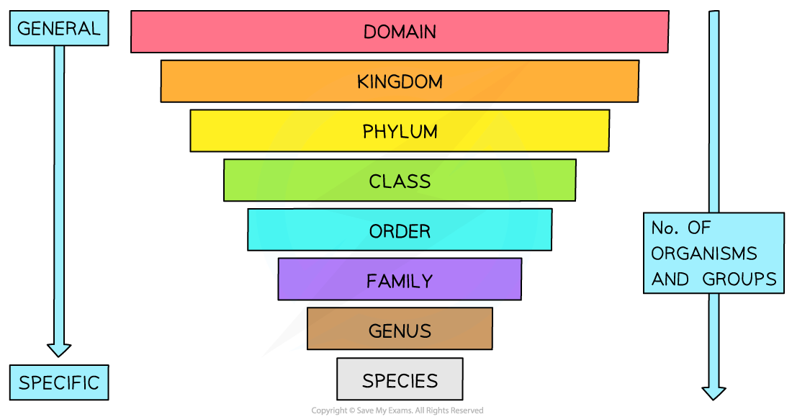
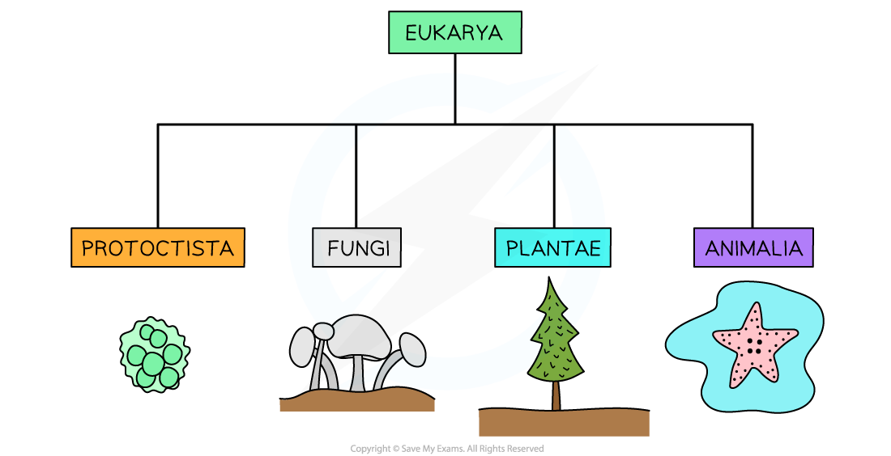
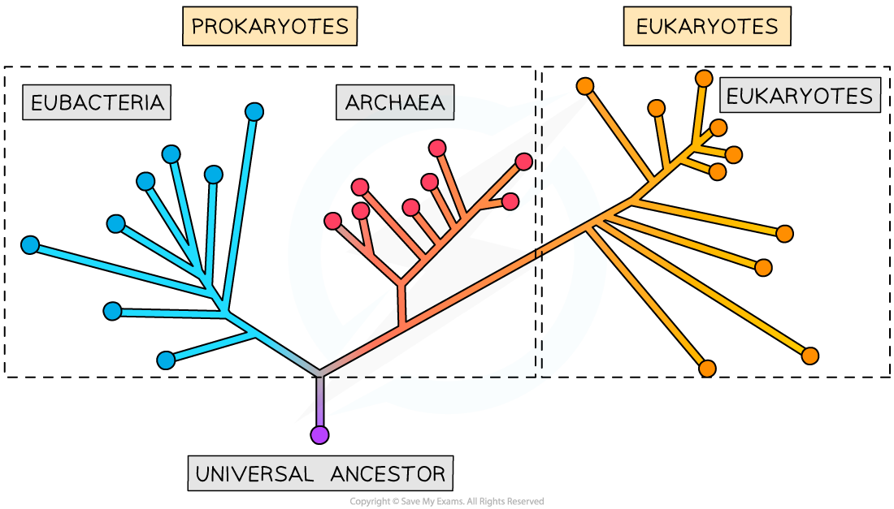
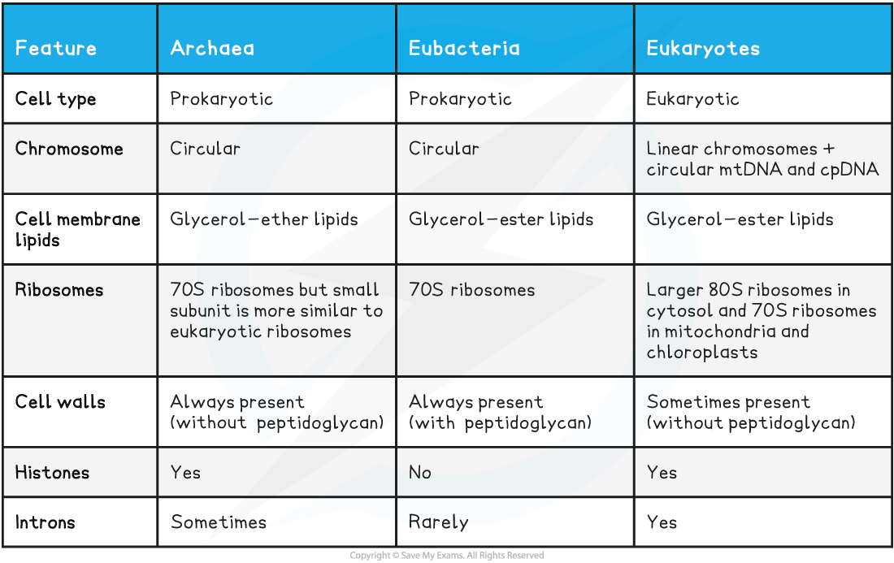

## Classification

* Taxonomy is the practice of biological classification
* The phylogenetic classification system enables us to arrange **species** into **groups** based on their **evolutionary origins** and **evolutionary** **relationships**
* By grouping organisms into taxa, it can make them easier to understand and remember
* There are several **different ranks**or levels within the **hierarchical** classification system used in biology

  + There is**no overlap between groups**
  + Each group is called a **taxon** (plural **taxa**)
  + Multiple smaller taxa can be put in the same larger taxa
* **Species** is the **lowest taxonomic rank**in the system

  + Similar species can be grouped in a **genus**
  + Similar genera can be grouped in a **family**
  + Similar families can be grouped into an **order**
  + Similar orders can be grouped into a **class**
  + Similar classes can be grouped into a **phylum**
  + Similar phyla can be grouped into a **kingdom**
  + Similar kingdoms can be grouped into a **domain**
* **Domains are the highest taxonomic rank** in the system
* There are a few different rhymes that exist to help you remember the different ranks in the taxonomic classification system. You can always make up your own but the one below is super helpful!

  + The first letters of all the different ranks below the domains can be remembered as:

    - **K**ings **P**lay **C**hess **O**n **F**ancy **G**old **S**quares
    - **K**ingdom **P**hylum **C**lass **O**rder **F**amily **G**enus **S**pecies

***The different levels within the hierarchical classification system - the higher ranks contain more organisms with less similarity between them, while the lower ranks contain fewer organisms with more similarity between them***

* Many **different species** with similar genotypes and phenotypes can be grouped together in the **same genus**
* They are, however, still **separate species** since they **cannot produce fertile offspring**

  + This is known as the **species concept**
* Early classification systems only relied on the **outward appearance** (phenotype) of organisms to classify them

  + Looks can be deceiving however as many non-related organisms share similar phenotypes - e.g. whales and sharks
  + Advances in technology, such as **DNA sequencing**, have made it possible to **compare the genotypes** of organisms and **provide clarity** on the evolutionary relationships between them

#### Binomial system

* **Binomials** are the scientific names given to individual species
* It consists of the organism’s **genus** and **species** name in modern Latin

  + The genus name is written first and is **capitalised**, while the species name comes second and is **not capitalise**d
  + **Both** parts of a binomial are **italicised**
* For example, the binomial for humans is*Homo sapiens*and the binomial for dogs is *Canis familiaris*
* Binomials are extremely useful for scientists as they allow for species to be **universally identified**- the binomial for a species is the same across the entire globe

#### Five kingdoms

* Organisms can be placed into one of **five kingdoms**
* This is based on the general features that groups of organisms within these kingdoms **share**

#### Kingdom Prokaryotae (Monera)

* These are organisms that have **prokaryotic cells** which contain no nucleus
* They vary in size over a wide range, but are typically less than 5 μm
* Example: *Staphylococcus pneumoniae*is a bacteria species that causes pneumonia

#### Kingdom Protoctista

* All Protoctista are **eukaryotic,**and this broad group of cellular life encompasses all eukaryotic cells that do not belong to the other three eukaryotic kingdoms
* Members of this kingdom show great diversity in all aspects of life including structure, life cycle, feeding, trophic levels and modes of locomotion
* They usually live in **watery environments**
* Protoctists can exist as **single-celled organisms**or as a **group of similar cells**
* A group of Protoctista known as protozoa possess cells similar to animal cells

  + Their cells have **no cell wall**
* Another group of Protoctista known as algae possess cells similar to plant cells

  + Their cells have **cellulose cell walls and chloroplasts**
* *Stentor roseli*is a protoctist that has flagella all over its body which help it feed and move

#### Kingdom Fungi

* The oldest organism in the world is thought to be a fungus aged somewhere between 1500 - 10,000 years old
* All fungi are **eukaryotic** cells
* The cells of fungi:

  + Possess **non-cellulose cell walls** (often made of the polysaccharide **chitin**)
* Fungi are **saprotrophs:**

  + They obtain this energy and carbon by **digesting dead/decaying matter**extracellularly or from being **parasites** on living organisms
* Fungi **reproduce using spores** that disperse onto the ground nearby
* Fungi have a simple body form:

  + They can be unicellular (like the common baker’s yeast *Saccharomyces cerevisiae)*
  + Some consist of long threads called hyphae that grow from the main fungus body (mycelium)
  + Larger fungi possess fruiting bodies that release large numbers of spores
* Examples: moulds, yeasts, mushrooms

#### Kingdom Plantae

* Plants are **multicellular eukaryotic** organisms
* Plant cells:

  + All have **cell walls** composed of cellulose
  + Possess large (and usually permanent) **vacuoles**that provide structural support
  + Are able to differentiate into **specialized cells** to form **tissues and organs**
  + Possess **chloroplasts** (containing **chlorophyll**) that enable **photosynthesis** (not all plant cells have chloroplasts)
* They are **autotrophs**

  + This means they can synthesize their organic compounds and molecules for energy use and building biomass from inorganic compounds
* Examples: mosses, ferns, flowering plants

#### Kingdom Animalia

* Animals are also **multicellular eukaryotic** organisms
* Animal cells:

  + Are able to differentiate into **many different specialised cell types** that can form **tissues and organs**
  + Have **small temporary vacuoles** (for example, lysosomes)
  + Have **no cell walls**
* They are **heterotrophs**

  + They have a wide range of feeding mechanisms
* Examples: molluscs, insects, fish, reptiles, birds, mammals

***The four kingdoms that fall under the domain Eukarya, representing the eukaryotes***

#### Examiner Tips and Tricks

The binomial for a species is always typed in italics or **underlined when handwritten.**The genus should always begin with a capital letter, and the species with a lower case letter.

## Critical Evaluation of New Classification Data

* In the past, scientists encountered many difficulties when trying to determine the evolutionary relationships between species
* Using the physical features of species (such as colour/shape/size) has many limitations and can often lead to the wrong classification of species
* Advances in genome sequencing and immunology has allowed scientists to further investigate the evolutionary relationships between species
* This has led to many organisms being **reclassified** or changes being made to the **classification system structure**
* Scientific knowledge is **constantly changing**, as more technological advances are made
* One such example is the **three domain classification system**, which was based on new information obtained from molecular analysis of RNA genes in particular

  + Using this new information, scientists have realised that using cell type to classify organisms is insufficient, and that **prokaryotes** could be divided into two separate groups (domains)
  + The **three domains** are:

    - Archaea (prokaryotes)
    - Bacteria (prokaryotes)
    - Eukarya (eukaryotes)

***The taxonomic classification system within the three domains***

* This new classification system was based on **molecular phylogeny**
* **Phylogeny** investigates the evolutionary history of different groups of organisms and can specify how closely related they are
* Molecular phylogeny relies on similarities or **differences of molecules** (such as DNA, RNA or proteins) between groups of organisms to determine how closely related they are
* The **more similar** the molecules, the **more recent** the common ancestor is that they share
* Based on the evidence that molecular phylogeny provided, it was determined that the organisms in the kingdom **Prokaryotae** would be **reclassified** into two separate domains - the **Archaea** and **Bacteria**
* The evidence suggested that archaea and bacteria are **less closely related** to each other than scientists originally thought
* Organisms from the other four kingdoms where placed in another domain - **Eukaryota**

**Characteristics & Features of the Three Domains Table**

