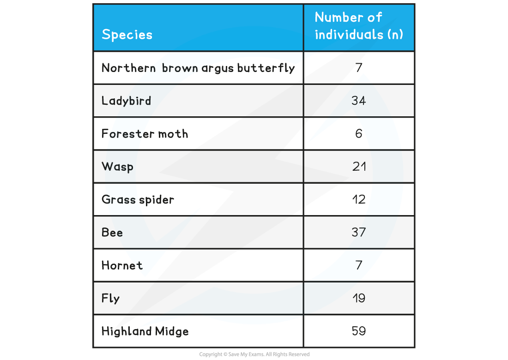
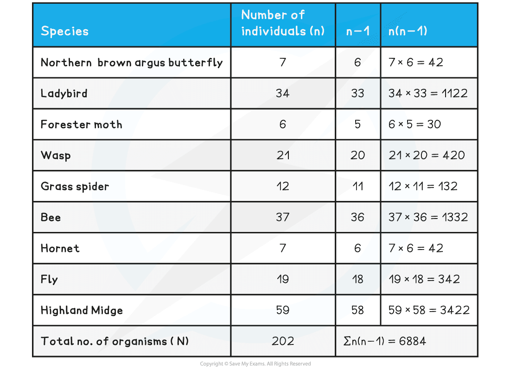

## Comparing Biodiversity Between Habitats

* Once the abundance of different species in an area has been recorded, the results can be used to calculate the **species diversity** for that area

  + Species diversity looks at the number of different species in an area but also the **abundance** across the different species
* An**index of diversity** is a measurement that describes the relationship between the number of species present and how each species contributes to the total number of organisms that are present in that community

#### The index of diversity formula

* The formula is:

%3C%2Fmo%3E%3C%2Fmrow%3E%3Cmrow%3E%3Cmi%3E%26%23x3A3%3Bn%3C%2Fmi%3E%3Cmo%3E(%3C%2Fmo%3E%3Cmi%20mathvariant%3D%22normal%22%3En%3C%2Fmi%3E%3Cmo%3E-%3C%2Fmo%3E%3Cmn%3E1%3C%2Fmn%3E%3Cmo%3E)%3C%2Fmo%3E%3C%2Fmrow%3E%3C%2Fmfrac%3E%3C%2Fmath%3E--%3E%3Cdefs%3E%3Cstyle%20type%3D%22text%2Fcss%22%3E%40font-face%7Bfont-family%3A'math143f4d31b04031e49f5eb18baba'%3Bsrc%3Aurl(data%3Afont%2Ftruetype%3Bcharset%3Dutf-8%3Bbase64%2CAAEAAAAMAIAAAwBAT1MvMi7iBBMAAADMAAAATmNtYXDEvmKUAAABHAAAADxjdnQgDVUNBwAAAVgAAAA6Z2x5ZoPi2VsAAAGUAAAA%2FGhlYWQQC2qxAAACkAAAADZoaGVhCGsXSAAAAsgAAAAkaG10eE2rRkcAAALsAAAADGxvY2EAHTwYAAAC%2BAAAABBtYXhwBT0FPgAAAwgAAAAgbmFtZaBxlY4AAAMoAAABn3Bvc3QB9wD6AAAEyAAAACBwcmVwa1uragAABOgAAAAUAAADSwGQAAUAAAQABAAAAAAABAAEAAAAAAAAAQEAAAAAAAAAAAAAAAAAAAAAAAAAAAAAAAAAAAAAACAgICAAAAAg1UADev96AAAD6ACWAAAAAAACAAEAAQAAABQAAwABAAAAFAAEACgAAAAGAAQAAQACAD0iEv%2F%2FAAAAPSIS%2F%2F%2F%2FxN3wAAEAAAAAAAAAAAFUAywAgAEAAFYAKgJYAh4BDgEsAiwAWgGAAoAAoADUAIAAAAAAAAAAKwBVAIAAqwDVAQABKwAHAAAAAgBVAAADAAOrAAMABwAAMxEhESUhESFVAqv9qwIA%2FgADq%2FxVVQMAAAIAgADrAtUCFQADAAcAZRgBsAgQsAbUsAYQsAXUsAgQsAHUsAEQsADUsAYQsAc8sAUQsAQ8sAEQsAI8sAAQsAM8ALAIELAG1LAGELAH1LAHELAB1LABELAC1LAGELAFPLAHELAEPLABELAAPLACELADPDEwEyE1IR0BITWAAlX9qwJVAcBV1VVVAAEAgAFVAtUBqwADADAYAbAEELEAA%2FawAzyxAgf1sAE8sQUD5gCxAAATELEABuWxAAETELABPLEDBfWwAjwTIRUhgAJV%2FasBq1YAAQAAAAEAANV4zkFfDzz1AAMEAP%2F%2F%2F%2F%2FWOhNz%2F%2F%2F%2F%2F9Y6E3MAAP8gBIADqwAAAAoAAgABAAAAAAABAAAD6P9qAAAXcAAA%2F7YEgAABAAAAAAAAAAAAAAAAAAAAAwNSAFUDVgCAA1YAgAAAAAAAAAAoAAAAsgAAAPwAAQAAAAMAXgAFAAAAAAACAIAEAAAAAAAEAADeAAAAAAAAABUBAgAAAAAAAAABABIAAAAAAAAAAAACAA4AEgAAAAAAAAADADAAIAAAAAAAAAAEABIAUAAAAAAAAAAFABYAYgAAAAAAAAAGAAkAeAAAAAAAAAAIABwAgQABAAAAAAABABIAAAABAAAAAAACAA4AEgABAAAAAAADADAAIAABAAAAAAAEABIAUAABAAAAAAAFABYAYgABAAAAAAAGAAkAeAABAAAAAAAIABwAgQADAAEECQABABIAAAADAAEECQACAA4AEgADAAEECQADADAAIAADAAEECQAEABIAUAADAAEECQAFABYAYgADAAEECQAGAAkAeAADAAEECQAIABwAgQBNAGEAdABoACAARgBvAG4AdABSAGUAZwB1AGwAYQByAE0AYQB0AGgAcwAgAEYAbwByACAATQBvAHIAZQAgAE0AYQB0AGgAIABGAG8AbgB0AE0AYQB0AGgAIABGAG8AbgB0AFYAZQByAHMAaQBvAG4AIAAxAC4AME1hdGhfRm9udABNAGEAdABoAHMAIABGAG8AcgAgAE0AbwByAGUAAAMAAAAAAAAB9AD6AAAAAAAAAAAAAAAAAAAAAAAAAAC5BxEAAI2FGACyAAAAFRQTsQABPw%3D%3D)format('truetype')%3Bfont-weight%3Anormal%3Bfont-style%3Anormal%3B%7D%40font-face%7Bfont-family%3A'round_brackets18549f92a457f2409'%3Bsrc%3Aurl(data%3Afont%2Ftruetype%3Bcharset%3Dutf-8%3Bbase64%2CAAEAAAAMAIAAAwBAT1MvMjwHLFQAAADMAAAATmNtYXDf7xCrAAABHAAAADxjdnQgBAkDLgAAAVgAAAASZ2x5ZmAOz2cAAAFsAAABJGhlYWQOKih8AAACkAAAADZoaGVhCvgVwgAAAsgAAAAkaG10eCA6AAIAAALsAAAADGxvY2EAAARLAAAC%2BAAAABBtYXhwBIgEWQAAAwgAAAAgbmFtZXHR30MAAAMoAAACOXBvc3QDogHPAAAFZAAAACBwcmVwupWEAAAABYQAAAAHAAAGcgGQAAUAAAgACAAAAAAACAAIAAAAAAAAAQIAAAAAAAAAAAAAAAAAAAAAAAAAAAAAAAAAAAAAACAgICAAAAAo8AMGe%2F57AAAHPgGyAAAAAAACAAEAAQAAABQAAwABAAAAFAAEACgAAAAGAAQAAQACACgAKf%2F%2FAAAAKAAp%2F%2F%2F%2F2f%2FZAAEAAAAAAAAAAAFUAFYBAAAsAKgDgAAyAAcAAAACAAAAKgDVA1UAAwAHAAA1MxEjEyMRM9XVq4CAKgMr%2FQAC1QABAAD%2B0AIgBtAACQBNGAGwChCwA9SwAxCwAtSwChCwBdSwBRCwANSwAxCwBzywAhCwCDwAsAoQsAPUsAMQsAfUsAoQsAXUsAoQsADUsAMQsAI8sAcQsAg8MTAREAEzABEQASMAAZCQ%2FnABkJD%2BcALQ%2FZD%2BcAGQAnACcAGQ%2FnAAAQAA%2FtACIAbQAAkATRgBsAoQsAPUsAMQsALUsAoQsAXUsAUQsADUsAMQsAc8sAIQsAg8ALAKELAD1LADELAH1LAKELAF1LAKELAA1LADELACPLAHELAIPDEwARABIwAREAEzAAIg%2FnCQAZD%2BcJABkALQ%2FZD%2BcAGQAnACcAGQ%2FnAAAQAAAAEAAPW2NYFfDzz1AAMIAP%2F%2F%2F%2F%2FVre7u%2F%2F%2F%2F%2F9Wt7u4AAP7QA7cG0AAAAAoAAgABAAAAAAABAAAHPv5OAAAXcAAA%2F%2F4DtwABAAAAAAAAAAAAAAAAAAAAAwDVAAACIAAAAiAAAAAAAAAAAAAkAAAAowAAASQAAQAAAAMACgACAAAAAAACAIAEAAAAAAAEAABNAAAAAAAAABUBAgAAAAAAAAABAD4AAAAAAAAAAAACAA4APgAAAAAAAAADAFwATAAAAAAAAAAEAD4AqAAAAAAAAAAFABYA5gAAAAAAAAAGAB8A%2FAAAAAAAAAAIABwBGwABAAAAAAABAD4AAAABAAAAAAACAA4APgABAAAAAAADAFwATAABAAAAAAAEAD4AqAABAAAAAAAFABYA5gABAAAAAAAGAB8A%2FAABAAAAAAAIABwBGwADAAEECQABAD4AAAADAAEECQACAA4APgADAAEECQADAFwATAADAAEECQAEAD4AqAADAAEECQAFABYA5gADAAEECQAGAB8A%2FAADAAEECQAIABwBGwBSAG8AdQBuAGQAIABiAHIAYQBjAGsAZQB0AHMAIAB3AGkAdABoACAAYQBzAGMAZQBuAHQAIAAxADgANQA0AFIAZQBnAHUAbABhAHIATQBhAHQAaABzACAARgBvAHIAIABNAG8AcgBlACAAUgBvAHUAbgBkACAAYgByAGEAYwBrAGUAdABzACAAdwBpAHQAaAAgAGEAcwBjAGUAbgB0ACAAMQA4ADUANABSAG8AdQBuAGQAIABiAHIAYQBjAGsAZQB0AHMAIAB3AGkAdABoACAAYQBzAGMAZQBuAHQAIAAxADgANQA0AFYAZQByAHMAaQBvAG4AIAAyAC4AMFJvdW5kX2JyYWNrZXRzX3dpdGhfYXNjZW50XzE4NTQATQBhAHQAaABzACAARgBvAHIAIABNAG8AcgBlAAAAAAMAAAAAAAADnwHPAAAAAAAAAAAAAAAAAAAAAAAAAAC5B%2F8AAY2FAA%3D%3D)format('truetype')%3Bfont-weight%3Anormal%3Bfont-style%3Anormal%3B%7D%3C%2Fstyle%3E%3C%2Fdefs%3E%3Ctext%20font-family%3D%22Arial%22%20font-size%3D%2218%22%20text-anchor%3D%22middle%22%20x%3D%226.5%22%20y%3D%2231%22%3ED%3C%2Ftext%3E%3Ctext%20font-family%3D%22math143f4d31b04031e49f5eb18baba%22%20font-size%3D%2218%22%20text-anchor%3D%22middle%22%20x%3D%2227.5%22%20y%3D%2231%22%3E%3D%3C%2Ftext%3E%3Cline%20stroke%3D%22%23000%22%20stroke-linecap%3D%22square%22%20stroke-width%3D%221%22%20x1%3D%2244.5%22%20x2%3D%22119.5%22%20y1%3D%2224.5%22%20y2%3D%2224.5%22%2F%3E%3Ctext%20font-family%3D%22Arial%22%20font-size%3D%2218%22%20text-anchor%3D%22middle%22%20x%3D%2255.5%22%20y%3D%2218%22%3EN%3C%2Ftext%3E%3Ctext%20font-family%3D%22round_brackets18549f92a457f2409%22%20font-size%3D%2218%22%20text-anchor%3D%22middle%22%20x%3D%2265.5%22%20y%3D%2218%22%3E(%3C%2Ftext%3E%3Ctext%20font-family%3D%22Arial%22%20font-size%3D%2218%22%20text-anchor%3D%22middle%22%20x%3D%2274.5%22%20y%3D%2218%22%3EN%3C%2Ftext%3E%3Ctext%20font-family%3D%22math143f4d31b04031e49f5eb18baba%22%20font-size%3D%2218%22%20text-anchor%3D%22middle%22%20x%3D%2290.5%22%20y%3D%2218%22%3E%26%23x2212%3B%3C%2Ftext%3E%3Ctext%20font-family%3D%22Arial%22%20font-size%3D%2218%22%20text-anchor%3D%22middle%22%20x%3D%22105.5%22%20y%3D%2218%22%3E1%3C%2Ftext%3E%3Ctext%20font-family%3D%22round_brackets18549f92a457f2409%22%20font-size%3D%2218%22%20text-anchor%3D%22middle%22%20x%3D%22112.5%22%20y%3D%2218%22%3E)%3C%2Ftext%3E%3Ctext%20font-family%3D%22Arial%22%20font-size%3D%2218%22%20text-anchor%3D%22middle%22%20x%3D%2256.5%22%20y%3D%2244%22%3E%26%23x3A3%3Bn%3C%2Ftext%3E%3Ctext%20font-family%3D%22round_brackets18549f92a457f2409%22%20font-size%3D%2218%22%20text-anchor%3D%22middle%22%20x%3D%2270.5%22%20y%3D%2244%22%3E(%3C%2Ftext%3E%3Ctext%20font-family%3D%22Arial%22%20font-size%3D%2218%22%20text-anchor%3D%22middle%22%20x%3D%2278.5%22%20y%3D%2244%22%3En%3C%2Ftext%3E%3Ctext%20font-family%3D%22math143f4d31b04031e49f5eb18baba%22%20font-size%3D%2218%22%20text-anchor%3D%22middle%22%20x%3D%2292.5%22%20y%3D%2244%22%3E%26%23x2212%3B%3C%2Ftext%3E%3Ctext%20font-family%3D%22Arial%22%20font-size%3D%2218%22%20text-anchor%3D%22middle%22%20x%3D%22107.5%22%20y%3D%2244%22%3E1%3C%2Ftext%3E%3Ctext%20font-family%3D%22round_brackets18549f92a457f2409%22%20font-size%3D%2218%22%20text-anchor%3D%22middle%22%20x%3D%22114.5%22%20y%3D%2244%22%3E)%3C%2Ftext%3E%3C%2Fsvg%3E)

* Where:

  + ***n*** = total no. of organisms for a single species in the community
  + ***N*** = total no. of organisms in the community
  + **Σ** = sum of
* The **larger the number** obtained, the**higher the level of diversity**

#### Calculating the index of diversity

* To calculate:

  + **Step 1:** Calculate N(N-1) to find *value A*
  + **Step 2:**Calculate n(n-1) for **each species** and add all these numbers together to find *value B*
  + **Step 3:**Divide *value A* by *value B*

#### Worked Example

Samples of different insect species in a back garden were collected using sweep nets and identification keys. Use the data recorded to calculate the index of diversity.

The total number of organisms(**N**) in this community would be: 7 + 34 + 6 + 21 + 12 + 37 + 7 + 19 + 59 = **202**

The formula is:

%3C%2Fmo%3E%3C%2Fmrow%3E%3Cmrow%3E%3Cmi%3E%26%23x3A3%3Bn%3C%2Fmi%3E%3Cmo%3E(%3C%2Fmo%3E%3Cmi%20mathvariant%3D%22normal%22%3En%3C%2Fmi%3E%3Cmo%3E-%3C%2Fmo%3E%3Cmn%3E1%3C%2Fmn%3E%3Cmo%3E)%3C%2Fmo%3E%3C%2Fmrow%3E%3C%2Fmfrac%3E%3C%2Fmath%3E--%3E%3Cdefs%3E%3Cstyle%20type%3D%22text%2Fcss%22%3E%40font-face%7Bfont-family%3A'math143f4d31b04031e49f5eb18baba'%3Bsrc%3Aurl(data%3Afont%2Ftruetype%3Bcharset%3Dutf-8%3Bbase64%2CAAEAAAAMAIAAAwBAT1MvMi7iBBMAAADMAAAATmNtYXDEvmKUAAABHAAAADxjdnQgDVUNBwAAAVgAAAA6Z2x5ZoPi2VsAAAGUAAAA%2FGhlYWQQC2qxAAACkAAAADZoaGVhCGsXSAAAAsgAAAAkaG10eE2rRkcAAALsAAAADGxvY2EAHTwYAAAC%2BAAAABBtYXhwBT0FPgAAAwgAAAAgbmFtZaBxlY4AAAMoAAABn3Bvc3QB9wD6AAAEyAAAACBwcmVwa1uragAABOgAAAAUAAADSwGQAAUAAAQABAAAAAAABAAEAAAAAAAAAQEAAAAAAAAAAAAAAAAAAAAAAAAAAAAAAAAAAAAAACAgICAAAAAg1UADev96AAAD6ACWAAAAAAACAAEAAQAAABQAAwABAAAAFAAEACgAAAAGAAQAAQACAD0iEv%2F%2FAAAAPSIS%2F%2F%2F%2FxN3wAAEAAAAAAAAAAAFUAywAgAEAAFYAKgJYAh4BDgEsAiwAWgGAAoAAoADUAIAAAAAAAAAAKwBVAIAAqwDVAQABKwAHAAAAAgBVAAADAAOrAAMABwAAMxEhESUhESFVAqv9qwIA%2FgADq%2FxVVQMAAAIAgADrAtUCFQADAAcAZRgBsAgQsAbUsAYQsAXUsAgQsAHUsAEQsADUsAYQsAc8sAUQsAQ8sAEQsAI8sAAQsAM8ALAIELAG1LAGELAH1LAHELAB1LABELAC1LAGELAFPLAHELAEPLABELAAPLACELADPDEwEyE1IR0BITWAAlX9qwJVAcBV1VVVAAEAgAFVAtUBqwADADAYAbAEELEAA%2FawAzyxAgf1sAE8sQUD5gCxAAATELEABuWxAAETELABPLEDBfWwAjwTIRUhgAJV%2FasBq1YAAQAAAAEAANV4zkFfDzz1AAMEAP%2F%2F%2F%2F%2FWOhNz%2F%2F%2F%2F%2F9Y6E3MAAP8gBIADqwAAAAoAAgABAAAAAAABAAAD6P9qAAAXcAAA%2F7YEgAABAAAAAAAAAAAAAAAAAAAAAwNSAFUDVgCAA1YAgAAAAAAAAAAoAAAAsgAAAPwAAQAAAAMAXgAFAAAAAAACAIAEAAAAAAAEAADeAAAAAAAAABUBAgAAAAAAAAABABIAAAAAAAAAAAACAA4AEgAAAAAAAAADADAAIAAAAAAAAAAEABIAUAAAAAAAAAAFABYAYgAAAAAAAAAGAAkAeAAAAAAAAAAIABwAgQABAAAAAAABABIAAAABAAAAAAACAA4AEgABAAAAAAADADAAIAABAAAAAAAEABIAUAABAAAAAAAFABYAYgABAAAAAAAGAAkAeAABAAAAAAAIABwAgQADAAEECQABABIAAAADAAEECQACAA4AEgADAAEECQADADAAIAADAAEECQAEABIAUAADAAEECQAFABYAYgADAAEECQAGAAkAeAADAAEECQAIABwAgQBNAGEAdABoACAARgBvAG4AdABSAGUAZwB1AGwAYQByAE0AYQB0AGgAcwAgAEYAbwByACAATQBvAHIAZQAgAE0AYQB0AGgAIABGAG8AbgB0AE0AYQB0AGgAIABGAG8AbgB0AFYAZQByAHMAaQBvAG4AIAAxAC4AME1hdGhfRm9udABNAGEAdABoAHMAIABGAG8AcgAgAE0AbwByAGUAAAMAAAAAAAAB9AD6AAAAAAAAAAAAAAAAAAAAAAAAAAC5BxEAAI2FGACyAAAAFRQTsQABPw%3D%3D)format('truetype')%3Bfont-weight%3Anormal%3Bfont-style%3Anormal%3B%7D%40font-face%7Bfont-family%3A'round_brackets18549f92a457f2409'%3Bsrc%3Aurl(data%3Afont%2Ftruetype%3Bcharset%3Dutf-8%3Bbase64%2CAAEAAAAMAIAAAwBAT1MvMjwHLFQAAADMAAAATmNtYXDf7xCrAAABHAAAADxjdnQgBAkDLgAAAVgAAAASZ2x5ZmAOz2cAAAFsAAABJGhlYWQOKih8AAACkAAAADZoaGVhCvgVwgAAAsgAAAAkaG10eCA6AAIAAALsAAAADGxvY2EAAARLAAAC%2BAAAABBtYXhwBIgEWQAAAwgAAAAgbmFtZXHR30MAAAMoAAACOXBvc3QDogHPAAAFZAAAACBwcmVwupWEAAAABYQAAAAHAAAGcgGQAAUAAAgACAAAAAAACAAIAAAAAAAAAQIAAAAAAAAAAAAAAAAAAAAAAAAAAAAAAAAAAAAAACAgICAAAAAo8AMGe%2F57AAAHPgGyAAAAAAACAAEAAQAAABQAAwABAAAAFAAEACgAAAAGAAQAAQACACgAKf%2F%2FAAAAKAAp%2F%2F%2F%2F2f%2FZAAEAAAAAAAAAAAFUAFYBAAAsAKgDgAAyAAcAAAACAAAAKgDVA1UAAwAHAAA1MxEjEyMRM9XVq4CAKgMr%2FQAC1QABAAD%2B0AIgBtAACQBNGAGwChCwA9SwAxCwAtSwChCwBdSwBRCwANSwAxCwBzywAhCwCDwAsAoQsAPUsAMQsAfUsAoQsAXUsAoQsADUsAMQsAI8sAcQsAg8MTAREAEzABEQASMAAZCQ%2FnABkJD%2BcALQ%2FZD%2BcAGQAnACcAGQ%2FnAAAQAA%2FtACIAbQAAkATRgBsAoQsAPUsAMQsALUsAoQsAXUsAUQsADUsAMQsAc8sAIQsAg8ALAKELAD1LADELAH1LAKELAF1LAKELAA1LADELACPLAHELAIPDEwARABIwAREAEzAAIg%2FnCQAZD%2BcJABkALQ%2FZD%2BcAGQAnACcAGQ%2FnAAAQAAAAEAAPW2NYFfDzz1AAMIAP%2F%2F%2F%2F%2FVre7u%2F%2F%2F%2F%2F9Wt7u4AAP7QA7cG0AAAAAoAAgABAAAAAAABAAAHPv5OAAAXcAAA%2F%2F4DtwABAAAAAAAAAAAAAAAAAAAAAwDVAAACIAAAAiAAAAAAAAAAAAAkAAAAowAAASQAAQAAAAMACgACAAAAAAACAIAEAAAAAAAEAABNAAAAAAAAABUBAgAAAAAAAAABAD4AAAAAAAAAAAACAA4APgAAAAAAAAADAFwATAAAAAAAAAAEAD4AqAAAAAAAAAAFABYA5gAAAAAAAAAGAB8A%2FAAAAAAAAAAIABwBGwABAAAAAAABAD4AAAABAAAAAAACAA4APgABAAAAAAADAFwATAABAAAAAAAEAD4AqAABAAAAAAAFABYA5gABAAAAAAAGAB8A%2FAABAAAAAAAIABwBGwADAAEECQABAD4AAAADAAEECQACAA4APgADAAEECQADAFwATAADAAEECQAEAD4AqAADAAEECQAFABYA5gADAAEECQAGAB8A%2FAADAAEECQAIABwBGwBSAG8AdQBuAGQAIABiAHIAYQBjAGsAZQB0AHMAIAB3AGkAdABoACAAYQBzAGMAZQBuAHQAIAAxADgANQA0AFIAZQBnAHUAbABhAHIATQBhAHQAaABzACAARgBvAHIAIABNAG8AcgBlACAAUgBvAHUAbgBkACAAYgByAGEAYwBrAGUAdABzACAAdwBpAHQAaAAgAGEAcwBjAGUAbgB0ACAAMQA4ADUANABSAG8AdQBuAGQAIABiAHIAYQBjAGsAZQB0AHMAIAB3AGkAdABoACAAYQBzAGMAZQBuAHQAIAAxADgANQA0AFYAZQByAHMAaQBvAG4AIAAyAC4AMFJvdW5kX2JyYWNrZXRzX3dpdGhfYXNjZW50XzE4NTQATQBhAHQAaABzACAARgBvAHIAIABNAG8AcgBlAAAAAAMAAAAAAAADnwHPAAAAAAAAAAAAAAAAAAAAAAAAAAC5B%2F8AAY2FAA%3D%3D)format('truetype')%3Bfont-weight%3Anormal%3Bfont-style%3Anormal%3B%7D%3C%2Fstyle%3E%3C%2Fdefs%3E%3Ctext%20font-family%3D%22Arial%22%20font-size%3D%2218%22%20text-anchor%3D%22middle%22%20x%3D%226.5%22%20y%3D%2231%22%3ED%3C%2Ftext%3E%3Ctext%20font-family%3D%22math143f4d31b04031e49f5eb18baba%22%20font-size%3D%2218%22%20text-anchor%3D%22middle%22%20x%3D%2227.5%22%20y%3D%2231%22%3E%3D%3C%2Ftext%3E%3Cline%20stroke%3D%22%23000%22%20stroke-linecap%3D%22square%22%20stroke-width%3D%221%22%20x1%3D%2244.5%22%20x2%3D%22119.5%22%20y1%3D%2224.5%22%20y2%3D%2224.5%22%2F%3E%3Ctext%20font-family%3D%22Arial%22%20font-size%3D%2218%22%20text-anchor%3D%22middle%22%20x%3D%2255.5%22%20y%3D%2218%22%3EN%3C%2Ftext%3E%3Ctext%20font-family%3D%22round_brackets18549f92a457f2409%22%20font-size%3D%2218%22%20text-anchor%3D%22middle%22%20x%3D%2265.5%22%20y%3D%2218%22%3E(%3C%2Ftext%3E%3Ctext%20font-family%3D%22Arial%22%20font-size%3D%2218%22%20text-anchor%3D%22middle%22%20x%3D%2274.5%22%20y%3D%2218%22%3EN%3C%2Ftext%3E%3Ctext%20font-family%3D%22math143f4d31b04031e49f5eb18baba%22%20font-size%3D%2218%22%20text-anchor%3D%22middle%22%20x%3D%2290.5%22%20y%3D%2218%22%3E%26%23x2212%3B%3C%2Ftext%3E%3Ctext%20font-family%3D%22Arial%22%20font-size%3D%2218%22%20text-anchor%3D%22middle%22%20x%3D%22105.5%22%20y%3D%2218%22%3E1%3C%2Ftext%3E%3Ctext%20font-family%3D%22round_brackets18549f92a457f2409%22%20font-size%3D%2218%22%20text-anchor%3D%22middle%22%20x%3D%22112.5%22%20y%3D%2218%22%3E)%3C%2Ftext%3E%3Ctext%20font-family%3D%22Arial%22%20font-size%3D%2218%22%20text-anchor%3D%22middle%22%20x%3D%2256.5%22%20y%3D%2244%22%3E%26%23x3A3%3Bn%3C%2Ftext%3E%3Ctext%20font-family%3D%22round_brackets18549f92a457f2409%22%20font-size%3D%2218%22%20text-anchor%3D%22middle%22%20x%3D%2270.5%22%20y%3D%2244%22%3E(%3C%2Ftext%3E%3Ctext%20font-family%3D%22Arial%22%20font-size%3D%2218%22%20text-anchor%3D%22middle%22%20x%3D%2278.5%22%20y%3D%2244%22%3En%3C%2Ftext%3E%3Ctext%20font-family%3D%22math143f4d31b04031e49f5eb18baba%22%20font-size%3D%2218%22%20text-anchor%3D%22middle%22%20x%3D%2292.5%22%20y%3D%2244%22%3E%26%23x2212%3B%3C%2Ftext%3E%3Ctext%20font-family%3D%22Arial%22%20font-size%3D%2218%22%20text-anchor%3D%22middle%22%20x%3D%22107.5%22%20y%3D%2244%22%3E1%3C%2Ftext%3E%3Ctext%20font-family%3D%22round_brackets18549f92a457f2409%22%20font-size%3D%2218%22%20text-anchor%3D%22middle%22%20x%3D%22114.5%22%20y%3D%2244%22%3E)%3C%2Ftext%3E%3C%2Fsvg%3E)

**Answer:**

**Step one:       Calculate N(N-1) to find*****value A***

N(N-1) = 202(202-1)

N(N-1)= 202(201)

N(N-1) = 40602

**Step two:       Calculate n(n-1) for each species and add all of these numbers together to find*****value B***

See table below

**Step three:      Divide*****value A*****by*****value B*** **to calculate the index of diversity (D)**

D = 40602÷ 6884

D = 5.90  
  
The **higher** the value of D, the **greater** the level of biodiversity in that area

* It is useful to **compare** the species diversity in different habitats by calculating the diversity index for each of them

#### Examiner Tips and Tricks

Even though you are not expected to memorise the formulae for calculating the heterozygosity index and index of diversity, you will be expected to know how to use them and understand what the values mean that you calculate with them.