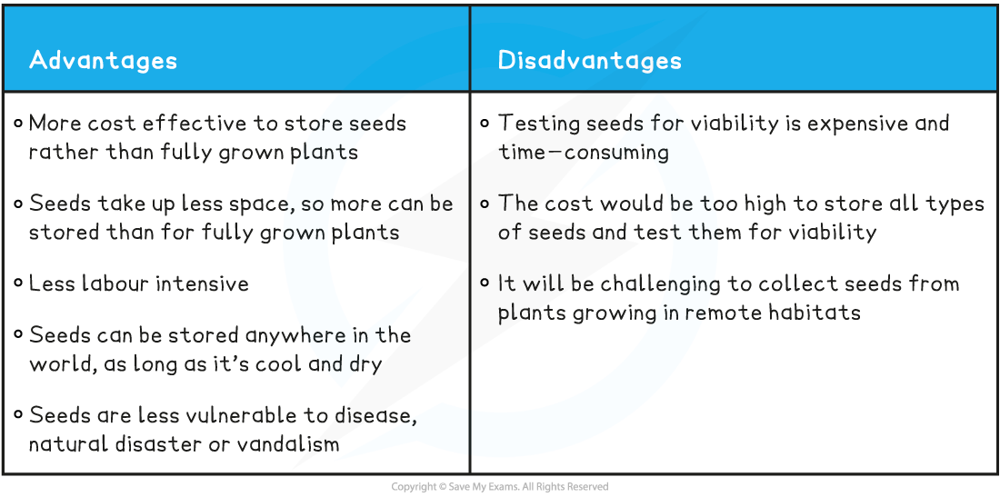
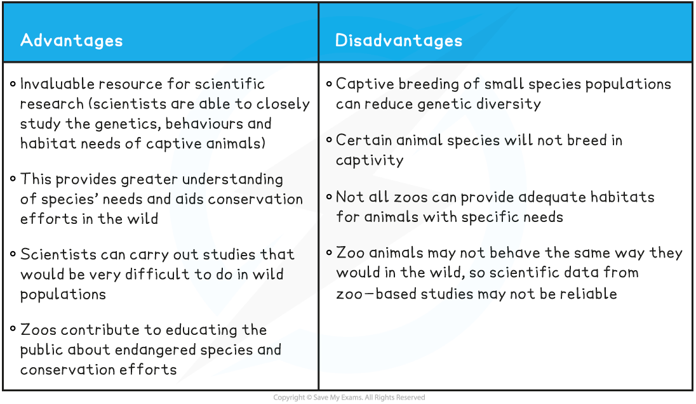

## Conservation of Biodiversity

* When species go extinct it leads to an overall **decrease in biodiversity**
* In recent times many species have already gone extinct, while others are **endangered**
* An endangered species is a **species that is being threatened with extinction**
* It is therefore important that these species are **conserved** to prevent them from going extinct
* Conservation of endangered species can be approached in several different ways
* Ideally a species should be **kept in their natural habitat**, as all the support systems they need to maintain life already exist there

  + National parks and marine parks are examples of conservation methods that do this
* When it is not possible to do this endangered species can be captured and placed in **captivity** for conservation efforts

  + **Zoos** and **botanic gardens** take part in conservation programmes
* Scientists have also come up with several methods to try and ensure the **long-term survival**of endangered species through frozen zoos and seed banks
* **Conservation** of species refers to **protecting** and **managing** them for future generations

#### Seed banks

* A **seed bank** is a facility that conserves plant diversity by drying and storing seeds in a temperature-controlled environment
* Usually, seeds of the same species are collected from different sites to **maintain genetic diversity**
* If the plant species goes extinct then the seeds can be used to grow them again
* Seeds can only be stored for so long. After a certain period of time the stored seeds are grown into plants and fresh seeds for storage are taken from those plants
* The **Svalbard Global Seed Vault**in Norway has almost 1 million species of plant seed. It is located in the Arctic Circle, within ideal environmental conditions
* Many organisations send seeds from crop plants to be stored there for safekeeping
* Some plants have **seeds that cannot be frozen** such as coffee and cocoa plants

  + In order to preserve the genetic diversity of these plants successive generations must be grown or tissue cultures taken
* There are **advantages** and **disadvantages** of using seed banks
* Seed banks make valuable contributions to **scientific research**

  + It provides an opportunity to investigate how to **successfully grow** plants from seeds
  + They **provide a stock** of endangered plants that could be useful to humans (e.g. medicinal plant species, crop plant species) taking pressure off of wild populations
* It is important to note, however, that data gathered from seed banks may not be representative of wild populations due to the small, genetically limited, sample size
* Seed banks also educate people about endangered species and increase interest in conserving these species

  + For example, people can be trained to set up local seed banks, which involves the community

**Advantages & Disadvantages of Seed Banks Table**

#### Zoos

* **Zoos** can also contribute to the conservation of endangered animal species
* **Captive breeding** programmes can breed individuals of a species so their offspring can be **released into the wild**
* Zoos are an invaluable resource for **scientific research**

  + Scientists are able to closely study animal’s **genetics**, **behaviours** and **habitat needs**
* There are some **problems with zoos** and their role in conservation:

  + Captive breeding of small species populations can **reduce genetic diversity**
  + Certain animal species will **not breed in captivity**
  + Not all zoos can provide **adequate habitats** for animals with specific needs
  + Many people question the **ethics** of keeping animals in **captivity**
* There are stories of both **success and failure** when it comes to zoos and conservation:

  + The oryx is an antelope-like species that was saved from extinction and reintroduced into the wild in Africa thanks to zoos and captive breeding programmes
  + Pandas have been in captive breeding programs for over 60 years and not a single panda has been reintroduced into the wild
* Zoos make a valuable contribution to **scientific research** in a variety of ways:

  + They provide information about the **specific needs** (behavioural, physiological, nutritional) of different animal species, which **aids** **conservation efforts in the wild**
  + They can carry out studies that would be very difficult to do in **wild populations**
* Animals in zoos **may not behave the same** way they would in the wild, so this raises questions about the **reliability of the data** from some **zoo-based studies**
* Zoos contribute to **educating people** about endangered species by bringing them close to these organisms and **increasing public enthusiasm** for,and **public engagement** with, conservation efforts

**Advantages & Disadvantages of Zoos Table**

#### Reintroduction back into the wild

* Plants and animals from these facilities can be released back into their natural habitat, which holds certain **benefits**:

  + This will help **prevent** them from **going extinct** in the wild
  + **Organisms that rely** on these plants and animals for food or habitat may also benefit from their presence
  + This contributes toward **restoring lost or degraded habitats**
* Reintroduction may have some **negative effects** too:

  + These organisms may carry **new diseases** that will harm other organisms living in that habitat
  + Reintroduced animals may **lack the ability** to **find food** or **communicate** effectively with members of their own species