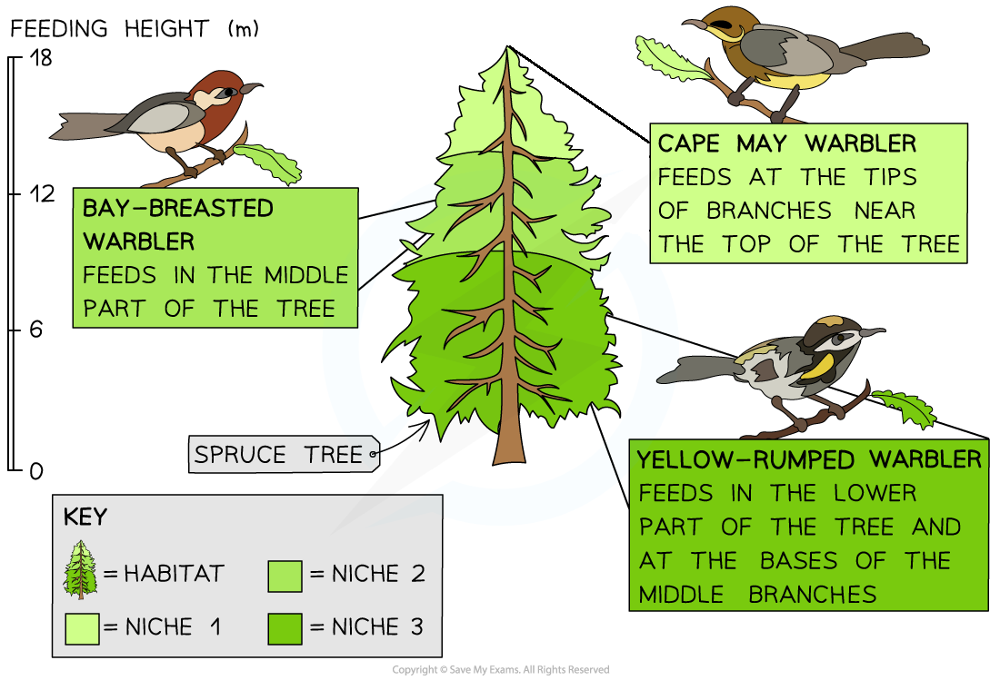
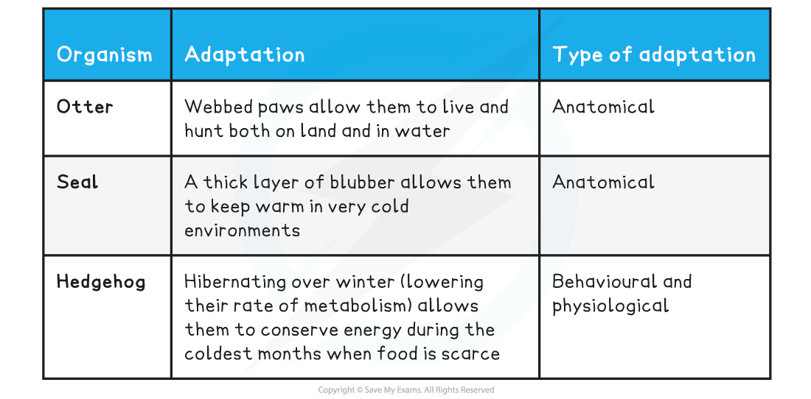

## Ecological Niches & Adaptations

#### Niche

* The place where a species lives within an ecosystem is its **habitat**
* The role that a species plays within its habitat is known as its **niche**, including:

  + The **biotic interactions** of the species (e.g. the organisms it feeds on and the organisms that feed on it)
  + The **abiotic interactions** (e.g. how much oxygen and carbon dioxide the species exchanges with the atmosphere)
* A niche can only be occupied by **one** species, meaning that every individual species has its own **unique** niche
* If two species try to occupy the **same niche**, they will **compete** with each other for the **same resources**

  + One of the species will be **more successful** and **out-compete** the other species until only **one** species is left and the other is either forced to occupy a new, slightly different niche or to go extinct from the habitat or ecosystem altogether
* For example, the three North American warbler species shown below all occupy the **same habitat** (spruces and other conifer trees) but occupy **slightly different niches** as each species feeds at a **different height** within the trees

  + This **avoids competition** between the three species, allowing them to **co-exist** closely with each other in the **same habitat**

***Although it appears as though these birds share the same niche, they spend their time eating in different parts of spruces and other conifer trees***

#### Adaptations to abiotic and biotic conditions

* Adaptations are features of organisms that **increase** their chances of **surviving** and **reproducing**. These adaptations can be:

  + **Anatomical**, which refers to structural features such as horns, claws or feathers, that increase an organism's chances of survival
  + **Behavioural**, which refers to behaviours such as courtship of defensive behaviours, that increase an organism's chances of survival
  + **Physiological**, which refers to processes inside the body, such as venom production or the ability to digest cellulose, that increase an organism's chances of survival
* A species must be adapted to both the **biotic** and **abiotic** factors within its habitat in order to use this habitat in a way no other species can (i.e. in order to occupy its unique niche)
* Examples of adaptations to **biotic conditions** could include:

**Adaptations to Biotic Factors Table**

* Examples of adaptations to **abiotic conditions** could include:

**Adaptations to Abiotic Factors Table**

