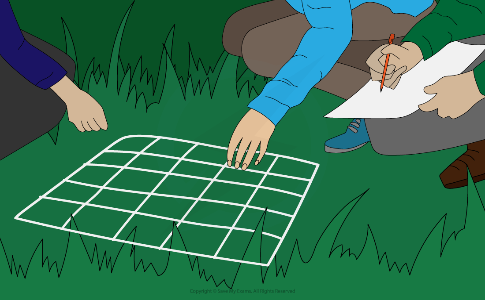
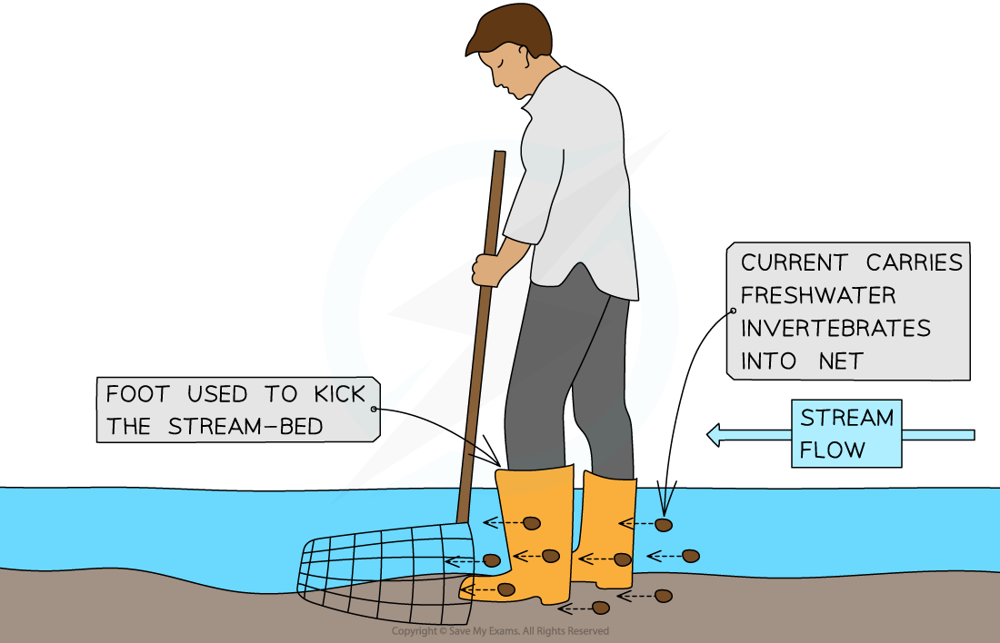

## Measuring Biodiversity Within a Habitat

* The place where an organism lives is called its **habitat**
* Habitats can vary in size, with some being very large (e.g. grasslands) while others are very small (e.g. a puddle of water that formed after heavy rain)
* Measuring the **species diversity** within different habitats can be useful in making comparisons between them or when studying how habitats change over time
* One way to determine species diversity is to measure **species richness** in a habitat
* **Species richness** is the **number** of species within a community

  + A community is a group of populations of **different species** living in the same place at the same time that **interact with each other**
* Species richness is the simplest way to measure **species diversity**
* A community with a greater number of species will have a greater species richness score

  + For example, a tropical rain forest has a very high number of different species so it would be described as **species-rich**
* Species richness can be a **misleading** indicator of diversity as it does not take into account the **number of individuals** of each species
* **Species abundance** is a measure of the **relative number of individuals** in the different species within a given area

  + In the example below, Area 1 and Area 2 both contain 4 tree species
  + However, Area 2 is actually **dominated** by one species and in fact, one of the species is very **rare** (only one individual)
  + Although the two areas have exactly the same **species richness**, Area 1 has a **higher species abundance** (and therefore a **higher overall species diversity**) than Area 2
  + This example illustrates the limitations of using just species richness on its own
* Conservationists often favour the use of an **index of diversity** as it takes into account species number and evenness

***Area 1 and 2 have the same species richness but different species abundance. Area 1 will have a higher overall species diversity as it has a higher species abundance. Species diversity takes both richness and abundance into account.***

* Measuring the different levels of biodiversity within an ecosystem can be challenging
* Finding out which species live in an ecosystem and the size of the populations requires the **identification and cataloguing** of all organisms present to build a **species list**
* This is possible for areas that are very small or where the species are very large like trees
* However, for larger and more complex ecosystems like rainforests, it is simply **impossible**to find, identify and count every organism that exists there
* When this is the case, different**samples**of the area can be taken and used to make an **estimate for the total** species numbers in the area

#### Random sampling

* Some ecosystems are very complex with large numbers of different species of different sizes
* For the sake of logistics, **random** **sampling** is often used to estimate the **distribution** and **abundance** of species

  + The **distribution** of a species describes how it is spread throughout the ecosystem
  + The **abundance** of a species is the number of individuals of that species
* When carrying out sampling, square frames called **quadrats** can be used to mark off the area being sampled

  + Quadrats are square frames made of wood or wire
  + They can be a variety of sizes eg. 0.25m2 or 1m2
  + They are placed on the ground and the organisms within them are recorded
  + They can be used to measure the distribution and abundance of **plants**

***Using a quadrat to investigate population size or distribution***

* Quadrats of different sizes can be used depending on what is being measured and what is most suitable in the space the samples are being made in
* Quadrats must be laid **randomly** in the area to **avoid****sampling bias**

  + This random sampling can be done by converting the sampling area into a **grid format**and labelling each square on the grid with a number
  + Then a random number generator is used to pick the sample points
* Once the quadrat has been laid on the chosen sample point the **abundance** or **percentage cover** of all the **different** **species** present can be recorded

***Using a quadrat to investigate the percentage cover of two species of grass. Some squares may be lacking any species while other squares may have multiple species in them - this means that the total percentage cover may sometimes be over or under 100%***

* Quadrats are suitable for sampling **plants**
* For many **animal species**, however, it is not possible to use quadrats to measure their distribution and abundance
* In these cases, **other techniques** involving other items of **equipment** are necessary, including:

  + **Sweeping nets**: these are large, strong nets with a fine material (very small holes) that are used to catch flying insects and insects that live in long grass by sweeping the net back and forth through the grass
  + **Pitfall traps**: these are cans or jars that are buried in the ground that are used to catch ground-dwelling (often nocturnal) insects and other invertebrates as they fall into the trap
  + **Kick-sampling**: this technique is used to catch freshwater invertebrates living in streams or rivers. A net in placed on the stream-bed so that the water is flowing into it and the stream-bed just above the net is churned up by the scientist (using their foot) for a set period of time. The invertebrates are carried by the stream into the net
* Take as **many samples** as possible to get a more accurate indication of the entire habitat
* The results can be used to **estimate** the total number of individuals or species richness in the habitat
* It is important to use the **same sampling method** when gathering data to compare different habitats with one another

***Example of how a pitfall trap can be used***

***Example of how kick-sampling is done***

#### Measuring genetic diversity within a species

* Genetic diversity refers to the **different alleles** that occur within the gene pool of a species or a population
* The **greater** the allele variety within a species, the **higher** the genetic diversity will be
* Measurements of genetic diversity is useful to investigate changes occurring in a population over time or when comparing two species with one another
* To measure genetic diversity two factors can be considered:

  + **Phenotype**
  + **Genotype**
* The **phenotype** of an organism refers to its **observable features**
* **Different alleles** are responsible for the **variety of phenotypes** that can be observed within a species
* **Therefore,** the greater the variety of phenotypes within a species, the higher the genetic diversity
* An organisms **genotype** is determined by the **different alleles** that is found within the cells
* Different alleles will have a different order of bases in the DNA molecules
* These base orders can be determined by sequencing the DNA of individuals in a species
* The **higher** the number of **different alleles** for a characteristic, the **greater** the **genetic diversity** within that species
* Another way to determine the genetic diversity within a species is to use the **heterozygosity index**

#### Heterozygosity index

* Organisms that have two different alleles at a particular gene locus are known as **heterozygotes**
* The **higher** the proportion of heterozygotes in a population, the **greater** the genetic diversity of that population will be
* We can use the following formula to calculate the **heterozygosity index** (H):

![straight H space equals space fraction numerator number space of space heterozygotes over denominator number space of space individuals space in space the space population end fraction](data:image/svg+xml;charset=utf8,%3Csvg%20xmlns%3D%22http%3A%2F%2Fwww.w3.org%2F2000%2Fsvg%22%20xmlns%3Awrs%3D%22http%3A%2F%2Fwww.wiris.com%2Fxml%2Fmathml-extension%22%20height%3D%2249%22%20width%3D%22358%22%20wrs%3Abaseline%3D%2231%22%3E%3C!--MathML%3A%20%3Cmath%20xmlns%3D%22http%3A%2F%2Fwww.w3.org%2F1998%2FMath%2FMathML%22%20style%3D%22font-family%3AArial%22%3E%3Cmi%20mathvariant%3D%22normal%22%3EH%3C%2Fmi%3E%3Cmo%3E%26%23xA0%3B%3C%2Fmo%3E%3Cmo%3E%3D%3C%2Fmo%3E%3Cmo%3E%26%23xA0%3B%3C%2Fmo%3E%3Cmfrac%3E%3Cmrow%3E%3Cmi%3Enumber%3C%2Fmi%3E%3Cmo%3E%26%23xA0%3B%3C%2Fmo%3E%3Cmi%3Eof%3C%2Fmi%3E%3Cmo%3E%26%23xA0%3B%3C%2Fmo%3E%3Cmi%3Eheterozygotes%3C%2Fmi%3E%3C%2Fmrow%3E%3Cmrow%3E%3Cmi%3Enumber%3C%2Fmi%3E%3Cmo%3E%26%23xA0%3B%3C%2Fmo%3E%3Cmi%3Eof%3C%2Fmi%3E%3Cmo%3E%26%23xA0%3B%3C%2Fmo%3E%3Cmi%3Eindividuals%3C%2Fmi%3E%3Cmo%3E%26%23xA0%3B%3C%2Fmo%3E%3Cmi%3Ein%3C%2Fmi%3E%3Cmo%3E%26%23xA0%3B%3C%2Fmo%3E%3Cmi%3Ethe%3C%2Fmi%3E%3Cmo%3E%26%23xA0%3B%3C%2Fmo%3E%3Cmi%3Epopulation%3C%2Fmi%3E%3C%2Fmrow%3E%3C%2Fmfrac%3E%3C%2Fmath%3E--%3E%3Cdefs%3E%3Cstyle%20type%3D%22text%2Fcss%22%3E%40font-face%7Bfont-family%3A'math17f39f8317fbdb1988ef4c628eb'%3Bsrc%3Aurl(data%3Afont%2Ftruetype%3Bcharset%3Dutf-8%3Bbase64%2CAAEAAAAMAIAAAwBAT1MvMi7iBBMAAADMAAAATmNtYXDEvmKUAAABHAAAADRjdnQgDVUNBwAAAVAAAAA6Z2x5ZoPi2VsAAAGMAAAAsmhlYWQQC2qxAAACQAAAADZoaGVhCGsXSAAAAngAAAAkaG10eE2rRkcAAAKcAAAACGxvY2EAHTwYAAACpAAAAAxtYXhwBT0FPgAAArAAAAAgbmFtZaBxlY4AAALQAAABn3Bvc3QB9wD6AAAEcAAAACBwcmVwa1uragAABJAAAAAUAAADSwGQAAUAAAQABAAAAAAABAAEAAAAAAAAAQEAAAAAAAAAAAAAAAAAAAAAAAAAAAAAAAAAAAAAACAgICAAAAAg1UADev96AAAD6ACWAAAAAAACAAEAAQAAABQAAwABAAAAFAAEACAAAAAEAAQAAQAAAD3%2F%2FwAAAD3%2F%2F%2F%2FEAAEAAAAAAAABVAMsAIABAABWACoCWAIeAQ4BLAIsAFoBgAKAAKAA1ACAAAAAAAAAACsAVQCAAKsA1QEAASsABwAAAAIAVQAAAwADqwADAAcAADMRIRElIREhVQKr%2FasCAP4AA6v8VVUDAAACAIAA6wLVAhUAAwAHAGUYAbAIELAG1LAGELAF1LAIELAB1LABELAA1LAGELAHPLAFELAEPLABELACPLAAELADPACwCBCwBtSwBhCwB9SwBxCwAdSwARCwAtSwBhCwBTywBxCwBDywARCwADywAhCwAzwxMBMhNSEdASE1gAJV%2FasCVQHAVdVVVQAAAAEAAAABAADVeM5BXw889QADBAD%2F%2F%2F%2F%2F1joTc%2F%2F%2F%2F%2F%2FWOhNzAAD%2FIASAA6sAAAAKAAIAAQAAAAAAAQAAA%2Bj%2FagAAF3AAAP%2B2BIAAAQAAAAAAAAAAAAAAAAAAAAIDUgBVA1YAgAAAAAAAAAAoAAAAsgABAAAAAgBeAAUAAAAAAAIAgAQAAAAAAAQAAN4AAAAAAAAAFQECAAAAAAAAAAEAEgAAAAAAAAAAAAIADgASAAAAAAAAAAMAMAAgAAAAAAAAAAQAEgBQAAAAAAAAAAUAFgBiAAAAAAAAAAYACQB4AAAAAAAAAAgAHACBAAEAAAAAAAEAEgAAAAEAAAAAAAIADgASAAEAAAAAAAMAMAAgAAEAAAAAAAQAEgBQAAEAAAAAAAUAFgBiAAEAAAAAAAYACQB4AAEAAAAAAAgAHACBAAMAAQQJAAEAEgAAAAMAAQQJAAIADgASAAMAAQQJAAMAMAAgAAMAAQQJAAQAEgBQAAMAAQQJAAUAFgBiAAMAAQQJAAYACQB4AAMAAQQJAAgAHACBAE0AYQB0AGgAIABGAG8AbgB0AFIAZQBnAHUAbABhAHIATQBhAHQAaABzACAARgBvAHIAIABNAG8AcgBlACAATQBhAHQAaAAgAEYAbwBuAHQATQBhAHQAaAAgAEYAbwBuAHQAVgBlAHIAcwBpAG8AbgAgADEALgAwTWF0aF9Gb250AE0AYQB0AGgAcwAgAEYAbwByACAATQBvAHIAZQAAAwAAAAAAAAH0APoAAAAAAAAAAAAAAAAAAAAAAAAAALkHEQAAjYUYALIAAAAVFBOxAAE%2F)format('truetype')%3Bfont-weight%3Anormal%3Bfont-style%3Anormal%3B%7D%3C%2Fstyle%3E%3C%2Fdefs%3E%3Ctext%20font-family%3D%22Arial%22%20font-size%3D%2218%22%20text-anchor%3D%22middle%22%20x%3D%226.5%22%20y%3D%2231%22%3EH%3C%2Ftext%3E%3Ctext%20font-family%3D%22math17f39f8317fbdb1988ef4c628eb%22%20font-size%3D%2218%22%20text-anchor%3D%22middle%22%20x%3D%2227.5%22%20y%3D%2231%22%3E%3D%3C%2Ftext%3E%3Cline%20stroke%3D%22%23000%22%20stroke-linecap%3D%22square%22%20stroke-width%3D%221%22%20x1%3D%2244.5%22%20x2%3D%22354.5%22%20y1%3D%2224.5%22%20y2%3D%2224.5%22%2F%3E%3Ctext%20font-family%3D%22Arial%22%20font-size%3D%2218%22%20text-anchor%3D%22middle%22%20x%3D%22130.5%22%20y%3D%2218%22%3Enumber%3C%2Ftext%3E%3Ctext%20font-family%3D%22Arial%22%20font-size%3D%2218%22%20text-anchor%3D%22middle%22%20x%3D%22173.5%22%20y%3D%2218%22%3Eof%3C%2Ftext%3E%3Ctext%20font-family%3D%22Arial%22%20font-size%3D%2218%22%20text-anchor%3D%22middle%22%20x%3D%22242.5%22%20y%3D%2218%22%3Eheterozygotes%3C%2Ftext%3E%3Ctext%20font-family%3D%22Arial%22%20font-size%3D%2218%22%20text-anchor%3D%22middle%22%20x%3D%2276.5%22%20y%3D%2244%22%3Enumber%3C%2Ftext%3E%3Ctext%20font-family%3D%22Arial%22%20font-size%3D%2218%22%20text-anchor%3D%22middle%22%20x%3D%22119.5%22%20y%3D%2244%22%3Eof%3C%2Ftext%3E%3Ctext%20font-family%3D%22Arial%22%20font-size%3D%2218%22%20text-anchor%3D%22middle%22%20x%3D%22174.5%22%20y%3D%2244%22%3Eindividuals%3C%2Ftext%3E%3Ctext%20font-family%3D%22Arial%22%20font-size%3D%2218%22%20text-anchor%3D%22middle%22%20x%3D%22228.5%22%20y%3D%2244%22%3Ein%3C%2Ftext%3E%3Ctext%20font-family%3D%22Arial%22%20font-size%3D%2218%22%20text-anchor%3D%22middle%22%20x%3D%22252.5%22%20y%3D%2244%22%3Ethe%3C%2Ftext%3E%3Ctext%20font-family%3D%22Arial%22%20font-size%3D%2218%22%20text-anchor%3D%22middle%22%20x%3D%22311.5%22%20y%3D%2244%22%3Epopulation%3C%2Ftext%3E%3C%2Fsvg%3E)

#### Worked Example

In pea plants the gene controlling seed shape exist in two forms: Allele **R** codes for round seeds and is dominant over allele **r** which codes for wrinkled seeds. It is found that within a population of 620 pea plants, there are 350 heterozygous (**Rr**) individuals.

Calculate the heterozygosity index for the pea plants at the locus for seed shape.

The formula is:

![straight H space equals space fraction numerator number space of space heterozygotes over denominator number space of space individuals space in space the space population end fraction](data:image/svg+xml;charset=utf8,%3Csvg%20xmlns%3D%22http%3A%2F%2Fwww.w3.org%2F2000%2Fsvg%22%20xmlns%3Awrs%3D%22http%3A%2F%2Fwww.wiris.com%2Fxml%2Fmathml-extension%22%20height%3D%2249%22%20width%3D%22358%22%20wrs%3Abaseline%3D%2231%22%3E%3C!--MathML%3A%20%3Cmath%20xmlns%3D%22http%3A%2F%2Fwww.w3.org%2F1998%2FMath%2FMathML%22%20style%3D%22font-family%3AArial%22%3E%3Cmi%20mathvariant%3D%22normal%22%3EH%3C%2Fmi%3E%3Cmo%3E%26%23xA0%3B%3C%2Fmo%3E%3Cmo%3E%3D%3C%2Fmo%3E%3Cmo%3E%26%23xA0%3B%3C%2Fmo%3E%3Cmfrac%3E%3Cmrow%3E%3Cmi%3Enumber%3C%2Fmi%3E%3Cmo%3E%26%23xA0%3B%3C%2Fmo%3E%3Cmi%3Eof%3C%2Fmi%3E%3Cmo%3E%26%23xA0%3B%3C%2Fmo%3E%3Cmi%3Eheterozygotes%3C%2Fmi%3E%3C%2Fmrow%3E%3Cmrow%3E%3Cmi%3Enumber%3C%2Fmi%3E%3Cmo%3E%26%23xA0%3B%3C%2Fmo%3E%3Cmi%3Eof%3C%2Fmi%3E%3Cmo%3E%26%23xA0%3B%3C%2Fmo%3E%3Cmi%3Eindividuals%3C%2Fmi%3E%3Cmo%3E%26%23xA0%3B%3C%2Fmo%3E%3Cmi%3Ein%3C%2Fmi%3E%3Cmo%3E%26%23xA0%3B%3C%2Fmo%3E%3Cmi%3Ethe%3C%2Fmi%3E%3Cmo%3E%26%23xA0%3B%3C%2Fmo%3E%3Cmi%3Epopulation%3C%2Fmi%3E%3C%2Fmrow%3E%3C%2Fmfrac%3E%3C%2Fmath%3E--%3E%3Cdefs%3E%3Cstyle%20type%3D%22text%2Fcss%22%3E%40font-face%7Bfont-family%3A'math17f39f8317fbdb1988ef4c628eb'%3Bsrc%3Aurl(data%3Afont%2Ftruetype%3Bcharset%3Dutf-8%3Bbase64%2CAAEAAAAMAIAAAwBAT1MvMi7iBBMAAADMAAAATmNtYXDEvmKUAAABHAAAADRjdnQgDVUNBwAAAVAAAAA6Z2x5ZoPi2VsAAAGMAAAAsmhlYWQQC2qxAAACQAAAADZoaGVhCGsXSAAAAngAAAAkaG10eE2rRkcAAAKcAAAACGxvY2EAHTwYAAACpAAAAAxtYXhwBT0FPgAAArAAAAAgbmFtZaBxlY4AAALQAAABn3Bvc3QB9wD6AAAEcAAAACBwcmVwa1uragAABJAAAAAUAAADSwGQAAUAAAQABAAAAAAABAAEAAAAAAAAAQEAAAAAAAAAAAAAAAAAAAAAAAAAAAAAAAAAAAAAACAgICAAAAAg1UADev96AAAD6ACWAAAAAAACAAEAAQAAABQAAwABAAAAFAAEACAAAAAEAAQAAQAAAD3%2F%2FwAAAD3%2F%2F%2F%2FEAAEAAAAAAAABVAMsAIABAABWACoCWAIeAQ4BLAIsAFoBgAKAAKAA1ACAAAAAAAAAACsAVQCAAKsA1QEAASsABwAAAAIAVQAAAwADqwADAAcAADMRIRElIREhVQKr%2FasCAP4AA6v8VVUDAAACAIAA6wLVAhUAAwAHAGUYAbAIELAG1LAGELAF1LAIELAB1LABELAA1LAGELAHPLAFELAEPLABELACPLAAELADPACwCBCwBtSwBhCwB9SwBxCwAdSwARCwAtSwBhCwBTywBxCwBDywARCwADywAhCwAzwxMBMhNSEdASE1gAJV%2FasCVQHAVdVVVQAAAAEAAAABAADVeM5BXw889QADBAD%2F%2F%2F%2F%2F1joTc%2F%2F%2F%2F%2F%2FWOhNzAAD%2FIASAA6sAAAAKAAIAAQAAAAAAAQAAA%2Bj%2FagAAF3AAAP%2B2BIAAAQAAAAAAAAAAAAAAAAAAAAIDUgBVA1YAgAAAAAAAAAAoAAAAsgABAAAAAgBeAAUAAAAAAAIAgAQAAAAAAAQAAN4AAAAAAAAAFQECAAAAAAAAAAEAEgAAAAAAAAAAAAIADgASAAAAAAAAAAMAMAAgAAAAAAAAAAQAEgBQAAAAAAAAAAUAFgBiAAAAAAAAAAYACQB4AAAAAAAAAAgAHACBAAEAAAAAAAEAEgAAAAEAAAAAAAIADgASAAEAAAAAAAMAMAAgAAEAAAAAAAQAEgBQAAEAAAAAAAUAFgBiAAEAAAAAAAYACQB4AAEAAAAAAAgAHACBAAMAAQQJAAEAEgAAAAMAAQQJAAIADgASAAMAAQQJAAMAMAAgAAMAAQQJAAQAEgBQAAMAAQQJAAUAFgBiAAMAAQQJAAYACQB4AAMAAQQJAAgAHACBAE0AYQB0AGgAIABGAG8AbgB0AFIAZQBnAHUAbABhAHIATQBhAHQAaABzACAARgBvAHIAIABNAG8AcgBlACAATQBhAHQAaAAgAEYAbwBuAHQATQBhAHQAaAAgAEYAbwBuAHQAVgBlAHIAcwBpAG8AbgAgADEALgAwTWF0aF9Gb250AE0AYQB0AGgAcwAgAEYAbwByACAATQBvAHIAZQAAAwAAAAAAAAH0APoAAAAAAAAAAAAAAAAAAAAAAAAAALkHEQAAjYUYALIAAAAVFBOxAAE%2F)format('truetype')%3Bfont-weight%3Anormal%3Bfont-style%3Anormal%3B%7D%3C%2Fstyle%3E%3C%2Fdefs%3E%3Ctext%20font-family%3D%22Arial%22%20font-size%3D%2218%22%20text-anchor%3D%22middle%22%20x%3D%226.5%22%20y%3D%2231%22%3EH%3C%2Ftext%3E%3Ctext%20font-family%3D%22math17f39f8317fbdb1988ef4c628eb%22%20font-size%3D%2218%22%20text-anchor%3D%22middle%22%20x%3D%2227.5%22%20y%3D%2231%22%3E%3D%3C%2Ftext%3E%3Cline%20stroke%3D%22%23000%22%20stroke-linecap%3D%22square%22%20stroke-width%3D%221%22%20x1%3D%2244.5%22%20x2%3D%22354.5%22%20y1%3D%2224.5%22%20y2%3D%2224.5%22%2F%3E%3Ctext%20font-family%3D%22Arial%22%20font-size%3D%2218%22%20text-anchor%3D%22middle%22%20x%3D%22130.5%22%20y%3D%2218%22%3Enumber%3C%2Ftext%3E%3Ctext%20font-family%3D%22Arial%22%20font-size%3D%2218%22%20text-anchor%3D%22middle%22%20x%3D%22173.5%22%20y%3D%2218%22%3Eof%3C%2Ftext%3E%3Ctext%20font-family%3D%22Arial%22%20font-size%3D%2218%22%20text-anchor%3D%22middle%22%20x%3D%22242.5%22%20y%3D%2218%22%3Eheterozygotes%3C%2Ftext%3E%3Ctext%20font-family%3D%22Arial%22%20font-size%3D%2218%22%20text-anchor%3D%22middle%22%20x%3D%2276.5%22%20y%3D%2244%22%3Enumber%3C%2Ftext%3E%3Ctext%20font-family%3D%22Arial%22%20font-size%3D%2218%22%20text-anchor%3D%22middle%22%20x%3D%22119.5%22%20y%3D%2244%22%3Eof%3C%2Ftext%3E%3Ctext%20font-family%3D%22Arial%22%20font-size%3D%2218%22%20text-anchor%3D%22middle%22%20x%3D%22174.5%22%20y%3D%2244%22%3Eindividuals%3C%2Ftext%3E%3Ctext%20font-family%3D%22Arial%22%20font-size%3D%2218%22%20text-anchor%3D%22middle%22%20x%3D%22228.5%22%20y%3D%2244%22%3Ein%3C%2Ftext%3E%3Ctext%20font-family%3D%22Arial%22%20font-size%3D%2218%22%20text-anchor%3D%22middle%22%20x%3D%22252.5%22%20y%3D%2244%22%3Ethe%3C%2Ftext%3E%3Ctext%20font-family%3D%22Arial%22%20font-size%3D%2218%22%20text-anchor%3D%22middle%22%20x%3D%22311.5%22%20y%3D%2244%22%3Epopulation%3C%2Ftext%3E%3C%2Fsvg%3E)

![straight H space equals space 350 over 620](data:image/svg+xml;charset=utf8,%3Csvg%20xmlns%3D%22http%3A%2F%2Fwww.w3.org%2F2000%2Fsvg%22%20xmlns%3Awrs%3D%22http%3A%2F%2Fwww.wiris.com%2Fxml%2Fmathml-extension%22%20height%3D%2247%22%20width%3D%2281%22%20wrs%3Abaseline%3D%2230%22%3E%3C!--MathML%3A%20%3Cmath%20xmlns%3D%22http%3A%2F%2Fwww.w3.org%2F1998%2FMath%2FMathML%22%20style%3D%22font-family%3AArial%22%3E%3Cmi%20mathvariant%3D%22normal%22%3EH%3C%2Fmi%3E%3Cmo%3E%26%23xA0%3B%3C%2Fmo%3E%3Cmo%3E%3D%3C%2Fmo%3E%3Cmo%3E%26%23xA0%3B%3C%2Fmo%3E%3Cmfrac%3E%3Cmn%3E350%3C%2Fmn%3E%3Cmn%3E620%3C%2Fmn%3E%3C%2Fmfrac%3E%3C%2Fmath%3E--%3E%3Cdefs%3E%3Cstyle%20type%3D%22text%2Fcss%22%3E%40font-face%7Bfont-family%3A'math17f39f8317fbdb1988ef4c628eb'%3Bsrc%3Aurl(data%3Afont%2Ftruetype%3Bcharset%3Dutf-8%3Bbase64%2CAAEAAAAMAIAAAwBAT1MvMi7iBBMAAADMAAAATmNtYXDEvmKUAAABHAAAADRjdnQgDVUNBwAAAVAAAAA6Z2x5ZoPi2VsAAAGMAAAAsmhlYWQQC2qxAAACQAAAADZoaGVhCGsXSAAAAngAAAAkaG10eE2rRkcAAAKcAAAACGxvY2EAHTwYAAACpAAAAAxtYXhwBT0FPgAAArAAAAAgbmFtZaBxlY4AAALQAAABn3Bvc3QB9wD6AAAEcAAAACBwcmVwa1uragAABJAAAAAUAAADSwGQAAUAAAQABAAAAAAABAAEAAAAAAAAAQEAAAAAAAAAAAAAAAAAAAAAAAAAAAAAAAAAAAAAACAgICAAAAAg1UADev96AAAD6ACWAAAAAAACAAEAAQAAABQAAwABAAAAFAAEACAAAAAEAAQAAQAAAD3%2F%2FwAAAD3%2F%2F%2F%2FEAAEAAAAAAAABVAMsAIABAABWACoCWAIeAQ4BLAIsAFoBgAKAAKAA1ACAAAAAAAAAACsAVQCAAKsA1QEAASsABwAAAAIAVQAAAwADqwADAAcAADMRIRElIREhVQKr%2FasCAP4AA6v8VVUDAAACAIAA6wLVAhUAAwAHAGUYAbAIELAG1LAGELAF1LAIELAB1LABELAA1LAGELAHPLAFELAEPLABELACPLAAELADPACwCBCwBtSwBhCwB9SwBxCwAdSwARCwAtSwBhCwBTywBxCwBDywARCwADywAhCwAzwxMBMhNSEdASE1gAJV%2FasCVQHAVdVVVQAAAAEAAAABAADVeM5BXw889QADBAD%2F%2F%2F%2F%2F1joTc%2F%2F%2F%2F%2F%2FWOhNzAAD%2FIASAA6sAAAAKAAIAAQAAAAAAAQAAA%2Bj%2FagAAF3AAAP%2B2BIAAAQAAAAAAAAAAAAAAAAAAAAIDUgBVA1YAgAAAAAAAAAAoAAAAsgABAAAAAgBeAAUAAAAAAAIAgAQAAAAAAAQAAN4AAAAAAAAAFQECAAAAAAAAAAEAEgAAAAAAAAAAAAIADgASAAAAAAAAAAMAMAAgAAAAAAAAAAQAEgBQAAAAAAAAAAUAFgBiAAAAAAAAAAYACQB4AAAAAAAAAAgAHACBAAEAAAAAAAEAEgAAAAEAAAAAAAIADgASAAEAAAAAAAMAMAAgAAEAAAAAAAQAEgBQAAEAAAAAAAUAFgBiAAEAAAAAAAYACQB4AAEAAAAAAAgAHACBAAMAAQQJAAEAEgAAAAMAAQQJAAIADgASAAMAAQQJAAMAMAAgAAMAAQQJAAQAEgBQAAMAAQQJAAUAFgBiAAMAAQQJAAYACQB4AAMAAQQJAAgAHACBAE0AYQB0AGgAIABGAG8AbgB0AFIAZQBnAHUAbABhAHIATQBhAHQAaABzACAARgBvAHIAIABNAG8AcgBlACAATQBhAHQAaAAgAEYAbwBuAHQATQBhAHQAaAAgAEYAbwBuAHQAVgBlAHIAcwBpAG8AbgAgADEALgAwTWF0aF9Gb250AE0AYQB0AGgAcwAgAEYAbwByACAATQBvAHIAZQAAAwAAAAAAAAH0APoAAAAAAAAAAAAAAAAAAAAAAAAAALkHEQAAjYUYALIAAAAVFBOxAAE%2F)format('truetype')%3Bfont-weight%3Anormal%3Bfont-style%3Anormal%3B%7D%3C%2Fstyle%3E%3C%2Fdefs%3E%3Ctext%20font-family%3D%22Arial%22%20font-size%3D%2218%22%20text-anchor%3D%22middle%22%20x%3D%226.5%22%20y%3D%2230%22%3EH%3C%2Ftext%3E%3Ctext%20font-family%3D%22math17f39f8317fbdb1988ef4c628eb%22%20font-size%3D%2218%22%20text-anchor%3D%22middle%22%20x%3D%2227.5%22%20y%3D%2230%22%3E%3D%3C%2Ftext%3E%3Cline%20stroke%3D%22%23000%22%20stroke-linecap%3D%22square%22%20stroke-width%3D%221%22%20x1%3D%2244.5%22%20x2%3D%2277.5%22%20y1%3D%2223.5%22%20y2%3D%2223.5%22%2F%3E%3Ctext%20font-family%3D%22Arial%22%20font-size%3D%2218%22%20text-anchor%3D%22middle%22%20x%3D%2261.5%22%20y%3D%2217%22%3E350%3C%2Ftext%3E%3Ctext%20font-family%3D%22Arial%22%20font-size%3D%2218%22%20text-anchor%3D%22middle%22%20x%3D%2261.5%22%20y%3D%2242%22%3E620%3C%2Ftext%3E%3C%2Fsvg%3E)

![straight H space equals space 0.56](data:image/svg+xml;charset=utf8,%3Csvg%20xmlns%3D%22http%3A%2F%2Fwww.w3.org%2F2000%2Fsvg%22%20xmlns%3Awrs%3D%22http%3A%2F%2Fwww.wiris.com%2Fxml%2Fmathml-extension%22%20height%3D%2223%22%20width%3D%2279%22%20wrs%3Abaseline%3D%2218%22%3E%3C!--MathML%3A%20%3Cmath%20xmlns%3D%22http%3A%2F%2Fwww.w3.org%2F1998%2FMath%2FMathML%22%20style%3D%22font-family%3AArial%22%3E%3Cmi%20mathvariant%3D%22normal%22%3EH%3C%2Fmi%3E%3Cmo%3E%26%23xA0%3B%3C%2Fmo%3E%3Cmo%3E%3D%3C%2Fmo%3E%3Cmo%3E%26%23xA0%3B%3C%2Fmo%3E%3Cmn%3E0%3C%2Fmn%3E%3Cmo%3E.%3C%2Fmo%3E%3Cmn%3E56%3C%2Fmn%3E%3C%2Fmath%3E--%3E%3Cdefs%3E%3Cstyle%20type%3D%22text%2Fcss%22%3E%40font-face%7Bfont-family%3A'math11824c643d1feb4da18b28ed527'%3Bsrc%3Aurl(data%3Afont%2Ftruetype%3Bcharset%3Dutf-8%3Bbase64%2CAAEAAAAMAIAAAwBAT1MvMi7iBBMAAADMAAAATmNtYXDEvmKUAAABHAAAADxjdnQgDVUNBwAAAVgAAAA6Z2x5ZoPi2VsAAAGUAAAA%2BGhlYWQQC2qxAAACjAAAADZoaGVhCGsXSAAAAsQAAAAkaG10eE2rRkcAAALoAAAADGxvY2EAHTwYAAAC9AAAABBtYXhwBT0FPgAAAwQAAAAgbmFtZaBxlY4AAAMkAAABn3Bvc3QB9wD6AAAExAAAACBwcmVwa1uragAABOQAAAAUAAADSwGQAAUAAAQABAAAAAAABAAEAAAAAAAAAQEAAAAAAAAAAAAAAAAAAAAAAAAAAAAAAAAAAAAAACAgICAAAAAg1UADev96AAAD6ACWAAAAAAACAAEAAQAAABQAAwABAAAAFAAEACgAAAAGAAQAAQACAC4APf%2F%2FAAAALgA9%2F%2F%2F%2F0%2F%2FFAAEAAAAAAAAAAAFUAywAgAEAAFYAKgJYAh4BDgEsAiwAWgGAAoAAoADUAIAAAAAAAAAAKwBVAIAAqwDVAQABKwAHAAAAAgBVAAADAAOrAAMABwAAMxEhESUhESFVAqv9qwIA%2FgADq%2FxVVQMAAAEAIAAAAKAAgAADAC8YAbAEELAD1LADELAC1LADELAAPLACELABPACwBBCwA9SwAxCwAjywABCwATwwMTczFSMggICAgAACAIAA6wLVAhUAAwAHAGUYAbAIELAG1LAGELAF1LAIELAB1LABELAA1LAGELAHPLAFELAEPLABELACPLAAELADPACwCBCwBtSwBhCwB9SwBxCwAdSwARCwAtSwBhCwBTywBxCwBDywARCwADywAhCwAzwxMBMhNSEdASE1gAJV%2FasCVQHAVdVVVQABAAAAAQAA1XjOQV8PPPUAAwQA%2F%2F%2F%2F%2F9Y6E3P%2F%2F%2F%2F%2F1joTcwAA%2FyAEgAOrAAAACgACAAEAAAAAAAEAAAPo%2F2oAABdwAAD%2FtgSAAAEAAAAAAAAAAAAAAAAAAAADA1IAVQDIACADVgCAAAAAAAAAACgAAABuAAAA%2BAABAAAAAwBeAAUAAAAAAAIAgAQAAAAAAAQAAN4AAAAAAAAAFQECAAAAAAAAAAEAEgAAAAAAAAAAAAIADgASAAAAAAAAAAMAMAAgAAAAAAAAAAQAEgBQAAAAAAAAAAUAFgBiAAAAAAAAAAYACQB4AAAAAAAAAAgAHACBAAEAAAAAAAEAEgAAAAEAAAAAAAIADgASAAEAAAAAAAMAMAAgAAEAAAAAAAQAEgBQAAEAAAAAAAUAFgBiAAEAAAAAAAYACQB4AAEAAAAAAAgAHACBAAMAAQQJAAEAEgAAAAMAAQQJAAIADgASAAMAAQQJAAMAMAAgAAMAAQQJAAQAEgBQAAMAAQQJAAUAFgBiAAMAAQQJAAYACQB4AAMAAQQJAAgAHACBAE0AYQB0AGgAIABGAG8AbgB0AFIAZQBnAHUAbABhAHIATQBhAHQAaABzACAARgBvAHIAIABNAG8AcgBlACAATQBhAHQAaAAgAEYAbwBuAHQATQBhAHQAaAAgAEYAbwBuAHQAVgBlAHIAcwBpAG8AbgAgADEALgAwTWF0aF9Gb250AE0AYQB0AGgAcwAgAEYAbwByACAATQBvAHIAZQAAAwAAAAAAAAH0APoAAAAAAAAAAAAAAAAAAAAAAAAAALkHEQAAjYUYALIAAAAVFBOxAAE%2F)format('truetype')%3Bfont-weight%3Anormal%3Bfont-style%3Anormal%3B%7D%3C%2Fstyle%3E%3C%2Fdefs%3E%3Ctext%20font-family%3D%22Arial%22%20font-size%3D%2218%22%20text-anchor%3D%22middle%22%20x%3D%226.5%22%20y%3D%2218%22%3EH%3C%2Ftext%3E%3Ctext%20font-family%3D%22math11824c643d1feb4da18b28ed527%22%20font-size%3D%2218%22%20text-anchor%3D%22middle%22%20x%3D%2227.5%22%20y%3D%2218%22%3E%3D%3C%2Ftext%3E%3Ctext%20font-family%3D%22Arial%22%20font-size%3D%2218%22%20text-anchor%3D%22middle%22%20x%3D%2247.5%22%20y%3D%2218%22%3E0%3C%2Ftext%3E%3Ctext%20font-family%3D%22math11824c643d1feb4da18b28ed527%22%20font-size%3D%2218%22%20text-anchor%3D%22middle%22%20x%3D%2255.5%22%20y%3D%2218%22%3E.%3C%2Ftext%3E%3Ctext%20font-family%3D%22Arial%22%20font-size%3D%2218%22%20text-anchor%3D%22middle%22%20x%3D%2268.5%22%20y%3D%2218%22%3E56%3C%2Ftext%3E%3C%2Fsvg%3E)

* It is possible to determine the value for H at many loci, then calculate an **average** value

  + This value can then be used as an **estimation** of the genetic diversity of the entire genome of the population