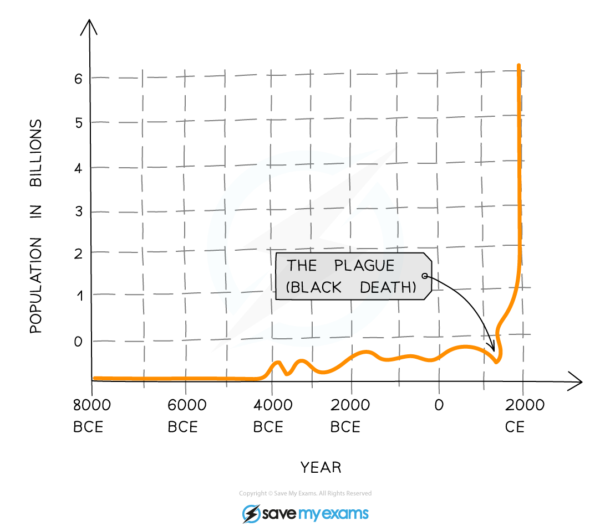

## Biodiversity & Endemism

* Biodiversity can be thought of as a study of all the **variation** that exists within and between all forms of life
* Biodiversity looks at the range and variety of genes, species and habitats within a particular region
* It can be assessed at three different levels:

  + The number and range of different ecosystems and habitats
  + The number of **species** and their relative abundance
  + The **genetic** variation within each species
* Biodiversity is very important for the **resilience of ecosystems;** in that it allows them to **resist changes**in the environment

#### Ecosystem or habitat diversity

* This is the **range** of different ecosystems or **habitats**within a **particular area or region**
* If there is a large number of different habitats within an area, that area is likely to have **high biodiversity**

  + A good example of this is a coral reef. They are very complex with lots of microhabitats and **niches** to be exploited
* If there are only one or two different habitats within an area, that area is likely to have low biodiversity

  + Large sandy deserts typically have very **low biodiversity** as the conditions are basically the same throughout the whole area

#### Species diversity

* An ecosystem such as a tropical rainforest that has a very high number of different species would be described as being **species-rich**

  + **Species richness** is the **number** of species within an ecosystem
* Species diversity includes the number of different species in an ecosystem, and also the**abundance** across the different species present

  + The **greater the number of species** in an ecosystem, and the **greater the abundance** of individuals from each species, the greater the **species** **diversity**
  + For example, an ecosystem can have a large number of different species but some species may be very rare (may only have a few individuals) in that particular ecosystem. As a result, the ecosystem does not necessarily have high species diversity
* Ecosystems with **high species diversity**are usually **more stable** than those with lower species diversity as they are **more resilient** to environmental changes

  + For example, in the Pine forests of Florida, the ecosystem is **dominated by one or two** tree species. If a pathogen comes along that target one of the two dominant species of trees, then the whole population could be wiped out and the ecosystem it is a part of could collapse

#### Genetic diversity

* The genetic diversity within a species is the **diversity of alleles and genes in the genome** of species
* Although individuals of the same species will have the same genes, they will not necessarily have the same **alleles**for each gene
* Genetic diversity is measured by working out the proportion of genes that have more than one form (allele) and how many possible alleles each gene has
* There can be genetic differences or diversity **between populations** of the same species

  + These differences may arise because the two populations occupy slightly different ranges in their habitat and so are subject to slightly different selection pressures that affect the allele frequencies in their populations
* Genetic diversity can also be observed **within** **a** **single population**

  + Genetic diversity in a species is important as it can help the population **adapt** to, and survive, **changes in the environment**
  + The changes could be in **biotic factors** such as new predators, pathogens and competition with other species
  + Or the changes could be through **abiotic factors** like temperature, humidity and rainfall
* Genetic diversity is **limited** in populations that are very **small** or **isolated**

  + **Inbreeding** in small, isolated populations leads to a **high proportion** of individuals being **homozygous** (e.g. AA to aa) for many genes, resulting in **lower genetic diversity**
  + This can mean that **genetic diseases** caused by **recessive alleles** can become **more common** in these populations

#### Endemism

* Certain species only occur in one particular area of the world - e.g. pygmy three-toed sloths which are only found on a small island off the coast of Panama
* These species are said to be **endemic** to that region and they do not naturally occur anywhere else
* Endemic species are particularly at risk of extinction due to their limited range

## The Threat of Human Activity

* **Evolution** by the process of natural selection has increased the variety of life on Earth over time
* In recent times, however, **human activities** have threatened many species with extinction
* The global human population has been growing **exponentially** for the last 150 years
* There are many reasons for this exponential growth, including:

  + **Improved technology** leading to an **abundance of food** = increase in birth rate
  + **Improved medicine, hygiene and health care** = decrease in death rate

***The human population is growing exponentially***

* Humans use many **resources** from the Earth such as **land** (for settlements and agriculture), **water**, **wood** and **fossil fuels**
* As the human **population** **increases** and countries become more economically **developed**, our requirement for these **natural resources** also **increases**
* This is having a **harmful effect** on many aspects of the environment, including **aquatic** and **terrestrial** **ecosystems**, and our **atmosphere** and **climate**
* The damage to these ecosystems is negatively impacting the **species** and **habitats** contained within them
* This means that a **conflict** exists between**human needs** and the **conservation of biodiversity**
* The **main factors affecting biodiversity** today are:

  + Habitat destruction
  + Overexploitation
  + Hunting
  + Agriculture
  + Climate change

#### Habitat destruction

* Many **human needs** lead to **natural environments** being **destroyed**
* When land is **cleared** for agriculture, industry, energy production housing, transport, leisure facilities, waste disposal and water storage, this results in:

  + **Habitat loss** (plant and animals completely lose their habitats)
  + **Habitat fragmentation** (habitats are divided into small areas - populations living within these **separated habitat fragments** are more likely to suffer from **inbreeding** or **local extinction**)
* **Deforestation** is one of the most damaging forms of habitat destruction, as forest habitats often have the **highest levels of biodiversity**
* **Marine habitats** are also being destroyed, including:

  + **Coral reefs** (some people use dynamite as an extreme way to catch fish, which damages corals)
  + **Sea beds** (fishing practices such as trawling, where nets are dragged along the sea bed, destroy this important habitat)

#### Overexploitation

* Many of the natural resources exploited by humans are actually being **overexploited** (they are being used up**faster**than they can be replaced)
* For example, much deforestation is **unsustainable** as trees are **removed** but are **not replaced** by replanting. Even if they are replanted, the rate at which trees are being **removed** far **exceeds** the rate at which they are **growing back**
* **Fish stocks** are also being overexploited, which is also having a knock-on effect on organisms that feed on these fish species, such as marine mammals and seabirds

#### Hunting

* Hunting is another form of overexploitation, as many **wild, non-farmed species** of animals are being hunted and removed **more quickly** than their wild populations can be **replenished**

  + An example is the hunting of animals for 'bush meat' in developing countries (including the hunting of primates such as monkeys and chimpanzees, as well as other mammal and reptile species)

#### Agriculture

* After the second world war, there was a massive change in how food was produced
* There was a need to produce more food, at a quicker rate
* It was then that modern farming practices began:

  + Farms became more **specialised** so they grew only one crop or raised one type of livestock (monoculture)
  + There was a switch to growing **cereal crops** rather than vegetables
  + **Fields were made bigger** to accommodate machinery via the removal of hedgerows and stonewalls
  + More land was made **arable** by **draining wetland** and **filling in ponds**
  + The use of **fertilisers** and **pesticides**massively increased
* Most of these modern farming techniques have had a **major negative impact** on the level of biodiversity present in farmed areas

  + Monocultures support much **lower levels of biodiversity** compared to natural habitats or even natural grazing land (that has a large variety of plant species present which can support a much greater range and number of insect species and bird species)
  + **Hedgerows** represent an **important habitat** for many insects, small mammals and birds, which can nest there. As hedgerows are being increasingly removed, this habitat and the biodiversity it supports is lost
  + **Fertilisers** can **leach** into **waterways**, causing **eutrophication**, which can lead to the death of many **aquatic invertebrate** and **fish** species
  + **Pesticides** (e.g. insecticides) used on crops kill insect pests but also **kill many non-target species**, including important insect pollinators like bees

#### Climate change

* Human-caused climate change is causing **weather patterns** to **change** and the **frequency of extreme weather events**, such as hurricanes, typhoons, floods and droughts, to **increase**

  + It is feared that climate change is now occurring **too fast** for many species to be able to **adapt** to these changes, which could result in many species becoming **extinct** and a major decline in biodiversity
* **Global warming** (a result of climate change) is causing many species to move towards the poles or to higher altitudes

  + However, these species may not be able to compete with, or may even out-compete, the species already present in these habitats, with either result leading to **decreased biodiversity**
  + Some species (such as plant species) may not be able to move or change their distributions fast enough to adapt to increasing temperature and may go extinct as a result
* Global warming (and the human-generated CO₂ that is the primary cause of this) is also threatening marine biodiversity:

  + **Increasing atmospheric CO₂** is leading to more CO₂ dissolving in seawater, **decreasing** its pH (known as **ocean acidification**). This is negatively affecting organisms that require**calcium carbonate** for shells (e.g. plankton and coral polyps)
  + Increased ocean temperatures have also led to an **increased frequency of coral-bleaching events**, where the tiny organisms that live inside corals and help keep them alive **leave** due to **temperature stress**. Without these organisms, the corals die and are broken down, eventually leading to the loss of whole coral reefs and as a result, the loss of the huge amount of biodiversity that depends on them