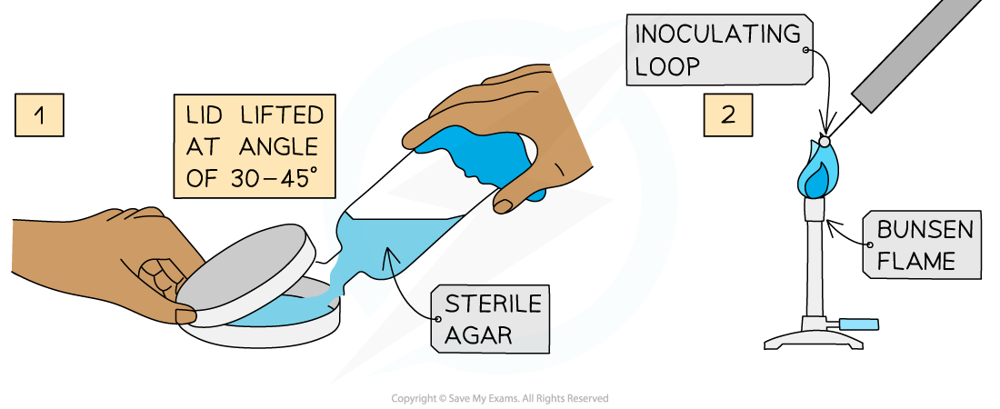
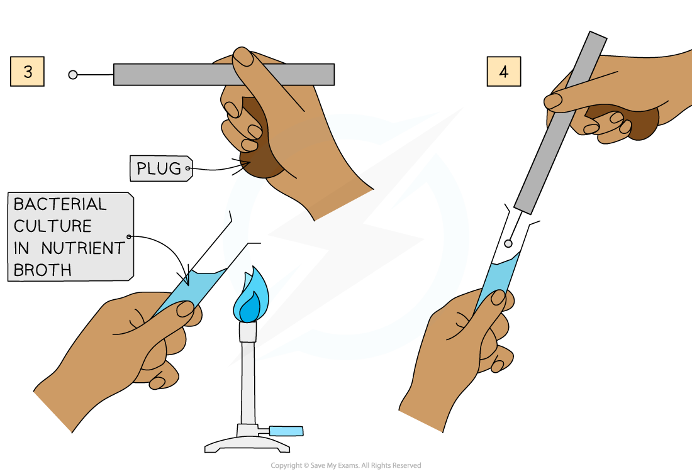
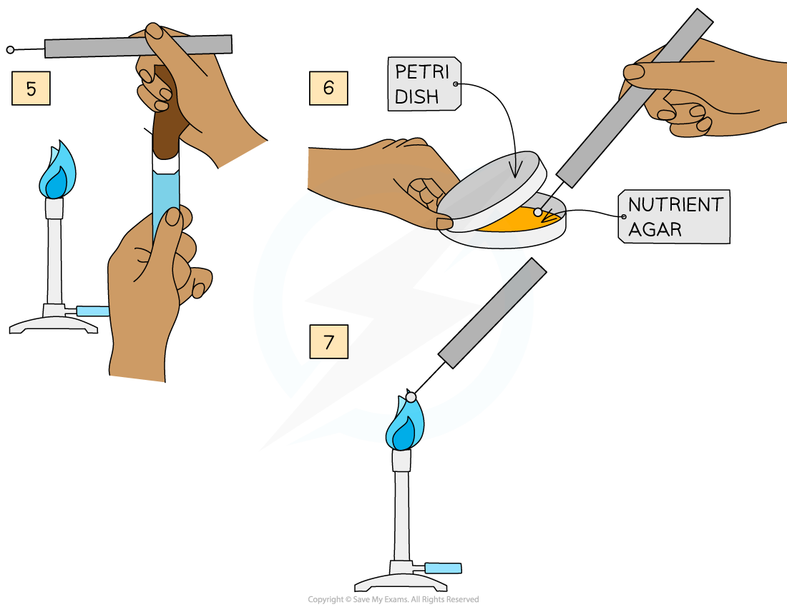
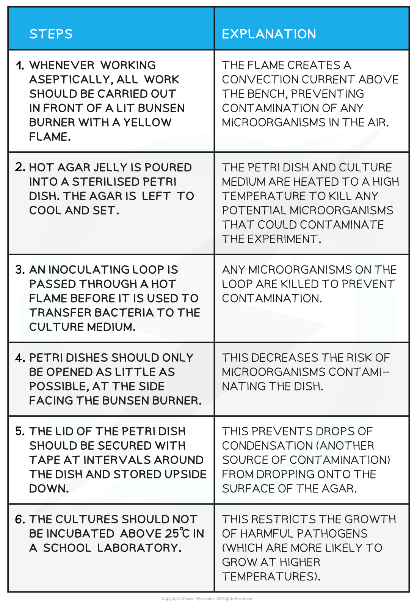

## Conditions Required for Bacterial Growth

* Bacteria are microscopic **prokaryotes** (meaning their cells do not contain a nucleus or membrane-bound organelles)
* They are often used in studies to test antimicrobial properties of substances

  + **Antimicrobial** means that the substance will either **kill** **microbes** (i.e. bacteria) or **prevent their growth**
* In order to perform these investigations, it is important to create an environment with all the **conditions** necessary for **bacterial growth** to occur
* Bacteria require the following conditions to survive and reproduce:

  + They require **nutrients**, which provide them with the materials needed to **grow** and **respire**
  + Those that respire **aerobically** will need a sufficient supply of **oxygen**
  + The **temperature** and **pH** of the environment must not be too high or too low to allow **enzymes** that control metabolic processes to **function optimally**

## Practical: Investigating Antimicrobial Properties of Plants

* Certain plant species have the ability to **kill** or **prevent the growth** of micro-organisms
* These **antimicrobial properties** can be incorporated into the development of new drugs

#### Apparatus

* Broth containing bacterial culture and nutrients
* Agar plate
* Pipette
* Plastic spreader
* Plant tissue
* Pestle and mortar
* Ethanol
* Funnel
* Glass beaker
* Filter paper
* Forceps
* Stopwatch
* Incubator

#### Method

* Prior to this practical, bacteria would have been grown in a mixture of distilled water and nutrients, along with a specific bacterial culture

  + This mixture is called a **broth**
* **Transfer** some of the bacteria from the broth onto an agar plate (which is a petri dish filled with agar jelly that will serve as a growth medium for the bacteria) using a **sterile pipette**
* Make sure the bacteria is **evenly spread** **out** by using a **sterile plastic spreader**

  + Open the lid of the of the agar plate **as little as possible** when doing this to avoid contaminating the plate with other fungi or bacteria present in the surrounding air
  + Place the lidback on top of the agar plate **immediately afterward** to prevent contamination
* To prepare the plant extracts, plant tissue must be dried and ground finely
* This should be **soaked in ethanol** to extract the antimicrobial substances, after which it should be filtered
* Equal sized discs cut from **sterile absorbent paper** should be dipped in the plant extract using sterile forceps
* Leave the discs in the extract for the **same amount of time** to ensure that they absorb a similar amount of the plant extract

  + The disc that will serve as the **control** will only be dipped in ethanol
* Space the discs out evenly on the agar plate, before taping the lid on, inverting the plate and **incubating it at 25°C**

  + This temperature will ensure good bacterial growth without stimulating the growth of human pathogens
* Incubate for 24 to 48 hours

***The same method as that shown above can be used to investigate the antimicrobial properties of plants. Just remember that the paper discs are soaked in different plant extracts (instead of different antiseptics) and the control disc should be soaked in ethanol (instead of sterile water)***

#### Analysis

* The area around each disc where bacteria cannot grow is known as the **clear zone**
* The **larger** the clear zone, the **more effective** the antimicrobial properties of that plant extract was
* The size of the clear zone can be determined by **measuring the diameter** or by **calculating the area** (area = πr2)
* **Repeat** the experiment at least three times and **calculate the mean** of the results

***Record the diameter of each clear zone to the nearest whole mm, and remember to calculate the area using the radius (taken as half the value of the mean diameter of each zone)***

#### Aseptic techniques

* These techniques are important to use in order to **prevent** the bacterial cultures on the agar plate from **being contaminated** by other micro-organisms or human pathogens from outside
* Contamination will have a **negative impact** on the growth of the bacteria under investigation
* When doing the investigation above, use the following **aseptic techniques**:

  + Keep windows and doors **closed** to prevent air movement
  + **Disinfect** surfaces and utensils regularly to prevent contamination
  + Ensure that you use **sterile equipment** and discard afterwards (especially plastic instruments)
  + Work near a **Bunsen flame** when transferring bacteria to ensure that microbes in the air are drawn away by rising hot air
  + For the same reason as above, hold the **flame** close to neck of the glass container of broth every time it's opened or closed

***To prepare an uncontaminated culture of microorganisms, this procedure can be followed***

**Aseptic Techniques Table**

#### Examiner Tips and Tricks

It is vital that one of the paper discs placed on the bacterial agar plate is not soaked in plant extract but in ethanol instead. This is to ensure that any differences in bacterial growth observed can be attributed to the antimicrobial properties of the plant extracts used and not some other factor (such as the paper discs themselves or the presence of ethanol, for example).