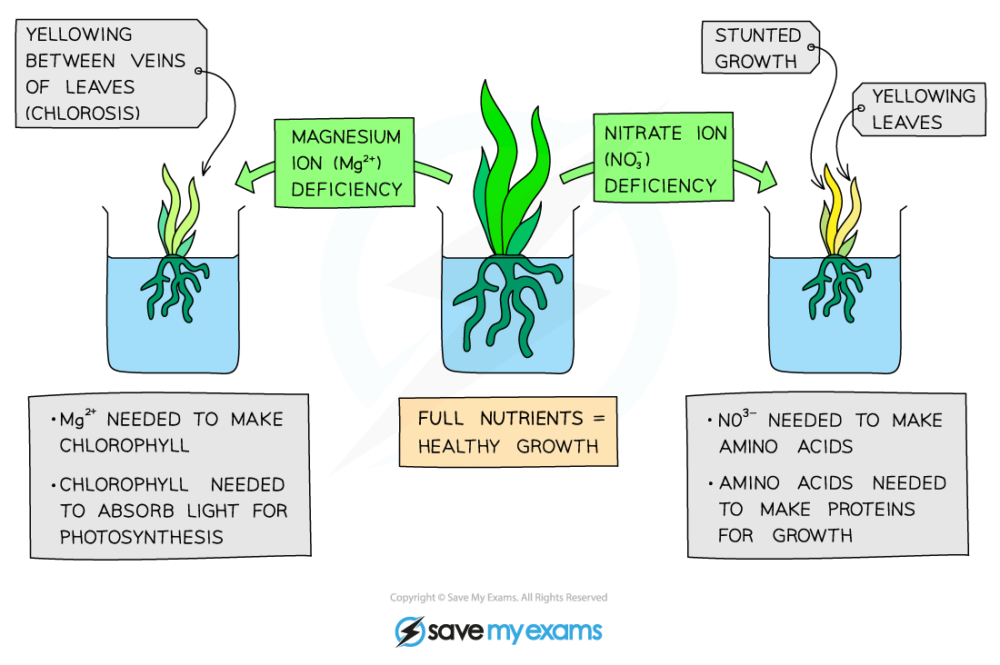

## Importance of Water & Inorganic Ions to Plants

* Plant cells perform a variety of different functions
* In order to perform these functions efficiently, the plant requires **water** and **inorganic ions** (minerals)
* They are absorbed through the **root hairs** on the root and travel up the stem in **xylem vessels**
* A plant will show certain **symptoms** (e.g. yellow leaves, stunted growth) when there is a **deficiency** in any one of these substances

#### Water

* Important component required for **photosynthesis**
* Provides a **transport medium** for minerals
* Maintains **turgidity** in plant cells though pressure in cell vacuoles
* **Regulates temperature** - to ensure that enzymes can function at their optimum rate

#### Magnesium ions

* Important requirement for the **production of chlorophyll**
* This provides the green colour of stems and leaves and is essential for photosynthesis

#### Nitrate ions

* Without nitrate ions, the plant would be unable to s**ynthesise DNA**, **proteins** and **chlorophyll**

  + **Enzymes** are important proteins for which nitrate ions are needed
* These molecules are essential for **plant growth**, as well as the production of **fruit** and **seeds**

#### Calcium ions

* These form important **cell wall components**
* Plants require calcium ions for proper **growth**

***Diagram showing the importance of magnesium and nitrate ions for plants***

## Practical: Investigating Plant Mineral Deficiencies

* The following experiment could be done with any one of the mineral ions mentioned earlier
* For this example, the focus will be on investigating the effect of a **calcium deficiency** on plants

#### Apparatus

* Nutrient broths
* Test tubes
* Seedlings
* Aluminium foil
* Mass balance

#### Method

* Prepare three nutrient broths containing every mineral that a plant requires, but with different concentrations of **calcium ions** in each (**high**, **medium** and **low**)

  + Label three test tubes for each of the nutrient broths (three 'high', three 'medium' and three 'low' = nine in total)
* Take **nine seedlings**, ensuring that they are from the same plant and are the same age, and **record the mass** of each
* Place one seedling on top of each test tube, **suspending the roots** in the nutrient broth
* Cover the test tubes with aluminium foil to **keep light away** from the broth
* Place the test tubes near a **source of light** and leave them for a few days
* Remove each plant from the broth and carefully blot it dry before **measuring the mass** again
* Record the end mass and use that to **calculate the mean change in mass** of the plants for each of the different nutrient broths
* Make a note of any **physical differences** between the plants of the different groups

#### Variation of the practical

* Another variation of the experiment mentioned above, is to investigate the effect on plant growth when the mineral is **completely lacking**
* In this experiment you would have broths that contains all of the minerals, except the one that is being investigated
* There would also need to be two **control broths**

  + One would contain all the minerals
  + The other would contain no minerals