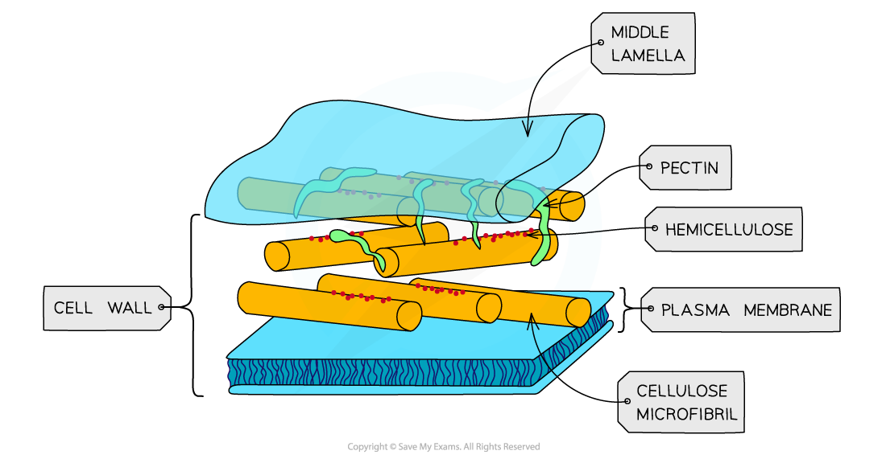
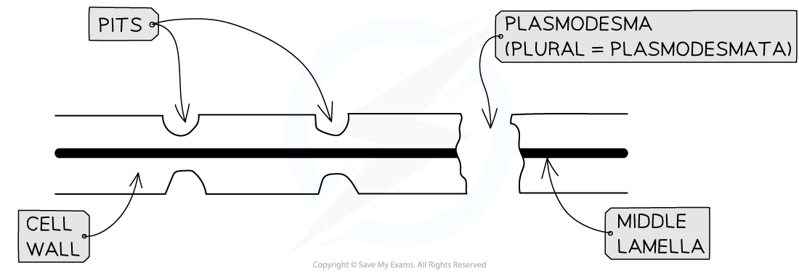
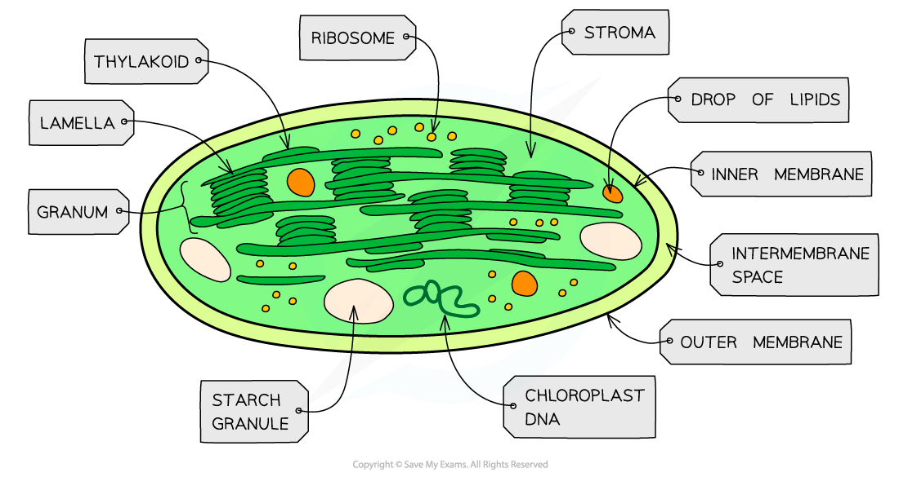
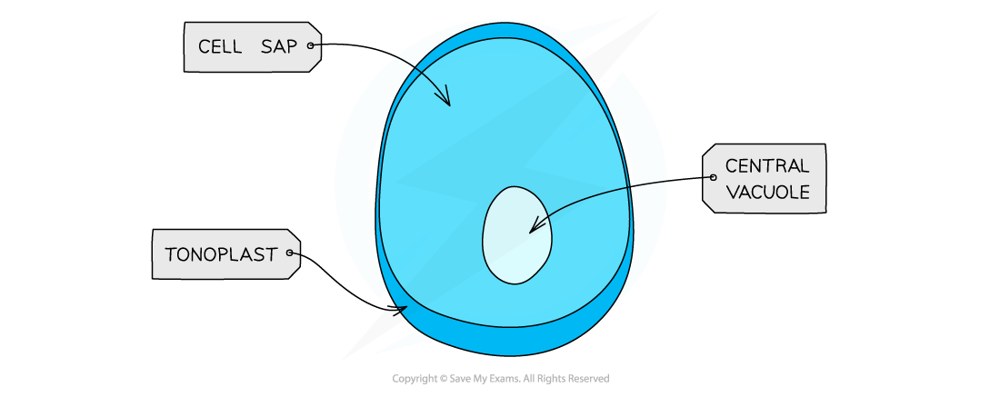
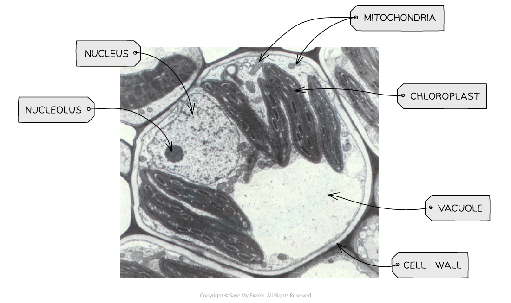

## Plant Cell Structure

* Plant cells contain most of the organelles found in animal cells, along with a few extra organelles that are only found in plant cells

#### Cell wall

* Cell walls are formed outside of the cell membrane and offer **structural support** to the cell

  + This structural support is provided by the polysaccharide **cellulose**

#### Middle lamella

* This forms the **outermost layer** of the plant cell and acts like glue to stick adjacent plant cells together
* It provides **stability** to the plant

***A diagram to show the cell wall and middle lamella of one plant cell***

#### Plasmodesmata

* Narrow threads of cytoplasm (surrounded by a cell membrane) called **plasmodesmata** connect the cytoplasm of neighbouring plant cells
* This allows substances to be **transported** between plant cells and facilitates **cell to cell communication**

#### Pits

* These are **very thin** regions of the cell wall
* The pits in adjacent plant cells are lined up in **pairs**
* This facilitates **transport** of substances between cells

***Detailed structure of plant cell wall***

#### Chloroplasts

* Larger than mitochondria, also surrounded by a **double-membrane**
* Membrane-bound compartments called **thylakoids** containing chlorophyll stack to form structures called **grana** (singular = granum)
* Grana are joined together by **lamellae** (thin and flat thylakoid membranes)
* Chloroplasts are the site of **photosynthesis**:
* Certain parts of photosynthesis occur in **thylakoid membranes**, while other parts happen in the **stroma**
* Chloroplasts also contain small circular pieces of **DNA**and ribosomes used to synthesise proteins needed in chloroplast replication and photosynthesis

***Chloroplasts are found in the green parts of plants - the green colour is due to the presence of the pigment chlorophyll***

#### Amyloplasts

* Small, membrane bound organelle containing **starch granules**
* They are responsible for **storing starch** in plants and converting it back to glucose when the plant needs it

***Structure of an amyloplast***

#### Vacuole and tonoplast

* The vacuole is a sac in plant cells surrounded by the **tonoplast** (selectively permeable membrane)
* Contains cell sap, which is a mixture of different substances such as water, minerals, waste and enzymes
* Vacuoles have several functions in plant cell:

  + They keep cells **turgid**, which stops the plant from wilting
  + They can **break down** and **isolate** unwanted chemicals in plant cells
  + The tonoplast **controls** what can enter and leave

***The structure of the vacuole***

## Recognising Organelles from Electron Microscope Images

* It is important to be able to recognise the plant organelles mentioned earlier from electron microscope images

***TEM electron micrograph of a plant cell showing key features***