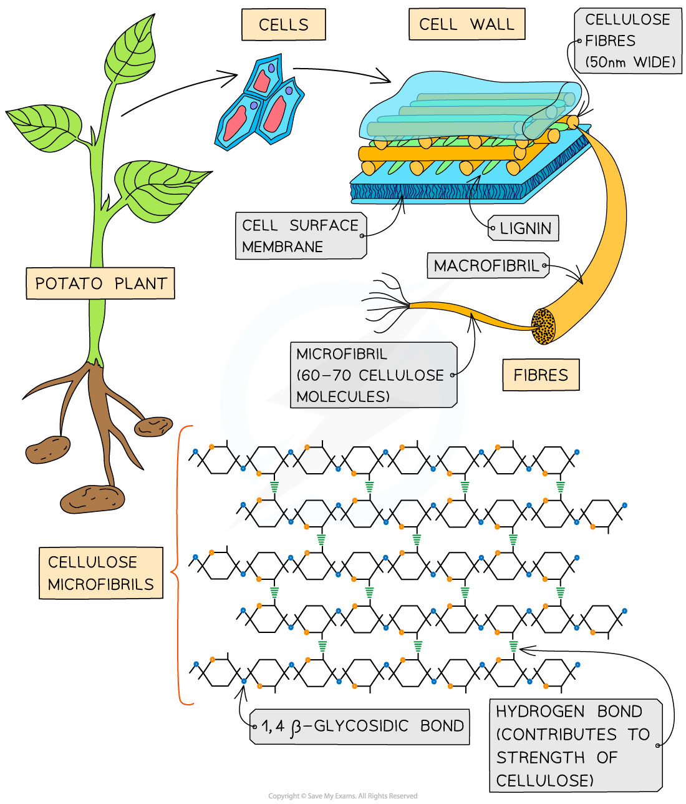

## Plant Fibres

* Sclerenchyma fibres and xylem vessels are made of **long, hollow plant cells**
* These cells are hollow due to the fact that their cell contents **died** (often due to the lignification of the cell wall, which makes it almost impossible for substances to enter or leave the cell)
* These fibres have **great strength**, which is a property that is often exploited by humans

  + They are useful in making **rope** and certain **fabrics** are made from plant fibres (e.g. cotton and hemp)
* Their strength is due to certain factors affecting the cell wall:

  + The **arrangement of microfibrils** in a mesh-like pattern
  + **Secondary thickening**, which results in a thick secondary cell wall developing which often contains **lignin**

***The arrangement of cellulose microfibrils, along with secondary thickening, are the main reasons why plant fibres are very strong***