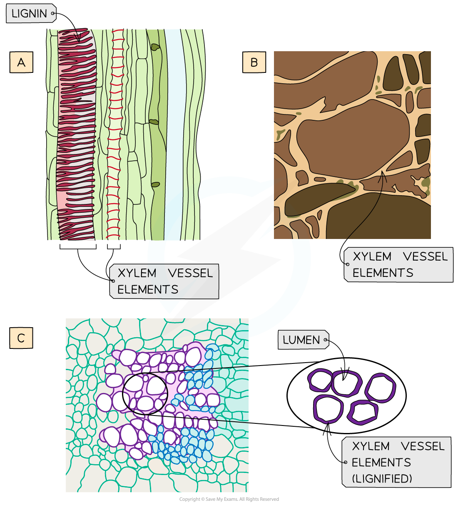
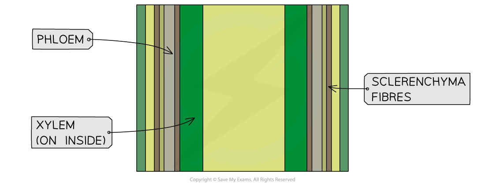

## Plant Stems

#### Xylem vessels

* The functions of **xylem** tissue in a plant are:

  + Vascular tissue that **transports** dissolved minerals and water around the plant
  + Structural **support**
* Their cell walls contain **lignin**, which enables the vessels to withstand the pressure created by the moving column of water
* Xylem vessels form **long, hollow** straw-like structures that are formed by **dead cells** (due to lignification of cell walls)
* This means that they **do not** contain any cytoplasm or organelles that could slow down the flow of water
* There are small regions in the walls that are not lignified, known as **pits**, which allows for lateral movement of water and minerals between xylem vessels

***Images of xylem vessel elements: A = photomicrograph (drawing) in longitudinal section (lignin is stained red), B = scanning electron micrograph (drawing) in transverse section, C = microscope image (drawing) in transverse section (lignin is stained purple)***

**Structure and Function of Xylem Vessels Table**

#### Sclerenchyma fibres

* Sclerenchyma fibres are not involved in transport of substances, they **provide support**
* Similar to xylem, they consist of bundles of **dead cells**
* They form **long, hollow tubes**, but they do have **end walls** present
* **Lignification** of cell walls occur, but they **do not have pits** like xylem vessels
* They have **more cellulose** in their walls compared to other plant cells

#### Phloem tissue

* The functions of **phloem** tissue in a plant are:

  + Transport **organic compounds** (assimilates), particularly sucrose, from sources (e.g. leaves) to sinks (e.g. roots). The transport of these compounds can occur **up** and **down** the plant
  + This is known as **translocation**
  + Phloem has no support function in a plant
* The organic compounds are dissolved in water to form sap
* Phloem is a complex tissue made up of various cell types; its bulk is made up of **sieve tube elements** which are the main conducting cells and **companion cells**
* Other cell types of phloem tissue also include parenchyma for storage and strengthening fibres
* Mature phloem tissue contains living cells, unlike xylem tissue

***Structure of phloem tissue: A = microscope slide image (and below drawing) of a sieve tube element and companion cell in transverse section, B = photomicrograph image (and below drawing) of a sieve tube element and companion cell in longitudinal section***

***Structure of phloem tissue: C = transmission electron micrograph image (and drawing) of a sieve tube element and companion cell in transverse section***

#### Sieve tube elements

* Sieve tube elements line up end to end to form a **continuous tube**

**Phloem Sieve Tube Elements Structure & Function Table**

#### Companion cells

* Each sieve tube element has a companion cell associated with it as companion cells control the metabolism of their associated sieve tube member
* They also play a role in **loading and unloading of sugars into the phloem sieve tube elements**

**Phloem Companion Cells Structure & Function Table**

#### Vascular bundles in a stem

* **Vascular bundles** consist of xylem vessels which are group together with phloem tissue
* In a stem, the **xylem vessels** are always located towards the middle of the stem, while the **phloem** is located closer towards the outside of the stem
* **Sclerenchyma fibres** are associated with the vascular bundles and provide additional support to the stem

***Transverse section through a stem, showing the positions of phloem, xylem and sclerenchyma fibres***

***Longitudinal section through a stem, showing the positions of phloem, xylem and sclerenchyma fibres***

#### Examiner Tips and Tricks

Understand the difference between sieve tube elements and companion cells, and how they are different to xylem tissue. Remember that mature xylem tissue is dead, so there is no evidence of organelles, and they have lignified cell walls, whereas sieve tube elements have no lignin, have sieve plates, and have companion cells that contain nuclei and cytoplasm.