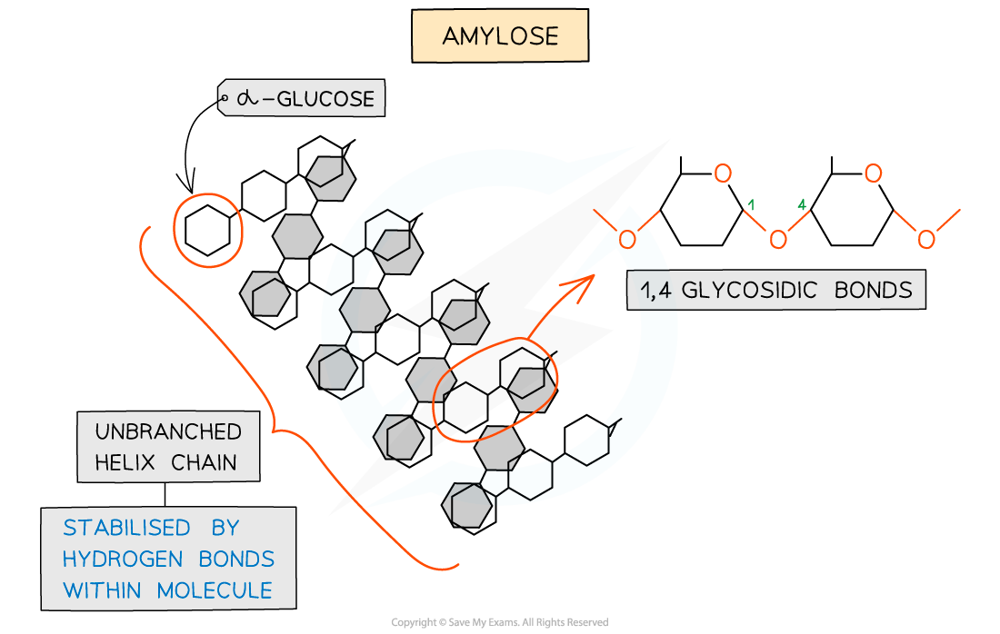

## Starch & Cellulose: Structure & Function

#### Starch

* Starch is the **storage** polysaccharide of **plants**
* It is stored as granules in plastids (e.g. chloroplasts) and amyloplasts (small, membrane bound organelles containing starch granules)
* Due to starch molecules being large **polymers** consisting of thousands of **glucose monomers**, starch takes **longer to digest** than glucose
* Starch is constructed from **two** **different** polysaccharides:

  + **Amylose** (10 - 30% of starch)

    - **Unbranched** helix-shaped chain with **1,4 glycosidic bonds** between **α-glucose** molecules
    - The helix shape enables it to be more compact and thus it is more resistant to digestion

***Amylose - one of the two polysaccharides present in starch***

* **Amylopectin** (70 - 90% of starch)

  + 1,4 glycosidic bonds between α-glucose molecules (as found in amylose)**but also 1,6 glycosidic bonds** form between glucose molecules creating a **branched** molecule
  + The branches result in many terminal glucose molecules that can be **easily hydrolysed** for use during **cellular respiration** or added to for storage

***Amylopectin - the other polysaccharide present in starch***

* **Starch** is a storage polysaccharide because it is:

  + **Compact** (so large quantities can be stored)
  + **Insoluble** (so will have **no osmotic effect,** unlike glucose which would cause water to move into cells, meaning cells would then have to have thicker cell walls to withstand the increased internal water pressure)

#### Cellulose – structure

* Cellulose is a **polymer** consisting of long chains of **β-glucose** joined together by **1,4 glycosidic bonds**
* As β-glucose is an isomer of α-glucose, consecutive β-glucose molecules must be **rotated 180° to each other** in order to form the 1,4 glycosidic bonds

***To form the 1,4 glycosidic bond between two β-glucose molecules, the glucose molecules must be rotated to 180° to each other***

* Due to the **inversion** of the β-glucose molecules **many** **hydrogen** **bonds** form between the long chains, giving cellulose it’s great **strength**

***Cellulose is used as a structural component due to the strength it has from the many hydrogen bonds that form between the long chains of β-glucose molecules***

#### Cellulose – function

* Cellulose is the **main structural component**of **cell walls** due to its strength, which is a result of the many hydrogen bonds found between the parallel chains of **microfibrils**
* The **high tensile strength** of cellulose allows it to be **stretched without breaking** which makes it possible for cell walls to withstand **turgor pressure**
* The cellulose fibres and other molecules (e.g. lignin) found in the **cell wall** form a matrix which increases the strength of the cell walls
* These **strengthened cell walls** provide **support** to plants