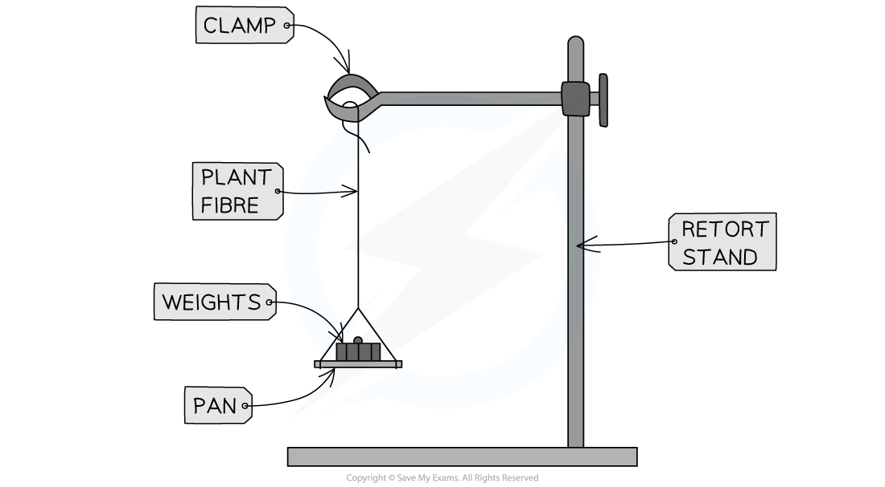

## Practical: Determining the Tensile Strength of Plant Fibres

* The **tensile strength** of a fibre refers to the **maximum load** it can carry **before breaking**

  + For example, this information would be important when determining the strength of a rope made of plant fibres

#### Apparatus

* Plant fibres
* Retort stand (clamp stand)
* Clamp
* Weights

#### Method

* The fibre should be attached to a **clamp stand**
* Attach a **weight** on the other end of the plant fibre
* Carefully continue to **add one weight** at a time until the **fibre breaks**
* **Record the mass** at which the fibre **broke**
* This represents the **tensile strength**
* To increase the **accuracy** of your results, this process should be **repeated** with more samples of the same plant fibre

  + These values can be used to **calculate the mean** tensile strength for the fibre
  + It is important to ensure that the fibres are all of the **same length** and that all other **variables are kept constant**

***Apparatus used to determine the tensile strength of plant fibres***