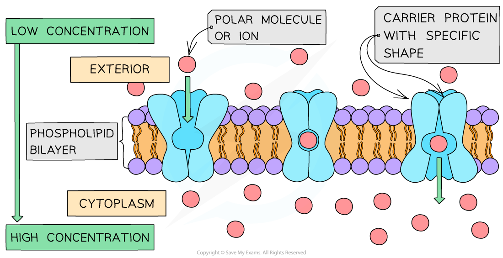
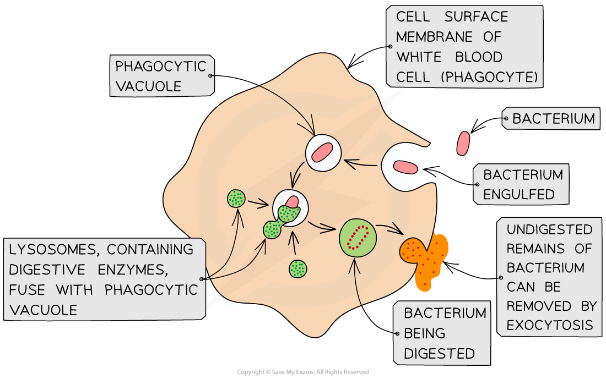

## Active Transport

* Active transport is the **movement of molecules and ions through a cell membrane from a region of lower concentration to a region of higher concentration**

  + Active transport **requires energy** in the form of **ATP** from respiration to move substances **against their** **concentration gradient**; hence this is an **active** process
* Active transport requires **carrier proteins**

  + Each carrier protein is specific to a particular type of molecule or ion
* Energy is required to allow the carrier protein to **change shape**; this transfers the molecules or ions across the cell membrane

  + The **energy required is provided by ATP** (adenosine triphosphate) produced during respiration
  + The ATP is hydrolysed to release energy

***Active transport moves substances across a membrane from low to high concentration. Note that ATP is required for carrier proteins to change shape.***

* Examples of active transport include

  + **Reabsorption** of useful molecules and ions **into the blood** after filtration into the kidney tubules
  + **Absorption** of some products of digestion from the digestive tract **into the blood**
  + **Loading sugar** from the photosynthesising cells of leaves **into the phloem** tissue for transport around the plant
  + **Loading inorganic ions** from the soil **into root hair cells**

#### Endocytosis

* Some molecules are **too large** to travel via membrane proteins, e.g.

  + Proteins
  + Lipids
  + Some carbohydrates
* In such cases a cell can **surround a substance with a section of the cell surface membrane**

  + The membrane **engulfs** the substance and pinches off inside the cell to form a **temporary vacuole** with the ingested substance contained inside
  + This is **endocytosis**

    - Phagocytosis is an example of endocytosis
* Endocytosis is an **active process** and requires a source of energy

***Phagocytosis is an example of endocytosis; the cell surface membrane extends around a pathogen, engulfing it and enclosing it within a temporary vacuole inside the cell***

#### Exocytosis

* Some substances produced by the cell need to be **secreted**, such as hormones, some enzymes, and lipids
* **Vesicles** containing the substance **pinch off from sacs of the Golgi apparatus**
* These vesicles are moved toward the cell surface and fuse with the cell surface membrane to be released outside the cell

  + This is **exocytosis**
* Exocytosis is an **active process** and requires a source of energy

***The active processes of endocytosis and exocytosis***

***Exocytosis allows the bulk secretion of substances from cells***

#### Examiner Tips and Tricks

Be careful not to get carrier proteins and channel proteins confused when answering questions on active transport. Active transport requires **carrier proteins** (transmembrane transport proteins that undergo conformational change) **not** channel proteins.