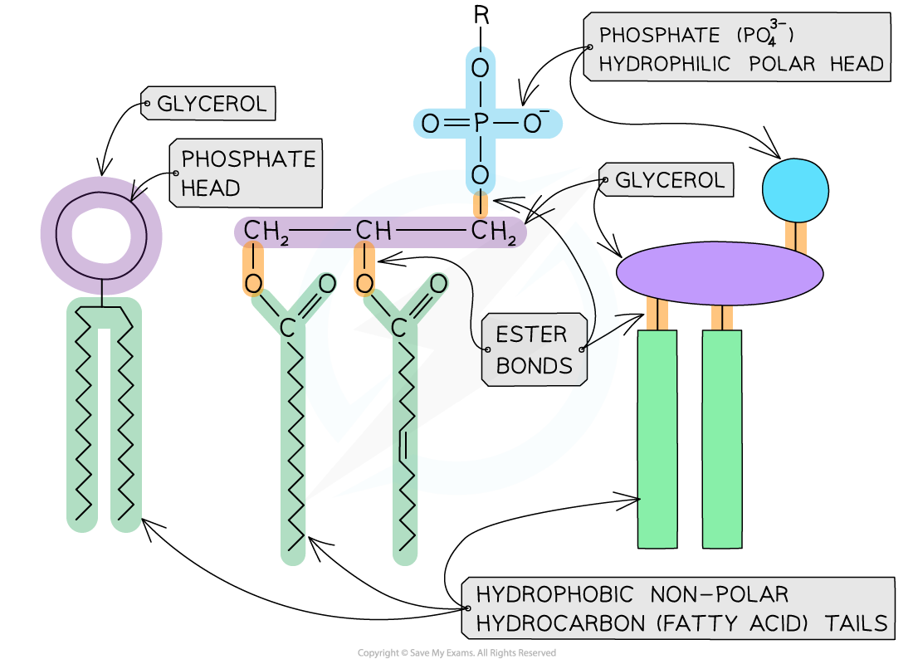
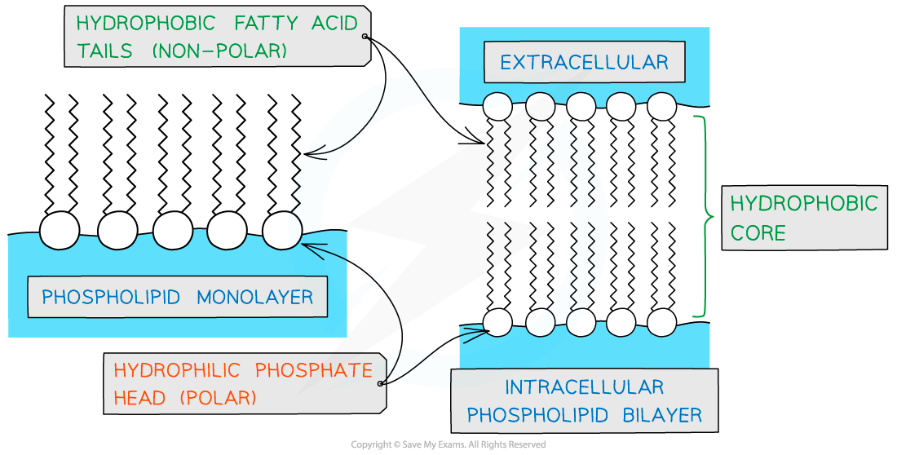
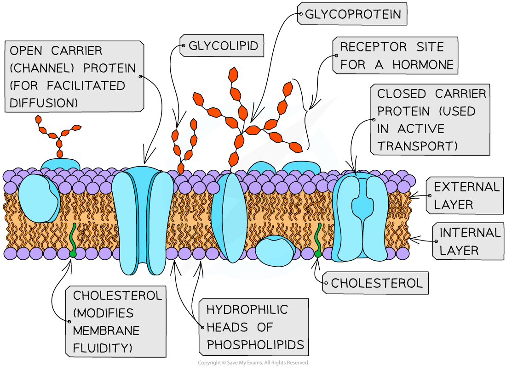
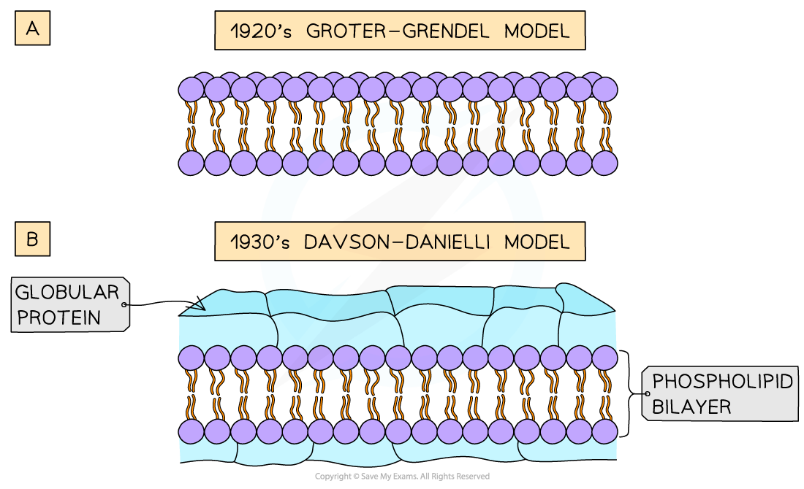
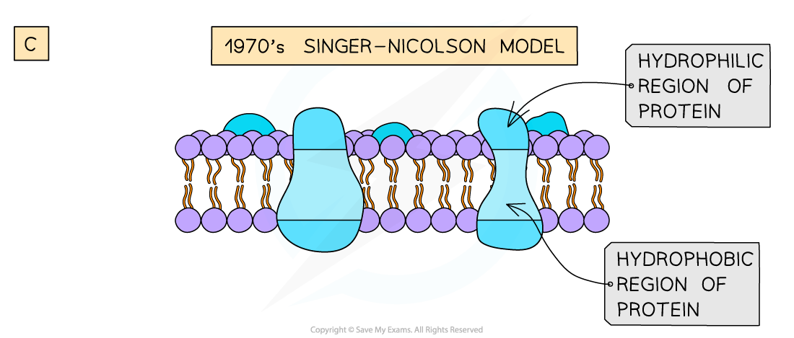

## Cell Membranes

* **Membranes** are vital structures found in all cells
* The **cell surface membrane** creates an enclosed space separating the internal cell environment from the external environment, and **intracellular membranes** form compartments within the cell such as the **nucleus**, **mitochondria,** and **endoplasmic reticulum**
* Membranes do not only separate different areas but also control the **exchange of substances** from one side of a membrane to the other, as well as acting as an **interface for communication**

  + Membranes are partially permeable

    - Substances can cross membranes by diffusion and active transport
  + Membranes contain receptor proteins, e.g. for binding to hormones, and antigens

#### Phospholipids

* Cellular membranes are formed from a double layer, or **bilayer**, of **phospholipids**
* Phospholipids consist of

  + A molecule of **glycerol**
  + A **phosphate group**, which forms the **phosphate head**
  + **Two fatty acid tails**, making up the **lipid tail**
* Phospholipids contain two distinct regions: a polar head and two non-polar tails

  + The **phosphate head** of a phospholipid is **polar,**meaning that it can interact with polar water molecules; the head is therefore described as being **hydrophilic**

    - Hydro = water
    - Philic = loving
  + The lipid tail is **non-polar,**meaning that it cannot interact with polar molecules; the tail is therefore described as hydrophobic

    - Hydro = water
    - Phobic = hating

***Phospholipids can be visually represented in different ways. In the image above the left-hand diagram shows a simple representation of the phosphate head and lipid tails, while the central diagram shows the chemical structure of each region; the separate glycerol and phosphate group can be seen, as well as the ester bonds that join the components together. The right-hand diagram shows a diagrammatic representation of the chemical structure.***

* If phospholipids are spread over the surface of water they form a single layer with the **hydrophilic phosphate heads in the water** and the **hydrophobic fatty acid tails sticking up** away from the water

  + This is called a **phospholipid monolayer**
* Alternatively, two-layered structures may form in sheets; these are called **phospholipid bilayers**

  + Phospholipid bilayers form the basic structure of the cell membrane

***Phospholipids can form monolayers and bilayers***

#### Structure of membranes

* The phospholipid bilayers that make up cell membranes also contain **non-lipid components**

  + **Proteins** are involved with **cell transport** and **communication**

    - The proteins can either be **intrinsic** or **extrinsic**

      * Intrinsic proteins can also be referred to as integral
      * Extrinsic proteins can also be referred to as peripheral
    - Intrinsic proteins are **embedded** in the membrane with their precise arrangement determined by their hydrophilic and hydrophobic regions
    - Extrinsic proteins are found on the **outer or inner surface** of the membrane
  + **Cholesterol** can be found between the phospholipids, where it **regulates membrane fluidity**

    - Cholesterol**increases the fluidity of the membrane at low temperatures,** stopping it from becoming too rigid

      * This occurs because cholesterol **stops the phospholipid tails packing too closely together**
    - Interaction between cholesterol and phospholipid tails also **stabilises the cell membrane at higher temperatures**by stopping the membrane from becoming too fluid

      * Cholesterol molecules bind to the hydrophobic tails of phospholipids, stabilising them and causing phospholipids to pack more closely together
    - Cholesterol**increases the mechanical strength and stability of membranes;** without it membranes would break down and cells would burst
  + **Glycolipids** and **glycoproteins** are present on the surface of the cell, where they aid **cell-to-cell communication**

    - Glycoproteins are **proteins with carbohydrate** attached, while glycolipids are **lipids with carbohydrate** attached
    - The glycolipids and glycoproteins **bind with substances at the cell’s surface**, e.g. hormones
    - Some glycolipids and glycoproteins act as cell markers or **antigens** for **cell-to-cell recognition**

      * E.g. the ABO blood group antigens are glycolipids and glycoproteins that differ slightly in their carbohydrate chains

* The phospholipid bilayer with its additional components is often described as a **'fluid mosaic'**

  + The scattered pattern produced by the components within the phospholipid bilayer looks somewhat like a **mosaic** when viewed from above
  + The mosaic of phospholipids and proteinscan **move around within the bilayer by diffusion**, hence the mosaic is said to be 'fluid'

    - The phospholipids mainly move sideways, within their own layer
    - The many different types of proteins interspersed throughout the bilayer move about within it, although some may be fixed in position
  + Note that the **fluid mosaic model** is one **model** of membrane structure; other models have been considered and rejected as knowledge of membrane structure has advanced
* The membrane is **partially permeable**

  + **Small, non-polar molecules** can pass through the gaps between the phospholipids
  + **Large, polar molecules** must pass through specialised membrane proteins called **channel proteins** and **carrier proteins**

***The distribution of the proteins within the membrane gives a mosaic appearance and the structure of proteins determines their position in the membrane***

#### Examiner Tips and Tricks

In an exam it is good practice to always refer to the cell membrane that surrounds the cell as either the **cell surface membrane** or the **plasma membrane**; this distinguishes it from all of a cell's internal membranes

## Models of the Cell Membrane

* Scientists use **models** to represent real world ideas, organisms, processes, and systems that cannot be easily investigated
* Over time, as **technological developments** have been made, the models used to **represent the structure of cell membranes** have changed
* The **fluid mosaic model** of cell membrane structure was first proposed in 1972 by **Singer and Nicolson**
* The model has **evolved over time,** and is thought to best account for the structure and functions of cell membranes as scientists **currently** understand them

  + **Models can change** on the basis of new discoveries; if scientists found a new feature of cell membranes that didn't fit with the fluid mosaic model, the model would be **altered**, or a **new model** introduced

* Evolving cell membrane models have included the following

  + The**Gorter and Grendel** model of the 1920s showed that the **phospholipids** in the membrane of cells were arranged into a **bilayer**

    - **Evidence** for this model

      * The number of phospholipids extracted from red blood cell membranes was double the area of the plasma membrane if it was arranged as a monolayer
    - **Problems**with this model

      * Their model did not explain the location of proteins or how molecules that were insoluble in lipids moved into and out of the cell
  + **Davson and Danielli's** model of the membrane from the 1930s suggested that the **proteins** were arranged in **layers** **above** and **below** the **phospholipid bilayer**

    - **Evidence** for this model

      * Membranes were effective at controlling the movement of substances in and out of cells
      * Electron micrographs showed the membrane had two dark lines with a lighter band between

        + In electron micrographs, proteins appear darker than phospholipids
    - **Problems** with this model

      * Freeze etched electron micrographs of the centre of the membrane showed globular structures **scattered throughout**
      * Improvements in technology used to analyse the proteins in the membranes showed that **proteins** were **globular**, **varied in size**and had parts that were **hydrophobic**
  + **Singer and Nicolson** proposed the **fluid mosaic model** in the 1970s; the model stated that membranes were **fluid** and that the globular **proteins** were both peripheral and **integral**

    - **Evidence** for this model

      * Analysis of **freeze-etched electron micrographs** showed proteins **extending** into the **centre of membranes**
      * **Biochemical analysis** of the plasma membrane components showed that membrane proteins are **free to move** within the bilayer

***Models of cell membrane structure have evolved over time***

#### Examiner Tips and Tricks

You do not need to recall the names of the scientists or dates for different models of membrane structure, but it is important to understand that **models** of membrane structure are **interpretations of data** which can change when scientific advances enable **new discoveries**.

Remember that models **represent** real-life structures and processes.