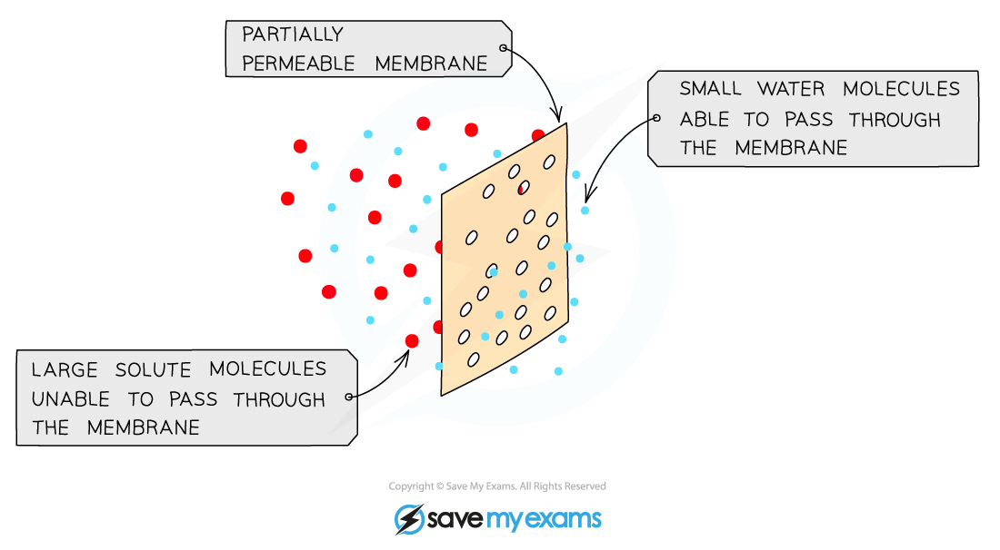
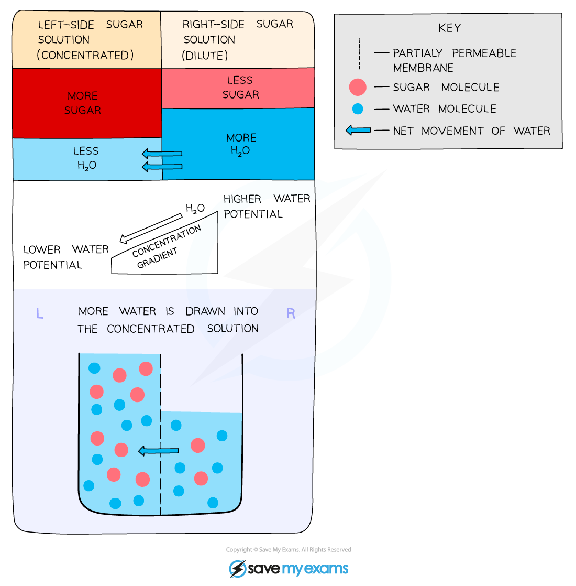

## Osmosis

* All cells are surrounded by a cell surface membrane which is **partially permeable**
* Water can move in and out of cells across the cell surface membrane by a process called **osmosis**

  + Osmosis is the **net movement of water molecules** from a region of **lower solute concentration** to a region of **higher solute concentration** through a partially permeable membrane

    - Water molecules move from a dilute solution to a concentrated solution
* In doing this, water is **moving down its concentration gradient**, so osmosis is a specialised form of diffusion

  + Water molecules will move from an area of **more free water molecules** to an area of **fewer free water molecules**

    - Water molecules are considered 'free' when they are **not surrounding substances in a solution**; when a substance dissolves it becomes surrounded by water molecules; such water molecules are **no longer free** and **cannot move through a membrane** readily
* Cell membranes are partially permeable, allowing small molecules like water through but not larger molecules such as solutes

  + Although water molecules are polar they can still pass through the bilayer because of their small size.

***Osmosis is the movement of water molecules from a dilute to a concentrated solution through a partially permeable membrane***

***Osmosis is the movement of water molecules down their concentration gradient. Note that 'water potential' is a term used to describe the number of free water molecules present.***

* Osmosis is important because it constantly affects the **cells** of living organisms

  + Cell cytoplasm consists of **water and dissolved substances**
  + Cells **lose or take on water** depending on the number of free water molecules in their surroundings in comparison to their cytoplasm
* When cells are placed in pure water, which has the highest possible number of free water molecules, water **moves into the cells by osmosis** and the cells **swell**

  + In animal cells this could lead to cell **bursting**
  + In plant cells the **cell wall prevents bursting**
* When cells are placed into a solution that has a smaller number of free water molecules than their cytoplasm, e.g. a concentrated glucose solution, water moves **out of the cells by osmosis** and the cells **shrink**

  + In animal cells the entire cell **shrivels**
  + In plant cells the vacuole and cytoplasm shrink but the **cell wall maintains the overall shape of the cell**