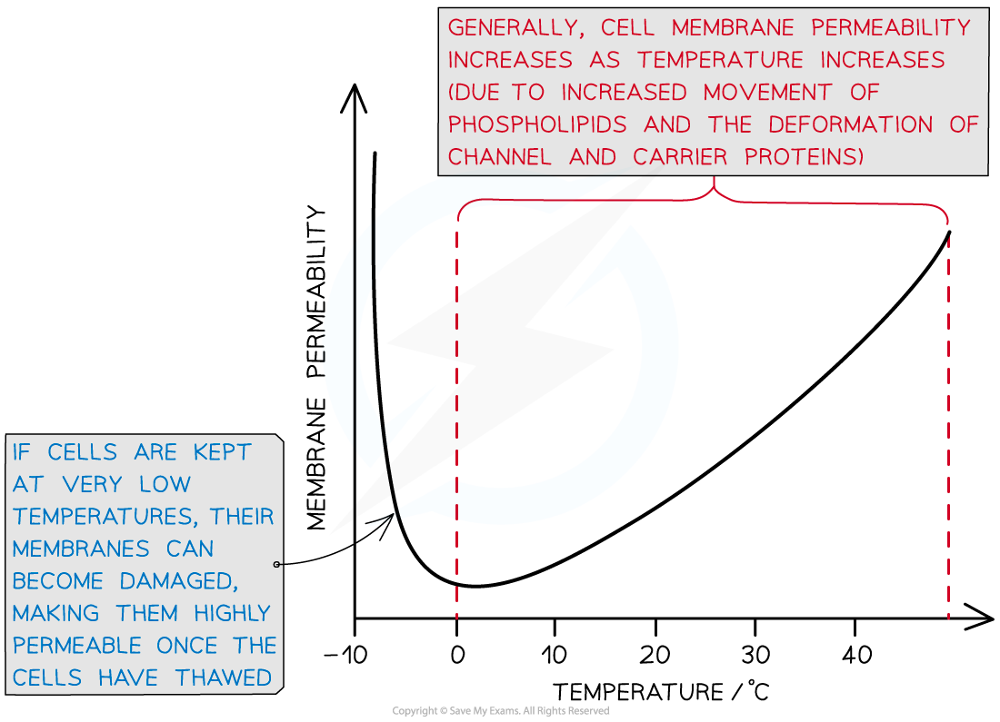

## Practical: Investigating Membrane Structure & Permeability

* The **permeability** of **cell membranes** is affected by several **factors** such as

  + **Temperature**
  + **pH**
* The effect of such factors on membrane structure and permeability can be investigated using **beetroot**

  + Beetroot cells contain a **dark purple-red pigment**
  + The **higher** the permeability of the beetroot cell membrane, the **more** of this pigment leaks **out of the cell**

* The amount of pigment in a sample can be measured using a piece of equipment known as a **colorimeter**

  + A colorimeter is a machine that passes light through a **coloured liquid sample** and measures how much of that light is absorbed by or transmitted through the sample

    - This gives an indication of how much of the colour is present in the solution, e.g. more absorbance or less transmission both indicate a darker coloured solution
  + A colour filter is used in the light path to ensure that the correct wavelength of light is used to measure the optical density of the specific pigment in the solution, e.g. the beetroot pigment called betalain
  + The colorimeter must be **zeroed** before each colorimeter is used; this can be done using **distilled water** in a small container called a cuvette

    - This process is known as **calibrating** the colorimeter

#### Investigating the effect of temperature on membrane permeability

#### Apparatus

* Scalpel
* Cork borer
* Cutting board
* Ruler
* Digital balance
* Test tubes
* Measuring cylinder
* Water baths
* Digital stopwatch
* Pipettes
* Colorimeter and cuvettes

#### Method

1. Using a cork borer and scalpel, cut five equal-sized sections of beetroot

   * The pieces must have the same dimensions so that they all have **equal surface areas and volumes**, as these factors could affect the rate at which the pigment leaks out
   * A cork borer enables cores of equal diameter to be cut, which can then be cut to the **same length**
2. Rinse the beetroot pieces

   * To **remove** any pigment released during cutting
3. Add the beetroot pieces to five different test tubes, each containing the same volume of water, e.g. 5 cm3
4. Put each test tube in a water bath at a different temperature, e.g. 10 ℃, 20 ℃, 30 ℃, 40 ℃, and 50 ℃, for the same length of time

   * The time should be **long enough to allow the pigment to diffuse into the water,** e.g. around 30 minutes
5. Remove the beetroot pieces, leaving just the coloured liquid in the five test tubes
6. Use pipettes to transfer samples of the coloured liquid to colorimeter cuvettes

   * Cuvettes are **small cuboid containers** that hold the liquid to be measured in a colorimeter
   * A different pipette should be used for each sample to **avoid the transfer of pigment** molecules between samples
7. Use a colorimeter to measure how much light is absorbed as it passes through each of the five samples of coloured liquid

   * The **higher** the **absorbance**, the **more** **pigment** must have been released due to a **greater** membrane **permeability**

#### Results

* The general pattern you would expect to see is that **as temperature increases, membrane permeability also increases**

  + As temperature increases, the phospholipids within the cell membrane **move** more because they have more **kinetic** **energy;** increased movement means the phospholipids are **not** as **tightly packed** together, increasing the permeability of the membrane
  + Temperature affects the 3D shape of **proteins;** at high temperatures **membrane proteins** denature, **increasing the permeability of the membrane**
  + The volume of water inside the cells **expands**, putting **pressure** on the membrane and damaging membrane components; this can increase membrane permeability
* If experimenting with temperatures below 0 ℃, membrane permeability may be increased once the cells have thawed again

  + **Ice crystals** that form can **pierce** the cell membrane, making it highly permeable

***Both high and very low temperatures can increase membrane permeability***

#### Limitations

* Cuvettes may differ in **thickness;** a thicker cuvette will absorb slightly **more light** than a thinner cuvette

  + Solution: use the **same cuvette** for every reading, or **repeat** the investigation many times and find a **mean**
  + Note that **scratched** cuvettes can have the same impact on absorbance as thicker cuvettes
* The beetroot pieces may not be identical in size and shape, meaning some test tubes could contain slightly more beetroot tissue than others

  + Solution: cut the discs as **accurately** as possible using a **scalpel and ruler**, and **repeat** each investigation several times to find a mean
* Some **parts** of beetroot tissue have **more pigment** in their cells than others

  + Solution: conduct several **repeats**, using **different parts** of the beetroot and find a **mean**

#### Variations

* The impact of**alcohol** on membrane permeability could also be investigated
* The expected trend is

  + As alcohol concentration i**ncreases** the permeability of the membrane **increases**
  + This is because **alcohol dissolves lipids** in the cell surface membrane so the membrane loses its structure and the beetroot pigment can leak out