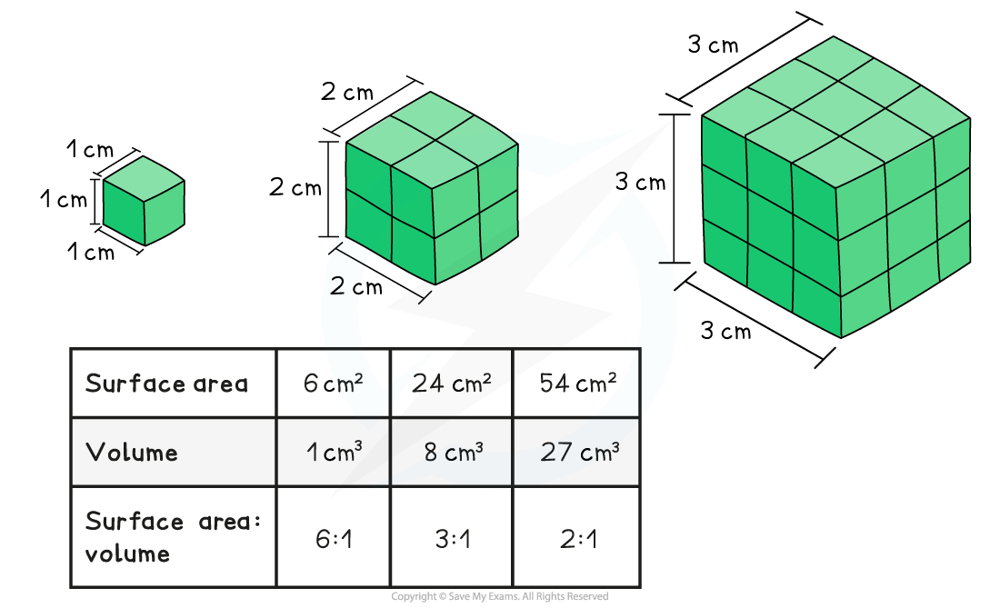

## Properties of Gas Exchange Surfaces

* All organisms need to **exchange gases with their environment,**e.g.

  + Aerobic respiration requires oxygen and produces carbon dioxide as a waste product
  + Photosynthesis requires carbon dioxide and produces oxygen as a waste product
* The process of gas exchange occurs by diffusion
* The surface over which this gas exchange takes place is known as an **exchange surface**; exchange surfaces have specific properties that enable efficient exchange to take place

#### Surface area to volume ratio

* The surface area of an organism refers to the **total area of the organism that is exposed to the external environment**
* The volume refers to the **total internal volume of the organism,** or total amount of space inside the organism
* The surface area of an organism in relation to its volume is referred to as an organism's **surface area : volume ratio (SA:V ratio)**
* As the overall **size of the organism increases**, the surface area becomes smaller in comparison to the organism's volume, and the organism's **surface area: volume ratio** **decreases**

  + This is because **volume increases much more rapidly than surface area as size increases**

* **Single-celled organisms** have a **high SA:V ratio** which allows the exchange of substances to occur by simple diffusion

  + The large surface area allows for maximum absorption of **nutrients** and **gases** and removal of **waste products**
  + The small volume within the cell means the diffusion distance to all organelles is short
* As organisms**increase in size**their **SA:V ratio decreases**

  + There is **less surface area** for the absorption of nutrients and gases and removal of waste products **in relation to the volume**, and therefore requirements, of the organism
  + The greater volume results in a longer diffusion distanceto the cells and tissues of the organism
* **Large multicellular organisms** have evolved adaptations to facilitate the exchange of substances with their environment

  + The gas exchange systems of multicellular organisms are adapted to increase the surface area available for the exchange of gases e.g.

    - Alveoli increase the surface area of mammalian lungs
    - Fish gills have structures called **lamellae** which provide a very large surface area
    - Leaves have a **spongy mesophyll layer** within which a large area of leaf cell surface is exposed to the air
* Note that the problem of internal diffusion distance is a separate, though connected, issue solved by the presence of a mass transport system such as a circulatory system

#### Diffusion pathway

* The **diffusion pathway**, or **distance**, across an exchange surface is **very short**
* The surface often contains only **one layer** of epithelial cells

  + The cells can also be flattened in shape to further reduce the distance across them
* This means that substances have a very **short diffusion pathway**

#### Concentration gradient

* This is the **difference in concentration** of the exchange substances on either side of the exchange surface, e.g. between the air inside the alveoli and the blood
* A greater difference in concentration means a **greater rate of diffusion** as the gas molecules move across the exchange surface
* The continued movement of exchange substances away from the exchange surface mean that a **concentration gradient is maintained**

  + This is achieved by e.g.

    - The alveoli have a **good blood supply**; this constantly removes oxygen from the capillary side of the exchange surface and supplies carbon dioxide
    - The ventilation system in mammals ensures constant **inhalation and exhalation**; this supplies oxygen and removes carbon dioxide from the alveoli side of the exchange surface

#### Examiner Tips and Tricks

Be careful when discussing surface area; the phrases 'surface area' and 'surface area : volume ratio' cannot be used interchangeably. Larger organisms have a larger surface area than smaller ones (an elephant clearly has a larger surface area than a bacterial cell), but it is the surface area : volume ratio that gets smaller as body size increases.