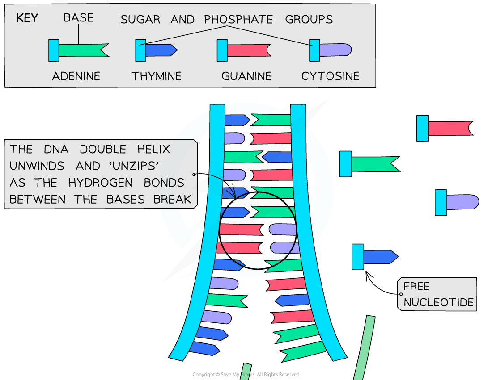
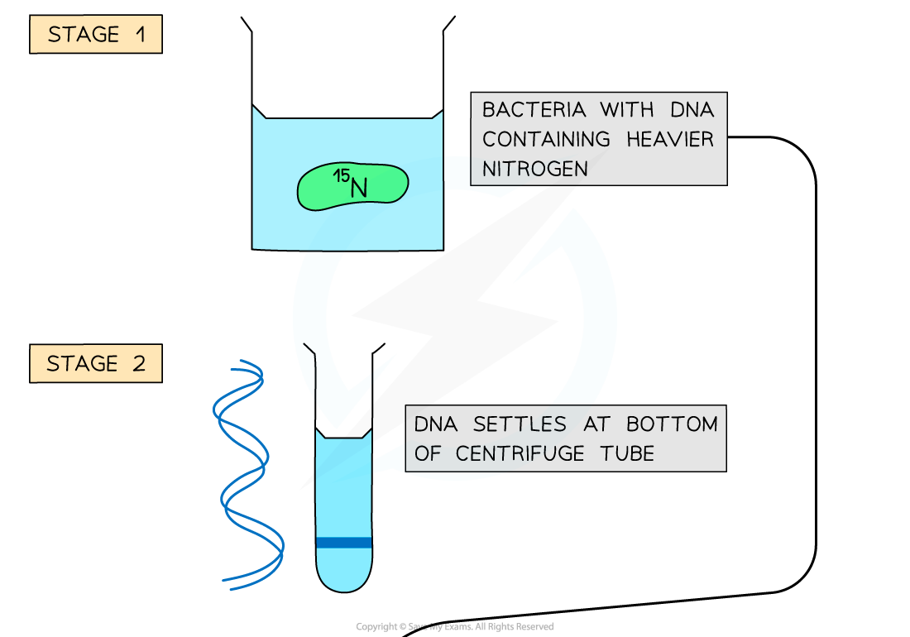

## DNA Replication

* Before a (parent) cell divides, it needs to **copy the DNA**contained within it
* **Doubling the DNA** ensures that the two new (daughter) cells produced will both receive **full copies of the parental DNA**
* The DNA is copied via a process known as **semi-conservative replication**(semi = half)
* The process is called this because in each new DNA molecule produced, one of the polynucleotide DNA strands (half of the new DNA molecule) is from the **original DNA** molecule being copied
* The other polynucleotide DNA strand (the other half of the new DNA molecule) has to be **newly created** by the cell
* Therefore, the **new DNA molecule has conserved half of the original DNA and then used this to create a new strand**

#### The importance of retaining one original DNA strand

* It **ensures**there is **genetic continuity**between generations of cells
* In other words, it ensures that the new cells produced during cell division **inherit all their genes** from their parent cells
* This is important because cells in our body are **replaced regularly** and therefore we need the new cells to be able to do the same role as the old ones

  + Replication of DNA and cell division also occurs during **growth**

***Semi conservative replication of DNA***

#### Semi-conservative replication

* DNA replication occurs in preparation for **mitosis**, the number of DNA molecules in the parent cell must be **doubled** before mitosis takes place
* DNA replication occurs during the **S phase** of the cell cycle (which occurs during **interphase**, when a cell is **not dividing**)
* The enzyme **helicase** **unwinds** the DNA double helix by breaking the **hydrogen bonds** between the base pairs on the two antiparallel polynucleotide DNA strands to form two single polynucleotide DNA strands
* Each of these single polynucleotide DNA strands acts as a **template** for the formation of a **new strand** made from free nucleotides that are attracted to the exposed DNA bases by **base pairing**
* The new nucleotides are then **joined together**by the enzymeDNA polymerase
* The original strand and the new strand join together through hydrogen bonding between base pairs to form the new DNA molecule
* This method of replicating DNA is known as **semi-conservative replication** because **half of the original** DNA molecule is kept (**conserved**) in each of the two new DNA molecules

#### DNA Polymerase

* In the nucleus, there are **free nucleotides** which contain three phosphate groups

  + These nucleotides are known as **nucleoside triphosphates** or **‘activated nucleotides’**
  + The extra phosphates activate the nucleotides, enabling them to take part in DNA replication
* The bases of the free nucleoside triphosphates **align** with their **complementary bases** on each of the **template** DNA strands
* The enzyme **DNA polymerase** **synthesises new DNA strands** from the two template strands
* It does this by **catalysing condensation reactions**between the **deoxyribose sugar and phosphate groups**of adjacent nucleotides within the new strands, creating the**sugar-phosphate backbone of the new DNA strands**
* DNA polymerase cleaves (breaks off) the two extra phosphates and uses the **energy released** to create the **phosphodiester bonds** (between adjacent nucleotides)
* **Hydrogen bonds** then form between the **complementary base pairs** of the template and new DNA strands

***Nucleotides are bonded together by DNA polymerase to create the new complementary DNA strands***

#### Leading & lagging strands

* **DNA polymerase** **can only build the new strand in one direction (5’ to 3’ direction)**
* As DNA is ‘unzipped’ from the 3’ towards the 5’ end, DNA polymerase will attach to the **3’ end of the original strand** and **move towards the replication fork** (the point at which the DNA molecule is splitting into two template strands)
* This means the DNA polymerase enzyme can synthesise the leading strand **continuously**
* This template strand that the DNA polymerase attaches to is known as the **leading strand**
* The other template strand created during DNA replication is known as the **lagging strand**
* On this strand, **DNA polymerase moves away from the replication fork**(from the 5’ end to the 3’ end)
* This means the DNA polymerase enzyme can only synthesise the lagging DNA strand in **short segments** (called Okazaki fragments)
* A second enzyme known as **DNA ligase** is needed to **join these lagging strand segments together** to form a continuous complementary DNA strand
* DNA ligase does this by catalysing the formation of **phosphodiester bonds** between the segments to create a **continuous sugar-phosphate backbone**

***The synthesis of the complimentary strand occurs differently on the leading and lagging strands of DNA***

## Meselson and Stahl’s Experiment

* Scientists were unsure if DNA replication was conservative or semi-conservative
* Two scientists called **Matthew Meselson** and **Franklin Stahl**, showed that DNA replication was semi-conservative by experimenting with **isotopes** of nitrogen

#### Meselson and Stahl's Experiment

* Bacteria were grown in a broth containing the **heavy** **(****15****N) nitrogen isotope**

  + DNA contains nitrogen in its bases
  + As the bacteria replicated, they used nitrogen from the broth to make **new DNA nucleotides**
  + After some time, the culture of bacteria had DNA containing **only heavy (****15****N) nitrogen**
* A sample of **DNA** from the 15N culture of bacteria was extracted and **spun in a centrifuge**

  + This showed that the DNA containing the heavy nitrogen settled near the bottom of the centrifuge tube
* The bacteria containing only 15N DNA were then taken out of the 15N broth and added to a broth containing **only the lighter****14****N nitrogen**. The bacteria were left for enough time for **one round of DNA replication** to occur before their DNA was extracted and **spun in a centrifuge**

  + If **conservative DNA replication** had occurred, the original template DNA molecules would only contain the heavier nitrogen and would settle at the bottom of the tube, whilst the new DNA molecules would only contain the lighter nitrogen and would settle at the top of the tube
  + If **semi-conservative replication** had occurred, **all** the DNA molecules would now contain **both** the **heavy****15****N** and **light** **14****N** nitrogen and would therefore settle in the **middle of the tube** (one strand of each DNA molecule would be from the original DNA containing the heavier nitrogen and the other (new) strand would be made using only the lighter nitrogen)
* Meselson and Stahl confirmed that the bacterial DNA had undergone **semi-conservative replication**.

  + The DNA from this second round of centrifugation settled in the middle of the tube, showing that each DNA molecule contained a **mixture** of the **heavier and lighter nitrogen isotopes**
  + If more rounds of replication were allowed to take place, the **ratio of****15****N:****14****N**would go from 1:1 after the first round of replication, to 3:1 after the second and 7:1 after the third

***Meselson and Stahl's experiment that showed bacterial DNA replicated via semi-conservative DNA replication***