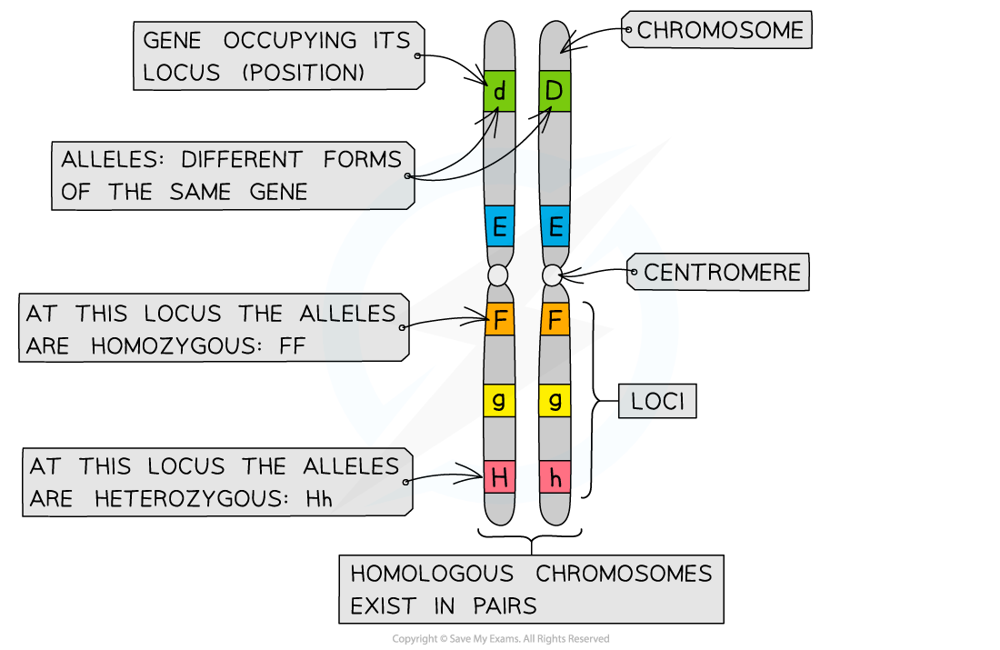

## Inheritance: Key Terms

#### Genes & alleles

* A **chromosome** is a long DNA molecule which contains **genes** that **code for several different proteins**
* A **gene** is a length of DNA that codes for a single polypeptide

  + The **position of a gene** on a chromosome is its **locus** (plural loci)
* Each gene can exist in two or more **different forms** called **alleles**

  + Different alleles of a gene have slightly **different nucleotide sequences** but they still occupy the **same locus** on the chromosome
  + Different alleles arise by the process of mutation
  + E.g. each allele might produce a different coat colour in mammals

    - One allele might code for a black coat while the alternative allele might code for a chestnut coat
* When writing about genes it is conventional to use a single letter to represent a gene, while different alleles may be indicated by using upper and lower case letters, e.g. **A** and **a**

#### Homozygous & heterozygous

* Every individual has two copies of each allele; one on each chromosome in a **homologous pair**

  + A homologous pair of chromosomes is a pair of chromosomes that **match in size and shape**, and that contain **the same genes at the same loci**

    - The chromosomes may not contain the same alleles for each gene
  + One member of a homologous pair of chromosomes comes from one parent, while the other comes from the other parent
* When an individual has **two identical alleles** at a locus they are said to be **homozygous,**or a **homozygote**

  + Homo = the same
* When an individual has **two different alleles** at a locus they are said to be **heterozygous,**or a **heterozygote**

  + Hetero = different

***Chromosomes match up to form homologous pairs which have the same genes at the same loci. While the genes are the same, the alleles may be different, meaning that individuals can be either homozygous or heterozygous at a particular locus.***

#### Genotype & phenotype

* The **genotype** of an organism refers to the **alleles of a gene**possessed by that individual

  + E.g. An organism's genotype could be represented by the letters gg
* The genotype of an individual affects their phenotype; a phenotype is the **observable characteristics** of an organism
* E.g. every horse has two copies of a gene for coat colour in all of their cells, one on each homologous pair of chromosomes; the gene could be notated using the letters A and a

  + A horse that has two **A** alleleshas the **genotype** **AA**and is homozygous

    - If the **A** allele codes for a black coat, then the **phenotype** of the horse would be black
  + A horse that has two **a** alleles has the genotype **aa** and is also homozygous

    - If the **a** allele codes for a chestnut coat then the phenotype of the horse would be chestnut

#### Dominant & recessive

* Not all alleles affect the phenotype in the same way
* Some alleles are **dominant;** they are **always expressed** in the phenotype no matter which other allele is present

  + This means they are expressed in both heterozygous and homozygous individuals, e.g.

    - A horse with the genotype **AA** would be said to be **homozygous dominant** and would have a black coat phenotype
    - A horse with the genotype **Aa** would be said to be **heterozygous** and would still have a black coat phenotype, as the allele for black coat colour is dominant over the lower case allele

      * It is possible to refer to a heterozygous individual like this as a **carrier** of the recessive allele; the allele doesn't show in the phenotype but could still be passed on to offspring
* Others are **recessive;** they are **only expressed** in the phenotype **if no dominant allele** is present

  + This means that it is only expressed when present in a homozygous individual, e.g.

    - A horse with the genotype **aa** would be said to be **homozygous recessive** and would have a chestnut coat phenotype due to the absence of the dominant black allele

#### Incomplete Dominance

* This occurs when the trait from a dominant allele is not completely expressed over the trait produced by the recessive allele

  + When present the recessive allele 'dilutes' the dominant allele
* **Both alleles influence the phenotype** in a heterozygous individual, giving rise to a third phenotype

  + E.g some flowers show incomplete dominance

    - Snapdragons can have red flowers (RR), white flowers (rr), or pink flowers (Rr)