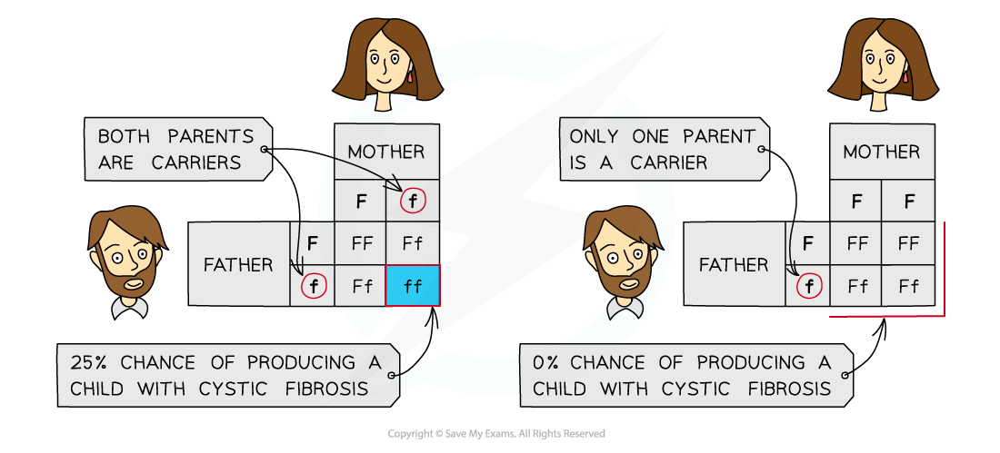

## Mutations

* A **gene mutation** is a change in the sequence of base pairs in a DNA molecule that may result in an altered polypeptide
* Mutations occur **continuously** and **spontaneously**

  + Errors in the DNA often occur **during DNA** replication
* As the DNA base sequence determines the sequence of amino acids that make up a protein, **mutations in a gene can sometimes lead to a change in the polypeptide that the gene codes for**
* **Most mutations do not alter the polypeptide** or only alter it slightly so that its structure or function is not changed

  + This is because the genetic code is degenerate
* There are different ways that a mutation in the DNA base sequence can occur:

  + Insertion
  + Deletion
  + Substitution
  + Duplication
  + Inversion

#### Insertion of nucleotides

* A mutation that occurs when **a nucleotide is randomly inserted** into the DNA sequence is known as an insertion mutation
* An insertion mutation **changes the amino acid that would have been coded for by the original base triplet**, as it creates a **new, different** triplet of bases

  + Remember that every group of three bases in a DNA sequence codes for an amino acid
* An insertion mutation also has a **knock-on effect** on other base triplets by **changing the triplets further on in the DNA sequence**

  + This means that insertion mutations cause what is known as a **frameshift mutation;**they don't only change the triplet where the insertion has occurred, but every triplet downstream of the insertion
* This **may dramatically change the amino acid sequence produced** from this gene and therefore the **ability of the polypeptide to function**

***Insertion mutations occur when a new nucleotide is added into a base sequence***

#### Deletion of nucleotides

* A mutation that occurs when **a nucleotide is randomly deleted** from the DNA sequence
* Like an insertion mutation, a deletion mutation **changes the triplet in which the deletion has occurred,** and also **changes every group of three bases further on in the DNA sequence**

  + This is known as a frameshift mutation
* This **may dramatically change the amino acid sequence produced** from this gene and therefore the **ability of the polypeptide to function**

#### Substitution of nucleotides

* A mutation that occurs when **a base in the DNA sequence is randomly swapped for a different base**
* **Unlike** an insertion or deletion mutation, a substitution mutation will **only change the amino acid for the triplet in which the mutation occurs**; it will **not have a knock-on effect elsewhere in the DNA sequence**
* Substitution mutations can take three forms

  + **Silent mutations**

    - The **mutation does not alter the amino acid sequence** of the polypeptide; this is due to the degenerate nature of the genetic code
  + **Missense mutations**

    - The **mutation alters a single amino acid** in the polypeptide chain, e.g. sickle cell anaemia is caused by a single substitution mutation changing a single amino acid in the sequence
  + **Nonsense mutations**

    - The **mutation creates a premature stop codon**, causing the polypeptide chain produced to be incomplete and therefore affecting the final protein structure and function, e.g. cystic fibrosis can be caused by a nonsense mutation

      * Note that a stop codon provides a signal for the cell to stop translation of the mRNA molecule into an amino acid sequence

***Substitution mutations involve swapping one nucleotide for another***

#### Duplication

* Duplication is a type of mutation that involves the **production of one or more copies of a gene** or a **region of a chromosome**

  + A whole gene or section of a gene is duplicated so that **two copies of the gene/section appear on the same chromosome**
  + The **original version of the gene remains intact** and therefore the **mutation is not harmful**
  + Overtime, the second copy can undergo mutations which enable it to develop new functions
* Gene duplication is an important mechanism by which **evolution** occurs
* Gene and chromosome duplications occur in all organisms, though they are **more common in plants**

***In duplication mutations entire genes can be duplicated***

#### Inversion

* Inversion mutations usually occur during crossing-over in meiosis

  + The DNA of a **single gene** is cut in two places
  + The cut portion is **inverted 180°** then rejoined to the same place within the gene
  + The result is a large section of the gene that is 'backwards' and therefore multiple amino acids are affected
* Inversion mutations frequently result in a non-functional protein

  + In some cases an entirely different protein is produced
* The mutation is often harmful because the original gene can no longer be expressed from that chromosome

  + If the other chromosome in the pair carries a working gene the effect of the mutation may be lessened

***Inversion mutations result in the reversal of sections of DNA***

## Cystic Fibrosis

* Genes can affect the phenotype of an organism

  + A gene codes for a single polypeptide
  + The polypeptide can affect the phenotype, e.g. it could form part of an enzyme or a membrane transport protein
* **Genetic disorders** are often caused by a mutation in a gene that results in a differently-functioning or non-functioning protein that **alters the phenotype** of the individual

#### Cystic fibrosis

* Cystic fibrosis is a genetic disorder of **cell membranes**caused by a recessive alleleof the **CFTR** (**C**ystic **F**ibrosis **T**ransmembrane Conductance **R**egulator) gene located on chromosome 7

  + This gene codes for the production of chloride ion channels required for secretion of sweat, mucus and digestive juices
  + A mutation in the CFTR gene leads to production of **non-functional chloride channels**
  + This **reduces** the movement of **water by osmosis** into the secretions
  + The result is that the body produces large amounts of **thick, sticky mucus** in the air passages, the digestive tract and the reproductive system
* There are **many mutations** in the CFTR gene that can lead to cystic fibrosis

  + The CFTR gene is large and a mutation in any part of the gene can cause cystic fibrosis
  + Around 1000 different mutations that can lead to cystic fibrosis have been identified, though some only occur very rarely
  + All of the mutations that cause cystic fibrosis are recessive
* Because cystic fibrosis is determined by a **recessive allele,** this means

  + People who are heterozygous won’t be affected by the disorder but are **carriers**
  + People must be homozygous**recessive** in order to have the disorder
  + If **both parents** **are carriers** the chance of them producing a child with cystic fibrosis is 1 in 4, or 25 %
  + If only **one of the parents is a carrier** with the other parent being homozygous dominant, there is no chance of producing a child with cystic fibrosis, as the recessive allele will always be masked by the dominant allele

***Cystic fibrosis is a genetic disorder caused by a recessive allele***

#### The respiratory system

* Mucus in the respiratory system is a necessary part of keeping the lungs healthy

  + It prevents infection by trapping microorganisms
  + This mucus is moved out of the respiratory tract by cilia
* In people with cystic fibrosis, due to the faulty chloride ion channels, the **cilia are unable to move** as the mucus is so thick and sticky
* This means microorganisms are not efficiently removed from the lungs and lung infections occur more frequently
* Mucus builds up in the **lungs** and can block airways which limits gas exchange

  + The **surface area for gas exchange is reduced** which can cause breathing difficulties
* **Physiotherapy** can support people with cystic fibrosis to loosen the mucus in the airways and improve gas exchange

#### The digestive system

* Thick mucus in the digestive system can cause issues because

  + The tube to the **pancreas** can become blocked, preventing digestive enzymes from entering the small intestine

    - Digestion of some food may be reduced and therefore **key nutrients may not be made available for absorption**
  + The mucus can cause **cysts** to grow in the pancreas which **inhibit the production of enzymes**, further reducing digestion of key nutrients
  + The **lining of the intestines** is also coated in thick mucus, **inhibiting the absorption of nutrients into the blood**

#### The reproductive system

* Mucus is normally secreted in the reproductive system to prevent infection and regulate the progress of sperm through the reproductive tract after sexual intercourse
* The mucus in people with cystic fibrosis can cause issues in both men and women

  + In **men** the tubes of the testes can become blocked, preventing sperm from reaching the penis
  + In **women** thickened cervical mucus can prevent sperm reaching the oviduct to fertilise an egg