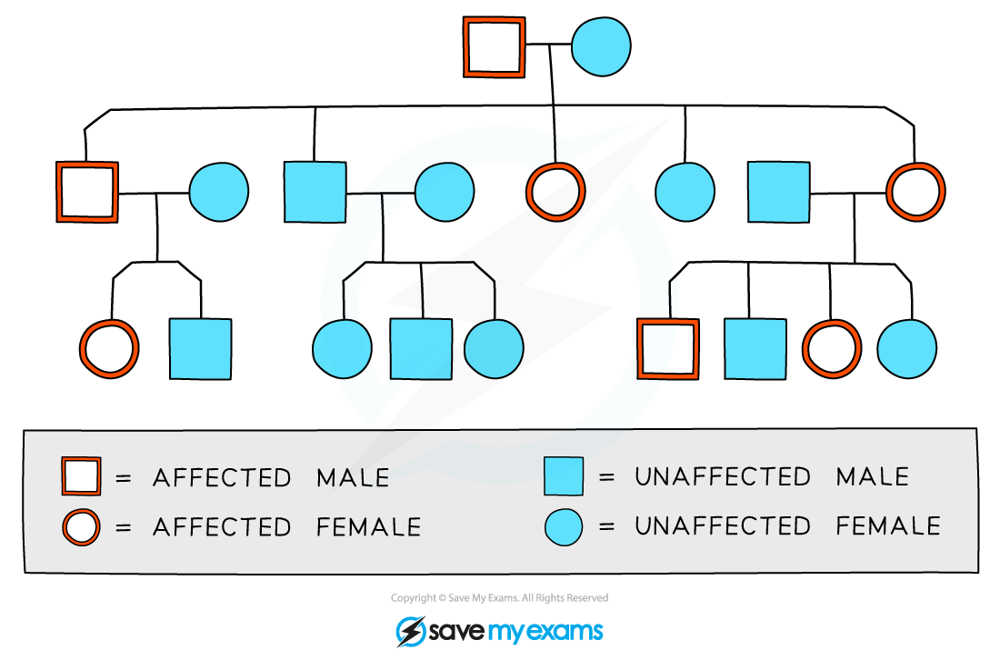
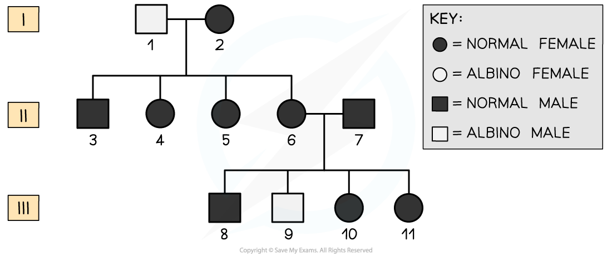

## Pedigree Diagrams

* Family pedigree diagrams can be used to trace the **pattern of inheritance** of a specific trait, e.g. a genetic disorder, **through generations of a family**
* Pedigree diagrams can provide information such as

  + Whether a trait is caused by a **dominant or recessive allele**
  + Whether a trait is more likely to be inherited by **males or females**
  + The **genotypes** of individuals in the family
  + The **probability** that an individual in the family will inherit a trait

***Pedigree diagrams can be used to show the pattern of inheritance of a genetic trait***

* **Males** are indicated by the **square shape** and **females** are represented by **circles**
* **Affected** and **unaffected individuals** can be indicated using **colour, shading**, or **cross-hatching**
* **Horizontal lines** between males and females show that they have **produced children**
* **Vertical lines** show the relationship between **parent** and **child**
* Roman numerals may be used to indicate **generations**
* For each generation the eldest child is on the left and **each individual** is **numbered**
* The family pedigree above shows the following

  + Both males and females are affected by the trait in question
  + Every generation has affected individuals
  + The eldest son in the second generation is affected
  + There is one family group that has no affected parents or children
* The diagram above does not contain enough information to show

  + Whether the trait is caused by a dominant or recessive allele
  + The genotypes of the individuals involved

#### Worked Example

The pedigree diagram below traces the inheritance of **albinism** through several generations. Albinism affects the production of the **pigment melanin** leading to lighter hair, skin and eyes.

Using the pedigree chart, deduce and explain the following:

1. The type of allele that causes albinism
2. The genotype of individuals **9** and **7**
3. The possible genotypes of **10** and **11**

**Answer:**  
  
**Question 1**

Albinism is caused by a **recessive allele**

Person number 9 is an affected individual despite parents 6 and 7 being unaffected; 6 and 7 must both be carriers of the recessive allele and 9 has inherited one recessive allele from each parent

**Question 2**

The genotype of person 9 must be **homozygous recessive** (aa) and the genotype of 7 must be **heterozygous** (Aa)

Person 9 is an affected individual with albinism; as this is determined by the recessive allele they must have two copies of the albinism allele

Person 7 must be heterozygous as he does not have albinism but has passed on the recessive allele to person 9

**Question 3**  
  
The possible genotypes of 10 and 11 are **heterozygous** (Aa) or **homozygous dominant** (AA)

They are both unaffected individuals so must possess at least one dominant allele (A), however, it is possible that they each might have inherited a recessive allele (a) from one parent (both parents must have a copy of the recessive allele in order for person 9 to have albinism)

#### Examiner Tips and Tricks

When answering questions about pedigree charts for genetic diseases, it is always useful to remember which phenotype is caused by the homozygous recessive genotype. You can write these genotypes onto your chart and it will give you a good starting point for working out the possible genotypes of the rest of the individuals in the chart.