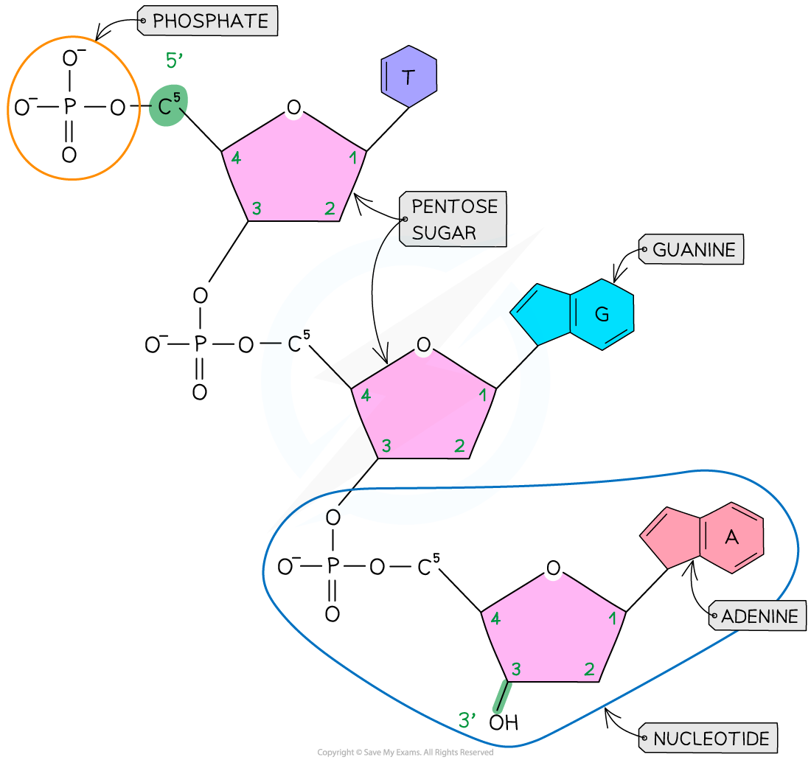

## DNA: Structure

* The nucleic acid DNA is a **polynucleotide** – it is made up of **many nucleotides** bonded together in a **long chain**

***DNA nucleotide***

* DNA molecules are made up of **two polynucleotide strands** lying side by side, running in opposite directions – the strands are said to be **antiparallel**
* Each DNA polynucleotide strand is made up of **alternating deoxyribose sugars and phosphate groups bonded together**to form the **sugar-phosphate backbone.** These bonds are **covalent** **bonds** known as **phosphodiester bonds**

  + The phosphodiester bonds link the **5-carbon of one deoxyribose sugar** molecule to the phosphate group from the same nucleotide, which is itself linked by another phosphodiester bond to the **3-carbon of the deoxyribose sugar molecule of the next nucleotide**in the strand
  + Each DNA polynucleotide strand is said to have a **3’ end and a 5’ end** (these numbers relate to which carbon on the pentose sugar could be bonded with another nucleotide)
  + As the strands run in opposite directions (they are **antiparallel**), one is known as the **5’ to 3’ strand** and the other is known as the **3’ to 5’ strand**
* The nitrogenous bases of each nucleotide project out from the backbone towards the interior of the double-stranded DNA molecule

***A single DNA polynucleotide strand***

#### Hydrogen bonding

* The two antiparallel DNA polynucleotide strands that make up the DNA molecule are **held together by hydrogen bonds** between the nitrogenous bases
* These hydrogen bonds always occur between the **same pairs of bases**:

  + The purine **adenine** (A) always pairs with the pyrimidine **thymine** (T) – two hydrogen bonds are formed between these bases
  + The purine **guanine** (G) always pairs with the pyrimidine **cytosine** (C) – three hydrogen bonds are formed between these bases
  + This is known as **complementary base pairing**
  + These pairs are known as **DNA base pairs**

***A section of DNA showing hydrogen bonding between base pairs***

#### Double helix

* DNA is not two-dimensional as seen in the diagram above
* DNA is described as a double helix
* This refers to the **three-dimensional shape** that DNA molecules form

***DNA molecules form a 3D double helix structure***

#### Examiner Tips and Tricks

Make sure you can name the different components of a DNA molecule (sugar-phosphate backbone, nucleotide, complementary base pairs, phosphodiester bonds, hydrogen bonds) and make sure you are able to locate these on a diagram.

Remember that **phosphodiester bonds** join the nucleotides in the sugar-phosphate backbone, and **hydrogen bonds** join the bases of the two complementary strands together.

Remember that the bases are complementary, so the number of A = T and C = G. You could be asked to determine how many bases are present in a DNA molecule if given the number of just one of the bases.