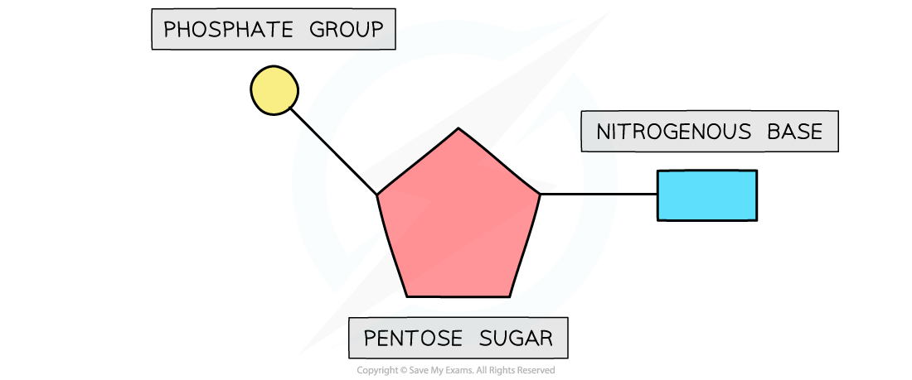
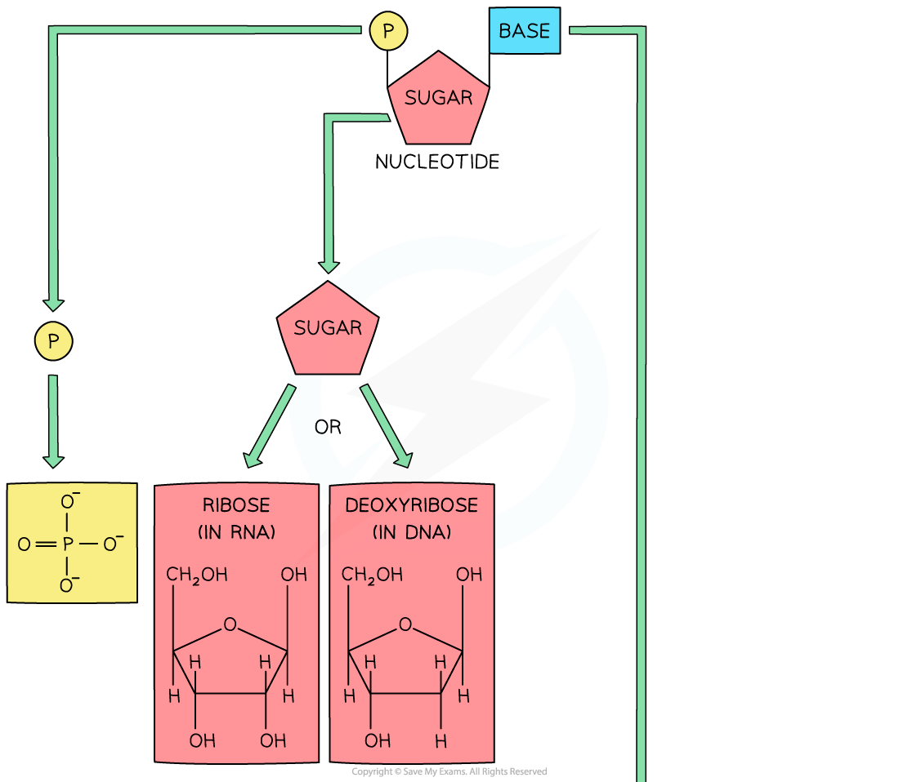
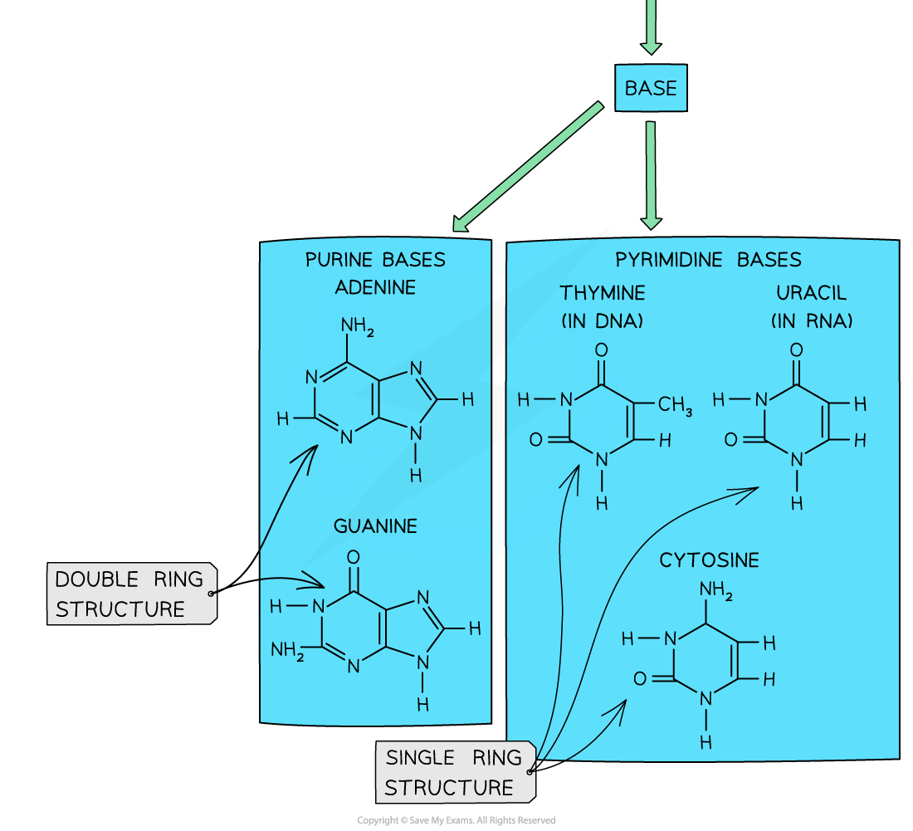
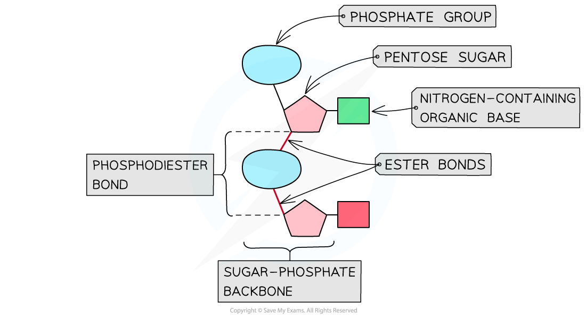

## Mononucleotides: Structure

* Both DNA and RNA are **polymers** that are made up of **many repeating units** called **nucleotides**
* Each nucleotide is formed from:

  + A **pentose sugar** (a sugar with 5 carbon atoms)
  + A nitrogen-containing **organic base**
  + A **phosphate group**

***The basic structure of a mononucleotide***

#### DNA nucleotides

* The components of a DNA nucleotide are:

  + A **deoxyribose** sugar with **hydrogen** at the 2' position
  + A phosphate group
  + One of four nitrogenous bases - adenine (A), cytosine(C), guanine(G) or thymine(T)

#### RNA nucleotides

* The components of an RNA nucleotide are:

  + A**ribose** sugar with a hydroxyl (OH) group at the 2' position
  + A phosphate group
  + One of four nitrogenous bases - adenine (A), cytosine(C), guanine(G) or **uracil (U)**
* The presence of the **2' hydroxyl group** makes **RNA more susceptible to hydrolysis**

  + This is why DNA is the storage molecule and RNA is the transport molecule with a shorter molecular lifespan

***RNA nucleotide compared with an DNA nucleotide***

#### Purines & Pyrimidines

* The **nitrogenous base** molecules that are found in the nucleotides of DNA (A, T, C, G) and RNA (A, U, C, G) occur in **two structural forms**: **purines** and **pyrimidines**

  + The bases **adenine** and **guanine** are **purines** – they have a **double ring structure**
  + The bases **cytosine**, **thymine** and **uracil** are **pyrimidines** – they have a **single ring structure**

***The molecular structure of each base is different, depending on whether they are a purine or pyrimidine***

## The Phosphodiester Bond

* DNA and RNA are polymers (**polynucleotides**), meaning that they are made up of many nucleotides joined together in long chains
* Separate **nucleotides are joined via condensation reactions**

  + These condensation reactions occur between the **phosphate group** of one nucleotide and the **pentose sugar** of the next nucleotide
* A condensation reaction between two nucleotides forms a **phosphodiester bond**

  + It is called a phospho**di**ester bond because it consists of a phosphate group and **two** ester bonds (phosphate with double bond oxygen attached - oxygen - carbon)
* The chain of alternating phosphate groups and pentose sugars produced as a result of many phosphodiester bonds is known as the **sugar-phosphate backbone** (of the DNA or RNA molecule)

***A section of a polynucleotide showing a single phosphodiester bond (and the positioning of the two ester bonds and the phosphate group that make up the phosphodiester bond)***

#### Examiner Tips and Tricks

Although DNA and RNA nucleotides are very similar, make sure you know the **key differences** between them: unlike DNA, **RNA nucleotides never contain the nitrogenous base thymine** (in place of this they contain the nitrogenous base **uracil**) and unlike DNA, RNA nucleotides contain the pentose sugar **ribose** (instead of deoxyribose).