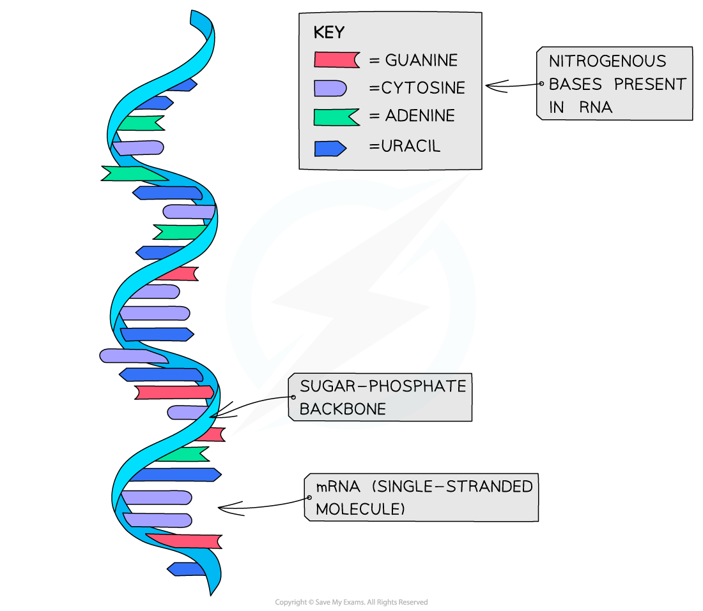

## RNA: Structure

* **Like DNA**, the nucleic acid RNA (ribonucleic acid) is a **polynucleotide** – it is made up of **many nucleotides** linked together in a chain
* **Like DNA**, RNA nucleotides contain the nitrogenous bases adenine (A), guanine (G) and cytosine (C)
* **Unlike DNA**, RNA nucleotides **never contain** the nitrogenous base **thymine** (T) – in place of this they contain the nitrogenous base **uracil** (U)
* **Unlike DNA**, RNA nucleotides contain the pentose sugar **ribose** (instead of deoxyribose)

***A RNA nucleotide compared with a DNA nucleotide***

* Unlike DNA, RNA molecules are only made up of **one polynucleotide strand** (they are single-stranded)
* RNA polynucleotide chains are relatively **short compared to DNA**
* Each RNA polynucleotide strand is made up of **alternating ribose sugars and phosphate groups linked together**, with the nitrogenous bases of each nucleotide projecting out sideways from the single-stranded RNA molecule
* The **sugar-phosphate bonds** (between different nucleotides in the same strand) are **covalent** **bonds** known as **phosphodiester bonds**

  + These bonds form what is known as the **sugar-phosphate backbone** of the RNA polynucleotide strand
  + The phosphodiester bonds link the **5-carbon of one ribose sugar** molecule to the phosphate group from the same nucleotide, which is itself linked by another phosphodiester bond to the **3-carbon of the ribose sugar molecule of the next nucleotide**in the strand
* An example of an RNA molecule is **messenger RNA**(**mRNA**), which is the transcript copy of a gene that encodes a specific polypeptide. Two other examples are **transfer RNA (tRNA)** and **ribosomal RNA (rRNA)**

***Messenger RNA (mRNA) is an example of the structure of RNA***

#### Examiner Tips and Tricks

You need to know the structure of DNA and RNA (bases, number of strands, pentose sugar present, length).