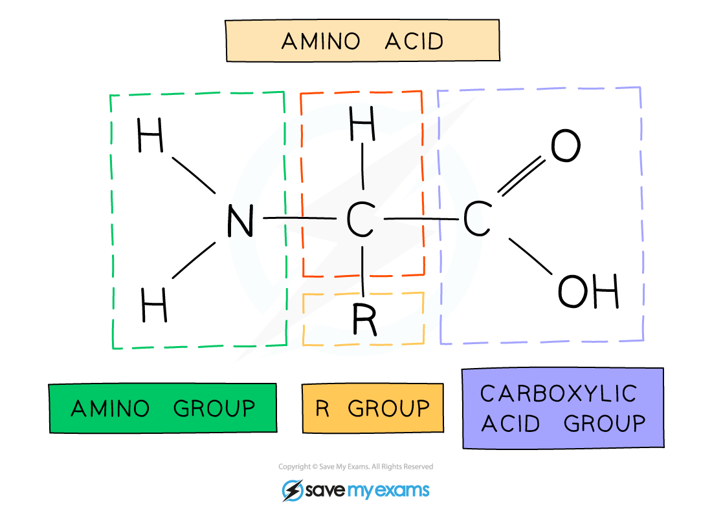
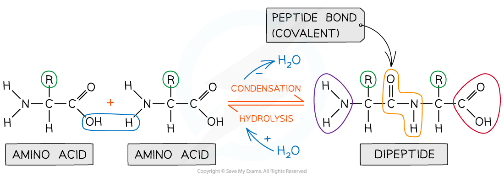

## Amino Acid: Structure

#### Proteins

* Proteins are polymers (and macromolecules) made of monomers called **amino acids**
* The sequence, type and number of the amino acids within a protein determines its shape and therefore its function
* Proteins are extremely important in cells because they form all of the following:

  + **Enzymes**
  + Cell membrane proteins (eg. carrier)
  + Hormones
  + Immunoproteins (eg. immunoglobulins)
  + Transport proteins (eg. haemoglobin)
  + Structural proteins (eg. keratin, collagen)
  + Contractile proteins (eg. myosin)

#### Amino acids

* Amino acids are the **monomers** of polypeptides
* There are 20 amino acids found in proteins common to all living organisms
* The general structure of all amino acids is a central carbon atom bonded to:

  + An **amine** (also called amino) group -NH2
  + A **carboxylic acid** group -COOH
  + A **hydrogen** atom
  + An **R** group (which is how each amino acid differs and why amino acid properties differ e.g. whether they are acidic or basic or whether they are polar or non-polar)

***The general structure of an amino acid***

## The Peptide Bond

* Peptide bonds form between amino acids
* Peptide bonds are **covalent bonds** and so involve the sharing of electrons
* In order to form a **peptide bond** :

  + A hydroxyl (-OH) is lost from the carboxylic group of one amino acid
  + A hydrogen atom is lost from the amine group of another amino acid
* The remaining carbon atom (with the double-bonded oxygen) from the first amino acid bonds to the nitrogen atom of the second amino acid
* This is a **condensation** reaction so water is released
* **Dipeptides** are formed by the condensation of **two** amino acids
* **Polypeptides** are formed by the condensation of **many** (3 or more) amino acids
* A protein may have only one polypeptide chain or it may have multiple chains interacting with each other
* During **hydrolysis** reactions, the addition of water **breaks the peptide bonds**resulting in polypeptides being broken down to amino acids

***Peptide bonds are formed by condensation reactions (releasing a molecule of water) and broken by hydrolysis reactions (adding a molecule of water)***

#### Examiner Tips and Tricks

When asked to identify the location of the peptide bond, look for where nitrogen is bonded to a carbon which has a double bond with an oxygen atom, note the R group is not involved in the formation of a peptide bond.

Structures of specific amino acids are not required.