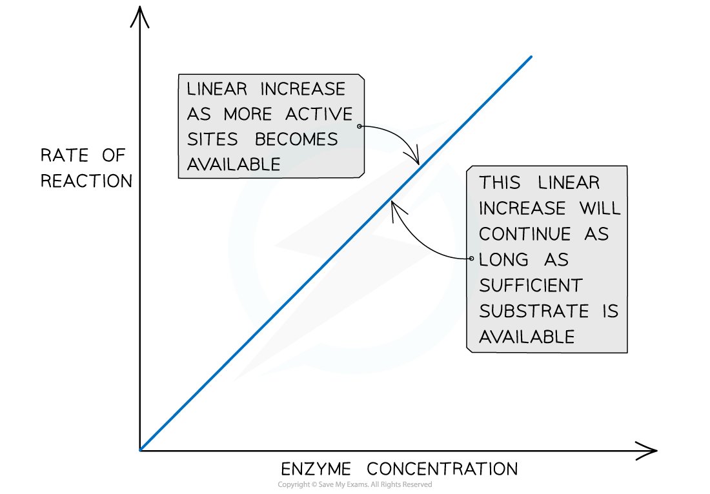
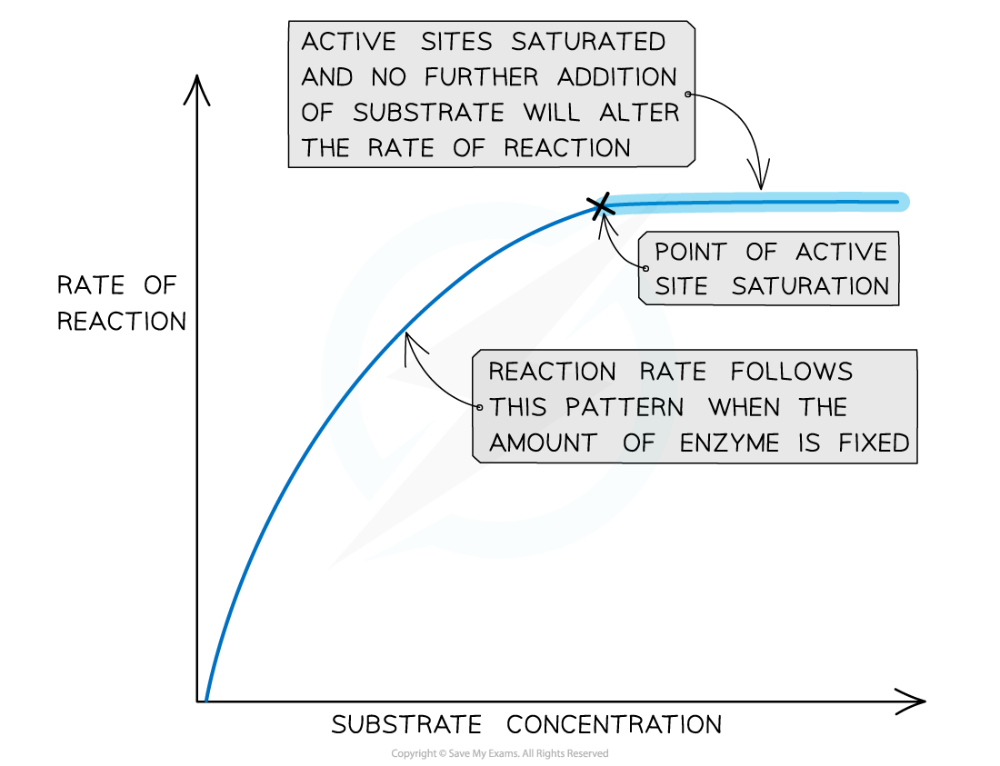
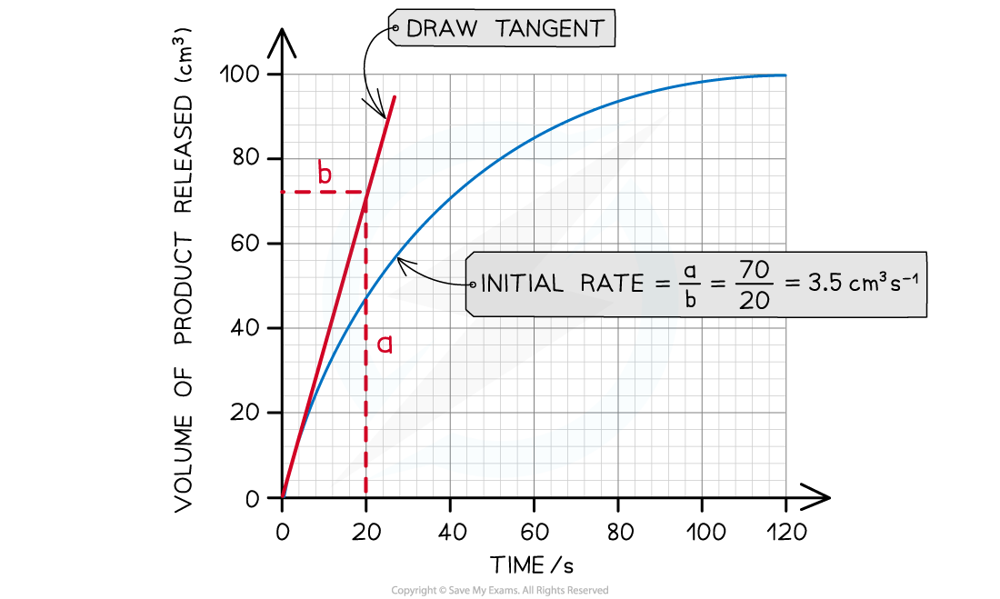
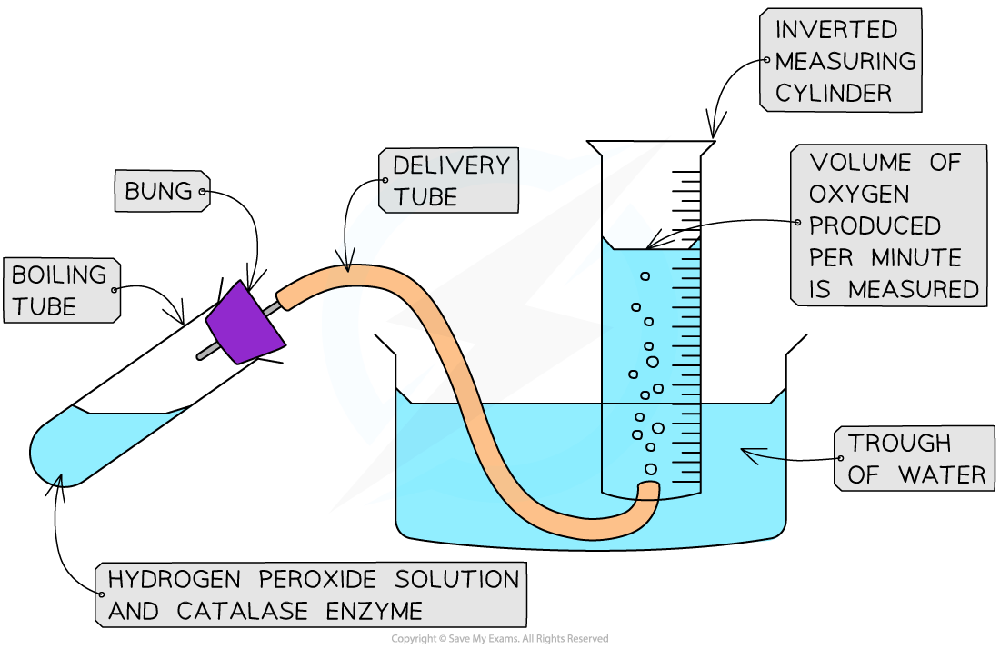
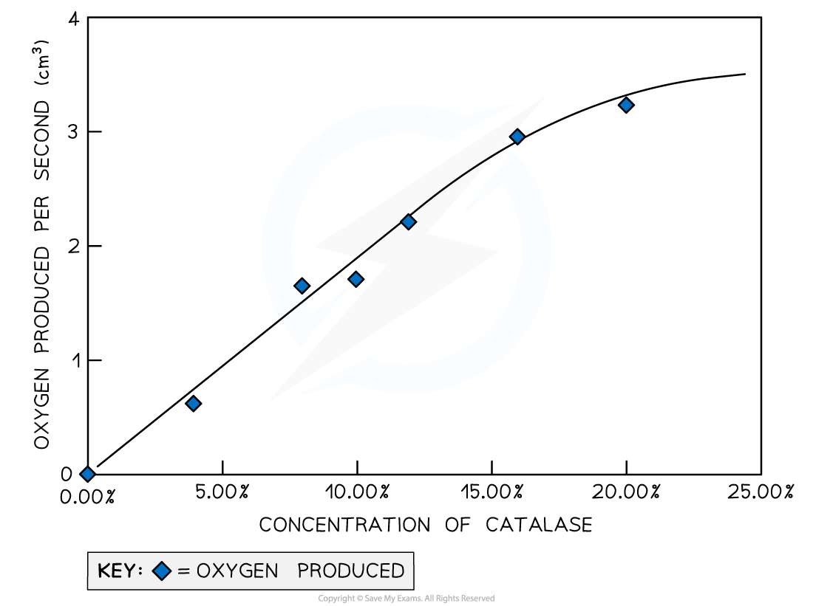

## Practical: Investigating the Effect of Enzyme and Substrate Concentrations

#### Enzyme concentration

* Enzyme concentration affects the rate of reaction
* The **higher** the **enzyme concentration** in a reaction mixture, the **greater the number of active sites** available and the **greater the likelihood of enzyme-substrate complex formation**
* As long as there is **sufficient substrate available**, the initial rate of reaction**increases linearly** with enzyme concentration
* If the **amount of substrate is limited**, at a certain point any further increase in enzyme concentration will **not increase** the reaction rate as the amount of substrate becomes a **limiting factor**

***The effect of enzyme concentration on the rate of an enzyme controlled reaction***

#### Substrate concentration

* Substrate concentration affects the rate of reaction
* The **higher the substrate concentration the faster the rate of reaction**
* More substrate molecules means **more collision between enzyme and substrate** so the more likely an active site will be used by a substrate
* The is only the case up until a certain concentration of substrate, at which point a **saturation point** is said to have been reached

  + At this point **all active sites are occupied** and increasing the substrate concentration will not affect the rate of the reaction
* **Substrate concentration will decrease over time** (if no new substrate is added)
* The **rate of reaction** will therefore **decrease** over time
* This means the **initial rate of reaction will be fastest** throughout the reaction

***The effect of substrate concentration on the rate of an enzyme controlled reaction***

#### Practical: Investigate the effect of enzyme and substrate concentrations on the initial rates of reactions

* There are **two ways to measure the rate of reaction** to investigate changing enzyme and substrate concentrations

  + Measure **how fast the product is made**
  + Measure **how fast the substrate is used up**
* There are many enzymes that can be used in this practical; some common examples are catalase, amylase and protease
* The initial rate of reaction can be calculated to determine the effect of changing enzyme or substrate concentrations

  + The initial rate of reaction is at the start of the reaction
  + You can **calculate the initial rate of reaction using a graph** of results showing volume of product/substrate against time
  + **Draw a tangent** to the graph through the origin
  + **Calculate the gradient of the tangent** - this is the **initial rate of reaction**

***How to calculate the initial rate of reaction from a graph***

#### Effect of enzyme concentration on the rate of reaction

* You can measure how fast a product is made in a reaction

#### Apparatus

* Catalase solution at five different concentrations (enzyme)
* Hydrogen peroxide solution (substrate)
* Buffer solution (to keep the pH constant)
* Boiling tube
* Bung and delivery tube
* Measuring cylinder
* Water trough
* Stopwatch

***The apparatus set up to investigate how changing the concentration of catalase affects the volume of oxygen produced***

#### Method

1. Add a set volume of hydrogen peroxide solution to a boiling tube
2. Add a set volume of buffer solution to the same boiling tube
3. Invert a full measuring cylinder into a trough of water
4. Place the end of the delivery tube into the open end of the measuring cylinder and attach the other end to a bung
5. Add a set volume of one concentration of catalase to the boiling tube and quickly place the bung into the boiling tube
6. Record the volume of oxygen collected in the measuring cylinder by the water displaced every 10 seconds for 60 seconds
7. Repeat the experiment twice more and calculate the average volume of oxygen produced at each 10 second interval
8. Repeat the whole experiment for the different concentrations of catalase
9. Plot the average volume of gas produced against time for each concentration
10. Compare the initial rate of reaction of each of the concentrations

#### Results

* As the concentration of catalase increases the volume of oxygen produced would increase
* This is because there would be more available active sites for hydrogen peroxide to use
* The volume of oxygen would plateau out after the initial rate of reaction due to the substrate decreasing, having been converted into the product (oxygen)

***An example of a set of results for one concentration of catalase showing the volume of oxygen produced per second***

#### Effect of substrate concentration on the rate of reaction

* Another investigation is to measure how fast a substrate is removed from a reaction
* This can be done using a range of substrate concentrations to investigate how changing concentration effects the rate of the reaction
* The breakdown of starch by amylase is a good example of how to investigate the effect of substrate concentration on the rate of the reaction
* Iodine solution can be added to a starch solution to create a solution with a blue-black appearance
* This will provide a measurable way of determining the rate at which starch is broken down to maltose using a colorimeter
* The colorimeter will measure how the absorbance of the starch solution change over a period of time once amylase is added to it
* This can be repeated for a range of different starch concentrations and a graph of absorbance against time can be plotted
* Results should show a fast initial rate of reaction and then plateau out as the substrate is converted into product(s) and all available active sites become occupied by the increasing concentration of substrate

#### Examiner Tips and Tricks

For any experiment remember to have a control, for example using distilled water in place of the enzyme or substrate. It is also important to control other variables such as pH and temperature to ensure these do not have an effect on the activity of the enzyme.