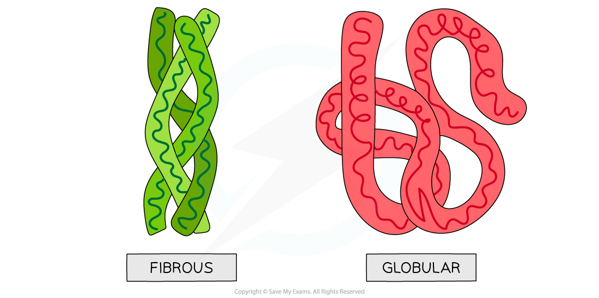
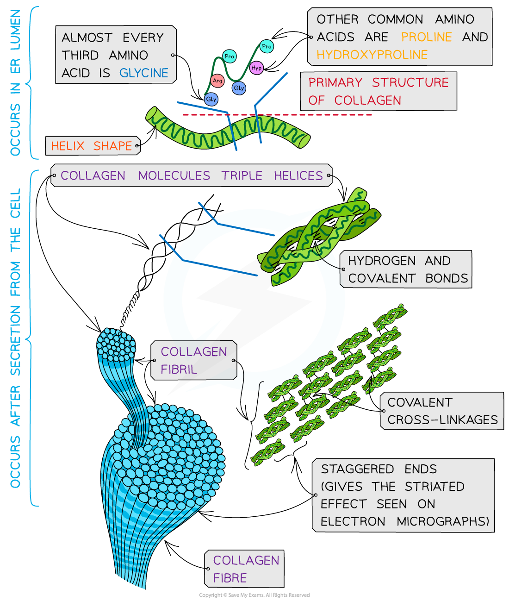
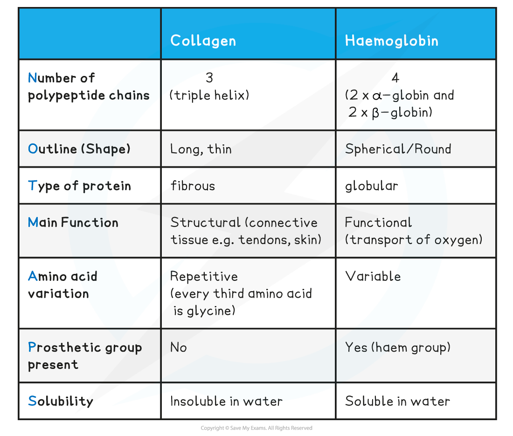

## Fibrous Proteins: Structure & Function

#### Structure

* **Fibrous proteins**are long strands of polypeptide chains that have cross-linkages due to hydrogen bonds
* These proteins have little or no tertiary structure
* Fibrous proteins have a limited number of amino acids with the sequence usually being highly repetitive
* The highly repetitive sequence creates **very organised structures**

#### Function

* Due to a large number of **hydrophobic R groups**, fibrous proteins are **insoluble** in water
* Fibrous proteins are **strong** and this, along with their insolubility property, makes fibrous proteins very suitable for **structural roles**
* Examples of fibrous proteins:

  + **Keratin** makes up hair, nails, horns and feathers (it is a very tough fibrous protein)
  + **Elastin** is found in connective tissue, tendons, skin and bone (it can stretch and then return to its original shape)
  + **Collagen** is a connective tissue found in skin, tendons and ligaments

***Globular and fibrous protein models illustrating the spherical shape of globular proteins and the long, stranded shape of fibrous proteins.***

#### Collagen

* **Collagen** is the most common **structural** protein found in **vertebrates**
* It provides structural **support**
* In vertebrates it is the component of **connective tissue** which forms:

  + Tendons
  + Cartilage
  + Ligaments
  + Bones
  + Teeth
  + Skin
  + Walls of blood vessels
  + Cornea of the eye
* Collagen is an **insoluble** **fibrous** protein

#### Structure of collagen

* Collagen is formed from **three polypeptide chains** closely held together by **hydrogen bonds** to form a **triple helix** (known as tropocollagen)
* Each polypeptide chain is a **helix shape** (but not α-helix as the chain is not as tightly wound) and contains about 1000 amino acids with glycine, proline and hydroxyproline being the most common
* In the primary structure of collagen almost **every third** amino acid is **glycine**

  + This is the smallest amino acid with a R group that contains a **single hydrogen atom**
  + Glycine tends to be found on the inside of the polypeptide chains allowing the three chains to be arranged closely together forming a **tight triple helix** structure
* Along with hydrogen bonds forming between the three chains there are also **covalent bonds** present

  + Covalent bonds also form **cross-links** between R groups of amino acids in interacting **triple helices** when they are arranged parallel to each other
  + The cross-links hold the collagen molecules together to form **fibrils**
* The collagen molecules are positioned in the **fibrils** so that there are **staggered ends** (this gives the striated effect seen in electron micrographs)
* When many fibrils are arranged together they form collagen **fibres**
* Collagen fibres are positioned so that they are lined up with the forces they are withstanding

***Collagen is a fibrous structural protein that is formed by triple helices. Collagen molecules arrange into collagen fibrils and finally into collagen fibres which have high tensile strength***

#### Function of collagen

* Collagen is a flexible**structural** protein forming **connective tissues**
* The presence of the **many hydrogen bonds** within the **triple helix structure** of collagen results in **great tensile strength**. This enables collagen to be able to withstand large pulling forces without stretching or breaking
* The **staggered ends** of the collagen molecules within the **fibrils** provide **strength**
* Collagen is a **stable** protein due to the high proportion of proline and hydroxyproline amino acids present. These amino acids increase stability as their R groups repel each other
* The length of collagen molecules means they take too long to dissolve in water (making it insoluble in water)

**Comparison of Collagen and Haemoglobin Table**

