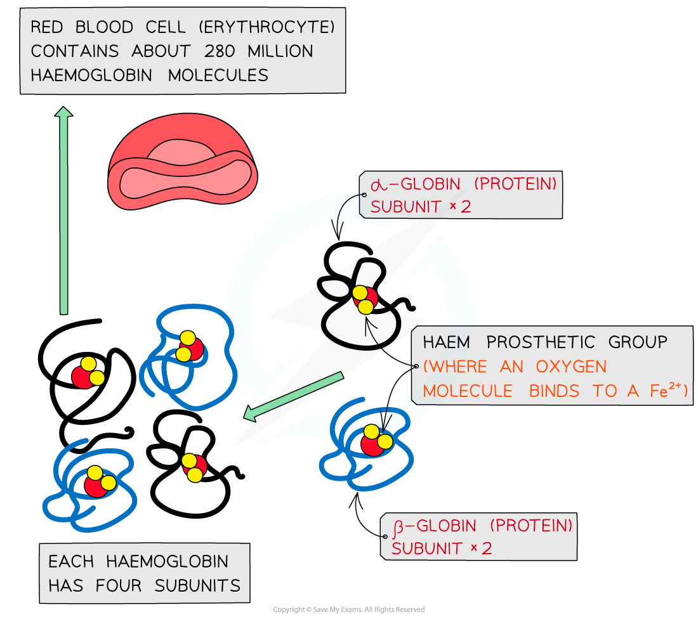

## Globular Proteins: Structure & Function

#### Structure

* **Globular proteins**are

  + **Compact**
  + Roughly **spherical** (circular) in shape
* Globular proteins form a spherical shape when folding into their tertiary structure because:

  + Their **non-polar hydrophobic R groups** are orientated towards the **centre** of the protein away from the aqueous surroundings
  + Their **polar hydrophilic R groups** orientate themselves on the **outside** of the protein
* The folding of the protein due to the interactions between the R groups results in globular proteins having **specific shapes**
* Some globular proteins are **conjugated protein** that contain a **prosthetic group**

#### Function

* The orientation of their R groups enables globular proteins to be (generally) **soluble** in water as the water molecules can surround the **polar hydrophilic R groups**
* The **solubility** of globular proteins in water means they play important **physiological** roles as they can be easily **transported** around organisms and be involved in **metabolic reactions**

  + For example, **enzymes** can catalyse specific reactions and **immunoglobulins** can respond to specific antigens

#### Haemoglobin

* Haemoglobin is a **globular** protein which is an oxygen-carrying pigment found in vast quantities in red blood cells
* It has a **quaternary** structure as there are **four polypeptide chains**

  + These chains or subunits are **globin** proteins (two **α–globins** and two **β–globins**) and each subunit has a prosthetic **haem** group
* The **four globin subunits** are held together by **disulphide bonds**

  + Their **hydrophobic R groups** are facing **inwards** (helping preserve the **three-dimensional spherical shape**)
  + Their **hydrophilic R groups** are facing **outwards** (helping maintain its **solubility**)
* The arrangements of the R groups is important to the functioning of haemoglobin
* If changes occur to the sequence of amino acids in the subunits this can result in the properties of haemoglobin changing

  + This is what happens to cause **sickle cell anaemia**(where base substitution results in the amino acid valine (non-polar) replacing glutamic acid (polar) making haemoglobin less soluble)
* The prosthetic **haem** group contains an **iron** II ion (Fe2+) which is able to **reversibly** combine with an **oxygen** molecule forming **oxyhaemoglobin** and results in the haemoglobin appearing bright red
* Each **haemoglobin** with the four haem groups can therefore **carry** **four oxygen** **molecules** (eight oxygen atoms)

***The molecular structure of haemoglobin showing the α–globin and β–globin subunits, the prosthetic haem group with oxygen molecules bonded to form oxyhaemoglobin***

* Haemoglobin is responsible for binding oxygen in the lungs and **transporting**the**oxygen**to tissue to be used in aerobic metabolic pathways
* As **oxygen is not very soluble** in water and haemoglobin is, oxygen can be carried more efficiently around the body when bound to the haemoglobin
* The **presence** of the **haem group** (and Fe2+) enables small molecules like oxygen to be bound more easily because as each **oxygen molecule** binds, it **alters** the **quaternary structure** (due to alterations in the tertiary structure) of the protein which causes haemoglobin to have a higher affinity for the subsequent oxygen molecules and they bind more easily
* The **existence** of the iron II ion (**Fe****2+**) in the prosthetic haem group also allows **oxygen** to **reversibly bind** as none of the amino acids that make up the polypeptide chains in haemoglobin are well suited to binding with oxygen