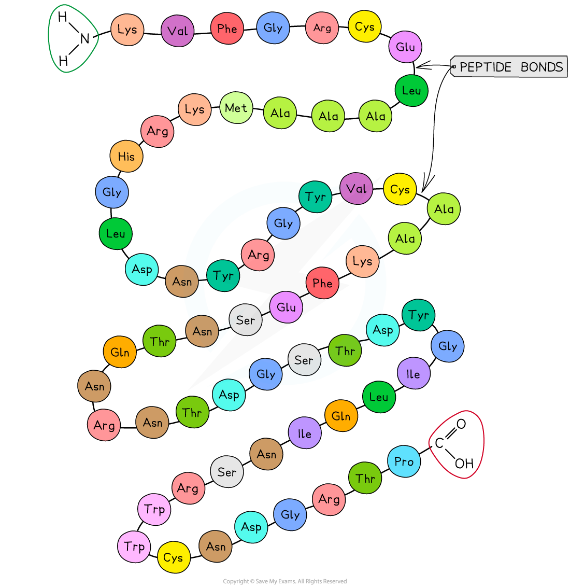
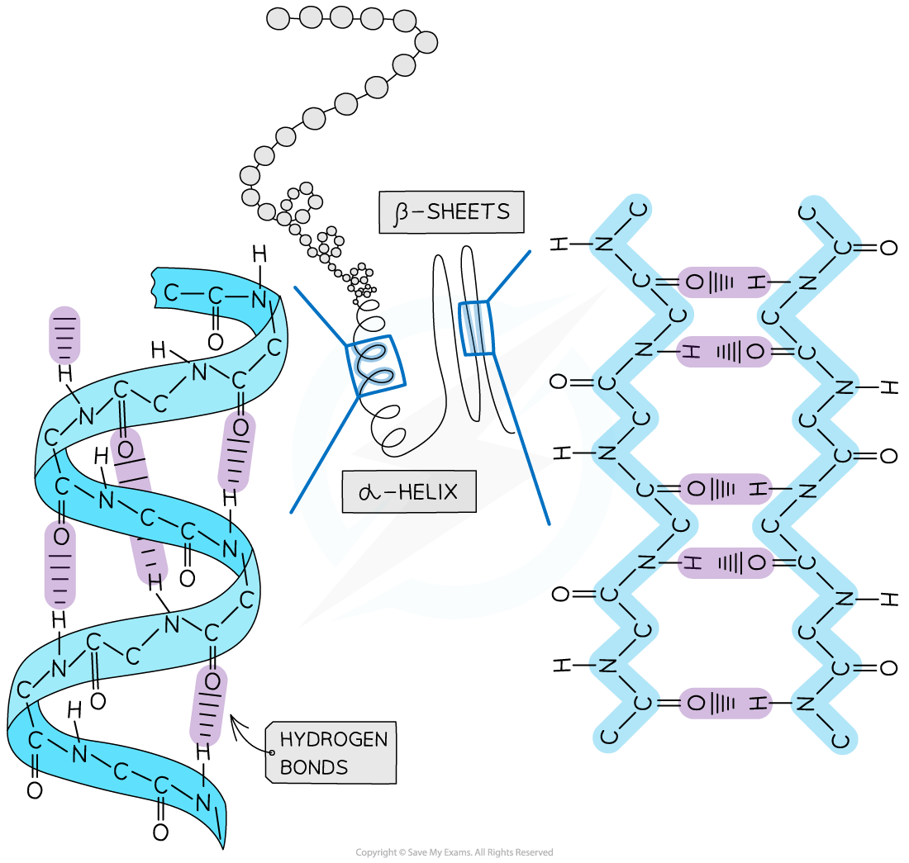
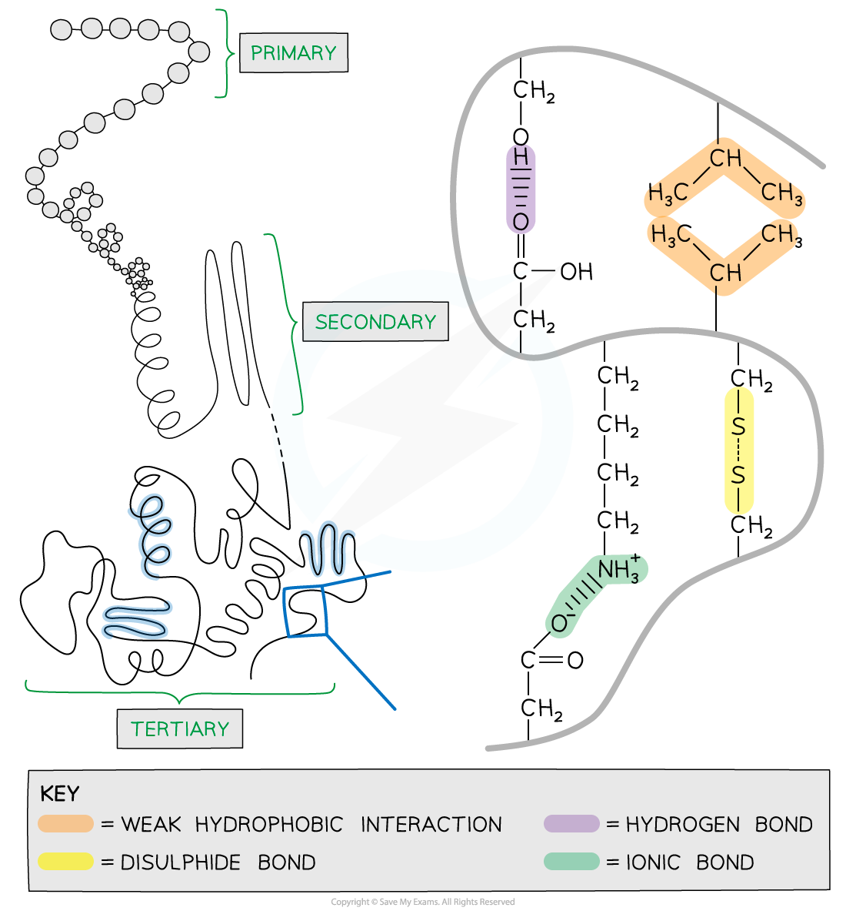
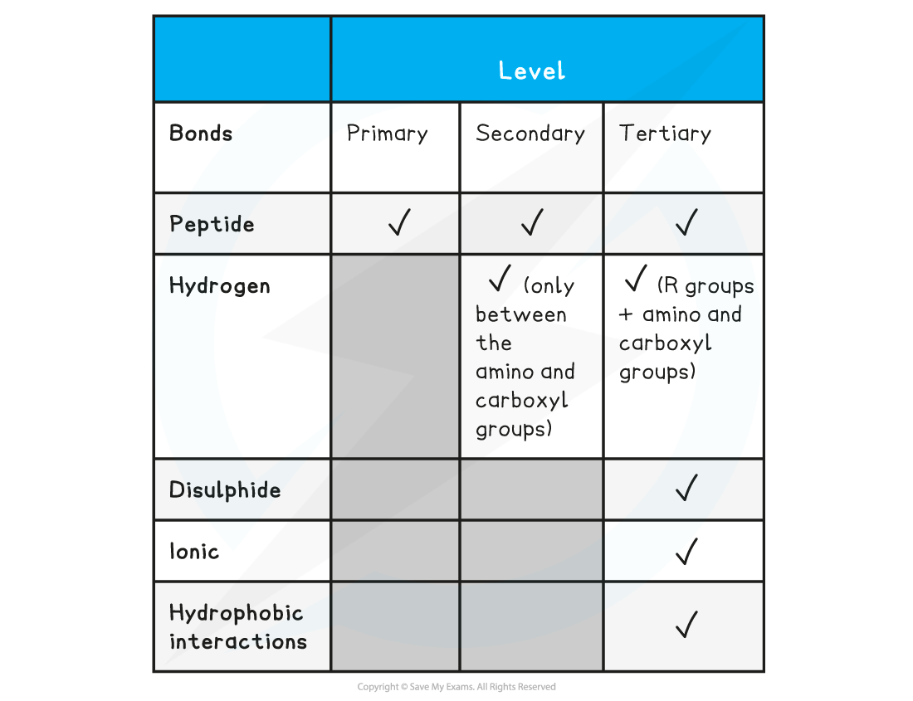

## Levels of Protein Structure

* There are **four** levels of structure in proteins

  + Three are related to a single polypeptide chain
  + The fourth level relates to a protein that has two or more polypeptide chains
* Polypeptide or protein molecules can have anywhere from 3 amino acids (Glutathione) to more than 34,000 amino acids (Titan) bonded together in chains

#### Primary structure

* The sequence of amino acids bonded by covalent peptide bonds is the **primary structure** of a protein
* **The DNA** of a cell **determines** the primary structure of a protein by instructing the cell to add certain amino acids in specific quantities in a certain sequence. This affects the shape and therefore the function of the protein
* The primary structure is **specific** for each protein (one alteration in the sequence of amino acids can affect the function of the protein)

***An example of the primary structure of proteins showing the three-letter abbreviation of specific amino acids***

#### Secondary

* The **secondary structure** of a protein occurs when the weak negatively charged nitrogen and oxygen atoms interact with the weak positively charged hydrogen atoms to form **hydrogen bonds**
* There are two shapes that can form within proteins due to the hydrogen bonds:

  + **α-helix**
  + **β-pleated sheet**
* The **α-helix** shape occurs when the hydrogen bonds form between every **fourth** peptide bond (between the oxygen of the carboxyl group and the hydrogen of the amine group)
* The **β-pleated sheet**shape forms when the protein folds so that **two parts of the polypeptide chain** are **parallel** to each other enabling hydrogen bonds to form between parallel peptide bonds
* Most **fibrous** proteins have secondary structures (e.g. collagen and keratin)
* The **secondary structure** **only** relates to **hydrogen bonds** forming between the **amino group**and the **carboxyl group** (the ‘protein backbone’)
* The hydrogen bonds can be broken by high temperatures and pH changes

***The secondary structure of a protein with the α-helix and β-pleated sheet shapes highlighted. The magnified regions illustrate how the hydrogen bonds form between the peptide bonds***

#### Tertiary structure

* Further conformational change of the secondary structure leads to additional **bonds forming between the R groups**(side chains)
* The additional bonds are:

  + **Hydrogen**(these are between R groups)
  + **Disulphide**(only occurs between cysteine amino acids)
  + **Ionic** (occurs between charged R groups)
  + Weak **hydrophobic interactions** (between non-polar R groups)
* This structure is common in **3D** **globular** proteins

***The 3D tertiary structure of proteins with hydrogen bonds, ionic bonds, disulphide bonds and hydrophobic interactions formed between the R groups of the amino acids***

#### Quaternary

* Occurs in proteins that have **more than one** polypeptide chain working together as a functional macromolecule, for example, haemoglobin
* The same bonds responsible for maintaining the tertiary structure of a protein will also be involved in forming the quaternary structure
* Each polypeptide chain in the quaternary structure is referred to as a **subunit** of the protein

***The quaternary structure of a protein. This is an example of haemoglobin which contains four subunits (polypeptide chains) working together to carry oxygen***

**Summary of Bonds in Proteins Table**

#### Examiner Tips and Tricks

Familiarise yourself with the difference between the four structural levels found in proteins, noting which bonds are found at which level. Remember that the hydrogen bonds in tertiary structures are between the R groups whereas in secondary structures the hydrogen bonds form between the amino and carboxyl groups.