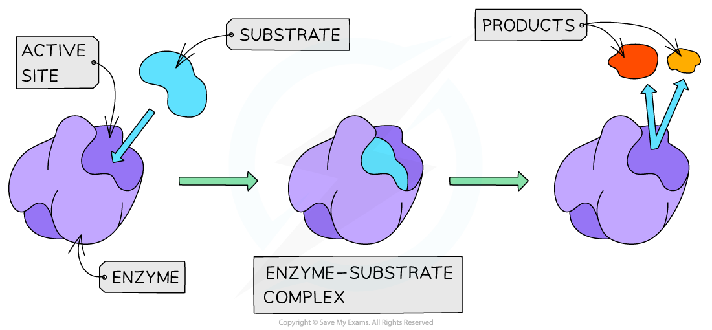
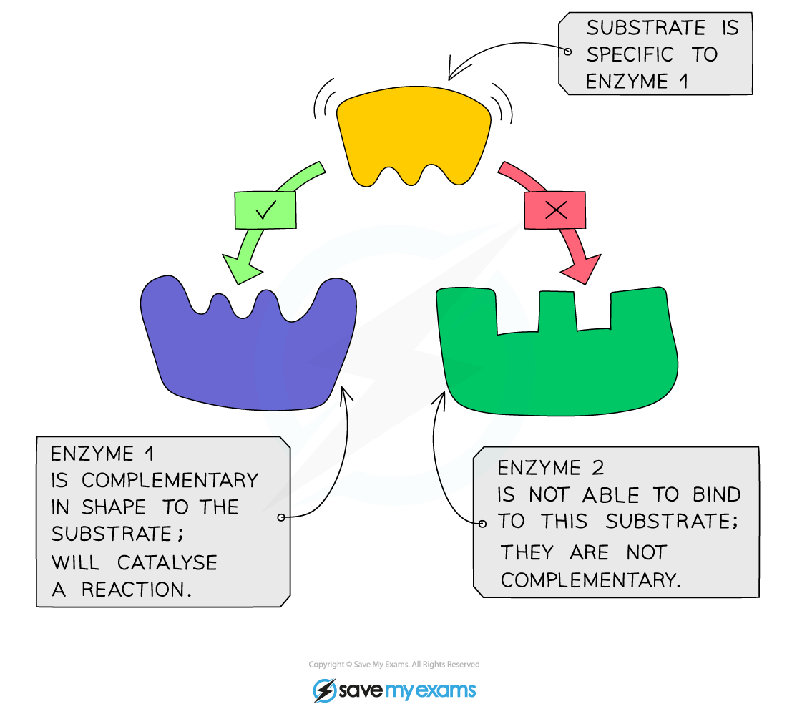
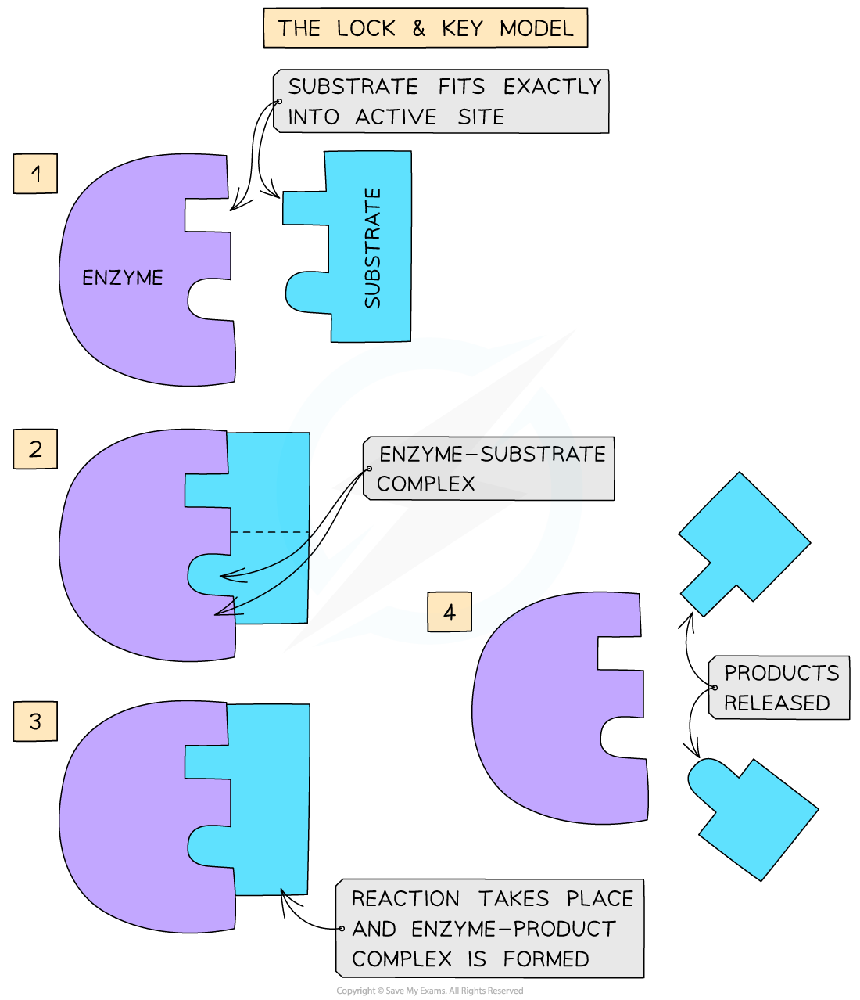
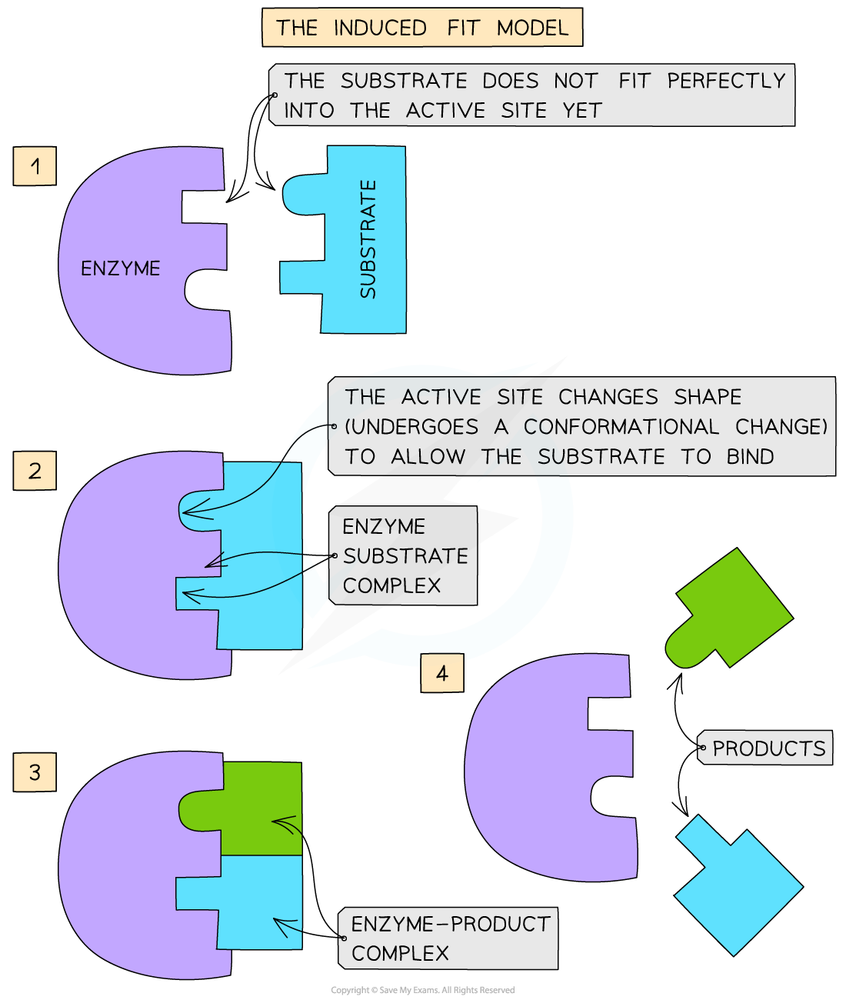

## Mode of Enzyme Action

* Enzymes are **globular proteins**
* This means their **3D shape** (as well as the shape of the **active site** of an enzyme) is determined by the complex tertiary structure of the protein that makes up the enzyme and is therefore **highly specific**
* Enzymes have a unique **active site** where **specific substrates bind**forming an **enzyme-substrate complex**
* The **active site** of an enzyme has a **specific shape** to fit a **specific substrate**
* Extremes of **heat** or **pH** can alter the protein structure and **change the shape** of the active site, **preventing** substrate binding – this is called **denaturation**
* Substrates **collide** with the enzymes active site and this must happen at the **correct orientation and speed** in order for a reaction to occur

***The active site of an enzyme has a specific shape to fit a specific substrate (when the substrate binds an enzyme-substrate complex is formed)***

#### Enzyme specificity

* The **specificity** of an enzyme is a result of the **complementary nature** between the **shape** of the **active site** on the enzyme and its **substrate**(s)
* Only **one specific substrate will fit into one specific active site**
* The shape of the active site (and therefore the specificity of the enzyme) is determined by the **complex tertiary structure** of the **protein** that makes up the enzyme:

  + Proteins are formed from chains of amino acids held together by peptide bonds
  + The order of amino acids determines the shape of an enzyme
  + If the order is altered, the resulting three-dimensional shape changes
* If the **tertiary structure of the protein is altered** in any way, the shape of the **active site will change** and the substrate will no longer fit the active site
* This means that an enzyme-substrate complex will not be able to form and the product(s) will not be produced: **the enzyme will not be able to carry out its function**

***An example of enzyme specificity***

#### The lock-and-key hypothesis

* In the 1890’s the first model of enzyme activity was described by Emil Fischer:

  + He suggested that both enzymes and substrates were **rigid structures** that **locked** into each other very **precisely**, much like a key going into a lock
  + This is known as the ‘**lock-and-key hypothesis**’

***The Lock and Key hypothesis***

#### The induced-fit hypothesis

* The lock-and-key model was later **modified** and adapted to our current understanding of enzyme activity, permitted by advances in techniques in the molecular sciences
* The **modified** **model** of enzyme activity (first proposed in 1959) is known as the ‘**induced-fit hypothesis**’
* Although it is very similar to the lock and key hypothesis, in this model the enzyme and substrate **interact** with each other:

  + The enzyme and its active site (and sometimes the substrate) can **change shape** slightly as the substrate molecule enters the enzyme
  + These changes in shape are known as **conformational changes**
  + The conformational changes ensure an **ideal binding arrangement** between the enzyme and substrate is achieved
  + This **maximises the ability of the enzyme to catalyse the reaction**

***The Induced Fit model of enzyme action***