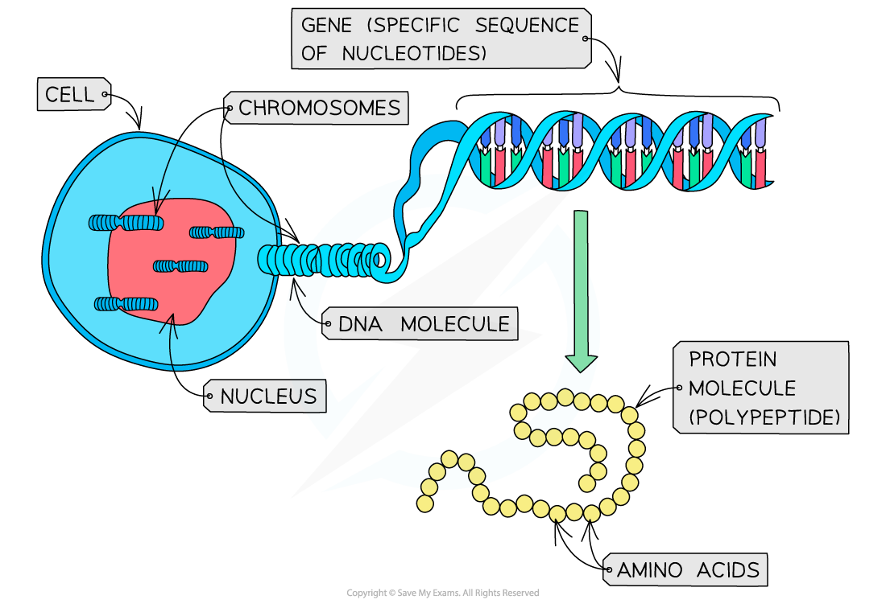

## Nature of the Genetic Code

#### The triplet code

* The sequence of DNA nucleotide bases found within a gene is determined by a **triplet** (three-letter) **code**
* Each sequence of **three bases** (i.e. each triplet of bases) in a gene codes for **one amino acid**
* These **triplets codes for different amino acids** – there are 20 different amino acids that cells use to make up different proteins
* For example:

  + CAG codes for the amino acid valine
  + TTC codes for the amino acid lysine
  + GAC codes for the amino acid leucine
  + CCG codes for the amino acid glycine
* Some of these triplets of bases code for **start**(AUG – methionine) **and stop signals**
* These start and stop signals **tell the cell where individual genes start and stop**
* As a result, the cell **reads the DNA correctly** and **produces the correct sequences of amino acids** (and therefore the correct protein molecules) that it requires to function properly

#### The genetic code is non-overlapping

* The non-overlapping nature of the genetic code means that each base is **only read once**
* **The adjacent codons do not overlap**
* A non-overlapping code means that the same letter is not used for two different codons; in other words, no single base can take part in the formation of more than one codon

#### The genetic code is degenerate

* There are **four bases**, so there are **64** different codons (triplets) possible (43= 64), yet there are only 20 amino acids that commonly occur in biological proteins

  + This is why the code is said to be **degenerate**: multiple codons can code for the same amino acids
  + The degenerate nature of the genetic code can **limit** the effect of **mutations**

***The mRNA codons and their amino acids, showing the degenerate nature of the genetic code***

#### The genetic code is universal

* The genetic code is also **universal**, meaning that almost every organism uses the **same code** (there are a few rare and minor exceptions)
* The **same triplet codes code for the same amino acids in all living things** (meaning that genetic information is transferable between species)

  + The universal nature of the genetic code is why genetic engineering (the transfer of genes from one species to another) is possible

#### Examiner Tips and Tricks

You will not be required to memorise specific codons and the amino acids for which they code.

## Definition of a Gene

* A **gene** is a **sequence of nucleotides**that forms part of a DNA molecule (one DNA molecule contains many genes)
* This sequence of nucleotides (the gene) **codes for the production of a specific polypeptide** (protein)
* Protein molecules are made up of a series of **amino acids** bonded together
* The **shape** and **behaviour** of a protein molecule depends on the **exact sequence**of these amino acids (the initial sequence of amino acids is known as the **primary structure** of the protein molecule)
* The **genes in DNA molecules, therefore, control protein structure** (and as a result, protein function) as **they determine the exact sequence in which the amino acids join together** when proteins are synthesised in a cell

***A gene is a sequence of nucleotides that codes for the production of a specific protein molecule (polypeptide)***