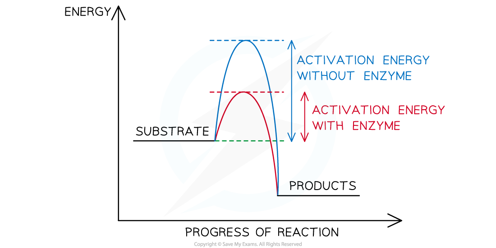

## Enzymes as Catalysts

* Enzymes are **biological catalysts**

  + ‘Biological’ because they function in **living systems**
  + ‘Catalysts’ because they **speed up the rate of chemical reactions** without being **used up** or undergoing **permanent change**
  + They speed up reactions by **reducing the** **activation energy** of reactions

* Enzymes are **globular proteins** with **complex tertiary structures**

  + Some are formed from a single polypeptide, whilst others are made up of two or more polypeptides and therefore have a **quaternary structure**
* **Metabolic pathways** are controlled by enzymes in a biochemical cascade of reactions

  + Virtually every metabolic reaction within living organisms is catalysed by an enzyme
  + Enzymes are therefore essential for life to exist
* All enzymes are **proteins** that are produced via the process of protein synthesis **inside cells**
* Some enzymes **remain** **inside** cells, whilst others are **secreted** to work **outside** of cells
* Enzymes can be **intracellular** or **extracellular** referring to whether they are active inside or outside the cell respectively

  + **Intracellular** enzymes are **produced** and **function** **inside the cell**
  + **Extracellular** enzymes are **secreted** by cells and catalyse reactions **outside** cells (eg. digestive enzymes in the gut)

**Intracellular and Extracellular Enzymes Table**

#### Enzymes and the lowering of activation energy

* All chemical reactions are associated with **energy changes**
* For a reaction to proceed there must be enough **activation energy**
* Activation energy is the **amount of energy needed** by the substrate to become just **unstable** enough for a **reaction to occur** and for **products to be formed**

  + Enzymes speed up chemical reactions because they reduce the **stability** of **bonds** in the reactants
  + The **destabilisation of bonds** in the substrate makes it **more reactive**
* Rather than lowering the overall energy change of the reaction, enzymes work by providing an **alternative energy pathway**with a **lower activation energy**
* Without enzymes, **extremely high temperatures** or **pressures** would be needed to reach the activation energy for many biological reactions

  + Enzymes avoid the need for these **extreme conditions** (that would otherwise **kill cells**)

***The activation energy of a chemical reaction is lowered by the presence of a catalyst (i.e. an enzyme)***

#### Examiner Tips and Tricks

Don't forget that enzymes are proteins and so anything that could denature a protein, rendering it non-operational (extremes of heat, temperature, pH etc.) would also denature an enzyme.