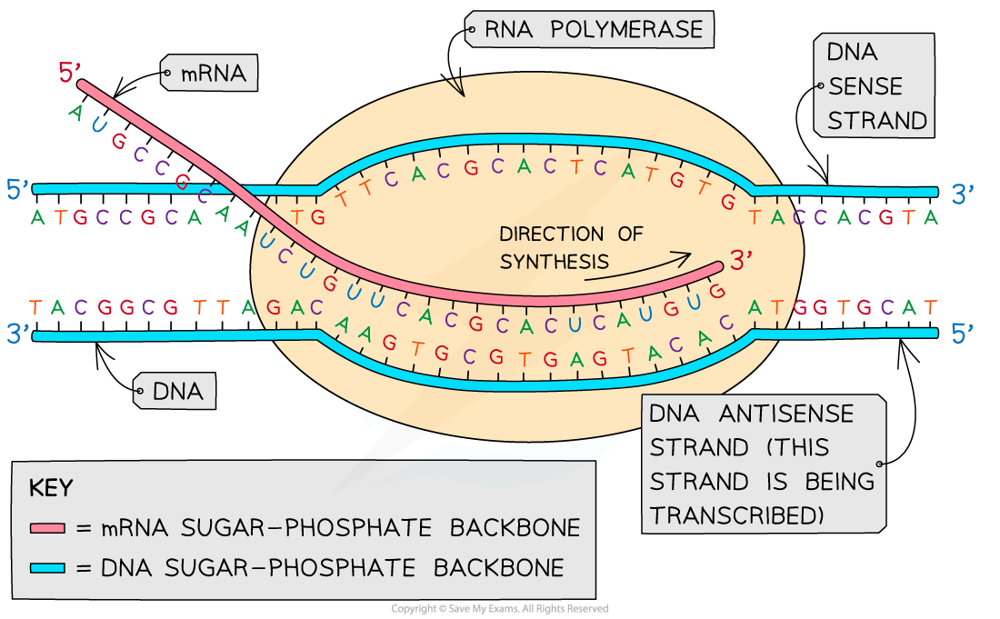

## Transcription

* A **gene** is a **sequence of nucleotide bases**in a DNA molecule that **codes for the production of a specific sequence of amino acids**, that in turn make up a **specific polypeptide** (**protein**)
* This process of protein synthesis occurs in **two stages**:

  + **Transcription** – **DNA** is transcribed and an **mRNA** (messenger RNA)molecule is produced
  + **Translation** – **mRNA** is translated and an **amino acid sequence** is produced

    - mRNA is a single-stranded molecule made up of many **RNA nucleotides** joined together
    - The role of mRNA is to carry the information encoded in the DNA from the nucleus to the site of translation on ribosomes
    - RNA is similar to DNA except for the following

      * RNA contains a **ribose** sugar while DNA contains deoxyribose
      * RNA is usually **single-stranded** while DNA is double-stranded
      * RNA contains the base **uracil** instead of the DNA base thymine

#### Transcription

* This stage of protein synthesis occurs in the **nucleus** of the cell
* Part of a DNA molecule unwinds and the hydrogen bonds between the complementary base pairs break
* This **exposes the gene to be transcribed** (the gene from which a particular polypeptide will be produced)
* A **complimentary** copy of the code from the gene is made by building a **single-stranded nucleic acid molecule known as mRNA**

  + This reaction is catalysed by **RNA polymerase**
* **Free activated RNA nucleotides** pair up, via hydrogen bonds, with their **complementary** bases on the exposed strand of the **‘unzipped’ DNA molecule**
* The sugar-phosphate groups of these RNA nucleotides are then bonded together in a reaction catalysed by the enzyme RNA polymerase to form the sugar-phosphate backbone of the mRNA molecule
* When the gene has been transcribed and the mRNA molecule is complete, the hydrogen bonds between the mRNA and DNA strands break and the **double-stranded DNA molecule reforms**
* The **mRNA molecule then leaves the nucleus** via a pore in the nuclear envelope

***The transcription stage of protein synthesis - DNA is transcribed and an mRNA molecule is produced***

#### Anti-sense and sense strands

* In the **transcription** stage of protein synthesis, free RNA nucleotides pair up with the exposed bases on the DNA molecule
* RNA nucleotides only pair with the bases on**one strand of the DNA molecule**

  + This strand of the DNA molecule is known as the **antisense** or **template strand** (or the **transcribed strand**) and it is used to produce the **mRNA molecule**
  + The other strand is known as the **sense** or **coding strand** (or the **non-template** or **non-transcribed strand**)
* **RNA polymerase** moves along the template strand in the **3' to 5' direction**

  + This means that the **mRNA** molecule grows in the **5' to 3' direction**
* Because the mRNA is formed by complementary pairing with the DNA template strand, the mRNA molecule contains the **exact same sequence of nucleotides** as the DNA **coding strand** (although the mRNA will contain **uracil** instead of **thymine**)

***The antisense strand of DNA is the one that is transcribed into mRNA***

#### Examiner Tips and Tricks

Be careful – **DNA** polymerase is the enzyme involved in DNA replication; **RNA** polymerase is the enzyme involved in **transcription** – don’t get these confused.

Note the use of **sense** and **anti-sense strands** in transcription can be replaced with non-transcribed and transcribed/template strands respectively.

The mRNA strand will have the same base sequence as the sense strand **except** on RNA the base **U**racil replaces **T**hymine from the DNA strand.