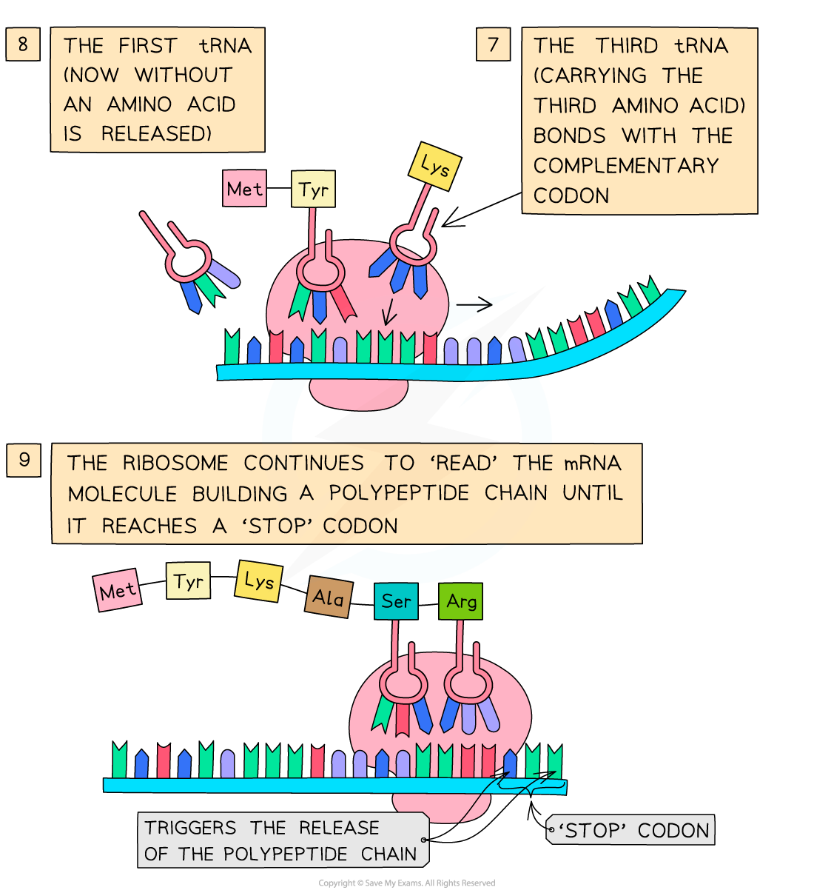

## Translation

* Translation occurs **in the cytoplasm** of the cell
* After leaving the nucleus via a nuclear pore, the **mRNA molecule attaches to a ribosome**
* In the cytoplasm there are **free molecules of tRNA** (transfer RNA)

  + tRNA is a single stranded molecule of RNA that folds into a clover-like structre
  + tRNA molecules have a **triplet of unpaired bases at one end,** known as the **anticodon**, and a region at the other end where a specific **amino acid can attach**
  + There are about 20 different tRNA molecules, each with a **specific anticodon** and **specific amino acid** binding site
* The **tRNA molecules bind with their specific amino acids** (also in the cytoplasm) and bring them to the mRNA molecule on the **ribosome**
* The triplet of bases (anticodon) on each tRNA molecule pairs with a **complementary triplet** on the mRNA molecule called the **codon**

  + Near the beginning of the mRNA is a triplet of bases called the **start codon (AUG)**
  + This is a signal to **start off translation**
  + AUG codes for an **amino acid** called **methionine**
* **Two tRNA molecules fit onto the ribosome at any one time**, bringing the amino acid they are each carrying side by side
* A **peptide bond** is then formed, via a **condensation reaction**, between the two amino acids
* This process continues until a **‘stop’ codon**on the mRNA molecule is reached – this acts as a signal for translation to stop and at this point the amino acid chain coded for by the mRNA molecule is **complete**
* The amino acid chain then forms the **final** **polypeptide**

***The process of translation***

#### Examiner Tips and Tricks

Make sure you learn both stages of protein synthesis fully. Don’t forget – transcription occurs in the nucleus but translation occurs in the cytoplasm!