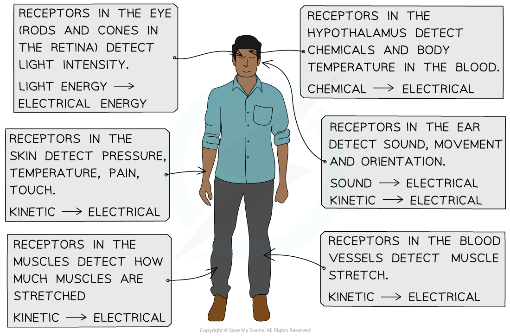

## Co-ordination of Response

* Organisms must **respond to changes** in their **external** and **internal** environments in order to survive

  + Organisms need to

    - Find favourable external conditions e.g. avoiding locations that are too hot or cold
    - Find food
    - Avoid harm e.g. from predators or high blood glucose
* Changes in the environment, or **stimuli** (singular **stimulus**) are detected by specialised **receptor cells**

  + Receptor cells are located in the **sense organs** e.g. the nose and eyes
  + Receptor cells can also be found inside the body e.g. pressure receptors in the blood vessels
* Receptor cells send **signals** via either the **nervous system** or the **hormonal system** to the body's co-ordination centres in the **brain** or **spinal cord**
* Signals are then sent on to the parts of the body which respond, known as the **effectors**

  + Effectors can be either **muscles** or **glands** e.g.

    - An arm muscle would respond to a hot surface by contracting to move the hand away
    - The pancreas responds to high blood sugar by secreting insulin

***Receptors are cells that detect stimuli in the internal and external environment***

#### The nervous system

* The human nervous system consists of

  + **Central nervous system** (CNS) – the **brain** and **spinal cord**
  + **Peripheral nervous system** (PNS) – all of the **nerves** in the body
* The nervous system allows detection of stimuli in our surroundings and the **coordination** of the body's **responses** to the stimuli
* Information is sent through the nervous system in the form of **electrical impulses** that pass along **nerve cells** known as **neurones**

  + A **bundle of neurones** is known as a **nerve**
  + There are different types of neuronesincluding **sensory neurones, relay neurones,** and **motor neurones**
* The nerves connect the receptors in the sense organs with the CNS, and connect the CNS with effectors

  + The **CNS**acts as a **central coordinating centre** for the impulses that come in from, and are sent out to, any part of the body
* Nerve impulses pass through the nervous system along the following pathway

**stimulus** ![rightwards arrow](data:image/svg+xml;charset=utf8,%3Csvg%20xmlns%3D%22http%3A%2F%2Fwww.w3.org%2F2000%2Fsvg%22%20xmlns%3Awrs%3D%22http%3A%2F%2Fwww.wiris.com%2Fxml%2Fmathml-extension%22%20height%3D%2219%22%20width%3D%2221%22%20wrs%3Abaseline%3D%2216%22%3E%3C!--MathML%3A%20%3Cmath%20xmlns%3D%22http%3A%2F%2Fwww.w3.org%2F1998%2FMath%2FMathML%22%3E%3Cmo%3E%26%23x2192%3B%3C%2Fmo%3E%3C%2Fmath%3E--%3E%3Cdefs%3E%3Cstyle%20type%3D%22text%2Fcss%22%3E%40font-face%7Bfont-family%3A'math12bba9f4124283edd644799e0ce'%3Bsrc%3Aurl(data%3Afont%2Ftruetype%3Bcharset%3Dutf-8%3Bbase64%2CAAEAAAAMAIAAAwBAT1MvMi7iBBMAAADMAAAATmNtYXDEvmKUAAABHAAAADRjdnQgDVUNBwAAAVAAAAA6Z2x5ZoPi2VsAAAGMAAAAcWhlYWQQC2qxAAACAAAAADZoaGVhCGsXSAAAAjgAAAAkaG10eE2rRkcAAAJcAAAACGxvY2EAHTwYAAACZAAAAAxtYXhwBT0FPgAAAnAAAAAgbmFtZaBxlY4AAAKQAAABn3Bvc3QB9wD6AAAEMAAAACBwcmVwa1uragAABFAAAAAUAAADSwGQAAUAAAQABAAAAAAABAAEAAAAAAAAAQEAAAAAAAAAAAAAAAAAAAAAAAAAAAAAAAAAAAAAACAgICAAAAAg1UADev96AAAD6ACWAAAAAAACAAEAAQAAABQAAwABAAAAFAAEACAAAAAEAAQAAQAAIZL%2F%2FwAAIZL%2F%2F95vAAEAAAAAAAABVAMsAIABAABWACoCWAIeAQ4BLAIsAFoBgAKAAKAA1ACAAAAAAAAAACsAVQCAAKsA1QEAASsABwAAAAIAVQAAAwADqwADAAcAADMRIRElIREhVQKr%2FasCAP4AA6v8VVUDAAABAIAAqgOAAlUACAAfALEAABMQsQAG5bEAARMQsAE8sQMP5bEHBfWxBQ%2F1MBMhJzUNATU3IYACK1YBK%2F7VVv3VAapBatXWa0AAAAAAAQAAAAEAANV4zkFfDzz1AAMEAP%2F%2F%2F%2F%2FWOhNz%2F%2F%2F%2F%2F9Y6E3MAAP8gBIADqwAAAAoAAgABAAAAAAABAAAD6P9qAAAXcAAA%2F7YEgAABAAAAAAAAAAAAAAAAAAAAAgNSAFUEAACAAAAAAAAAACgAAABxAAEAAAACAF4ABQAAAAAAAgCABAAAAAAABAAA3gAAAAAAAAAVAQIAAAAAAAAAAQASAAAAAAAAAAAAAgAOABIAAAAAAAAAAwAwACAAAAAAAAAABAASAFAAAAAAAAAABQAWAGIAAAAAAAAABgAJAHgAAAAAAAAACAAcAIEAAQAAAAAAAQASAAAAAQAAAAAAAgAOABIAAQAAAAAAAwAwACAAAQAAAAAABAASAFAAAQAAAAAABQAWAGIAAQAAAAAABgAJAHgAAQAAAAAACAAcAIEAAwABBAkAAQASAAAAAwABBAkAAgAOABIAAwABBAkAAwAwACAAAwABBAkABAASAFAAAwABBAkABQAWAGIAAwABBAkABgAJAHgAAwABBAkACAAcAIEATQBhAHQAaAAgAEYAbwBuAHQAUgBlAGcAdQBsAGEAcgBNAGEAdABoAHMAIABGAG8AcgAgAE0AbwByAGUAIABNAGEAdABoACAARgBvAG4AdABNAGEAdABoACAARgBvAG4AdABWAGUAcgBzAGkAbwBuACAAMQAuADBNYXRoX0ZvbnQATQBhAHQAaABzACAARgBvAHIAIABNAG8AcgBlAAADAAAAAAAAAfQA%2BgAAAAAAAAAAAAAAAAAAAAAAAAAAuQcRAACNhRgAsgAAABUUE7EAAT8%3D)format('truetype')%3Bfont-weight%3Anormal%3Bfont-style%3Anormal%3B%7D%3C%2Fstyle%3E%3C%2Fdefs%3E%3Ctext%20font-family%3D%22math12bba9f4124283edd644799e0ce%22%20font-size%3D%2216%22%20text-anchor%3D%22middle%22%20x%3D%2210.5%22%20y%3D%2216%22%3E%26%23x2192%3B%3C%2Ftext%3E%3C%2Fsvg%3E) **receptor** ![rightwards arrow](data:image/svg+xml;charset=utf8,%3Csvg%20xmlns%3D%22http%3A%2F%2Fwww.w3.org%2F2000%2Fsvg%22%20xmlns%3Awrs%3D%22http%3A%2F%2Fwww.wiris.com%2Fxml%2Fmathml-extension%22%20height%3D%2219%22%20width%3D%2221%22%20wrs%3Abaseline%3D%2216%22%3E%3C!--MathML%3A%20%3Cmath%20xmlns%3D%22http%3A%2F%2Fwww.w3.org%2F1998%2FMath%2FMathML%22%3E%3Cmo%3E%26%23x2192%3B%3C%2Fmo%3E%3C%2Fmath%3E--%3E%3Cdefs%3E%3Cstyle%20type%3D%22text%2Fcss%22%3E%40font-face%7Bfont-family%3A'math12bba9f4124283edd644799e0ce'%3Bsrc%3Aurl(data%3Afont%2Ftruetype%3Bcharset%3Dutf-8%3Bbase64%2CAAEAAAAMAIAAAwBAT1MvMi7iBBMAAADMAAAATmNtYXDEvmKUAAABHAAAADRjdnQgDVUNBwAAAVAAAAA6Z2x5ZoPi2VsAAAGMAAAAcWhlYWQQC2qxAAACAAAAADZoaGVhCGsXSAAAAjgAAAAkaG10eE2rRkcAAAJcAAAACGxvY2EAHTwYAAACZAAAAAxtYXhwBT0FPgAAAnAAAAAgbmFtZaBxlY4AAAKQAAABn3Bvc3QB9wD6AAAEMAAAACBwcmVwa1uragAABFAAAAAUAAADSwGQAAUAAAQABAAAAAAABAAEAAAAAAAAAQEAAAAAAAAAAAAAAAAAAAAAAAAAAAAAAAAAAAAAACAgICAAAAAg1UADev96AAAD6ACWAAAAAAACAAEAAQAAABQAAwABAAAAFAAEACAAAAAEAAQAAQAAIZL%2F%2FwAAIZL%2F%2F95vAAEAAAAAAAABVAMsAIABAABWACoCWAIeAQ4BLAIsAFoBgAKAAKAA1ACAAAAAAAAAACsAVQCAAKsA1QEAASsABwAAAAIAVQAAAwADqwADAAcAADMRIRElIREhVQKr%2FasCAP4AA6v8VVUDAAABAIAAqgOAAlUACAAfALEAABMQsQAG5bEAARMQsAE8sQMP5bEHBfWxBQ%2F1MBMhJzUNATU3IYACK1YBK%2F7VVv3VAapBatXWa0AAAAAAAQAAAAEAANV4zkFfDzz1AAMEAP%2F%2F%2F%2F%2FWOhNz%2F%2F%2F%2F%2F9Y6E3MAAP8gBIADqwAAAAoAAgABAAAAAAABAAAD6P9qAAAXcAAA%2F7YEgAABAAAAAAAAAAAAAAAAAAAAAgNSAFUEAACAAAAAAAAAACgAAABxAAEAAAACAF4ABQAAAAAAAgCABAAAAAAABAAA3gAAAAAAAAAVAQIAAAAAAAAAAQASAAAAAAAAAAAAAgAOABIAAAAAAAAAAwAwACAAAAAAAAAABAASAFAAAAAAAAAABQAWAGIAAAAAAAAABgAJAHgAAAAAAAAACAAcAIEAAQAAAAAAAQASAAAAAQAAAAAAAgAOABIAAQAAAAAAAwAwACAAAQAAAAAABAASAFAAAQAAAAAABQAWAGIAAQAAAAAABgAJAHgAAQAAAAAACAAcAIEAAwABBAkAAQASAAAAAwABBAkAAgAOABIAAwABBAkAAwAwACAAAwABBAkABAASAFAAAwABBAkABQAWAGIAAwABBAkABgAJAHgAAwABBAkACAAcAIEATQBhAHQAaAAgAEYAbwBuAHQAUgBlAGcAdQBsAGEAcgBNAGEAdABoAHMAIABGAG8AcgAgAE0AbwByAGUAIABNAGEAdABoACAARgBvAG4AdABNAGEAdABoACAARgBvAG4AdABWAGUAcgBzAGkAbwBuACAAMQAuADBNYXRoX0ZvbnQATQBhAHQAaABzACAARgBvAHIAIABNAG8AcgBlAAADAAAAAAAAAfQA%2BgAAAAAAAAAAAAAAAAAAAAAAAAAAuQcRAACNhRgAsgAAABUUE7EAAT8%3D)format('truetype')%3Bfont-weight%3Anormal%3Bfont-style%3Anormal%3B%7D%3C%2Fstyle%3E%3C%2Fdefs%3E%3Ctext%20font-family%3D%22math12bba9f4124283edd644799e0ce%22%20font-size%3D%2216%22%20text-anchor%3D%22middle%22%20x%3D%2210.5%22%20y%3D%2216%22%3E%26%23x2192%3B%3C%2Ftext%3E%3C%2Fsvg%3E) **sensory neurone**![rightwards arrow](data:image/svg+xml;charset=utf8,%3Csvg%20xmlns%3D%22http%3A%2F%2Fwww.w3.org%2F2000%2Fsvg%22%20xmlns%3Awrs%3D%22http%3A%2F%2Fwww.wiris.com%2Fxml%2Fmathml-extension%22%20height%3D%2219%22%20width%3D%2221%22%20wrs%3Abaseline%3D%2216%22%3E%3C!--MathML%3A%20%3Cmath%20xmlns%3D%22http%3A%2F%2Fwww.w3.org%2F1998%2FMath%2FMathML%22%3E%3Cmo%3E%26%23x2192%3B%3C%2Fmo%3E%3C%2Fmath%3E--%3E%3Cdefs%3E%3Cstyle%20type%3D%22text%2Fcss%22%3E%40font-face%7Bfont-family%3A'math12bba9f4124283edd644799e0ce'%3Bsrc%3Aurl(data%3Afont%2Ftruetype%3Bcharset%3Dutf-8%3Bbase64%2CAAEAAAAMAIAAAwBAT1MvMi7iBBMAAADMAAAATmNtYXDEvmKUAAABHAAAADRjdnQgDVUNBwAAAVAAAAA6Z2x5ZoPi2VsAAAGMAAAAcWhlYWQQC2qxAAACAAAAADZoaGVhCGsXSAAAAjgAAAAkaG10eE2rRkcAAAJcAAAACGxvY2EAHTwYAAACZAAAAAxtYXhwBT0FPgAAAnAAAAAgbmFtZaBxlY4AAAKQAAABn3Bvc3QB9wD6AAAEMAAAACBwcmVwa1uragAABFAAAAAUAAADSwGQAAUAAAQABAAAAAAABAAEAAAAAAAAAQEAAAAAAAAAAAAAAAAAAAAAAAAAAAAAAAAAAAAAACAgICAAAAAg1UADev96AAAD6ACWAAAAAAACAAEAAQAAABQAAwABAAAAFAAEACAAAAAEAAQAAQAAIZL%2F%2FwAAIZL%2F%2F95vAAEAAAAAAAABVAMsAIABAABWACoCWAIeAQ4BLAIsAFoBgAKAAKAA1ACAAAAAAAAAACsAVQCAAKsA1QEAASsABwAAAAIAVQAAAwADqwADAAcAADMRIRElIREhVQKr%2FasCAP4AA6v8VVUDAAABAIAAqgOAAlUACAAfALEAABMQsQAG5bEAARMQsAE8sQMP5bEHBfWxBQ%2F1MBMhJzUNATU3IYACK1YBK%2F7VVv3VAapBatXWa0AAAAAAAQAAAAEAANV4zkFfDzz1AAMEAP%2F%2F%2F%2F%2FWOhNz%2F%2F%2F%2F%2F9Y6E3MAAP8gBIADqwAAAAoAAgABAAAAAAABAAAD6P9qAAAXcAAA%2F7YEgAABAAAAAAAAAAAAAAAAAAAAAgNSAFUEAACAAAAAAAAAACgAAABxAAEAAAACAF4ABQAAAAAAAgCABAAAAAAABAAA3gAAAAAAAAAVAQIAAAAAAAAAAQASAAAAAAAAAAAAAgAOABIAAAAAAAAAAwAwACAAAAAAAAAABAASAFAAAAAAAAAABQAWAGIAAAAAAAAABgAJAHgAAAAAAAAACAAcAIEAAQAAAAAAAQASAAAAAQAAAAAAAgAOABIAAQAAAAAAAwAwACAAAQAAAAAABAASAFAAAQAAAAAABQAWAGIAAQAAAAAABgAJAHgAAQAAAAAACAAcAIEAAwABBAkAAQASAAAAAwABBAkAAgAOABIAAwABBAkAAwAwACAAAwABBAkABAASAFAAAwABBAkABQAWAGIAAwABBAkABgAJAHgAAwABBAkACAAcAIEATQBhAHQAaAAgAEYAbwBuAHQAUgBlAGcAdQBsAGEAcgBNAGEAdABoAHMAIABGAG8AcgAgAE0AbwByAGUAIABNAGEAdABoACAARgBvAG4AdABNAGEAdABoACAARgBvAG4AdABWAGUAcgBzAGkAbwBuACAAMQAuADBNYXRoX0ZvbnQATQBhAHQAaABzACAARgBvAHIAIABNAG8AcgBlAAADAAAAAAAAAfQA%2BgAAAAAAAAAAAAAAAAAAAAAAAAAAuQcRAACNhRgAsgAAABUUE7EAAT8%3D)format('truetype')%3Bfont-weight%3Anormal%3Bfont-style%3Anormal%3B%7D%3C%2Fstyle%3E%3C%2Fdefs%3E%3Ctext%20font-family%3D%22math12bba9f4124283edd644799e0ce%22%20font-size%3D%2216%22%20text-anchor%3D%22middle%22%20x%3D%2210.5%22%20y%3D%2216%22%3E%26%23x2192%3B%3C%2Ftext%3E%3C%2Fsvg%3E) **CNS**![rightwards arrow](data:image/svg+xml;charset=utf8,%3Csvg%20xmlns%3D%22http%3A%2F%2Fwww.w3.org%2F2000%2Fsvg%22%20xmlns%3Awrs%3D%22http%3A%2F%2Fwww.wiris.com%2Fxml%2Fmathml-extension%22%20height%3D%2219%22%20width%3D%2221%22%20wrs%3Abaseline%3D%2216%22%3E%3C!--MathML%3A%20%3Cmath%20xmlns%3D%22http%3A%2F%2Fwww.w3.org%2F1998%2FMath%2FMathML%22%3E%3Cmo%3E%26%23x2192%3B%3C%2Fmo%3E%3C%2Fmath%3E--%3E%3Cdefs%3E%3Cstyle%20type%3D%22text%2Fcss%22%3E%40font-face%7Bfont-family%3A'math12bba9f4124283edd644799e0ce'%3Bsrc%3Aurl(data%3Afont%2Ftruetype%3Bcharset%3Dutf-8%3Bbase64%2CAAEAAAAMAIAAAwBAT1MvMi7iBBMAAADMAAAATmNtYXDEvmKUAAABHAAAADRjdnQgDVUNBwAAAVAAAAA6Z2x5ZoPi2VsAAAGMAAAAcWhlYWQQC2qxAAACAAAAADZoaGVhCGsXSAAAAjgAAAAkaG10eE2rRkcAAAJcAAAACGxvY2EAHTwYAAACZAAAAAxtYXhwBT0FPgAAAnAAAAAgbmFtZaBxlY4AAAKQAAABn3Bvc3QB9wD6AAAEMAAAACBwcmVwa1uragAABFAAAAAUAAADSwGQAAUAAAQABAAAAAAABAAEAAAAAAAAAQEAAAAAAAAAAAAAAAAAAAAAAAAAAAAAAAAAAAAAACAgICAAAAAg1UADev96AAAD6ACWAAAAAAACAAEAAQAAABQAAwABAAAAFAAEACAAAAAEAAQAAQAAIZL%2F%2FwAAIZL%2F%2F95vAAEAAAAAAAABVAMsAIABAABWACoCWAIeAQ4BLAIsAFoBgAKAAKAA1ACAAAAAAAAAACsAVQCAAKsA1QEAASsABwAAAAIAVQAAAwADqwADAAcAADMRIRElIREhVQKr%2FasCAP4AA6v8VVUDAAABAIAAqgOAAlUACAAfALEAABMQsQAG5bEAARMQsAE8sQMP5bEHBfWxBQ%2F1MBMhJzUNATU3IYACK1YBK%2F7VVv3VAapBatXWa0AAAAAAAQAAAAEAANV4zkFfDzz1AAMEAP%2F%2F%2F%2F%2FWOhNz%2F%2F%2F%2F%2F9Y6E3MAAP8gBIADqwAAAAoAAgABAAAAAAABAAAD6P9qAAAXcAAA%2F7YEgAABAAAAAAAAAAAAAAAAAAAAAgNSAFUEAACAAAAAAAAAACgAAABxAAEAAAACAF4ABQAAAAAAAgCABAAAAAAABAAA3gAAAAAAAAAVAQIAAAAAAAAAAQASAAAAAAAAAAAAAgAOABIAAAAAAAAAAwAwACAAAAAAAAAABAASAFAAAAAAAAAABQAWAGIAAAAAAAAABgAJAHgAAAAAAAAACAAcAIEAAQAAAAAAAQASAAAAAQAAAAAAAgAOABIAAQAAAAAAAwAwACAAAQAAAAAABAASAFAAAQAAAAAABQAWAGIAAQAAAAAABgAJAHgAAQAAAAAACAAcAIEAAwABBAkAAQASAAAAAwABBAkAAgAOABIAAwABBAkAAwAwACAAAwABBAkABAASAFAAAwABBAkABQAWAGIAAwABBAkABgAJAHgAAwABBAkACAAcAIEATQBhAHQAaAAgAEYAbwBuAHQAUgBlAGcAdQBsAGEAcgBNAGEAdABoAHMAIABGAG8AcgAgAE0AbwByAGUAIABNAGEAdABoACAARgBvAG4AdABNAGEAdABoACAARgBvAG4AdABWAGUAcgBzAGkAbwBuACAAMQAuADBNYXRoX0ZvbnQATQBhAHQAaABzACAARgBvAHIAIABNAG8AcgBlAAADAAAAAAAAAfQA%2BgAAAAAAAAAAAAAAAAAAAAAAAAAAuQcRAACNhRgAsgAAABUUE7EAAT8%3D)format('truetype')%3Bfont-weight%3Anormal%3Bfont-style%3Anormal%3B%7D%3C%2Fstyle%3E%3C%2Fdefs%3E%3Ctext%20font-family%3D%22math12bba9f4124283edd644799e0ce%22%20font-size%3D%2216%22%20text-anchor%3D%22middle%22%20x%3D%2210.5%22%20y%3D%2216%22%3E%26%23x2192%3B%3C%2Ftext%3E%3C%2Fsvg%3E)**motor neurone**![rightwards arrow](data:image/svg+xml;charset=utf8,%3Csvg%20xmlns%3D%22http%3A%2F%2Fwww.w3.org%2F2000%2Fsvg%22%20xmlns%3Awrs%3D%22http%3A%2F%2Fwww.wiris.com%2Fxml%2Fmathml-extension%22%20height%3D%2219%22%20width%3D%2221%22%20wrs%3Abaseline%3D%2216%22%3E%3C!--MathML%3A%20%3Cmath%20xmlns%3D%22http%3A%2F%2Fwww.w3.org%2F1998%2FMath%2FMathML%22%3E%3Cmo%3E%26%23x2192%3B%3C%2Fmo%3E%3C%2Fmath%3E--%3E%3Cdefs%3E%3Cstyle%20type%3D%22text%2Fcss%22%3E%40font-face%7Bfont-family%3A'math12bba9f4124283edd644799e0ce'%3Bsrc%3Aurl(data%3Afont%2Ftruetype%3Bcharset%3Dutf-8%3Bbase64%2CAAEAAAAMAIAAAwBAT1MvMi7iBBMAAADMAAAATmNtYXDEvmKUAAABHAAAADRjdnQgDVUNBwAAAVAAAAA6Z2x5ZoPi2VsAAAGMAAAAcWhlYWQQC2qxAAACAAAAADZoaGVhCGsXSAAAAjgAAAAkaG10eE2rRkcAAAJcAAAACGxvY2EAHTwYAAACZAAAAAxtYXhwBT0FPgAAAnAAAAAgbmFtZaBxlY4AAAKQAAABn3Bvc3QB9wD6AAAEMAAAACBwcmVwa1uragAABFAAAAAUAAADSwGQAAUAAAQABAAAAAAABAAEAAAAAAAAAQEAAAAAAAAAAAAAAAAAAAAAAAAAAAAAAAAAAAAAACAgICAAAAAg1UADev96AAAD6ACWAAAAAAACAAEAAQAAABQAAwABAAAAFAAEACAAAAAEAAQAAQAAIZL%2F%2FwAAIZL%2F%2F95vAAEAAAAAAAABVAMsAIABAABWACoCWAIeAQ4BLAIsAFoBgAKAAKAA1ACAAAAAAAAAACsAVQCAAKsA1QEAASsABwAAAAIAVQAAAwADqwADAAcAADMRIRElIREhVQKr%2FasCAP4AA6v8VVUDAAABAIAAqgOAAlUACAAfALEAABMQsQAG5bEAARMQsAE8sQMP5bEHBfWxBQ%2F1MBMhJzUNATU3IYACK1YBK%2F7VVv3VAapBatXWa0AAAAAAAQAAAAEAANV4zkFfDzz1AAMEAP%2F%2F%2F%2F%2FWOhNz%2F%2F%2F%2F%2F9Y6E3MAAP8gBIADqwAAAAoAAgABAAAAAAABAAAD6P9qAAAXcAAA%2F7YEgAABAAAAAAAAAAAAAAAAAAAAAgNSAFUEAACAAAAAAAAAACgAAABxAAEAAAACAF4ABQAAAAAAAgCABAAAAAAABAAA3gAAAAAAAAAVAQIAAAAAAAAAAQASAAAAAAAAAAAAAgAOABIAAAAAAAAAAwAwACAAAAAAAAAABAASAFAAAAAAAAAABQAWAGIAAAAAAAAABgAJAHgAAAAAAAAACAAcAIEAAQAAAAAAAQASAAAAAQAAAAAAAgAOABIAAQAAAAAAAwAwACAAAQAAAAAABAASAFAAAQAAAAAABQAWAGIAAQAAAAAABgAJAHgAAQAAAAAACAAcAIEAAwABBAkAAQASAAAAAwABBAkAAgAOABIAAwABBAkAAwAwACAAAwABBAkABAASAFAAAwABBAkABQAWAGIAAwABBAkABgAJAHgAAwABBAkACAAcAIEATQBhAHQAaAAgAEYAbwBuAHQAUgBlAGcAdQBsAGEAcgBNAGEAdABoAHMAIABGAG8AcgAgAE0AbwByAGUAIABNAGEAdABoACAARgBvAG4AdABNAGEAdABoACAARgBvAG4AdABWAGUAcgBzAGkAbwBuACAAMQAuADBNYXRoX0ZvbnQATQBhAHQAaABzACAARgBvAHIAIABNAG8AcgBlAAADAAAAAAAAAfQA%2BgAAAAAAAAAAAAAAAAAAAAAAAAAAuQcRAACNhRgAsgAAABUUE7EAAT8%3D)format('truetype')%3Bfont-weight%3Anormal%3Bfont-style%3Anormal%3B%7D%3C%2Fstyle%3E%3C%2Fdefs%3E%3Ctext%20font-family%3D%22math12bba9f4124283edd644799e0ce%22%20font-size%3D%2216%22%20text-anchor%3D%22middle%22%20x%3D%2210.5%22%20y%3D%2216%22%3E%26%23x2192%3B%3C%2Ftext%3E%3C%2Fsvg%3E)**effector**

* An example of this nerve pathway in action might be

**hot surface** ![rightwards arrow](data:image/svg+xml;charset=utf8,%3Csvg%20xmlns%3D%22http%3A%2F%2Fwww.w3.org%2F2000%2Fsvg%22%20xmlns%3Awrs%3D%22http%3A%2F%2Fwww.wiris.com%2Fxml%2Fmathml-extension%22%20height%3D%2219%22%20width%3D%2221%22%20wrs%3Abaseline%3D%2216%22%3E%3C!--MathML%3A%20%3Cmath%20xmlns%3D%22http%3A%2F%2Fwww.w3.org%2F1998%2FMath%2FMathML%22%3E%3Cmo%3E%26%23x2192%3B%3C%2Fmo%3E%3C%2Fmath%3E--%3E%3Cdefs%3E%3Cstyle%20type%3D%22text%2Fcss%22%3E%40font-face%7Bfont-family%3A'math12bba9f4124283edd644799e0ce'%3Bsrc%3Aurl(data%3Afont%2Ftruetype%3Bcharset%3Dutf-8%3Bbase64%2CAAEAAAAMAIAAAwBAT1MvMi7iBBMAAADMAAAATmNtYXDEvmKUAAABHAAAADRjdnQgDVUNBwAAAVAAAAA6Z2x5ZoPi2VsAAAGMAAAAcWhlYWQQC2qxAAACAAAAADZoaGVhCGsXSAAAAjgAAAAkaG10eE2rRkcAAAJcAAAACGxvY2EAHTwYAAACZAAAAAxtYXhwBT0FPgAAAnAAAAAgbmFtZaBxlY4AAAKQAAABn3Bvc3QB9wD6AAAEMAAAACBwcmVwa1uragAABFAAAAAUAAADSwGQAAUAAAQABAAAAAAABAAEAAAAAAAAAQEAAAAAAAAAAAAAAAAAAAAAAAAAAAAAAAAAAAAAACAgICAAAAAg1UADev96AAAD6ACWAAAAAAACAAEAAQAAABQAAwABAAAAFAAEACAAAAAEAAQAAQAAIZL%2F%2FwAAIZL%2F%2F95vAAEAAAAAAAABVAMsAIABAABWACoCWAIeAQ4BLAIsAFoBgAKAAKAA1ACAAAAAAAAAACsAVQCAAKsA1QEAASsABwAAAAIAVQAAAwADqwADAAcAADMRIRElIREhVQKr%2FasCAP4AA6v8VVUDAAABAIAAqgOAAlUACAAfALEAABMQsQAG5bEAARMQsAE8sQMP5bEHBfWxBQ%2F1MBMhJzUNATU3IYACK1YBK%2F7VVv3VAapBatXWa0AAAAAAAQAAAAEAANV4zkFfDzz1AAMEAP%2F%2F%2F%2F%2FWOhNz%2F%2F%2F%2F%2F9Y6E3MAAP8gBIADqwAAAAoAAgABAAAAAAABAAAD6P9qAAAXcAAA%2F7YEgAABAAAAAAAAAAAAAAAAAAAAAgNSAFUEAACAAAAAAAAAACgAAABxAAEAAAACAF4ABQAAAAAAAgCABAAAAAAABAAA3gAAAAAAAAAVAQIAAAAAAAAAAQASAAAAAAAAAAAAAgAOABIAAAAAAAAAAwAwACAAAAAAAAAABAASAFAAAAAAAAAABQAWAGIAAAAAAAAABgAJAHgAAAAAAAAACAAcAIEAAQAAAAAAAQASAAAAAQAAAAAAAgAOABIAAQAAAAAAAwAwACAAAQAAAAAABAASAFAAAQAAAAAABQAWAGIAAQAAAAAABgAJAHgAAQAAAAAACAAcAIEAAwABBAkAAQASAAAAAwABBAkAAgAOABIAAwABBAkAAwAwACAAAwABBAkABAASAFAAAwABBAkABQAWAGIAAwABBAkABgAJAHgAAwABBAkACAAcAIEATQBhAHQAaAAgAEYAbwBuAHQAUgBlAGcAdQBsAGEAcgBNAGEAdABoAHMAIABGAG8AcgAgAE0AbwByAGUAIABNAGEAdABoACAARgBvAG4AdABNAGEAdABoACAARgBvAG4AdABWAGUAcgBzAGkAbwBuACAAMQAuADBNYXRoX0ZvbnQATQBhAHQAaABzACAARgBvAHIAIABNAG8AcgBlAAADAAAAAAAAAfQA%2BgAAAAAAAAAAAAAAAAAAAAAAAAAAuQcRAACNhRgAsgAAABUUE7EAAT8%3D)format('truetype')%3Bfont-weight%3Anormal%3Bfont-style%3Anormal%3B%7D%3C%2Fstyle%3E%3C%2Fdefs%3E%3Ctext%20font-family%3D%22math12bba9f4124283edd644799e0ce%22%20font-size%3D%2216%22%20text-anchor%3D%22middle%22%20x%3D%2210.5%22%20y%3D%2216%22%3E%26%23x2192%3B%3C%2Ftext%3E%3C%2Fsvg%3E) **pain receptor in skin of hand**![rightwards arrow](data:image/svg+xml;charset=utf8,%3Csvg%20xmlns%3D%22http%3A%2F%2Fwww.w3.org%2F2000%2Fsvg%22%20xmlns%3Awrs%3D%22http%3A%2F%2Fwww.wiris.com%2Fxml%2Fmathml-extension%22%20height%3D%2219%22%20width%3D%2221%22%20wrs%3Abaseline%3D%2216%22%3E%3C!--MathML%3A%20%3Cmath%20xmlns%3D%22http%3A%2F%2Fwww.w3.org%2F1998%2FMath%2FMathML%22%3E%3Cmo%3E%26%23x2192%3B%3C%2Fmo%3E%3C%2Fmath%3E--%3E%3Cdefs%3E%3Cstyle%20type%3D%22text%2Fcss%22%3E%40font-face%7Bfont-family%3A'math12bba9f4124283edd644799e0ce'%3Bsrc%3Aurl(data%3Afont%2Ftruetype%3Bcharset%3Dutf-8%3Bbase64%2CAAEAAAAMAIAAAwBAT1MvMi7iBBMAAADMAAAATmNtYXDEvmKUAAABHAAAADRjdnQgDVUNBwAAAVAAAAA6Z2x5ZoPi2VsAAAGMAAAAcWhlYWQQC2qxAAACAAAAADZoaGVhCGsXSAAAAjgAAAAkaG10eE2rRkcAAAJcAAAACGxvY2EAHTwYAAACZAAAAAxtYXhwBT0FPgAAAnAAAAAgbmFtZaBxlY4AAAKQAAABn3Bvc3QB9wD6AAAEMAAAACBwcmVwa1uragAABFAAAAAUAAADSwGQAAUAAAQABAAAAAAABAAEAAAAAAAAAQEAAAAAAAAAAAAAAAAAAAAAAAAAAAAAAAAAAAAAACAgICAAAAAg1UADev96AAAD6ACWAAAAAAACAAEAAQAAABQAAwABAAAAFAAEACAAAAAEAAQAAQAAIZL%2F%2FwAAIZL%2F%2F95vAAEAAAAAAAABVAMsAIABAABWACoCWAIeAQ4BLAIsAFoBgAKAAKAA1ACAAAAAAAAAACsAVQCAAKsA1QEAASsABwAAAAIAVQAAAwADqwADAAcAADMRIRElIREhVQKr%2FasCAP4AA6v8VVUDAAABAIAAqgOAAlUACAAfALEAABMQsQAG5bEAARMQsAE8sQMP5bEHBfWxBQ%2F1MBMhJzUNATU3IYACK1YBK%2F7VVv3VAapBatXWa0AAAAAAAQAAAAEAANV4zkFfDzz1AAMEAP%2F%2F%2F%2F%2FWOhNz%2F%2F%2F%2F%2F9Y6E3MAAP8gBIADqwAAAAoAAgABAAAAAAABAAAD6P9qAAAXcAAA%2F7YEgAABAAAAAAAAAAAAAAAAAAAAAgNSAFUEAACAAAAAAAAAACgAAABxAAEAAAACAF4ABQAAAAAAAgCABAAAAAAABAAA3gAAAAAAAAAVAQIAAAAAAAAAAQASAAAAAAAAAAAAAgAOABIAAAAAAAAAAwAwACAAAAAAAAAABAASAFAAAAAAAAAABQAWAGIAAAAAAAAABgAJAHgAAAAAAAAACAAcAIEAAQAAAAAAAQASAAAAAQAAAAAAAgAOABIAAQAAAAAAAwAwACAAAQAAAAAABAASAFAAAQAAAAAABQAWAGIAAQAAAAAABgAJAHgAAQAAAAAACAAcAIEAAwABBAkAAQASAAAAAwABBAkAAgAOABIAAwABBAkAAwAwACAAAwABBAkABAASAFAAAwABBAkABQAWAGIAAwABBAkABgAJAHgAAwABBAkACAAcAIEATQBhAHQAaAAgAEYAbwBuAHQAUgBlAGcAdQBsAGEAcgBNAGEAdABoAHMAIABGAG8AcgAgAE0AbwByAGUAIABNAGEAdABoACAARgBvAG4AdABNAGEAdABoACAARgBvAG4AdABWAGUAcgBzAGkAbwBuACAAMQAuADBNYXRoX0ZvbnQATQBhAHQAaABzACAARgBvAHIAIABNAG8AcgBlAAADAAAAAAAAAfQA%2BgAAAAAAAAAAAAAAAAAAAAAAAAAAuQcRAACNhRgAsgAAABUUE7EAAT8%3D)format('truetype')%3Bfont-weight%3Anormal%3Bfont-style%3Anormal%3B%7D%3C%2Fstyle%3E%3C%2Fdefs%3E%3Ctext%20font-family%3D%22math12bba9f4124283edd644799e0ce%22%20font-size%3D%2216%22%20text-anchor%3D%22middle%22%20x%3D%2210.5%22%20y%3D%2216%22%3E%26%23x2192%3B%3C%2Ftext%3E%3C%2Fsvg%3E) **sensory neurone** ![rightwards arrow](data:image/svg+xml;charset=utf8,%3Csvg%20xmlns%3D%22http%3A%2F%2Fwww.w3.org%2F2000%2Fsvg%22%20xmlns%3Awrs%3D%22http%3A%2F%2Fwww.wiris.com%2Fxml%2Fmathml-extension%22%20height%3D%2219%22%20width%3D%2221%22%20wrs%3Abaseline%3D%2216%22%3E%3C!--MathML%3A%20%3Cmath%20xmlns%3D%22http%3A%2F%2Fwww.w3.org%2F1998%2FMath%2FMathML%22%3E%3Cmo%3E%26%23x2192%3B%3C%2Fmo%3E%3C%2Fmath%3E--%3E%3Cdefs%3E%3Cstyle%20type%3D%22text%2Fcss%22%3E%40font-face%7Bfont-family%3A'math12bba9f4124283edd644799e0ce'%3Bsrc%3Aurl(data%3Afont%2Ftruetype%3Bcharset%3Dutf-8%3Bbase64%2CAAEAAAAMAIAAAwBAT1MvMi7iBBMAAADMAAAATmNtYXDEvmKUAAABHAAAADRjdnQgDVUNBwAAAVAAAAA6Z2x5ZoPi2VsAAAGMAAAAcWhlYWQQC2qxAAACAAAAADZoaGVhCGsXSAAAAjgAAAAkaG10eE2rRkcAAAJcAAAACGxvY2EAHTwYAAACZAAAAAxtYXhwBT0FPgAAAnAAAAAgbmFtZaBxlY4AAAKQAAABn3Bvc3QB9wD6AAAEMAAAACBwcmVwa1uragAABFAAAAAUAAADSwGQAAUAAAQABAAAAAAABAAEAAAAAAAAAQEAAAAAAAAAAAAAAAAAAAAAAAAAAAAAAAAAAAAAACAgICAAAAAg1UADev96AAAD6ACWAAAAAAACAAEAAQAAABQAAwABAAAAFAAEACAAAAAEAAQAAQAAIZL%2F%2FwAAIZL%2F%2F95vAAEAAAAAAAABVAMsAIABAABWACoCWAIeAQ4BLAIsAFoBgAKAAKAA1ACAAAAAAAAAACsAVQCAAKsA1QEAASsABwAAAAIAVQAAAwADqwADAAcAADMRIRElIREhVQKr%2FasCAP4AA6v8VVUDAAABAIAAqgOAAlUACAAfALEAABMQsQAG5bEAARMQsAE8sQMP5bEHBfWxBQ%2F1MBMhJzUNATU3IYACK1YBK%2F7VVv3VAapBatXWa0AAAAAAAQAAAAEAANV4zkFfDzz1AAMEAP%2F%2F%2F%2F%2FWOhNz%2F%2F%2F%2F%2F9Y6E3MAAP8gBIADqwAAAAoAAgABAAAAAAABAAAD6P9qAAAXcAAA%2F7YEgAABAAAAAAAAAAAAAAAAAAAAAgNSAFUEAACAAAAAAAAAACgAAABxAAEAAAACAF4ABQAAAAAAAgCABAAAAAAABAAA3gAAAAAAAAAVAQIAAAAAAAAAAQASAAAAAAAAAAAAAgAOABIAAAAAAAAAAwAwACAAAAAAAAAABAASAFAAAAAAAAAABQAWAGIAAAAAAAAABgAJAHgAAAAAAAAACAAcAIEAAQAAAAAAAQASAAAAAQAAAAAAAgAOABIAAQAAAAAAAwAwACAAAQAAAAAABAASAFAAAQAAAAAABQAWAGIAAQAAAAAABgAJAHgAAQAAAAAACAAcAIEAAwABBAkAAQASAAAAAwABBAkAAgAOABIAAwABBAkAAwAwACAAAwABBAkABAASAFAAAwABBAkABQAWAGIAAwABBAkABgAJAHgAAwABBAkACAAcAIEATQBhAHQAaAAgAEYAbwBuAHQAUgBlAGcAdQBsAGEAcgBNAGEAdABoAHMAIABGAG8AcgAgAE0AbwByAGUAIABNAGEAdABoACAARgBvAG4AdABNAGEAdABoACAARgBvAG4AdABWAGUAcgBzAGkAbwBuACAAMQAuADBNYXRoX0ZvbnQATQBhAHQAaABzACAARgBvAHIAIABNAG8AcgBlAAADAAAAAAAAAfQA%2BgAAAAAAAAAAAAAAAAAAAAAAAAAAuQcRAACNhRgAsgAAABUUE7EAAT8%3D)format('truetype')%3Bfont-weight%3Anormal%3Bfont-style%3Anormal%3B%7D%3C%2Fstyle%3E%3C%2Fdefs%3E%3Ctext%20font-family%3D%22math12bba9f4124283edd644799e0ce%22%20font-size%3D%2216%22%20text-anchor%3D%22middle%22%20x%3D%2210.5%22%20y%3D%2216%22%3E%26%23x2192%3B%3C%2Ftext%3E%3C%2Fsvg%3E)**CNS**![rightwards arrow](data:image/svg+xml;charset=utf8,%3Csvg%20xmlns%3D%22http%3A%2F%2Fwww.w3.org%2F2000%2Fsvg%22%20xmlns%3Awrs%3D%22http%3A%2F%2Fwww.wiris.com%2Fxml%2Fmathml-extension%22%20height%3D%2219%22%20width%3D%2221%22%20wrs%3Abaseline%3D%2216%22%3E%3C!--MathML%3A%20%3Cmath%20xmlns%3D%22http%3A%2F%2Fwww.w3.org%2F1998%2FMath%2FMathML%22%3E%3Cmo%3E%26%23x2192%3B%3C%2Fmo%3E%3C%2Fmath%3E--%3E%3Cdefs%3E%3Cstyle%20type%3D%22text%2Fcss%22%3E%40font-face%7Bfont-family%3A'math12bba9f4124283edd644799e0ce'%3Bsrc%3Aurl(data%3Afont%2Ftruetype%3Bcharset%3Dutf-8%3Bbase64%2CAAEAAAAMAIAAAwBAT1MvMi7iBBMAAADMAAAATmNtYXDEvmKUAAABHAAAADRjdnQgDVUNBwAAAVAAAAA6Z2x5ZoPi2VsAAAGMAAAAcWhlYWQQC2qxAAACAAAAADZoaGVhCGsXSAAAAjgAAAAkaG10eE2rRkcAAAJcAAAACGxvY2EAHTwYAAACZAAAAAxtYXhwBT0FPgAAAnAAAAAgbmFtZaBxlY4AAAKQAAABn3Bvc3QB9wD6AAAEMAAAACBwcmVwa1uragAABFAAAAAUAAADSwGQAAUAAAQABAAAAAAABAAEAAAAAAAAAQEAAAAAAAAAAAAAAAAAAAAAAAAAAAAAAAAAAAAAACAgICAAAAAg1UADev96AAAD6ACWAAAAAAACAAEAAQAAABQAAwABAAAAFAAEACAAAAAEAAQAAQAAIZL%2F%2FwAAIZL%2F%2F95vAAEAAAAAAAABVAMsAIABAABWACoCWAIeAQ4BLAIsAFoBgAKAAKAA1ACAAAAAAAAAACsAVQCAAKsA1QEAASsABwAAAAIAVQAAAwADqwADAAcAADMRIRElIREhVQKr%2FasCAP4AA6v8VVUDAAABAIAAqgOAAlUACAAfALEAABMQsQAG5bEAARMQsAE8sQMP5bEHBfWxBQ%2F1MBMhJzUNATU3IYACK1YBK%2F7VVv3VAapBatXWa0AAAAAAAQAAAAEAANV4zkFfDzz1AAMEAP%2F%2F%2F%2F%2FWOhNz%2F%2F%2F%2F%2F9Y6E3MAAP8gBIADqwAAAAoAAgABAAAAAAABAAAD6P9qAAAXcAAA%2F7YEgAABAAAAAAAAAAAAAAAAAAAAAgNSAFUEAACAAAAAAAAAACgAAABxAAEAAAACAF4ABQAAAAAAAgCABAAAAAAABAAA3gAAAAAAAAAVAQIAAAAAAAAAAQASAAAAAAAAAAAAAgAOABIAAAAAAAAAAwAwACAAAAAAAAAABAASAFAAAAAAAAAABQAWAGIAAAAAAAAABgAJAHgAAAAAAAAACAAcAIEAAQAAAAAAAQASAAAAAQAAAAAAAgAOABIAAQAAAAAAAwAwACAAAQAAAAAABAASAFAAAQAAAAAABQAWAGIAAQAAAAAABgAJAHgAAQAAAAAACAAcAIEAAwABBAkAAQASAAAAAwABBAkAAgAOABIAAwABBAkAAwAwACAAAwABBAkABAASAFAAAwABBAkABQAWAGIAAwABBAkABgAJAHgAAwABBAkACAAcAIEATQBhAHQAaAAgAEYAbwBuAHQAUgBlAGcAdQBsAGEAcgBNAGEAdABoAHMAIABGAG8AcgAgAE0AbwByAGUAIABNAGEAdABoACAARgBvAG4AdABNAGEAdABoACAARgBvAG4AdABWAGUAcgBzAGkAbwBuACAAMQAuADBNYXRoX0ZvbnQATQBhAHQAaABzACAARgBvAHIAIABNAG8AcgBlAAADAAAAAAAAAfQA%2BgAAAAAAAAAAAAAAAAAAAAAAAAAAuQcRAACNhRgAsgAAABUUE7EAAT8%3D)format('truetype')%3Bfont-weight%3Anormal%3Bfont-style%3Anormal%3B%7D%3C%2Fstyle%3E%3C%2Fdefs%3E%3Ctext%20font-family%3D%22math12bba9f4124283edd644799e0ce%22%20font-size%3D%2216%22%20text-anchor%3D%22middle%22%20x%3D%2210.5%22%20y%3D%2216%22%3E%26%23x2192%3B%3C%2Ftext%3E%3C%2Fsvg%3E) **motor neurone** ![rightwards arrow](data:image/svg+xml;charset=utf8,%3Csvg%20xmlns%3D%22http%3A%2F%2Fwww.w3.org%2F2000%2Fsvg%22%20xmlns%3Awrs%3D%22http%3A%2F%2Fwww.wiris.com%2Fxml%2Fmathml-extension%22%20height%3D%2219%22%20width%3D%2221%22%20wrs%3Abaseline%3D%2216%22%3E%3C!--MathML%3A%20%3Cmath%20xmlns%3D%22http%3A%2F%2Fwww.w3.org%2F1998%2FMath%2FMathML%22%3E%3Cmo%3E%26%23x2192%3B%3C%2Fmo%3E%3C%2Fmath%3E--%3E%3Cdefs%3E%3Cstyle%20type%3D%22text%2Fcss%22%3E%40font-face%7Bfont-family%3A'math12bba9f4124283edd644799e0ce'%3Bsrc%3Aurl(data%3Afont%2Ftruetype%3Bcharset%3Dutf-8%3Bbase64%2CAAEAAAAMAIAAAwBAT1MvMi7iBBMAAADMAAAATmNtYXDEvmKUAAABHAAAADRjdnQgDVUNBwAAAVAAAAA6Z2x5ZoPi2VsAAAGMAAAAcWhlYWQQC2qxAAACAAAAADZoaGVhCGsXSAAAAjgAAAAkaG10eE2rRkcAAAJcAAAACGxvY2EAHTwYAAACZAAAAAxtYXhwBT0FPgAAAnAAAAAgbmFtZaBxlY4AAAKQAAABn3Bvc3QB9wD6AAAEMAAAACBwcmVwa1uragAABFAAAAAUAAADSwGQAAUAAAQABAAAAAAABAAEAAAAAAAAAQEAAAAAAAAAAAAAAAAAAAAAAAAAAAAAAAAAAAAAACAgICAAAAAg1UADev96AAAD6ACWAAAAAAACAAEAAQAAABQAAwABAAAAFAAEACAAAAAEAAQAAQAAIZL%2F%2FwAAIZL%2F%2F95vAAEAAAAAAAABVAMsAIABAABWACoCWAIeAQ4BLAIsAFoBgAKAAKAA1ACAAAAAAAAAACsAVQCAAKsA1QEAASsABwAAAAIAVQAAAwADqwADAAcAADMRIRElIREhVQKr%2FasCAP4AA6v8VVUDAAABAIAAqgOAAlUACAAfALEAABMQsQAG5bEAARMQsAE8sQMP5bEHBfWxBQ%2F1MBMhJzUNATU3IYACK1YBK%2F7VVv3VAapBatXWa0AAAAAAAQAAAAEAANV4zkFfDzz1AAMEAP%2F%2F%2F%2F%2FWOhNz%2F%2F%2F%2F%2F9Y6E3MAAP8gBIADqwAAAAoAAgABAAAAAAABAAAD6P9qAAAXcAAA%2F7YEgAABAAAAAAAAAAAAAAAAAAAAAgNSAFUEAACAAAAAAAAAACgAAABxAAEAAAACAF4ABQAAAAAAAgCABAAAAAAABAAA3gAAAAAAAAAVAQIAAAAAAAAAAQASAAAAAAAAAAAAAgAOABIAAAAAAAAAAwAwACAAAAAAAAAABAASAFAAAAAAAAAABQAWAGIAAAAAAAAABgAJAHgAAAAAAAAACAAcAIEAAQAAAAAAAQASAAAAAQAAAAAAAgAOABIAAQAAAAAAAwAwACAAAQAAAAAABAASAFAAAQAAAAAABQAWAGIAAQAAAAAABgAJAHgAAQAAAAAACAAcAIEAAwABBAkAAQASAAAAAwABBAkAAgAOABIAAwABBAkAAwAwACAAAwABBAkABAASAFAAAwABBAkABQAWAGIAAwABBAkABgAJAHgAAwABBAkACAAcAIEATQBhAHQAaAAgAEYAbwBuAHQAUgBlAGcAdQBsAGEAcgBNAGEAdABoAHMAIABGAG8AcgAgAE0AbwByAGUAIABNAGEAdABoACAARgBvAG4AdABNAGEAdABoACAARgBvAG4AdABWAGUAcgBzAGkAbwBuACAAMQAuADBNYXRoX0ZvbnQATQBhAHQAaABzACAARgBvAHIAIABNAG8AcgBlAAADAAAAAAAAAfQA%2BgAAAAAAAAAAAAAAAAAAAAAAAAAAuQcRAACNhRgAsgAAABUUE7EAAT8%3D)format('truetype')%3Bfont-weight%3Anormal%3Bfont-style%3Anormal%3B%7D%3C%2Fstyle%3E%3C%2Fdefs%3E%3Ctext%20font-family%3D%22math12bba9f4124283edd644799e0ce%22%20font-size%3D%2216%22%20text-anchor%3D%22middle%22%20x%3D%2210.5%22%20y%3D%2216%22%3E%26%23x2192%3B%3C%2Ftext%3E%3C%2Fsvg%3E) **arm muscle**

* The muscle in the arm responds by contracting to move the hand away from the hot surface

***The nervous system allows the detection of stimuli and the co-ordination of appropriate responses***

#### The hormonal system

* Hormones are **chemical substances** produced by **endocrine glands** and carried by the **blood**

  + Hormones are sometimes known as **chemical messengers**
* Hormones **transmit information from one part of an organism to another** and bring about **change** by altering the **activity** of one or more **specific target organs**

  + Hormones can leave the blood and bind to **specific receptors** on the cell surface membranes of target organs
* Hormones are slower in action than nerve impulses and are therefore used to control functions that **do not need instant responses**
* Endocrine glands that produces hormones in animals are known collectively as the **endocrine system**

  + Endocrine glands secrete hormones directly into the **blood**
  + Endocrine glands can be stimulated to secrete hormones by the action of **another hormone** or by the arrival of a **nerve impulse**
* The pathway of hormone action is as follows

**stimulus** ![rightwards arrow](data:image/svg+xml;charset=utf8,%3Csvg%20xmlns%3D%22http%3A%2F%2Fwww.w3.org%2F2000%2Fsvg%22%20xmlns%3Awrs%3D%22http%3A%2F%2Fwww.wiris.com%2Fxml%2Fmathml-extension%22%20height%3D%2219%22%20width%3D%2221%22%20wrs%3Abaseline%3D%2216%22%3E%3C!--MathML%3A%20%3Cmath%20xmlns%3D%22http%3A%2F%2Fwww.w3.org%2F1998%2FMath%2FMathML%22%3E%3Cmo%3E%26%23x2192%3B%3C%2Fmo%3E%3C%2Fmath%3E--%3E%3Cdefs%3E%3Cstyle%20type%3D%22text%2Fcss%22%3E%40font-face%7Bfont-family%3A'math12bba9f4124283edd644799e0ce'%3Bsrc%3Aurl(data%3Afont%2Ftruetype%3Bcharset%3Dutf-8%3Bbase64%2CAAEAAAAMAIAAAwBAT1MvMi7iBBMAAADMAAAATmNtYXDEvmKUAAABHAAAADRjdnQgDVUNBwAAAVAAAAA6Z2x5ZoPi2VsAAAGMAAAAcWhlYWQQC2qxAAACAAAAADZoaGVhCGsXSAAAAjgAAAAkaG10eE2rRkcAAAJcAAAACGxvY2EAHTwYAAACZAAAAAxtYXhwBT0FPgAAAnAAAAAgbmFtZaBxlY4AAAKQAAABn3Bvc3QB9wD6AAAEMAAAACBwcmVwa1uragAABFAAAAAUAAADSwGQAAUAAAQABAAAAAAABAAEAAAAAAAAAQEAAAAAAAAAAAAAAAAAAAAAAAAAAAAAAAAAAAAAACAgICAAAAAg1UADev96AAAD6ACWAAAAAAACAAEAAQAAABQAAwABAAAAFAAEACAAAAAEAAQAAQAAIZL%2F%2FwAAIZL%2F%2F95vAAEAAAAAAAABVAMsAIABAABWACoCWAIeAQ4BLAIsAFoBgAKAAKAA1ACAAAAAAAAAACsAVQCAAKsA1QEAASsABwAAAAIAVQAAAwADqwADAAcAADMRIRElIREhVQKr%2FasCAP4AA6v8VVUDAAABAIAAqgOAAlUACAAfALEAABMQsQAG5bEAARMQsAE8sQMP5bEHBfWxBQ%2F1MBMhJzUNATU3IYACK1YBK%2F7VVv3VAapBatXWa0AAAAAAAQAAAAEAANV4zkFfDzz1AAMEAP%2F%2F%2F%2F%2FWOhNz%2F%2F%2F%2F%2F9Y6E3MAAP8gBIADqwAAAAoAAgABAAAAAAABAAAD6P9qAAAXcAAA%2F7YEgAABAAAAAAAAAAAAAAAAAAAAAgNSAFUEAACAAAAAAAAAACgAAABxAAEAAAACAF4ABQAAAAAAAgCABAAAAAAABAAA3gAAAAAAAAAVAQIAAAAAAAAAAQASAAAAAAAAAAAAAgAOABIAAAAAAAAAAwAwACAAAAAAAAAABAASAFAAAAAAAAAABQAWAGIAAAAAAAAABgAJAHgAAAAAAAAACAAcAIEAAQAAAAAAAQASAAAAAQAAAAAAAgAOABIAAQAAAAAAAwAwACAAAQAAAAAABAASAFAAAQAAAAAABQAWAGIAAQAAAAAABgAJAHgAAQAAAAAACAAcAIEAAwABBAkAAQASAAAAAwABBAkAAgAOABIAAwABBAkAAwAwACAAAwABBAkABAASAFAAAwABBAkABQAWAGIAAwABBAkABgAJAHgAAwABBAkACAAcAIEATQBhAHQAaAAgAEYAbwBuAHQAUgBlAGcAdQBsAGEAcgBNAGEAdABoAHMAIABGAG8AcgAgAE0AbwByAGUAIABNAGEAdABoACAARgBvAG4AdABNAGEAdABoACAARgBvAG4AdABWAGUAcgBzAGkAbwBuACAAMQAuADBNYXRoX0ZvbnQATQBhAHQAaABzACAARgBvAHIAIABNAG8AcgBlAAADAAAAAAAAAfQA%2BgAAAAAAAAAAAAAAAAAAAAAAAAAAuQcRAACNhRgAsgAAABUUE7EAAT8%3D)format('truetype')%3Bfont-weight%3Anormal%3Bfont-style%3Anormal%3B%7D%3C%2Fstyle%3E%3C%2Fdefs%3E%3Ctext%20font-family%3D%22math12bba9f4124283edd644799e0ce%22%20font-size%3D%2216%22%20text-anchor%3D%22middle%22%20x%3D%2210.5%22%20y%3D%2216%22%3E%26%23x2192%3B%3C%2Ftext%3E%3C%2Fsvg%3E) **receptor** ![rightwards arrow](data:image/svg+xml;charset=utf8,%3Csvg%20xmlns%3D%22http%3A%2F%2Fwww.w3.org%2F2000%2Fsvg%22%20xmlns%3Awrs%3D%22http%3A%2F%2Fwww.wiris.com%2Fxml%2Fmathml-extension%22%20height%3D%2219%22%20width%3D%2221%22%20wrs%3Abaseline%3D%2216%22%3E%3C!--MathML%3A%20%3Cmath%20xmlns%3D%22http%3A%2F%2Fwww.w3.org%2F1998%2FMath%2FMathML%22%3E%3Cmo%3E%26%23x2192%3B%3C%2Fmo%3E%3C%2Fmath%3E--%3E%3Cdefs%3E%3Cstyle%20type%3D%22text%2Fcss%22%3E%40font-face%7Bfont-family%3A'math12bba9f4124283edd644799e0ce'%3Bsrc%3Aurl(data%3Afont%2Ftruetype%3Bcharset%3Dutf-8%3Bbase64%2CAAEAAAAMAIAAAwBAT1MvMi7iBBMAAADMAAAATmNtYXDEvmKUAAABHAAAADRjdnQgDVUNBwAAAVAAAAA6Z2x5ZoPi2VsAAAGMAAAAcWhlYWQQC2qxAAACAAAAADZoaGVhCGsXSAAAAjgAAAAkaG10eE2rRkcAAAJcAAAACGxvY2EAHTwYAAACZAAAAAxtYXhwBT0FPgAAAnAAAAAgbmFtZaBxlY4AAAKQAAABn3Bvc3QB9wD6AAAEMAAAACBwcmVwa1uragAABFAAAAAUAAADSwGQAAUAAAQABAAAAAAABAAEAAAAAAAAAQEAAAAAAAAAAAAAAAAAAAAAAAAAAAAAAAAAAAAAACAgICAAAAAg1UADev96AAAD6ACWAAAAAAACAAEAAQAAABQAAwABAAAAFAAEACAAAAAEAAQAAQAAIZL%2F%2FwAAIZL%2F%2F95vAAEAAAAAAAABVAMsAIABAABWACoCWAIeAQ4BLAIsAFoBgAKAAKAA1ACAAAAAAAAAACsAVQCAAKsA1QEAASsABwAAAAIAVQAAAwADqwADAAcAADMRIRElIREhVQKr%2FasCAP4AA6v8VVUDAAABAIAAqgOAAlUACAAfALEAABMQsQAG5bEAARMQsAE8sQMP5bEHBfWxBQ%2F1MBMhJzUNATU3IYACK1YBK%2F7VVv3VAapBatXWa0AAAAAAAQAAAAEAANV4zkFfDzz1AAMEAP%2F%2F%2F%2F%2FWOhNz%2F%2F%2F%2F%2F9Y6E3MAAP8gBIADqwAAAAoAAgABAAAAAAABAAAD6P9qAAAXcAAA%2F7YEgAABAAAAAAAAAAAAAAAAAAAAAgNSAFUEAACAAAAAAAAAACgAAABxAAEAAAACAF4ABQAAAAAAAgCABAAAAAAABAAA3gAAAAAAAAAVAQIAAAAAAAAAAQASAAAAAAAAAAAAAgAOABIAAAAAAAAAAwAwACAAAAAAAAAABAASAFAAAAAAAAAABQAWAGIAAAAAAAAABgAJAHgAAAAAAAAACAAcAIEAAQAAAAAAAQASAAAAAQAAAAAAAgAOABIAAQAAAAAAAwAwACAAAQAAAAAABAASAFAAAQAAAAAABQAWAGIAAQAAAAAABgAJAHgAAQAAAAAACAAcAIEAAwABBAkAAQASAAAAAwABBAkAAgAOABIAAwABBAkAAwAwACAAAwABBAkABAASAFAAAwABBAkABQAWAGIAAwABBAkABgAJAHgAAwABBAkACAAcAIEATQBhAHQAaAAgAEYAbwBuAHQAUgBlAGcAdQBsAGEAcgBNAGEAdABoAHMAIABGAG8AcgAgAE0AbwByAGUAIABNAGEAdABoACAARgBvAG4AdABNAGEAdABoACAARgBvAG4AdABWAGUAcgBzAGkAbwBuACAAMQAuADBNYXRoX0ZvbnQATQBhAHQAaABzACAARgBvAHIAIABNAG8AcgBlAAADAAAAAAAAAfQA%2BgAAAAAAAAAAAAAAAAAAAAAAAAAAuQcRAACNhRgAsgAAABUUE7EAAT8%3D)format('truetype')%3Bfont-weight%3Anormal%3Bfont-style%3Anormal%3B%7D%3C%2Fstyle%3E%3C%2Fdefs%3E%3Ctext%20font-family%3D%22math12bba9f4124283edd644799e0ce%22%20font-size%3D%2216%22%20text-anchor%3D%22middle%22%20x%3D%2210.5%22%20y%3D%2216%22%3E%26%23x2192%3B%3C%2Ftext%3E%3C%2Fsvg%3E) **hormone**![rightwards arrow space](data:image/svg+xml;charset=utf8,%3Csvg%20xmlns%3D%22http%3A%2F%2Fwww.w3.org%2F2000%2Fsvg%22%20xmlns%3Awrs%3D%22http%3A%2F%2Fwww.wiris.com%2Fxml%2Fmathml-extension%22%20height%3D%2219%22%20width%3D%2225%22%20wrs%3Abaseline%3D%2216%22%3E%3C!--MathML%3A%20%3Cmath%20xmlns%3D%22http%3A%2F%2Fwww.w3.org%2F1998%2FMath%2FMathML%22%3E%3Cmo%3E%26%23x2192%3B%3C%2Fmo%3E%3Cmo%3E%26%23xA0%3B%3C%2Fmo%3E%3C%2Fmath%3E--%3E%3Cdefs%3E%3Cstyle%20type%3D%22text%2Fcss%22%3E%40font-face%7Bfont-family%3A'math12bba9f4124283edd644799e0ce'%3Bsrc%3Aurl(data%3Afont%2Ftruetype%3Bcharset%3Dutf-8%3Bbase64%2CAAEAAAAMAIAAAwBAT1MvMi7iBBMAAADMAAAATmNtYXDEvmKUAAABHAAAADRjdnQgDVUNBwAAAVAAAAA6Z2x5ZoPi2VsAAAGMAAAAcWhlYWQQC2qxAAACAAAAADZoaGVhCGsXSAAAAjgAAAAkaG10eE2rRkcAAAJcAAAACGxvY2EAHTwYAAACZAAAAAxtYXhwBT0FPgAAAnAAAAAgbmFtZaBxlY4AAAKQAAABn3Bvc3QB9wD6AAAEMAAAACBwcmVwa1uragAABFAAAAAUAAADSwGQAAUAAAQABAAAAAAABAAEAAAAAAAAAQEAAAAAAAAAAAAAAAAAAAAAAAAAAAAAAAAAAAAAACAgICAAAAAg1UADev96AAAD6ACWAAAAAAACAAEAAQAAABQAAwABAAAAFAAEACAAAAAEAAQAAQAAIZL%2F%2FwAAIZL%2F%2F95vAAEAAAAAAAABVAMsAIABAABWACoCWAIeAQ4BLAIsAFoBgAKAAKAA1ACAAAAAAAAAACsAVQCAAKsA1QEAASsABwAAAAIAVQAAAwADqwADAAcAADMRIRElIREhVQKr%2FasCAP4AA6v8VVUDAAABAIAAqgOAAlUACAAfALEAABMQsQAG5bEAARMQsAE8sQMP5bEHBfWxBQ%2F1MBMhJzUNATU3IYACK1YBK%2F7VVv3VAapBatXWa0AAAAAAAQAAAAEAANV4zkFfDzz1AAMEAP%2F%2F%2F%2F%2FWOhNz%2F%2F%2F%2F%2F9Y6E3MAAP8gBIADqwAAAAoAAgABAAAAAAABAAAD6P9qAAAXcAAA%2F7YEgAABAAAAAAAAAAAAAAAAAAAAAgNSAFUEAACAAAAAAAAAACgAAABxAAEAAAACAF4ABQAAAAAAAgCABAAAAAAABAAA3gAAAAAAAAAVAQIAAAAAAAAAAQASAAAAAAAAAAAAAgAOABIAAAAAAAAAAwAwACAAAAAAAAAABAASAFAAAAAAAAAABQAWAGIAAAAAAAAABgAJAHgAAAAAAAAACAAcAIEAAQAAAAAAAQASAAAAAQAAAAAAAgAOABIAAQAAAAAAAwAwACAAAQAAAAAABAASAFAAAQAAAAAABQAWAGIAAQAAAAAABgAJAHgAAQAAAAAACAAcAIEAAwABBAkAAQASAAAAAwABBAkAAgAOABIAAwABBAkAAwAwACAAAwABBAkABAASAFAAAwABBAkABQAWAGIAAwABBAkABgAJAHgAAwABBAkACAAcAIEATQBhAHQAaAAgAEYAbwBuAHQAUgBlAGcAdQBsAGEAcgBNAGEAdABoAHMAIABGAG8AcgAgAE0AbwByAGUAIABNAGEAdABoACAARgBvAG4AdABNAGEAdABoACAARgBvAG4AdABWAGUAcgBzAGkAbwBuACAAMQAuADBNYXRoX0ZvbnQATQBhAHQAaABzACAARgBvAHIAIABNAG8AcgBlAAADAAAAAAAAAfQA%2BgAAAAAAAAAAAAAAAAAAAAAAAAAAuQcRAACNhRgAsgAAABUUE7EAAT8%3D)format('truetype')%3Bfont-weight%3Anormal%3Bfont-style%3Anormal%3B%7D%3C%2Fstyle%3E%3C%2Fdefs%3E%3Ctext%20font-family%3D%22math12bba9f4124283edd644799e0ce%22%20font-size%3D%2216%22%20text-anchor%3D%22middle%22%20x%3D%2210.5%22%20y%3D%2216%22%3E%26%23x2192%3B%3C%2Ftext%3E%3C%2Fsvg%3E)**effector**

* An example of this pathway in action might be

**high blood sugar**![rightwards arrow](data:image/svg+xml;charset=utf8,%3Csvg%20xmlns%3D%22http%3A%2F%2Fwww.w3.org%2F2000%2Fsvg%22%20xmlns%3Awrs%3D%22http%3A%2F%2Fwww.wiris.com%2Fxml%2Fmathml-extension%22%20height%3D%2219%22%20width%3D%2221%22%20wrs%3Abaseline%3D%2216%22%3E%3C!--MathML%3A%20%3Cmath%20xmlns%3D%22http%3A%2F%2Fwww.w3.org%2F1998%2FMath%2FMathML%22%3E%3Cmo%3E%26%23x2192%3B%3C%2Fmo%3E%3C%2Fmath%3E--%3E%3Cdefs%3E%3Cstyle%20type%3D%22text%2Fcss%22%3E%40font-face%7Bfont-family%3A'math12bba9f4124283edd644799e0ce'%3Bsrc%3Aurl(data%3Afont%2Ftruetype%3Bcharset%3Dutf-8%3Bbase64%2CAAEAAAAMAIAAAwBAT1MvMi7iBBMAAADMAAAATmNtYXDEvmKUAAABHAAAADRjdnQgDVUNBwAAAVAAAAA6Z2x5ZoPi2VsAAAGMAAAAcWhlYWQQC2qxAAACAAAAADZoaGVhCGsXSAAAAjgAAAAkaG10eE2rRkcAAAJcAAAACGxvY2EAHTwYAAACZAAAAAxtYXhwBT0FPgAAAnAAAAAgbmFtZaBxlY4AAAKQAAABn3Bvc3QB9wD6AAAEMAAAACBwcmVwa1uragAABFAAAAAUAAADSwGQAAUAAAQABAAAAAAABAAEAAAAAAAAAQEAAAAAAAAAAAAAAAAAAAAAAAAAAAAAAAAAAAAAACAgICAAAAAg1UADev96AAAD6ACWAAAAAAACAAEAAQAAABQAAwABAAAAFAAEACAAAAAEAAQAAQAAIZL%2F%2FwAAIZL%2F%2F95vAAEAAAAAAAABVAMsAIABAABWACoCWAIeAQ4BLAIsAFoBgAKAAKAA1ACAAAAAAAAAACsAVQCAAKsA1QEAASsABwAAAAIAVQAAAwADqwADAAcAADMRIRElIREhVQKr%2FasCAP4AA6v8VVUDAAABAIAAqgOAAlUACAAfALEAABMQsQAG5bEAARMQsAE8sQMP5bEHBfWxBQ%2F1MBMhJzUNATU3IYACK1YBK%2F7VVv3VAapBatXWa0AAAAAAAQAAAAEAANV4zkFfDzz1AAMEAP%2F%2F%2F%2F%2FWOhNz%2F%2F%2F%2F%2F9Y6E3MAAP8gBIADqwAAAAoAAgABAAAAAAABAAAD6P9qAAAXcAAA%2F7YEgAABAAAAAAAAAAAAAAAAAAAAAgNSAFUEAACAAAAAAAAAACgAAABxAAEAAAACAF4ABQAAAAAAAgCABAAAAAAABAAA3gAAAAAAAAAVAQIAAAAAAAAAAQASAAAAAAAAAAAAAgAOABIAAAAAAAAAAwAwACAAAAAAAAAABAASAFAAAAAAAAAABQAWAGIAAAAAAAAABgAJAHgAAAAAAAAACAAcAIEAAQAAAAAAAQASAAAAAQAAAAAAAgAOABIAAQAAAAAAAwAwACAAAQAAAAAABAASAFAAAQAAAAAABQAWAGIAAQAAAAAABgAJAHgAAQAAAAAACAAcAIEAAwABBAkAAQASAAAAAwABBAkAAgAOABIAAwABBAkAAwAwACAAAwABBAkABAASAFAAAwABBAkABQAWAGIAAwABBAkABgAJAHgAAwABBAkACAAcAIEATQBhAHQAaAAgAEYAbwBuAHQAUgBlAGcAdQBsAGEAcgBNAGEAdABoAHMAIABGAG8AcgAgAE0AbwByAGUAIABNAGEAdABoACAARgBvAG4AdABNAGEAdABoACAARgBvAG4AdABWAGUAcgBzAGkAbwBuACAAMQAuADBNYXRoX0ZvbnQATQBhAHQAaABzACAARgBvAHIAIABNAG8AcgBlAAADAAAAAAAAAfQA%2BgAAAAAAAAAAAAAAAAAAAAAAAAAAuQcRAACNhRgAsgAAABUUE7EAAT8%3D)format('truetype')%3Bfont-weight%3Anormal%3Bfont-style%3Anormal%3B%7D%3C%2Fstyle%3E%3C%2Fdefs%3E%3Ctext%20font-family%3D%22math12bba9f4124283edd644799e0ce%22%20font-size%3D%2216%22%20text-anchor%3D%22middle%22%20x%3D%2210.5%22%20y%3D%2216%22%3E%26%23x2192%3B%3C%2Ftext%3E%3C%2Fsvg%3E) **cells in the pancreas**![rightwards arrow](data:image/svg+xml;charset=utf8,%3Csvg%20xmlns%3D%22http%3A%2F%2Fwww.w3.org%2F2000%2Fsvg%22%20xmlns%3Awrs%3D%22http%3A%2F%2Fwww.wiris.com%2Fxml%2Fmathml-extension%22%20height%3D%2219%22%20width%3D%2221%22%20wrs%3Abaseline%3D%2216%22%3E%3C!--MathML%3A%20%3Cmath%20xmlns%3D%22http%3A%2F%2Fwww.w3.org%2F1998%2FMath%2FMathML%22%3E%3Cmo%3E%26%23x2192%3B%3C%2Fmo%3E%3C%2Fmath%3E--%3E%3Cdefs%3E%3Cstyle%20type%3D%22text%2Fcss%22%3E%40font-face%7Bfont-family%3A'math12bba9f4124283edd644799e0ce'%3Bsrc%3Aurl(data%3Afont%2Ftruetype%3Bcharset%3Dutf-8%3Bbase64%2CAAEAAAAMAIAAAwBAT1MvMi7iBBMAAADMAAAATmNtYXDEvmKUAAABHAAAADRjdnQgDVUNBwAAAVAAAAA6Z2x5ZoPi2VsAAAGMAAAAcWhlYWQQC2qxAAACAAAAADZoaGVhCGsXSAAAAjgAAAAkaG10eE2rRkcAAAJcAAAACGxvY2EAHTwYAAACZAAAAAxtYXhwBT0FPgAAAnAAAAAgbmFtZaBxlY4AAAKQAAABn3Bvc3QB9wD6AAAEMAAAACBwcmVwa1uragAABFAAAAAUAAADSwGQAAUAAAQABAAAAAAABAAEAAAAAAAAAQEAAAAAAAAAAAAAAAAAAAAAAAAAAAAAAAAAAAAAACAgICAAAAAg1UADev96AAAD6ACWAAAAAAACAAEAAQAAABQAAwABAAAAFAAEACAAAAAEAAQAAQAAIZL%2F%2FwAAIZL%2F%2F95vAAEAAAAAAAABVAMsAIABAABWACoCWAIeAQ4BLAIsAFoBgAKAAKAA1ACAAAAAAAAAACsAVQCAAKsA1QEAASsABwAAAAIAVQAAAwADqwADAAcAADMRIRElIREhVQKr%2FasCAP4AA6v8VVUDAAABAIAAqgOAAlUACAAfALEAABMQsQAG5bEAARMQsAE8sQMP5bEHBfWxBQ%2F1MBMhJzUNATU3IYACK1YBK%2F7VVv3VAapBatXWa0AAAAAAAQAAAAEAANV4zkFfDzz1AAMEAP%2F%2F%2F%2F%2FWOhNz%2F%2F%2F%2F%2F9Y6E3MAAP8gBIADqwAAAAoAAgABAAAAAAABAAAD6P9qAAAXcAAA%2F7YEgAABAAAAAAAAAAAAAAAAAAAAAgNSAFUEAACAAAAAAAAAACgAAABxAAEAAAACAF4ABQAAAAAAAgCABAAAAAAABAAA3gAAAAAAAAAVAQIAAAAAAAAAAQASAAAAAAAAAAAAAgAOABIAAAAAAAAAAwAwACAAAAAAAAAABAASAFAAAAAAAAAABQAWAGIAAAAAAAAABgAJAHgAAAAAAAAACAAcAIEAAQAAAAAAAQASAAAAAQAAAAAAAgAOABIAAQAAAAAAAwAwACAAAQAAAAAABAASAFAAAQAAAAAABQAWAGIAAQAAAAAABgAJAHgAAQAAAAAACAAcAIEAAwABBAkAAQASAAAAAwABBAkAAgAOABIAAwABBAkAAwAwACAAAwABBAkABAASAFAAAwABBAkABQAWAGIAAwABBAkABgAJAHgAAwABBAkACAAcAIEATQBhAHQAaAAgAEYAbwBuAHQAUgBlAGcAdQBsAGEAcgBNAGEAdABoAHMAIABGAG8AcgAgAE0AbwByAGUAIABNAGEAdABoACAARgBvAG4AdABNAGEAdABoACAARgBvAG4AdABWAGUAcgBzAGkAbwBuACAAMQAuADBNYXRoX0ZvbnQATQBhAHQAaABzACAARgBvAHIAIABNAG8AcgBlAAADAAAAAAAAAfQA%2BgAAAAAAAAAAAAAAAAAAAAAAAAAAuQcRAACNhRgAsgAAABUUE7EAAT8%3D)format('truetype')%3Bfont-weight%3Anormal%3Bfont-style%3Anormal%3B%7D%3C%2Fstyle%3E%3C%2Fdefs%3E%3Ctext%20font-family%3D%22math12bba9f4124283edd644799e0ce%22%20font-size%3D%2216%22%20text-anchor%3D%22middle%22%20x%3D%2210.5%22%20y%3D%2216%22%3E%26%23x2192%3B%3C%2Ftext%3E%3C%2Fsvg%3E) **insulin**![rightwards arrow](data:image/svg+xml;charset=utf8,%3Csvg%20xmlns%3D%22http%3A%2F%2Fwww.w3.org%2F2000%2Fsvg%22%20xmlns%3Awrs%3D%22http%3A%2F%2Fwww.wiris.com%2Fxml%2Fmathml-extension%22%20height%3D%2219%22%20width%3D%2221%22%20wrs%3Abaseline%3D%2216%22%3E%3C!--MathML%3A%20%3Cmath%20xmlns%3D%22http%3A%2F%2Fwww.w3.org%2F1998%2FMath%2FMathML%22%3E%3Cmo%3E%26%23x2192%3B%3C%2Fmo%3E%3C%2Fmath%3E--%3E%3Cdefs%3E%3Cstyle%20type%3D%22text%2Fcss%22%3E%40font-face%7Bfont-family%3A'math12bba9f4124283edd644799e0ce'%3Bsrc%3Aurl(data%3Afont%2Ftruetype%3Bcharset%3Dutf-8%3Bbase64%2CAAEAAAAMAIAAAwBAT1MvMi7iBBMAAADMAAAATmNtYXDEvmKUAAABHAAAADRjdnQgDVUNBwAAAVAAAAA6Z2x5ZoPi2VsAAAGMAAAAcWhlYWQQC2qxAAACAAAAADZoaGVhCGsXSAAAAjgAAAAkaG10eE2rRkcAAAJcAAAACGxvY2EAHTwYAAACZAAAAAxtYXhwBT0FPgAAAnAAAAAgbmFtZaBxlY4AAAKQAAABn3Bvc3QB9wD6AAAEMAAAACBwcmVwa1uragAABFAAAAAUAAADSwGQAAUAAAQABAAAAAAABAAEAAAAAAAAAQEAAAAAAAAAAAAAAAAAAAAAAAAAAAAAAAAAAAAAACAgICAAAAAg1UADev96AAAD6ACWAAAAAAACAAEAAQAAABQAAwABAAAAFAAEACAAAAAEAAQAAQAAIZL%2F%2FwAAIZL%2F%2F95vAAEAAAAAAAABVAMsAIABAABWACoCWAIeAQ4BLAIsAFoBgAKAAKAA1ACAAAAAAAAAACsAVQCAAKsA1QEAASsABwAAAAIAVQAAAwADqwADAAcAADMRIRElIREhVQKr%2FasCAP4AA6v8VVUDAAABAIAAqgOAAlUACAAfALEAABMQsQAG5bEAARMQsAE8sQMP5bEHBfWxBQ%2F1MBMhJzUNATU3IYACK1YBK%2F7VVv3VAapBatXWa0AAAAAAAQAAAAEAANV4zkFfDzz1AAMEAP%2F%2F%2F%2F%2FWOhNz%2F%2F%2F%2F%2F9Y6E3MAAP8gBIADqwAAAAoAAgABAAAAAAABAAAD6P9qAAAXcAAA%2F7YEgAABAAAAAAAAAAAAAAAAAAAAAgNSAFUEAACAAAAAAAAAACgAAABxAAEAAAACAF4ABQAAAAAAAgCABAAAAAAABAAA3gAAAAAAAAAVAQIAAAAAAAAAAQASAAAAAAAAAAAAAgAOABIAAAAAAAAAAwAwACAAAAAAAAAABAASAFAAAAAAAAAABQAWAGIAAAAAAAAABgAJAHgAAAAAAAAACAAcAIEAAQAAAAAAAQASAAAAAQAAAAAAAgAOABIAAQAAAAAAAwAwACAAAQAAAAAABAASAFAAAQAAAAAABQAWAGIAAQAAAAAABgAJAHgAAQAAAAAACAAcAIEAAwABBAkAAQASAAAAAwABBAkAAgAOABIAAwABBAkAAwAwACAAAwABBAkABAASAFAAAwABBAkABQAWAGIAAwABBAkABgAJAHgAAwABBAkACAAcAIEATQBhAHQAaAAgAEYAbwBuAHQAUgBlAGcAdQBsAGEAcgBNAGEAdABoAHMAIABGAG8AcgAgAE0AbwByAGUAIABNAGEAdABoACAARgBvAG4AdABNAGEAdABoACAARgBvAG4AdABWAGUAcgBzAGkAbwBuACAAMQAuADBNYXRoX0ZvbnQATQBhAHQAaABzACAARgBvAHIAIABNAG8AcgBlAAADAAAAAAAAAfQA%2BgAAAAAAAAAAAAAAAAAAAAAAAAAAuQcRAACNhRgAsgAAABUUE7EAAT8%3D)format('truetype')%3Bfont-weight%3Anormal%3Bfont-style%3Anormal%3B%7D%3C%2Fstyle%3E%3C%2Fdefs%3E%3Ctext%20font-family%3D%22math12bba9f4124283edd644799e0ce%22%20font-size%3D%2216%22%20text-anchor%3D%22middle%22%20x%3D%2210.5%22%20y%3D%2216%22%3E%26%23x2192%3B%3C%2Ftext%3E%3C%2Fsvg%3E) **liver cells**

* The liver cells respond to insulin by converting glucose into glycogen

***Hormones are secreted into the blood by the endocrine glands***

**Comparison of Nervous and Hormonal control Table**

