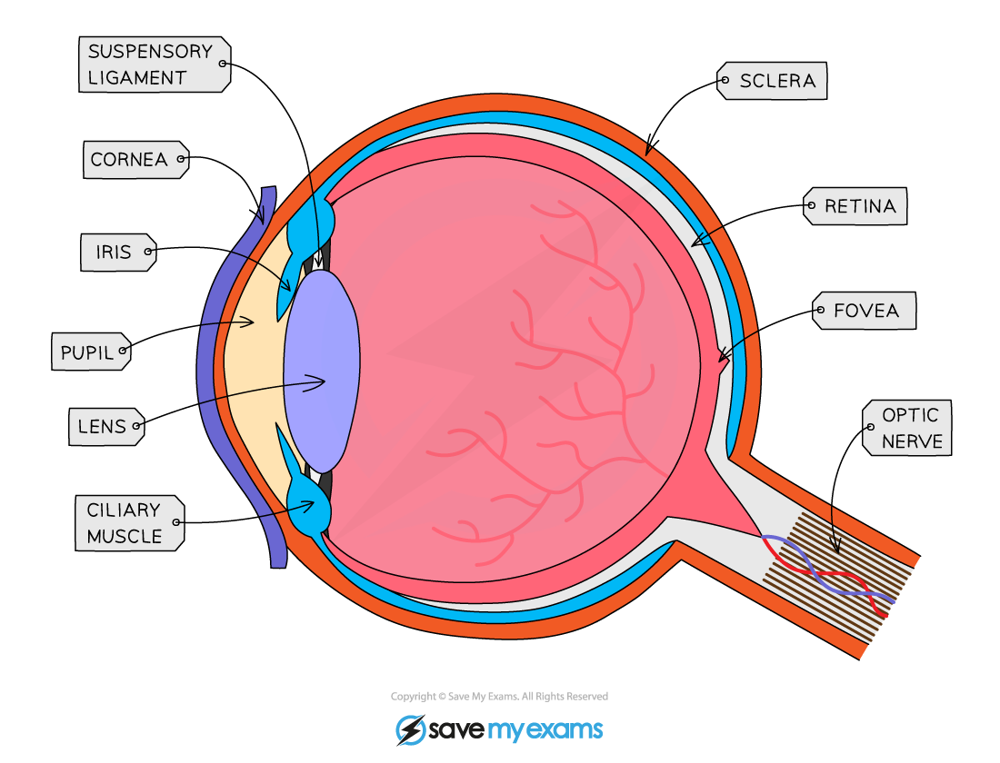
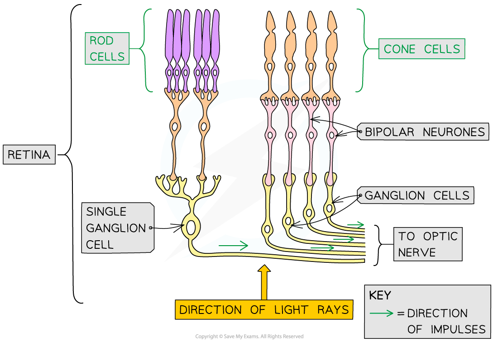

## Detection of Light

* The eye is a **sense organ** containing receptors sensitive to light intensity and wavelength

  + **Receptors** are specialised cells that can generate an electrical impulse in a sensory neurone when stimulated by a particular stimulus e.g. light receptors are stimulated when light falls on them
* Light enters the eye through the **pupil** and is focused onto a region of the **retina** called the **fovea**

  + The amount of light that enters the eye is controlled by the muscles of the**iris**
  + Light is focused using the **lens**, the shape of which is controlled by **ciliary** **muscles** attached to the lens by **suspensory ligaments**

    - The muscles change the shape of the lens to allow it to focus light reflected from objects at different distances from the eye
  + The fovea contains many **light receptors,** or **photoreceptors**
* The retina contains two types of photoreceptors

  + **Rod cells**

    - Primarily located around the **outer retina**
    - Sensitive to **light intensity** so can detect the presence and brightness of light
    - Images generated using information from only rod cells is **black and white**
  + **Cone cells**

    - Mostly found grouped together in the **fovea**
    - Sensitive to **different wavelengths** of visible light and so detect colour

      * Cone cells can be **red-sensitive, green-sensitive**, or **blue-sensitive**
      * The number of red-, green-, and blue-sensitive cone cells stimulated will **determine the colours seen**
    - Images generated using information from cone cells will be in **colour**
* Action potentials generated in the photoreceptor are transmitted to the brain via the **optic nerve**

  + The optic nerve leaves the back of the eye from a region known as the **blind spot**

    - The blind spot contains no photoreceptors

***The eye focuses light on the retina, which contains many light receptors***

#### Photoreceptors generate nerve impulses

* Photoreceptors in the eye generate action potentials when **stimulated** by **bright enough light** (rods), or by **light of a particular wavelength** (cones)
* **Light-sensitive pigments** inside the photoreceptors are **bleached** when light falls on them e.g.

  + Rod cells contain a light-sensitive pigment called **rhodopsin**
  + When light hits rhodopsin it **breaks apart** into constituent parts **retinal** and **opsin**
  + The breaking apart of rhodopsin is known as **bleaching**
* The bleaching of light-sensitive pigments causes a **chemical change** in the photoreceptor that results in the generation of a **nerve impulse**
* Nerve impulses travel along a **bipolar neurone** to the optic nerve, which carries information to the brain

***Information passes from rod and cone cells to the optic nerve via bipolar neurones. Note that you do not need to know about ganglion cells here***

#### The action of rod cells

* The way in which rod cells pass information to the optic nerve is a bit back-to-front in comparison to the action of other nerve cells; rather than initiating an action potential when they are **depolarised**, rod cells initiate action potentials in neighbouring bipolar neurones when they are **hyperpolarised**
* In the **dark** the following occurs inside rod cells

  + **Sodium ions** are actively pumped out of rod cells, generating a **concentration gradient**

    - Sodium ions (Na+) are **positively charged** ions, also known as **cations**
  + Sodium ions **diffuse** back down this concentration gradient into the rod cell via **sodium channels**

    - Sodium channels are also known as **cation channels** because they allow the movement of positively charged ions
  + At this stage there is little difference in charge between the outside and inside of the rod cell, and the cell is said to be **depolarised**

    - In reality the inside of the rod cell is **slightly negative** in comparison to the outside
  + The depolarised rod cell **releases neurotransmitters** which diffuse across a synapse to a **bipolar neurone**
  + Rather than initiating an action potential in the bipolar neurone **this neurotransmitter inhibits the generation of an action potential**, preventing a nerve impulse from being sent to the optic nerve

    - This neurotransmitter is said to be an **inhibitory neurotransmitter**
* In the **light** the following occurs inside rod cells

  + Light **bleaches rhodopsin**, causing it to break apart into retinal and opsin
  + The bleaching of rhodopsin causes the sodium ion channels in the cell surface membrane of the rod cell to **close**, **preventing sodium ions from diffusing** back into the rod cell

    - The active transport of sodium ions out of the cell is still taking place, so sodium ions are removed from the cell but not able to return
  + The lack of positively charged ions entering the rod cell causes its interior to become **more negative** until it reaches a **hyperpolarised state**

    - A membrane that is hyperpolarised has a **more negative** potential difference across it than the resting -70 mV
  + The hyperpolarised rod cell **stops releasing an inhibitory neurotransmitter**, so the generation of an action potential in the neighbouring bipolar neurone is **no longer inhibited**
  + An **action potential** is generated in the bipolar neurone attached to the rod cell and **an impulse is sent to the optic nerve**

***Rod cell membranes are depolarised in the dark and hyperpolarised in the light***