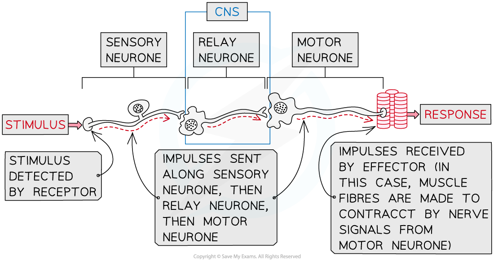
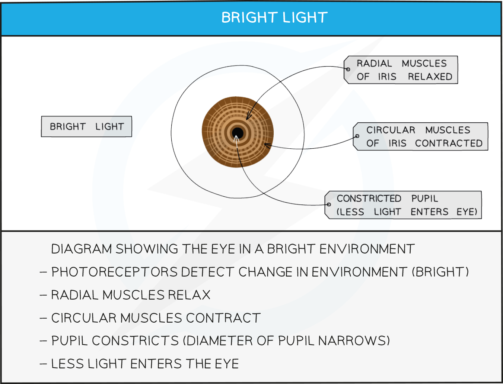
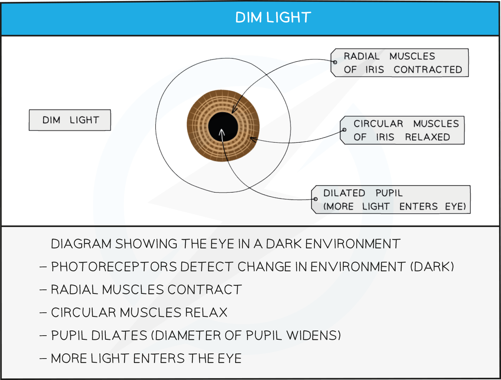

## Nervous System: Response to a Stimulus

* The nervous system enables the body to **detect changes in the environment** and brings about **appropriate responses** to ensure its safety

  + **Receptor cells** detect changes in the environment, or **stimuli**
  + Nerve impulses travel from the receptor cells along **sensory neurones** to the **central nervous system,** or CNS
  + The **CNS** acts as a **coordinating centre** for the impulses that arrive from the receptors, determining which part of the body needs to respond and sending out a new set of impulses along **motor neurones**
  + **Motor neurones send impulses** to the **effectors** to bring about a **response**

    - Effectors may be muscles or glands
* Nerve impulses pass through the nervous system along the following pathway

**stimulus**![rightwards arrow](data:image/svg+xml;charset=utf8,%3Csvg%20xmlns%3D%22http%3A%2F%2Fwww.w3.org%2F2000%2Fsvg%22%20xmlns%3Awrs%3D%22http%3A%2F%2Fwww.wiris.com%2Fxml%2Fmathml-extension%22%20height%3D%2219%22%20width%3D%2221%22%20wrs%3Abaseline%3D%2216%22%3E%3C!--MathML%3A%20%3Cmath%20xmlns%3D%22http%3A%2F%2Fwww.w3.org%2F1998%2FMath%2FMathML%22%3E%3Cmo%3E%26%23x2192%3B%3C%2Fmo%3E%3C%2Fmath%3E--%3E%3Cdefs%3E%3Cstyle%20type%3D%22text%2Fcss%22%3E%40font-face%7Bfont-family%3A'math12bba9f4124283edd644799e0ce'%3Bsrc%3Aurl(data%3Afont%2Ftruetype%3Bcharset%3Dutf-8%3Bbase64%2CAAEAAAAMAIAAAwBAT1MvMi7iBBMAAADMAAAATmNtYXDEvmKUAAABHAAAADRjdnQgDVUNBwAAAVAAAAA6Z2x5ZoPi2VsAAAGMAAAAcWhlYWQQC2qxAAACAAAAADZoaGVhCGsXSAAAAjgAAAAkaG10eE2rRkcAAAJcAAAACGxvY2EAHTwYAAACZAAAAAxtYXhwBT0FPgAAAnAAAAAgbmFtZaBxlY4AAAKQAAABn3Bvc3QB9wD6AAAEMAAAACBwcmVwa1uragAABFAAAAAUAAADSwGQAAUAAAQABAAAAAAABAAEAAAAAAAAAQEAAAAAAAAAAAAAAAAAAAAAAAAAAAAAAAAAAAAAACAgICAAAAAg1UADev96AAAD6ACWAAAAAAACAAEAAQAAABQAAwABAAAAFAAEACAAAAAEAAQAAQAAIZL%2F%2FwAAIZL%2F%2F95vAAEAAAAAAAABVAMsAIABAABWACoCWAIeAQ4BLAIsAFoBgAKAAKAA1ACAAAAAAAAAACsAVQCAAKsA1QEAASsABwAAAAIAVQAAAwADqwADAAcAADMRIRElIREhVQKr%2FasCAP4AA6v8VVUDAAABAIAAqgOAAlUACAAfALEAABMQsQAG5bEAARMQsAE8sQMP5bEHBfWxBQ%2F1MBMhJzUNATU3IYACK1YBK%2F7VVv3VAapBatXWa0AAAAAAAQAAAAEAANV4zkFfDzz1AAMEAP%2F%2F%2F%2F%2FWOhNz%2F%2F%2F%2F%2F9Y6E3MAAP8gBIADqwAAAAoAAgABAAAAAAABAAAD6P9qAAAXcAAA%2F7YEgAABAAAAAAAAAAAAAAAAAAAAAgNSAFUEAACAAAAAAAAAACgAAABxAAEAAAACAF4ABQAAAAAAAgCABAAAAAAABAAA3gAAAAAAAAAVAQIAAAAAAAAAAQASAAAAAAAAAAAAAgAOABIAAAAAAAAAAwAwACAAAAAAAAAABAASAFAAAAAAAAAABQAWAGIAAAAAAAAABgAJAHgAAAAAAAAACAAcAIEAAQAAAAAAAQASAAAAAQAAAAAAAgAOABIAAQAAAAAAAwAwACAAAQAAAAAABAASAFAAAQAAAAAABQAWAGIAAQAAAAAABgAJAHgAAQAAAAAACAAcAIEAAwABBAkAAQASAAAAAwABBAkAAgAOABIAAwABBAkAAwAwACAAAwABBAkABAASAFAAAwABBAkABQAWAGIAAwABBAkABgAJAHgAAwABBAkACAAcAIEATQBhAHQAaAAgAEYAbwBuAHQAUgBlAGcAdQBsAGEAcgBNAGEAdABoAHMAIABGAG8AcgAgAE0AbwByAGUAIABNAGEAdABoACAARgBvAG4AdABNAGEAdABoACAARgBvAG4AdABWAGUAcgBzAGkAbwBuACAAMQAuADBNYXRoX0ZvbnQATQBhAHQAaABzACAARgBvAHIAIABNAG8AcgBlAAADAAAAAAAAAfQA%2BgAAAAAAAAAAAAAAAAAAAAAAAAAAuQcRAACNhRgAsgAAABUUE7EAAT8%3D)format('truetype')%3Bfont-weight%3Anormal%3Bfont-style%3Anormal%3B%7D%3C%2Fstyle%3E%3C%2Fdefs%3E%3Ctext%20font-family%3D%22math12bba9f4124283edd644799e0ce%22%20font-size%3D%2216%22%20text-anchor%3D%22middle%22%20x%3D%2210.5%22%20y%3D%2216%22%3E%26%23x2192%3B%3C%2Ftext%3E%3C%2Fsvg%3E)**receptor**![rightwards arrow](data:image/svg+xml;charset=utf8,%3Csvg%20xmlns%3D%22http%3A%2F%2Fwww.w3.org%2F2000%2Fsvg%22%20xmlns%3Awrs%3D%22http%3A%2F%2Fwww.wiris.com%2Fxml%2Fmathml-extension%22%20height%3D%2219%22%20width%3D%2221%22%20wrs%3Abaseline%3D%2216%22%3E%3C!--MathML%3A%20%3Cmath%20xmlns%3D%22http%3A%2F%2Fwww.w3.org%2F1998%2FMath%2FMathML%22%3E%3Cmo%3E%26%23x2192%3B%3C%2Fmo%3E%3C%2Fmath%3E--%3E%3Cdefs%3E%3Cstyle%20type%3D%22text%2Fcss%22%3E%40font-face%7Bfont-family%3A'math12bba9f4124283edd644799e0ce'%3Bsrc%3Aurl(data%3Afont%2Ftruetype%3Bcharset%3Dutf-8%3Bbase64%2CAAEAAAAMAIAAAwBAT1MvMi7iBBMAAADMAAAATmNtYXDEvmKUAAABHAAAADRjdnQgDVUNBwAAAVAAAAA6Z2x5ZoPi2VsAAAGMAAAAcWhlYWQQC2qxAAACAAAAADZoaGVhCGsXSAAAAjgAAAAkaG10eE2rRkcAAAJcAAAACGxvY2EAHTwYAAACZAAAAAxtYXhwBT0FPgAAAnAAAAAgbmFtZaBxlY4AAAKQAAABn3Bvc3QB9wD6AAAEMAAAACBwcmVwa1uragAABFAAAAAUAAADSwGQAAUAAAQABAAAAAAABAAEAAAAAAAAAQEAAAAAAAAAAAAAAAAAAAAAAAAAAAAAAAAAAAAAACAgICAAAAAg1UADev96AAAD6ACWAAAAAAACAAEAAQAAABQAAwABAAAAFAAEACAAAAAEAAQAAQAAIZL%2F%2FwAAIZL%2F%2F95vAAEAAAAAAAABVAMsAIABAABWACoCWAIeAQ4BLAIsAFoBgAKAAKAA1ACAAAAAAAAAACsAVQCAAKsA1QEAASsABwAAAAIAVQAAAwADqwADAAcAADMRIRElIREhVQKr%2FasCAP4AA6v8VVUDAAABAIAAqgOAAlUACAAfALEAABMQsQAG5bEAARMQsAE8sQMP5bEHBfWxBQ%2F1MBMhJzUNATU3IYACK1YBK%2F7VVv3VAapBatXWa0AAAAAAAQAAAAEAANV4zkFfDzz1AAMEAP%2F%2F%2F%2F%2FWOhNz%2F%2F%2F%2F%2F9Y6E3MAAP8gBIADqwAAAAoAAgABAAAAAAABAAAD6P9qAAAXcAAA%2F7YEgAABAAAAAAAAAAAAAAAAAAAAAgNSAFUEAACAAAAAAAAAACgAAABxAAEAAAACAF4ABQAAAAAAAgCABAAAAAAABAAA3gAAAAAAAAAVAQIAAAAAAAAAAQASAAAAAAAAAAAAAgAOABIAAAAAAAAAAwAwACAAAAAAAAAABAASAFAAAAAAAAAABQAWAGIAAAAAAAAABgAJAHgAAAAAAAAACAAcAIEAAQAAAAAAAQASAAAAAQAAAAAAAgAOABIAAQAAAAAAAwAwACAAAQAAAAAABAASAFAAAQAAAAAABQAWAGIAAQAAAAAABgAJAHgAAQAAAAAACAAcAIEAAwABBAkAAQASAAAAAwABBAkAAgAOABIAAwABBAkAAwAwACAAAwABBAkABAASAFAAAwABBAkABQAWAGIAAwABBAkABgAJAHgAAwABBAkACAAcAIEATQBhAHQAaAAgAEYAbwBuAHQAUgBlAGcAdQBsAGEAcgBNAGEAdABoAHMAIABGAG8AcgAgAE0AbwByAGUAIABNAGEAdABoACAARgBvAG4AdABNAGEAdABoACAARgBvAG4AdABWAGUAcgBzAGkAbwBuACAAMQAuADBNYXRoX0ZvbnQATQBhAHQAaABzACAARgBvAHIAIABNAG8AcgBlAAADAAAAAAAAAfQA%2BgAAAAAAAAAAAAAAAAAAAAAAAAAAuQcRAACNhRgAsgAAABUUE7EAAT8%3D)format('truetype')%3Bfont-weight%3Anormal%3Bfont-style%3Anormal%3B%7D%3C%2Fstyle%3E%3C%2Fdefs%3E%3Ctext%20font-family%3D%22math12bba9f4124283edd644799e0ce%22%20font-size%3D%2216%22%20text-anchor%3D%22middle%22%20x%3D%2210.5%22%20y%3D%2216%22%3E%26%23x2192%3B%3C%2Ftext%3E%3C%2Fsvg%3E)**sensory neurone**![rightwards arrow](data:image/svg+xml;charset=utf8,%3Csvg%20xmlns%3D%22http%3A%2F%2Fwww.w3.org%2F2000%2Fsvg%22%20xmlns%3Awrs%3D%22http%3A%2F%2Fwww.wiris.com%2Fxml%2Fmathml-extension%22%20height%3D%2219%22%20width%3D%2221%22%20wrs%3Abaseline%3D%2216%22%3E%3C!--MathML%3A%20%3Cmath%20xmlns%3D%22http%3A%2F%2Fwww.w3.org%2F1998%2FMath%2FMathML%22%3E%3Cmo%3E%26%23x2192%3B%3C%2Fmo%3E%3C%2Fmath%3E--%3E%3Cdefs%3E%3Cstyle%20type%3D%22text%2Fcss%22%3E%40font-face%7Bfont-family%3A'math12bba9f4124283edd644799e0ce'%3Bsrc%3Aurl(data%3Afont%2Ftruetype%3Bcharset%3Dutf-8%3Bbase64%2CAAEAAAAMAIAAAwBAT1MvMi7iBBMAAADMAAAATmNtYXDEvmKUAAABHAAAADRjdnQgDVUNBwAAAVAAAAA6Z2x5ZoPi2VsAAAGMAAAAcWhlYWQQC2qxAAACAAAAADZoaGVhCGsXSAAAAjgAAAAkaG10eE2rRkcAAAJcAAAACGxvY2EAHTwYAAACZAAAAAxtYXhwBT0FPgAAAnAAAAAgbmFtZaBxlY4AAAKQAAABn3Bvc3QB9wD6AAAEMAAAACBwcmVwa1uragAABFAAAAAUAAADSwGQAAUAAAQABAAAAAAABAAEAAAAAAAAAQEAAAAAAAAAAAAAAAAAAAAAAAAAAAAAAAAAAAAAACAgICAAAAAg1UADev96AAAD6ACWAAAAAAACAAEAAQAAABQAAwABAAAAFAAEACAAAAAEAAQAAQAAIZL%2F%2FwAAIZL%2F%2F95vAAEAAAAAAAABVAMsAIABAABWACoCWAIeAQ4BLAIsAFoBgAKAAKAA1ACAAAAAAAAAACsAVQCAAKsA1QEAASsABwAAAAIAVQAAAwADqwADAAcAADMRIRElIREhVQKr%2FasCAP4AA6v8VVUDAAABAIAAqgOAAlUACAAfALEAABMQsQAG5bEAARMQsAE8sQMP5bEHBfWxBQ%2F1MBMhJzUNATU3IYACK1YBK%2F7VVv3VAapBatXWa0AAAAAAAQAAAAEAANV4zkFfDzz1AAMEAP%2F%2F%2F%2F%2FWOhNz%2F%2F%2F%2F%2F9Y6E3MAAP8gBIADqwAAAAoAAgABAAAAAAABAAAD6P9qAAAXcAAA%2F7YEgAABAAAAAAAAAAAAAAAAAAAAAgNSAFUEAACAAAAAAAAAACgAAABxAAEAAAACAF4ABQAAAAAAAgCABAAAAAAABAAA3gAAAAAAAAAVAQIAAAAAAAAAAQASAAAAAAAAAAAAAgAOABIAAAAAAAAAAwAwACAAAAAAAAAABAASAFAAAAAAAAAABQAWAGIAAAAAAAAABgAJAHgAAAAAAAAACAAcAIEAAQAAAAAAAQASAAAAAQAAAAAAAgAOABIAAQAAAAAAAwAwACAAAQAAAAAABAASAFAAAQAAAAAABQAWAGIAAQAAAAAABgAJAHgAAQAAAAAACAAcAIEAAwABBAkAAQASAAAAAwABBAkAAgAOABIAAwABBAkAAwAwACAAAwABBAkABAASAFAAAwABBAkABQAWAGIAAwABBAkABgAJAHgAAwABBAkACAAcAIEATQBhAHQAaAAgAEYAbwBuAHQAUgBlAGcAdQBsAGEAcgBNAGEAdABoAHMAIABGAG8AcgAgAE0AbwByAGUAIABNAGEAdABoACAARgBvAG4AdABNAGEAdABoACAARgBvAG4AdABWAGUAcgBzAGkAbwBuACAAMQAuADBNYXRoX0ZvbnQATQBhAHQAaABzACAARgBvAHIAIABNAG8AcgBlAAADAAAAAAAAAfQA%2BgAAAAAAAAAAAAAAAAAAAAAAAAAAuQcRAACNhRgAsgAAABUUE7EAAT8%3D)format('truetype')%3Bfont-weight%3Anormal%3Bfont-style%3Anormal%3B%7D%3C%2Fstyle%3E%3C%2Fdefs%3E%3Ctext%20font-family%3D%22math12bba9f4124283edd644799e0ce%22%20font-size%3D%2216%22%20text-anchor%3D%22middle%22%20x%3D%2210.5%22%20y%3D%2216%22%3E%26%23x2192%3B%3C%2Ftext%3E%3C%2Fsvg%3E)**CNS**![rightwards arrow](data:image/svg+xml;charset=utf8,%3Csvg%20xmlns%3D%22http%3A%2F%2Fwww.w3.org%2F2000%2Fsvg%22%20xmlns%3Awrs%3D%22http%3A%2F%2Fwww.wiris.com%2Fxml%2Fmathml-extension%22%20height%3D%2219%22%20width%3D%2221%22%20wrs%3Abaseline%3D%2216%22%3E%3C!--MathML%3A%20%3Cmath%20xmlns%3D%22http%3A%2F%2Fwww.w3.org%2F1998%2FMath%2FMathML%22%3E%3Cmo%3E%26%23x2192%3B%3C%2Fmo%3E%3C%2Fmath%3E--%3E%3Cdefs%3E%3Cstyle%20type%3D%22text%2Fcss%22%3E%40font-face%7Bfont-family%3A'math12bba9f4124283edd644799e0ce'%3Bsrc%3Aurl(data%3Afont%2Ftruetype%3Bcharset%3Dutf-8%3Bbase64%2CAAEAAAAMAIAAAwBAT1MvMi7iBBMAAADMAAAATmNtYXDEvmKUAAABHAAAADRjdnQgDVUNBwAAAVAAAAA6Z2x5ZoPi2VsAAAGMAAAAcWhlYWQQC2qxAAACAAAAADZoaGVhCGsXSAAAAjgAAAAkaG10eE2rRkcAAAJcAAAACGxvY2EAHTwYAAACZAAAAAxtYXhwBT0FPgAAAnAAAAAgbmFtZaBxlY4AAAKQAAABn3Bvc3QB9wD6AAAEMAAAACBwcmVwa1uragAABFAAAAAUAAADSwGQAAUAAAQABAAAAAAABAAEAAAAAAAAAQEAAAAAAAAAAAAAAAAAAAAAAAAAAAAAAAAAAAAAACAgICAAAAAg1UADev96AAAD6ACWAAAAAAACAAEAAQAAABQAAwABAAAAFAAEACAAAAAEAAQAAQAAIZL%2F%2FwAAIZL%2F%2F95vAAEAAAAAAAABVAMsAIABAABWACoCWAIeAQ4BLAIsAFoBgAKAAKAA1ACAAAAAAAAAACsAVQCAAKsA1QEAASsABwAAAAIAVQAAAwADqwADAAcAADMRIRElIREhVQKr%2FasCAP4AA6v8VVUDAAABAIAAqgOAAlUACAAfALEAABMQsQAG5bEAARMQsAE8sQMP5bEHBfWxBQ%2F1MBMhJzUNATU3IYACK1YBK%2F7VVv3VAapBatXWa0AAAAAAAQAAAAEAANV4zkFfDzz1AAMEAP%2F%2F%2F%2F%2FWOhNz%2F%2F%2F%2F%2F9Y6E3MAAP8gBIADqwAAAAoAAgABAAAAAAABAAAD6P9qAAAXcAAA%2F7YEgAABAAAAAAAAAAAAAAAAAAAAAgNSAFUEAACAAAAAAAAAACgAAABxAAEAAAACAF4ABQAAAAAAAgCABAAAAAAABAAA3gAAAAAAAAAVAQIAAAAAAAAAAQASAAAAAAAAAAAAAgAOABIAAAAAAAAAAwAwACAAAAAAAAAABAASAFAAAAAAAAAABQAWAGIAAAAAAAAABgAJAHgAAAAAAAAACAAcAIEAAQAAAAAAAQASAAAAAQAAAAAAAgAOABIAAQAAAAAAAwAwACAAAQAAAAAABAASAFAAAQAAAAAABQAWAGIAAQAAAAAABgAJAHgAAQAAAAAACAAcAIEAAwABBAkAAQASAAAAAwABBAkAAgAOABIAAwABBAkAAwAwACAAAwABBAkABAASAFAAAwABBAkABQAWAGIAAwABBAkABgAJAHgAAwABBAkACAAcAIEATQBhAHQAaAAgAEYAbwBuAHQAUgBlAGcAdQBsAGEAcgBNAGEAdABoAHMAIABGAG8AcgAgAE0AbwByAGUAIABNAGEAdABoACAARgBvAG4AdABNAGEAdABoACAARgBvAG4AdABWAGUAcgBzAGkAbwBuACAAMQAuADBNYXRoX0ZvbnQATQBhAHQAaABzACAARgBvAHIAIABNAG8AcgBlAAADAAAAAAAAAfQA%2BgAAAAAAAAAAAAAAAAAAAAAAAAAAuQcRAACNhRgAsgAAABUUE7EAAT8%3D)format('truetype')%3Bfont-weight%3Anormal%3Bfont-style%3Anormal%3B%7D%3C%2Fstyle%3E%3C%2Fdefs%3E%3Ctext%20font-family%3D%22math12bba9f4124283edd644799e0ce%22%20font-size%3D%2216%22%20text-anchor%3D%22middle%22%20x%3D%2210.5%22%20y%3D%2216%22%3E%26%23x2192%3B%3C%2Ftext%3E%3C%2Fsvg%3E)**motor neurone**![rightwards arrow](data:image/svg+xml;charset=utf8,%3Csvg%20xmlns%3D%22http%3A%2F%2Fwww.w3.org%2F2000%2Fsvg%22%20xmlns%3Awrs%3D%22http%3A%2F%2Fwww.wiris.com%2Fxml%2Fmathml-extension%22%20height%3D%2219%22%20width%3D%2221%22%20wrs%3Abaseline%3D%2216%22%3E%3C!--MathML%3A%20%3Cmath%20xmlns%3D%22http%3A%2F%2Fwww.w3.org%2F1998%2FMath%2FMathML%22%3E%3Cmo%3E%26%23x2192%3B%3C%2Fmo%3E%3C%2Fmath%3E--%3E%3Cdefs%3E%3Cstyle%20type%3D%22text%2Fcss%22%3E%40font-face%7Bfont-family%3A'math12bba9f4124283edd644799e0ce'%3Bsrc%3Aurl(data%3Afont%2Ftruetype%3Bcharset%3Dutf-8%3Bbase64%2CAAEAAAAMAIAAAwBAT1MvMi7iBBMAAADMAAAATmNtYXDEvmKUAAABHAAAADRjdnQgDVUNBwAAAVAAAAA6Z2x5ZoPi2VsAAAGMAAAAcWhlYWQQC2qxAAACAAAAADZoaGVhCGsXSAAAAjgAAAAkaG10eE2rRkcAAAJcAAAACGxvY2EAHTwYAAACZAAAAAxtYXhwBT0FPgAAAnAAAAAgbmFtZaBxlY4AAAKQAAABn3Bvc3QB9wD6AAAEMAAAACBwcmVwa1uragAABFAAAAAUAAADSwGQAAUAAAQABAAAAAAABAAEAAAAAAAAAQEAAAAAAAAAAAAAAAAAAAAAAAAAAAAAAAAAAAAAACAgICAAAAAg1UADev96AAAD6ACWAAAAAAACAAEAAQAAABQAAwABAAAAFAAEACAAAAAEAAQAAQAAIZL%2F%2FwAAIZL%2F%2F95vAAEAAAAAAAABVAMsAIABAABWACoCWAIeAQ4BLAIsAFoBgAKAAKAA1ACAAAAAAAAAACsAVQCAAKsA1QEAASsABwAAAAIAVQAAAwADqwADAAcAADMRIRElIREhVQKr%2FasCAP4AA6v8VVUDAAABAIAAqgOAAlUACAAfALEAABMQsQAG5bEAARMQsAE8sQMP5bEHBfWxBQ%2F1MBMhJzUNATU3IYACK1YBK%2F7VVv3VAapBatXWa0AAAAAAAQAAAAEAANV4zkFfDzz1AAMEAP%2F%2F%2F%2F%2FWOhNz%2F%2F%2F%2F%2F9Y6E3MAAP8gBIADqwAAAAoAAgABAAAAAAABAAAD6P9qAAAXcAAA%2F7YEgAABAAAAAAAAAAAAAAAAAAAAAgNSAFUEAACAAAAAAAAAACgAAABxAAEAAAACAF4ABQAAAAAAAgCABAAAAAAABAAA3gAAAAAAAAAVAQIAAAAAAAAAAQASAAAAAAAAAAAAAgAOABIAAAAAAAAAAwAwACAAAAAAAAAABAASAFAAAAAAAAAABQAWAGIAAAAAAAAABgAJAHgAAAAAAAAACAAcAIEAAQAAAAAAAQASAAAAAQAAAAAAAgAOABIAAQAAAAAAAwAwACAAAQAAAAAABAASAFAAAQAAAAAABQAWAGIAAQAAAAAABgAJAHgAAQAAAAAACAAcAIEAAwABBAkAAQASAAAAAwABBAkAAgAOABIAAwABBAkAAwAwACAAAwABBAkABAASAFAAAwABBAkABQAWAGIAAwABBAkABgAJAHgAAwABBAkACAAcAIEATQBhAHQAaAAgAEYAbwBuAHQAUgBlAGcAdQBsAGEAcgBNAGEAdABoAHMAIABGAG8AcgAgAE0AbwByAGUAIABNAGEAdABoACAARgBvAG4AdABNAGEAdABoACAARgBvAG4AdABWAGUAcgBzAGkAbwBuACAAMQAuADBNYXRoX0ZvbnQATQBhAHQAaABzACAARgBvAHIAIABNAG8AcgBlAAADAAAAAAAAAfQA%2BgAAAAAAAAAAAAAAAAAAAAAAAAAAuQcRAACNhRgAsgAAABUUE7EAAT8%3D)format('truetype')%3Bfont-weight%3Anormal%3Bfont-style%3Anormal%3B%7D%3C%2Fstyle%3E%3C%2Fdefs%3E%3Ctext%20font-family%3D%22math12bba9f4124283edd644799e0ce%22%20font-size%3D%2216%22%20text-anchor%3D%22middle%22%20x%3D%2210.5%22%20y%3D%2216%22%3E%26%23x2192%3B%3C%2Ftext%3E%3C%2Fsvg%3E)**effector**

***Receptors detect stimuli and impulses are sent through to nervous system to bring about a response in the effector***

## Pupil Response

* An example of a nerve pathway in action is the sequence of events that leads to a change in the diameter of the pupil in the eye

  + Changing pupil diameter enables the eye to control the amount of light hitting the retina
  + The diameter of the pupil in the eye is determined by two sets of muscles

    - The **circular muscles** contract to **constrict** the pupil
    - The **radial muscles** contract to **dilate** the pupil
  + The two sets of muscles work **antagonistically**, meaning that when one set of muscles contracts the other relaxes, and vice versa
* In **bright light** the following events occur

  **bright light**![rightwards arrow](data:image/svg+xml;charset=utf8,%3Csvg%20xmlns%3D%22http%3A%2F%2Fwww.w3.org%2F2000%2Fsvg%22%20xmlns%3Awrs%3D%22http%3A%2F%2Fwww.wiris.com%2Fxml%2Fmathml-extension%22%20height%3D%2219%22%20width%3D%2221%22%20wrs%3Abaseline%3D%2216%22%3E%3C!--MathML%3A%20%3Cmath%20xmlns%3D%22http%3A%2F%2Fwww.w3.org%2F1998%2FMath%2FMathML%22%3E%3Cmo%3E%26%23x2192%3B%3C%2Fmo%3E%3C%2Fmath%3E--%3E%3Cdefs%3E%3Cstyle%20type%3D%22text%2Fcss%22%3E%40font-face%7Bfont-family%3A'math12bba9f4124283edd644799e0ce'%3Bsrc%3Aurl(data%3Afont%2Ftruetype%3Bcharset%3Dutf-8%3Bbase64%2CAAEAAAAMAIAAAwBAT1MvMi7iBBMAAADMAAAATmNtYXDEvmKUAAABHAAAADRjdnQgDVUNBwAAAVAAAAA6Z2x5ZoPi2VsAAAGMAAAAcWhlYWQQC2qxAAACAAAAADZoaGVhCGsXSAAAAjgAAAAkaG10eE2rRkcAAAJcAAAACGxvY2EAHTwYAAACZAAAAAxtYXhwBT0FPgAAAnAAAAAgbmFtZaBxlY4AAAKQAAABn3Bvc3QB9wD6AAAEMAAAACBwcmVwa1uragAABFAAAAAUAAADSwGQAAUAAAQABAAAAAAABAAEAAAAAAAAAQEAAAAAAAAAAAAAAAAAAAAAAAAAAAAAAAAAAAAAACAgICAAAAAg1UADev96AAAD6ACWAAAAAAACAAEAAQAAABQAAwABAAAAFAAEACAAAAAEAAQAAQAAIZL%2F%2FwAAIZL%2F%2F95vAAEAAAAAAAABVAMsAIABAABWACoCWAIeAQ4BLAIsAFoBgAKAAKAA1ACAAAAAAAAAACsAVQCAAKsA1QEAASsABwAAAAIAVQAAAwADqwADAAcAADMRIRElIREhVQKr%2FasCAP4AA6v8VVUDAAABAIAAqgOAAlUACAAfALEAABMQsQAG5bEAARMQsAE8sQMP5bEHBfWxBQ%2F1MBMhJzUNATU3IYACK1YBK%2F7VVv3VAapBatXWa0AAAAAAAQAAAAEAANV4zkFfDzz1AAMEAP%2F%2F%2F%2F%2FWOhNz%2F%2F%2F%2F%2F9Y6E3MAAP8gBIADqwAAAAoAAgABAAAAAAABAAAD6P9qAAAXcAAA%2F7YEgAABAAAAAAAAAAAAAAAAAAAAAgNSAFUEAACAAAAAAAAAACgAAABxAAEAAAACAF4ABQAAAAAAAgCABAAAAAAABAAA3gAAAAAAAAAVAQIAAAAAAAAAAQASAAAAAAAAAAAAAgAOABIAAAAAAAAAAwAwACAAAAAAAAAABAASAFAAAAAAAAAABQAWAGIAAAAAAAAABgAJAHgAAAAAAAAACAAcAIEAAQAAAAAAAQASAAAAAQAAAAAAAgAOABIAAQAAAAAAAwAwACAAAQAAAAAABAASAFAAAQAAAAAABQAWAGIAAQAAAAAABgAJAHgAAQAAAAAACAAcAIEAAwABBAkAAQASAAAAAwABBAkAAgAOABIAAwABBAkAAwAwACAAAwABBAkABAASAFAAAwABBAkABQAWAGIAAwABBAkABgAJAHgAAwABBAkACAAcAIEATQBhAHQAaAAgAEYAbwBuAHQAUgBlAGcAdQBsAGEAcgBNAGEAdABoAHMAIABGAG8AcgAgAE0AbwByAGUAIABNAGEAdABoACAARgBvAG4AdABNAGEAdABoACAARgBvAG4AdABWAGUAcgBzAGkAbwBuACAAMQAuADBNYXRoX0ZvbnQATQBhAHQAaABzACAARgBvAHIAIABNAG8AcgBlAAADAAAAAAAAAfQA%2BgAAAAAAAAAAAAAAAAAAAAAAAAAAuQcRAACNhRgAsgAAABUUE7EAAT8%3D)format('truetype')%3Bfont-weight%3Anormal%3Bfont-style%3Anormal%3B%7D%3C%2Fstyle%3E%3C%2Fdefs%3E%3Ctext%20font-family%3D%22math12bba9f4124283edd644799e0ce%22%20font-size%3D%2216%22%20text-anchor%3D%22middle%22%20x%3D%2210.5%22%20y%3D%2216%22%3E%26%23x2192%3B%3C%2Ftext%3E%3C%2Fsvg%3E)**light receptors in eyes**![rightwards arrow](data:image/svg+xml;charset=utf8,%3Csvg%20xmlns%3D%22http%3A%2F%2Fwww.w3.org%2F2000%2Fsvg%22%20xmlns%3Awrs%3D%22http%3A%2F%2Fwww.wiris.com%2Fxml%2Fmathml-extension%22%20height%3D%2219%22%20width%3D%2221%22%20wrs%3Abaseline%3D%2216%22%3E%3C!--MathML%3A%20%3Cmath%20xmlns%3D%22http%3A%2F%2Fwww.w3.org%2F1998%2FMath%2FMathML%22%3E%3Cmo%3E%26%23x2192%3B%3C%2Fmo%3E%3C%2Fmath%3E--%3E%3Cdefs%3E%3Cstyle%20type%3D%22text%2Fcss%22%3E%40font-face%7Bfont-family%3A'math12bba9f4124283edd644799e0ce'%3Bsrc%3Aurl(data%3Afont%2Ftruetype%3Bcharset%3Dutf-8%3Bbase64%2CAAEAAAAMAIAAAwBAT1MvMi7iBBMAAADMAAAATmNtYXDEvmKUAAABHAAAADRjdnQgDVUNBwAAAVAAAAA6Z2x5ZoPi2VsAAAGMAAAAcWhlYWQQC2qxAAACAAAAADZoaGVhCGsXSAAAAjgAAAAkaG10eE2rRkcAAAJcAAAACGxvY2EAHTwYAAACZAAAAAxtYXhwBT0FPgAAAnAAAAAgbmFtZaBxlY4AAAKQAAABn3Bvc3QB9wD6AAAEMAAAACBwcmVwa1uragAABFAAAAAUAAADSwGQAAUAAAQABAAAAAAABAAEAAAAAAAAAQEAAAAAAAAAAAAAAAAAAAAAAAAAAAAAAAAAAAAAACAgICAAAAAg1UADev96AAAD6ACWAAAAAAACAAEAAQAAABQAAwABAAAAFAAEACAAAAAEAAQAAQAAIZL%2F%2FwAAIZL%2F%2F95vAAEAAAAAAAABVAMsAIABAABWACoCWAIeAQ4BLAIsAFoBgAKAAKAA1ACAAAAAAAAAACsAVQCAAKsA1QEAASsABwAAAAIAVQAAAwADqwADAAcAADMRIRElIREhVQKr%2FasCAP4AA6v8VVUDAAABAIAAqgOAAlUACAAfALEAABMQsQAG5bEAARMQsAE8sQMP5bEHBfWxBQ%2F1MBMhJzUNATU3IYACK1YBK%2F7VVv3VAapBatXWa0AAAAAAAQAAAAEAANV4zkFfDzz1AAMEAP%2F%2F%2F%2F%2FWOhNz%2F%2F%2F%2F%2F9Y6E3MAAP8gBIADqwAAAAoAAgABAAAAAAABAAAD6P9qAAAXcAAA%2F7YEgAABAAAAAAAAAAAAAAAAAAAAAgNSAFUEAACAAAAAAAAAACgAAABxAAEAAAACAF4ABQAAAAAAAgCABAAAAAAABAAA3gAAAAAAAAAVAQIAAAAAAAAAAQASAAAAAAAAAAAAAgAOABIAAAAAAAAAAwAwACAAAAAAAAAABAASAFAAAAAAAAAABQAWAGIAAAAAAAAABgAJAHgAAAAAAAAACAAcAIEAAQAAAAAAAQASAAAAAQAAAAAAAgAOABIAAQAAAAAAAwAwACAAAQAAAAAABAASAFAAAQAAAAAABQAWAGIAAQAAAAAABgAJAHgAAQAAAAAACAAcAIEAAwABBAkAAQASAAAAAwABBAkAAgAOABIAAwABBAkAAwAwACAAAwABBAkABAASAFAAAwABBAkABQAWAGIAAwABBAkABgAJAHgAAwABBAkACAAcAIEATQBhAHQAaAAgAEYAbwBuAHQAUgBlAGcAdQBsAGEAcgBNAGEAdABoAHMAIABGAG8AcgAgAE0AbwByAGUAIABNAGEAdABoACAARgBvAG4AdABNAGEAdABoACAARgBvAG4AdABWAGUAcgBzAGkAbwBuACAAMQAuADBNYXRoX0ZvbnQATQBhAHQAaABzACAARgBvAHIAIABNAG8AcgBlAAADAAAAAAAAAfQA%2BgAAAAAAAAAAAAAAAAAAAAAAAAAAuQcRAACNhRgAsgAAABUUE7EAAT8%3D)format('truetype')%3Bfont-weight%3Anormal%3Bfont-style%3Anormal%3B%7D%3C%2Fstyle%3E%3C%2Fdefs%3E%3Ctext%20font-family%3D%22math12bba9f4124283edd644799e0ce%22%20font-size%3D%2216%22%20text-anchor%3D%22middle%22%20x%3D%2210.5%22%20y%3D%2216%22%3E%26%23x2192%3B%3C%2Ftext%3E%3C%2Fsvg%3E)**sensory neurone**![rightwards arrow](data:image/svg+xml;charset=utf8,%3Csvg%20xmlns%3D%22http%3A%2F%2Fwww.w3.org%2F2000%2Fsvg%22%20xmlns%3Awrs%3D%22http%3A%2F%2Fwww.wiris.com%2Fxml%2Fmathml-extension%22%20height%3D%2219%22%20width%3D%2221%22%20wrs%3Abaseline%3D%2216%22%3E%3C!--MathML%3A%20%3Cmath%20xmlns%3D%22http%3A%2F%2Fwww.w3.org%2F1998%2FMath%2FMathML%22%3E%3Cmo%3E%26%23x2192%3B%3C%2Fmo%3E%3C%2Fmath%3E--%3E%3Cdefs%3E%3Cstyle%20type%3D%22text%2Fcss%22%3E%40font-face%7Bfont-family%3A'math12bba9f4124283edd644799e0ce'%3Bsrc%3Aurl(data%3Afont%2Ftruetype%3Bcharset%3Dutf-8%3Bbase64%2CAAEAAAAMAIAAAwBAT1MvMi7iBBMAAADMAAAATmNtYXDEvmKUAAABHAAAADRjdnQgDVUNBwAAAVAAAAA6Z2x5ZoPi2VsAAAGMAAAAcWhlYWQQC2qxAAACAAAAADZoaGVhCGsXSAAAAjgAAAAkaG10eE2rRkcAAAJcAAAACGxvY2EAHTwYAAACZAAAAAxtYXhwBT0FPgAAAnAAAAAgbmFtZaBxlY4AAAKQAAABn3Bvc3QB9wD6AAAEMAAAACBwcmVwa1uragAABFAAAAAUAAADSwGQAAUAAAQABAAAAAAABAAEAAAAAAAAAQEAAAAAAAAAAAAAAAAAAAAAAAAAAAAAAAAAAAAAACAgICAAAAAg1UADev96AAAD6ACWAAAAAAACAAEAAQAAABQAAwABAAAAFAAEACAAAAAEAAQAAQAAIZL%2F%2FwAAIZL%2F%2F95vAAEAAAAAAAABVAMsAIABAABWACoCWAIeAQ4BLAIsAFoBgAKAAKAA1ACAAAAAAAAAACsAVQCAAKsA1QEAASsABwAAAAIAVQAAAwADqwADAAcAADMRIRElIREhVQKr%2FasCAP4AA6v8VVUDAAABAIAAqgOAAlUACAAfALEAABMQsQAG5bEAARMQsAE8sQMP5bEHBfWxBQ%2F1MBMhJzUNATU3IYACK1YBK%2F7VVv3VAapBatXWa0AAAAAAAQAAAAEAANV4zkFfDzz1AAMEAP%2F%2F%2F%2F%2FWOhNz%2F%2F%2F%2F%2F9Y6E3MAAP8gBIADqwAAAAoAAgABAAAAAAABAAAD6P9qAAAXcAAA%2F7YEgAABAAAAAAAAAAAAAAAAAAAAAgNSAFUEAACAAAAAAAAAACgAAABxAAEAAAACAF4ABQAAAAAAAgCABAAAAAAABAAA3gAAAAAAAAAVAQIAAAAAAAAAAQASAAAAAAAAAAAAAgAOABIAAAAAAAAAAwAwACAAAAAAAAAABAASAFAAAAAAAAAABQAWAGIAAAAAAAAABgAJAHgAAAAAAAAACAAcAIEAAQAAAAAAAQASAAAAAQAAAAAAAgAOABIAAQAAAAAAAwAwACAAAQAAAAAABAASAFAAAQAAAAAABQAWAGIAAQAAAAAABgAJAHgAAQAAAAAACAAcAIEAAwABBAkAAQASAAAAAwABBAkAAgAOABIAAwABBAkAAwAwACAAAwABBAkABAASAFAAAwABBAkABQAWAGIAAwABBAkABgAJAHgAAwABBAkACAAcAIEATQBhAHQAaAAgAEYAbwBuAHQAUgBlAGcAdQBsAGEAcgBNAGEAdABoAHMAIABGAG8AcgAgAE0AbwByAGUAIABNAGEAdABoACAARgBvAG4AdABNAGEAdABoACAARgBvAG4AdABWAGUAcgBzAGkAbwBuACAAMQAuADBNYXRoX0ZvbnQATQBhAHQAaABzACAARgBvAHIAIABNAG8AcgBlAAADAAAAAAAAAfQA%2BgAAAAAAAAAAAAAAAAAAAAAAAAAAuQcRAACNhRgAsgAAABUUE7EAAT8%3D)format('truetype')%3Bfont-weight%3Anormal%3Bfont-style%3Anormal%3B%7D%3C%2Fstyle%3E%3C%2Fdefs%3E%3Ctext%20font-family%3D%22math12bba9f4124283edd644799e0ce%22%20font-size%3D%2216%22%20text-anchor%3D%22middle%22%20x%3D%2210.5%22%20y%3D%2216%22%3E%26%23x2192%3B%3C%2Ftext%3E%3C%2Fsvg%3E) **CNS**![rightwards arrow](data:image/svg+xml;charset=utf8,%3Csvg%20xmlns%3D%22http%3A%2F%2Fwww.w3.org%2F2000%2Fsvg%22%20xmlns%3Awrs%3D%22http%3A%2F%2Fwww.wiris.com%2Fxml%2Fmathml-extension%22%20height%3D%2219%22%20width%3D%2221%22%20wrs%3Abaseline%3D%2216%22%3E%3C!--MathML%3A%20%3Cmath%20xmlns%3D%22http%3A%2F%2Fwww.w3.org%2F1998%2FMath%2FMathML%22%3E%3Cmo%3E%26%23x2192%3B%3C%2Fmo%3E%3C%2Fmath%3E--%3E%3Cdefs%3E%3Cstyle%20type%3D%22text%2Fcss%22%3E%40font-face%7Bfont-family%3A'math12bba9f4124283edd644799e0ce'%3Bsrc%3Aurl(data%3Afont%2Ftruetype%3Bcharset%3Dutf-8%3Bbase64%2CAAEAAAAMAIAAAwBAT1MvMi7iBBMAAADMAAAATmNtYXDEvmKUAAABHAAAADRjdnQgDVUNBwAAAVAAAAA6Z2x5ZoPi2VsAAAGMAAAAcWhlYWQQC2qxAAACAAAAADZoaGVhCGsXSAAAAjgAAAAkaG10eE2rRkcAAAJcAAAACGxvY2EAHTwYAAACZAAAAAxtYXhwBT0FPgAAAnAAAAAgbmFtZaBxlY4AAAKQAAABn3Bvc3QB9wD6AAAEMAAAACBwcmVwa1uragAABFAAAAAUAAADSwGQAAUAAAQABAAAAAAABAAEAAAAAAAAAQEAAAAAAAAAAAAAAAAAAAAAAAAAAAAAAAAAAAAAACAgICAAAAAg1UADev96AAAD6ACWAAAAAAACAAEAAQAAABQAAwABAAAAFAAEACAAAAAEAAQAAQAAIZL%2F%2FwAAIZL%2F%2F95vAAEAAAAAAAABVAMsAIABAABWACoCWAIeAQ4BLAIsAFoBgAKAAKAA1ACAAAAAAAAAACsAVQCAAKsA1QEAASsABwAAAAIAVQAAAwADqwADAAcAADMRIRElIREhVQKr%2FasCAP4AA6v8VVUDAAABAIAAqgOAAlUACAAfALEAABMQsQAG5bEAARMQsAE8sQMP5bEHBfWxBQ%2F1MBMhJzUNATU3IYACK1YBK%2F7VVv3VAapBatXWa0AAAAAAAQAAAAEAANV4zkFfDzz1AAMEAP%2F%2F%2F%2F%2FWOhNz%2F%2F%2F%2F%2F9Y6E3MAAP8gBIADqwAAAAoAAgABAAAAAAABAAAD6P9qAAAXcAAA%2F7YEgAABAAAAAAAAAAAAAAAAAAAAAgNSAFUEAACAAAAAAAAAACgAAABxAAEAAAACAF4ABQAAAAAAAgCABAAAAAAABAAA3gAAAAAAAAAVAQIAAAAAAAAAAQASAAAAAAAAAAAAAgAOABIAAAAAAAAAAwAwACAAAAAAAAAABAASAFAAAAAAAAAABQAWAGIAAAAAAAAABgAJAHgAAAAAAAAACAAcAIEAAQAAAAAAAQASAAAAAQAAAAAAAgAOABIAAQAAAAAAAwAwACAAAQAAAAAABAASAFAAAQAAAAAABQAWAGIAAQAAAAAABgAJAHgAAQAAAAAACAAcAIEAAwABBAkAAQASAAAAAwABBAkAAgAOABIAAwABBAkAAwAwACAAAwABBAkABAASAFAAAwABBAkABQAWAGIAAwABBAkABgAJAHgAAwABBAkACAAcAIEATQBhAHQAaAAgAEYAbwBuAHQAUgBlAGcAdQBsAGEAcgBNAGEAdABoAHMAIABGAG8AcgAgAE0AbwByAGUAIABNAGEAdABoACAARgBvAG4AdABNAGEAdABoACAARgBvAG4AdABWAGUAcgBzAGkAbwBuACAAMQAuADBNYXRoX0ZvbnQATQBhAHQAaABzACAARgBvAHIAIABNAG8AcgBlAAADAAAAAAAAAfQA%2BgAAAAAAAAAAAAAAAAAAAAAAAAAAuQcRAACNhRgAsgAAABUUE7EAAT8%3D)format('truetype')%3Bfont-weight%3Anormal%3Bfont-style%3Anormal%3B%7D%3C%2Fstyle%3E%3C%2Fdefs%3E%3Ctext%20font-family%3D%22math12bba9f4124283edd644799e0ce%22%20font-size%3D%2216%22%20text-anchor%3D%22middle%22%20x%3D%2210.5%22%20y%3D%2216%22%3E%26%23x2192%3B%3C%2Ftext%3E%3C%2Fsvg%3E)**motor neurone**![rightwards arrow](data:image/svg+xml;charset=utf8,%3Csvg%20xmlns%3D%22http%3A%2F%2Fwww.w3.org%2F2000%2Fsvg%22%20xmlns%3Awrs%3D%22http%3A%2F%2Fwww.wiris.com%2Fxml%2Fmathml-extension%22%20height%3D%2219%22%20width%3D%2221%22%20wrs%3Abaseline%3D%2216%22%3E%3C!--MathML%3A%20%3Cmath%20xmlns%3D%22http%3A%2F%2Fwww.w3.org%2F1998%2FMath%2FMathML%22%3E%3Cmo%3E%26%23x2192%3B%3C%2Fmo%3E%3C%2Fmath%3E--%3E%3Cdefs%3E%3Cstyle%20type%3D%22text%2Fcss%22%3E%40font-face%7Bfont-family%3A'math12bba9f4124283edd644799e0ce'%3Bsrc%3Aurl(data%3Afont%2Ftruetype%3Bcharset%3Dutf-8%3Bbase64%2CAAEAAAAMAIAAAwBAT1MvMi7iBBMAAADMAAAATmNtYXDEvmKUAAABHAAAADRjdnQgDVUNBwAAAVAAAAA6Z2x5ZoPi2VsAAAGMAAAAcWhlYWQQC2qxAAACAAAAADZoaGVhCGsXSAAAAjgAAAAkaG10eE2rRkcAAAJcAAAACGxvY2EAHTwYAAACZAAAAAxtYXhwBT0FPgAAAnAAAAAgbmFtZaBxlY4AAAKQAAABn3Bvc3QB9wD6AAAEMAAAACBwcmVwa1uragAABFAAAAAUAAADSwGQAAUAAAQABAAAAAAABAAEAAAAAAAAAQEAAAAAAAAAAAAAAAAAAAAAAAAAAAAAAAAAAAAAACAgICAAAAAg1UADev96AAAD6ACWAAAAAAACAAEAAQAAABQAAwABAAAAFAAEACAAAAAEAAQAAQAAIZL%2F%2FwAAIZL%2F%2F95vAAEAAAAAAAABVAMsAIABAABWACoCWAIeAQ4BLAIsAFoBgAKAAKAA1ACAAAAAAAAAACsAVQCAAKsA1QEAASsABwAAAAIAVQAAAwADqwADAAcAADMRIRElIREhVQKr%2FasCAP4AA6v8VVUDAAABAIAAqgOAAlUACAAfALEAABMQsQAG5bEAARMQsAE8sQMP5bEHBfWxBQ%2F1MBMhJzUNATU3IYACK1YBK%2F7VVv3VAapBatXWa0AAAAAAAQAAAAEAANV4zkFfDzz1AAMEAP%2F%2F%2F%2F%2FWOhNz%2F%2F%2F%2F%2F9Y6E3MAAP8gBIADqwAAAAoAAgABAAAAAAABAAAD6P9qAAAXcAAA%2F7YEgAABAAAAAAAAAAAAAAAAAAAAAgNSAFUEAACAAAAAAAAAACgAAABxAAEAAAACAF4ABQAAAAAAAgCABAAAAAAABAAA3gAAAAAAAAAVAQIAAAAAAAAAAQASAAAAAAAAAAAAAgAOABIAAAAAAAAAAwAwACAAAAAAAAAABAASAFAAAAAAAAAABQAWAGIAAAAAAAAABgAJAHgAAAAAAAAACAAcAIEAAQAAAAAAAQASAAAAAQAAAAAAAgAOABIAAQAAAAAAAwAwACAAAQAAAAAABAASAFAAAQAAAAAABQAWAGIAAQAAAAAABgAJAHgAAQAAAAAACAAcAIEAAwABBAkAAQASAAAAAwABBAkAAgAOABIAAwABBAkAAwAwACAAAwABBAkABAASAFAAAwABBAkABQAWAGIAAwABBAkABgAJAHgAAwABBAkACAAcAIEATQBhAHQAaAAgAEYAbwBuAHQAUgBlAGcAdQBsAGEAcgBNAGEAdABoAHMAIABGAG8AcgAgAE0AbwByAGUAIABNAGEAdABoACAARgBvAG4AdABNAGEAdABoACAARgBvAG4AdABWAGUAcgBzAGkAbwBuACAAMQAuADBNYXRoX0ZvbnQATQBhAHQAaABzACAARgBvAHIAIABNAG8AcgBlAAADAAAAAAAAAfQA%2BgAAAAAAAAAAAAAAAAAAAAAAAAAAuQcRAACNhRgAsgAAABUUE7EAAT8%3D)format('truetype')%3Bfont-weight%3Anormal%3Bfont-style%3Anormal%3B%7D%3C%2Fstyle%3E%3C%2Fdefs%3E%3Ctext%20font-family%3D%22math12bba9f4124283edd644799e0ce%22%20font-size%3D%2216%22%20text-anchor%3D%22middle%22%20x%3D%2210.5%22%20y%3D%2216%22%3E%26%23x2192%3B%3C%2Ftext%3E%3C%2Fsvg%3E) **circular muscles in iris**

  + Contraction of the circular muscles in the iris of the eye causes the pupil to **constrict**
  + This limits the amount of light entering the eye and **prevents damage to the retina**
* In **low light** the following events occur

  **low light**![rightwards arrow](data:image/svg+xml;charset=utf8,%3Csvg%20xmlns%3D%22http%3A%2F%2Fwww.w3.org%2F2000%2Fsvg%22%20xmlns%3Awrs%3D%22http%3A%2F%2Fwww.wiris.com%2Fxml%2Fmathml-extension%22%20height%3D%2219%22%20width%3D%2221%22%20wrs%3Abaseline%3D%2216%22%3E%3C!--MathML%3A%20%3Cmath%20xmlns%3D%22http%3A%2F%2Fwww.w3.org%2F1998%2FMath%2FMathML%22%3E%3Cmo%3E%26%23x2192%3B%3C%2Fmo%3E%3C%2Fmath%3E--%3E%3Cdefs%3E%3Cstyle%20type%3D%22text%2Fcss%22%3E%40font-face%7Bfont-family%3A'math12bba9f4124283edd644799e0ce'%3Bsrc%3Aurl(data%3Afont%2Ftruetype%3Bcharset%3Dutf-8%3Bbase64%2CAAEAAAAMAIAAAwBAT1MvMi7iBBMAAADMAAAATmNtYXDEvmKUAAABHAAAADRjdnQgDVUNBwAAAVAAAAA6Z2x5ZoPi2VsAAAGMAAAAcWhlYWQQC2qxAAACAAAAADZoaGVhCGsXSAAAAjgAAAAkaG10eE2rRkcAAAJcAAAACGxvY2EAHTwYAAACZAAAAAxtYXhwBT0FPgAAAnAAAAAgbmFtZaBxlY4AAAKQAAABn3Bvc3QB9wD6AAAEMAAAACBwcmVwa1uragAABFAAAAAUAAADSwGQAAUAAAQABAAAAAAABAAEAAAAAAAAAQEAAAAAAAAAAAAAAAAAAAAAAAAAAAAAAAAAAAAAACAgICAAAAAg1UADev96AAAD6ACWAAAAAAACAAEAAQAAABQAAwABAAAAFAAEACAAAAAEAAQAAQAAIZL%2F%2FwAAIZL%2F%2F95vAAEAAAAAAAABVAMsAIABAABWACoCWAIeAQ4BLAIsAFoBgAKAAKAA1ACAAAAAAAAAACsAVQCAAKsA1QEAASsABwAAAAIAVQAAAwADqwADAAcAADMRIRElIREhVQKr%2FasCAP4AA6v8VVUDAAABAIAAqgOAAlUACAAfALEAABMQsQAG5bEAARMQsAE8sQMP5bEHBfWxBQ%2F1MBMhJzUNATU3IYACK1YBK%2F7VVv3VAapBatXWa0AAAAAAAQAAAAEAANV4zkFfDzz1AAMEAP%2F%2F%2F%2F%2FWOhNz%2F%2F%2F%2F%2F9Y6E3MAAP8gBIADqwAAAAoAAgABAAAAAAABAAAD6P9qAAAXcAAA%2F7YEgAABAAAAAAAAAAAAAAAAAAAAAgNSAFUEAACAAAAAAAAAACgAAABxAAEAAAACAF4ABQAAAAAAAgCABAAAAAAABAAA3gAAAAAAAAAVAQIAAAAAAAAAAQASAAAAAAAAAAAAAgAOABIAAAAAAAAAAwAwACAAAAAAAAAABAASAFAAAAAAAAAABQAWAGIAAAAAAAAABgAJAHgAAAAAAAAACAAcAIEAAQAAAAAAAQASAAAAAQAAAAAAAgAOABIAAQAAAAAAAwAwACAAAQAAAAAABAASAFAAAQAAAAAABQAWAGIAAQAAAAAABgAJAHgAAQAAAAAACAAcAIEAAwABBAkAAQASAAAAAwABBAkAAgAOABIAAwABBAkAAwAwACAAAwABBAkABAASAFAAAwABBAkABQAWAGIAAwABBAkABgAJAHgAAwABBAkACAAcAIEATQBhAHQAaAAgAEYAbwBuAHQAUgBlAGcAdQBsAGEAcgBNAGEAdABoAHMAIABGAG8AcgAgAE0AbwByAGUAIABNAGEAdABoACAARgBvAG4AdABNAGEAdABoACAARgBvAG4AdABWAGUAcgBzAGkAbwBuACAAMQAuADBNYXRoX0ZvbnQATQBhAHQAaABzACAARgBvAHIAIABNAG8AcgBlAAADAAAAAAAAAfQA%2BgAAAAAAAAAAAAAAAAAAAAAAAAAAuQcRAACNhRgAsgAAABUUE7EAAT8%3D)format('truetype')%3Bfont-weight%3Anormal%3Bfont-style%3Anormal%3B%7D%3C%2Fstyle%3E%3C%2Fdefs%3E%3Ctext%20font-family%3D%22math12bba9f4124283edd644799e0ce%22%20font-size%3D%2216%22%20text-anchor%3D%22middle%22%20x%3D%2210.5%22%20y%3D%2216%22%3E%26%23x2192%3B%3C%2Ftext%3E%3C%2Fsvg%3E)**light receptors in eyes**![rightwards arrow](data:image/svg+xml;charset=utf8,%3Csvg%20xmlns%3D%22http%3A%2F%2Fwww.w3.org%2F2000%2Fsvg%22%20xmlns%3Awrs%3D%22http%3A%2F%2Fwww.wiris.com%2Fxml%2Fmathml-extension%22%20height%3D%2219%22%20width%3D%2221%22%20wrs%3Abaseline%3D%2216%22%3E%3C!--MathML%3A%20%3Cmath%20xmlns%3D%22http%3A%2F%2Fwww.w3.org%2F1998%2FMath%2FMathML%22%3E%3Cmo%3E%26%23x2192%3B%3C%2Fmo%3E%3C%2Fmath%3E--%3E%3Cdefs%3E%3Cstyle%20type%3D%22text%2Fcss%22%3E%40font-face%7Bfont-family%3A'math12bba9f4124283edd644799e0ce'%3Bsrc%3Aurl(data%3Afont%2Ftruetype%3Bcharset%3Dutf-8%3Bbase64%2CAAEAAAAMAIAAAwBAT1MvMi7iBBMAAADMAAAATmNtYXDEvmKUAAABHAAAADRjdnQgDVUNBwAAAVAAAAA6Z2x5ZoPi2VsAAAGMAAAAcWhlYWQQC2qxAAACAAAAADZoaGVhCGsXSAAAAjgAAAAkaG10eE2rRkcAAAJcAAAACGxvY2EAHTwYAAACZAAAAAxtYXhwBT0FPgAAAnAAAAAgbmFtZaBxlY4AAAKQAAABn3Bvc3QB9wD6AAAEMAAAACBwcmVwa1uragAABFAAAAAUAAADSwGQAAUAAAQABAAAAAAABAAEAAAAAAAAAQEAAAAAAAAAAAAAAAAAAAAAAAAAAAAAAAAAAAAAACAgICAAAAAg1UADev96AAAD6ACWAAAAAAACAAEAAQAAABQAAwABAAAAFAAEACAAAAAEAAQAAQAAIZL%2F%2FwAAIZL%2F%2F95vAAEAAAAAAAABVAMsAIABAABWACoCWAIeAQ4BLAIsAFoBgAKAAKAA1ACAAAAAAAAAACsAVQCAAKsA1QEAASsABwAAAAIAVQAAAwADqwADAAcAADMRIRElIREhVQKr%2FasCAP4AA6v8VVUDAAABAIAAqgOAAlUACAAfALEAABMQsQAG5bEAARMQsAE8sQMP5bEHBfWxBQ%2F1MBMhJzUNATU3IYACK1YBK%2F7VVv3VAapBatXWa0AAAAAAAQAAAAEAANV4zkFfDzz1AAMEAP%2F%2F%2F%2F%2FWOhNz%2F%2F%2F%2F%2F9Y6E3MAAP8gBIADqwAAAAoAAgABAAAAAAABAAAD6P9qAAAXcAAA%2F7YEgAABAAAAAAAAAAAAAAAAAAAAAgNSAFUEAACAAAAAAAAAACgAAABxAAEAAAACAF4ABQAAAAAAAgCABAAAAAAABAAA3gAAAAAAAAAVAQIAAAAAAAAAAQASAAAAAAAAAAAAAgAOABIAAAAAAAAAAwAwACAAAAAAAAAABAASAFAAAAAAAAAABQAWAGIAAAAAAAAABgAJAHgAAAAAAAAACAAcAIEAAQAAAAAAAQASAAAAAQAAAAAAAgAOABIAAQAAAAAAAwAwACAAAQAAAAAABAASAFAAAQAAAAAABQAWAGIAAQAAAAAABgAJAHgAAQAAAAAACAAcAIEAAwABBAkAAQASAAAAAwABBAkAAgAOABIAAwABBAkAAwAwACAAAwABBAkABAASAFAAAwABBAkABQAWAGIAAwABBAkABgAJAHgAAwABBAkACAAcAIEATQBhAHQAaAAgAEYAbwBuAHQAUgBlAGcAdQBsAGEAcgBNAGEAdABoAHMAIABGAG8AcgAgAE0AbwByAGUAIABNAGEAdABoACAARgBvAG4AdABNAGEAdABoACAARgBvAG4AdABWAGUAcgBzAGkAbwBuACAAMQAuADBNYXRoX0ZvbnQATQBhAHQAaABzACAARgBvAHIAIABNAG8AcgBlAAADAAAAAAAAAfQA%2BgAAAAAAAAAAAAAAAAAAAAAAAAAAuQcRAACNhRgAsgAAABUUE7EAAT8%3D)format('truetype')%3Bfont-weight%3Anormal%3Bfont-style%3Anormal%3B%7D%3C%2Fstyle%3E%3C%2Fdefs%3E%3Ctext%20font-family%3D%22math12bba9f4124283edd644799e0ce%22%20font-size%3D%2216%22%20text-anchor%3D%22middle%22%20x%3D%2210.5%22%20y%3D%2216%22%3E%26%23x2192%3B%3C%2Ftext%3E%3C%2Fsvg%3E)**sensory neurone** ![rightwards arrow](data:image/svg+xml;charset=utf8,%3Csvg%20xmlns%3D%22http%3A%2F%2Fwww.w3.org%2F2000%2Fsvg%22%20xmlns%3Awrs%3D%22http%3A%2F%2Fwww.wiris.com%2Fxml%2Fmathml-extension%22%20height%3D%2219%22%20width%3D%2221%22%20wrs%3Abaseline%3D%2216%22%3E%3C!--MathML%3A%20%3Cmath%20xmlns%3D%22http%3A%2F%2Fwww.w3.org%2F1998%2FMath%2FMathML%22%3E%3Cmo%3E%26%23x2192%3B%3C%2Fmo%3E%3C%2Fmath%3E--%3E%3Cdefs%3E%3Cstyle%20type%3D%22text%2Fcss%22%3E%40font-face%7Bfont-family%3A'math12bba9f4124283edd644799e0ce'%3Bsrc%3Aurl(data%3Afont%2Ftruetype%3Bcharset%3Dutf-8%3Bbase64%2CAAEAAAAMAIAAAwBAT1MvMi7iBBMAAADMAAAATmNtYXDEvmKUAAABHAAAADRjdnQgDVUNBwAAAVAAAAA6Z2x5ZoPi2VsAAAGMAAAAcWhlYWQQC2qxAAACAAAAADZoaGVhCGsXSAAAAjgAAAAkaG10eE2rRkcAAAJcAAAACGxvY2EAHTwYAAACZAAAAAxtYXhwBT0FPgAAAnAAAAAgbmFtZaBxlY4AAAKQAAABn3Bvc3QB9wD6AAAEMAAAACBwcmVwa1uragAABFAAAAAUAAADSwGQAAUAAAQABAAAAAAABAAEAAAAAAAAAQEAAAAAAAAAAAAAAAAAAAAAAAAAAAAAAAAAAAAAACAgICAAAAAg1UADev96AAAD6ACWAAAAAAACAAEAAQAAABQAAwABAAAAFAAEACAAAAAEAAQAAQAAIZL%2F%2FwAAIZL%2F%2F95vAAEAAAAAAAABVAMsAIABAABWACoCWAIeAQ4BLAIsAFoBgAKAAKAA1ACAAAAAAAAAACsAVQCAAKsA1QEAASsABwAAAAIAVQAAAwADqwADAAcAADMRIRElIREhVQKr%2FasCAP4AA6v8VVUDAAABAIAAqgOAAlUACAAfALEAABMQsQAG5bEAARMQsAE8sQMP5bEHBfWxBQ%2F1MBMhJzUNATU3IYACK1YBK%2F7VVv3VAapBatXWa0AAAAAAAQAAAAEAANV4zkFfDzz1AAMEAP%2F%2F%2F%2F%2FWOhNz%2F%2F%2F%2F%2F9Y6E3MAAP8gBIADqwAAAAoAAgABAAAAAAABAAAD6P9qAAAXcAAA%2F7YEgAABAAAAAAAAAAAAAAAAAAAAAgNSAFUEAACAAAAAAAAAACgAAABxAAEAAAACAF4ABQAAAAAAAgCABAAAAAAABAAA3gAAAAAAAAAVAQIAAAAAAAAAAQASAAAAAAAAAAAAAgAOABIAAAAAAAAAAwAwACAAAAAAAAAABAASAFAAAAAAAAAABQAWAGIAAAAAAAAABgAJAHgAAAAAAAAACAAcAIEAAQAAAAAAAQASAAAAAQAAAAAAAgAOABIAAQAAAAAAAwAwACAAAQAAAAAABAASAFAAAQAAAAAABQAWAGIAAQAAAAAABgAJAHgAAQAAAAAACAAcAIEAAwABBAkAAQASAAAAAwABBAkAAgAOABIAAwABBAkAAwAwACAAAwABBAkABAASAFAAAwABBAkABQAWAGIAAwABBAkABgAJAHgAAwABBAkACAAcAIEATQBhAHQAaAAgAEYAbwBuAHQAUgBlAGcAdQBsAGEAcgBNAGEAdABoAHMAIABGAG8AcgAgAE0AbwByAGUAIABNAGEAdABoACAARgBvAG4AdABNAGEAdABoACAARgBvAG4AdABWAGUAcgBzAGkAbwBuACAAMQAuADBNYXRoX0ZvbnQATQBhAHQAaABzACAARgBvAHIAIABNAG8AcgBlAAADAAAAAAAAAfQA%2BgAAAAAAAAAAAAAAAAAAAAAAAAAAuQcRAACNhRgAsgAAABUUE7EAAT8%3D)format('truetype')%3Bfont-weight%3Anormal%3Bfont-style%3Anormal%3B%7D%3C%2Fstyle%3E%3C%2Fdefs%3E%3Ctext%20font-family%3D%22math12bba9f4124283edd644799e0ce%22%20font-size%3D%2216%22%20text-anchor%3D%22middle%22%20x%3D%2210.5%22%20y%3D%2216%22%3E%26%23x2192%3B%3C%2Ftext%3E%3C%2Fsvg%3E)**CNS**![rightwards arrow](data:image/svg+xml;charset=utf8,%3Csvg%20xmlns%3D%22http%3A%2F%2Fwww.w3.org%2F2000%2Fsvg%22%20xmlns%3Awrs%3D%22http%3A%2F%2Fwww.wiris.com%2Fxml%2Fmathml-extension%22%20height%3D%2219%22%20width%3D%2221%22%20wrs%3Abaseline%3D%2216%22%3E%3C!--MathML%3A%20%3Cmath%20xmlns%3D%22http%3A%2F%2Fwww.w3.org%2F1998%2FMath%2FMathML%22%3E%3Cmo%3E%26%23x2192%3B%3C%2Fmo%3E%3C%2Fmath%3E--%3E%3Cdefs%3E%3Cstyle%20type%3D%22text%2Fcss%22%3E%40font-face%7Bfont-family%3A'math12bba9f4124283edd644799e0ce'%3Bsrc%3Aurl(data%3Afont%2Ftruetype%3Bcharset%3Dutf-8%3Bbase64%2CAAEAAAAMAIAAAwBAT1MvMi7iBBMAAADMAAAATmNtYXDEvmKUAAABHAAAADRjdnQgDVUNBwAAAVAAAAA6Z2x5ZoPi2VsAAAGMAAAAcWhlYWQQC2qxAAACAAAAADZoaGVhCGsXSAAAAjgAAAAkaG10eE2rRkcAAAJcAAAACGxvY2EAHTwYAAACZAAAAAxtYXhwBT0FPgAAAnAAAAAgbmFtZaBxlY4AAAKQAAABn3Bvc3QB9wD6AAAEMAAAACBwcmVwa1uragAABFAAAAAUAAADSwGQAAUAAAQABAAAAAAABAAEAAAAAAAAAQEAAAAAAAAAAAAAAAAAAAAAAAAAAAAAAAAAAAAAACAgICAAAAAg1UADev96AAAD6ACWAAAAAAACAAEAAQAAABQAAwABAAAAFAAEACAAAAAEAAQAAQAAIZL%2F%2FwAAIZL%2F%2F95vAAEAAAAAAAABVAMsAIABAABWACoCWAIeAQ4BLAIsAFoBgAKAAKAA1ACAAAAAAAAAACsAVQCAAKsA1QEAASsABwAAAAIAVQAAAwADqwADAAcAADMRIRElIREhVQKr%2FasCAP4AA6v8VVUDAAABAIAAqgOAAlUACAAfALEAABMQsQAG5bEAARMQsAE8sQMP5bEHBfWxBQ%2F1MBMhJzUNATU3IYACK1YBK%2F7VVv3VAapBatXWa0AAAAAAAQAAAAEAANV4zkFfDzz1AAMEAP%2F%2F%2F%2F%2FWOhNz%2F%2F%2F%2F%2F9Y6E3MAAP8gBIADqwAAAAoAAgABAAAAAAABAAAD6P9qAAAXcAAA%2F7YEgAABAAAAAAAAAAAAAAAAAAAAAgNSAFUEAACAAAAAAAAAACgAAABxAAEAAAACAF4ABQAAAAAAAgCABAAAAAAABAAA3gAAAAAAAAAVAQIAAAAAAAAAAQASAAAAAAAAAAAAAgAOABIAAAAAAAAAAwAwACAAAAAAAAAABAASAFAAAAAAAAAABQAWAGIAAAAAAAAABgAJAHgAAAAAAAAACAAcAIEAAQAAAAAAAQASAAAAAQAAAAAAAgAOABIAAQAAAAAAAwAwACAAAQAAAAAABAASAFAAAQAAAAAABQAWAGIAAQAAAAAABgAJAHgAAQAAAAAACAAcAIEAAwABBAkAAQASAAAAAwABBAkAAgAOABIAAwABBAkAAwAwACAAAwABBAkABAASAFAAAwABBAkABQAWAGIAAwABBAkABgAJAHgAAwABBAkACAAcAIEATQBhAHQAaAAgAEYAbwBuAHQAUgBlAGcAdQBsAGEAcgBNAGEAdABoAHMAIABGAG8AcgAgAE0AbwByAGUAIABNAGEAdABoACAARgBvAG4AdABNAGEAdABoACAARgBvAG4AdABWAGUAcgBzAGkAbwBuACAAMQAuADBNYXRoX0ZvbnQATQBhAHQAaABzACAARgBvAHIAIABNAG8AcgBlAAADAAAAAAAAAfQA%2BgAAAAAAAAAAAAAAAAAAAAAAAAAAuQcRAACNhRgAsgAAABUUE7EAAT8%3D)format('truetype')%3Bfont-weight%3Anormal%3Bfont-style%3Anormal%3B%7D%3C%2Fstyle%3E%3C%2Fdefs%3E%3Ctext%20font-family%3D%22math12bba9f4124283edd644799e0ce%22%20font-size%3D%2216%22%20text-anchor%3D%22middle%22%20x%3D%2210.5%22%20y%3D%2216%22%3E%26%23x2192%3B%3C%2Ftext%3E%3C%2Fsvg%3E)**motor neurone** ![rightwards arrow](data:image/svg+xml;charset=utf8,%3Csvg%20xmlns%3D%22http%3A%2F%2Fwww.w3.org%2F2000%2Fsvg%22%20xmlns%3Awrs%3D%22http%3A%2F%2Fwww.wiris.com%2Fxml%2Fmathml-extension%22%20height%3D%2219%22%20width%3D%2221%22%20wrs%3Abaseline%3D%2216%22%3E%3C!--MathML%3A%20%3Cmath%20xmlns%3D%22http%3A%2F%2Fwww.w3.org%2F1998%2FMath%2FMathML%22%3E%3Cmo%3E%26%23x2192%3B%3C%2Fmo%3E%3C%2Fmath%3E--%3E%3Cdefs%3E%3Cstyle%20type%3D%22text%2Fcss%22%3E%40font-face%7Bfont-family%3A'math12bba9f4124283edd644799e0ce'%3Bsrc%3Aurl(data%3Afont%2Ftruetype%3Bcharset%3Dutf-8%3Bbase64%2CAAEAAAAMAIAAAwBAT1MvMi7iBBMAAADMAAAATmNtYXDEvmKUAAABHAAAADRjdnQgDVUNBwAAAVAAAAA6Z2x5ZoPi2VsAAAGMAAAAcWhlYWQQC2qxAAACAAAAADZoaGVhCGsXSAAAAjgAAAAkaG10eE2rRkcAAAJcAAAACGxvY2EAHTwYAAACZAAAAAxtYXhwBT0FPgAAAnAAAAAgbmFtZaBxlY4AAAKQAAABn3Bvc3QB9wD6AAAEMAAAACBwcmVwa1uragAABFAAAAAUAAADSwGQAAUAAAQABAAAAAAABAAEAAAAAAAAAQEAAAAAAAAAAAAAAAAAAAAAAAAAAAAAAAAAAAAAACAgICAAAAAg1UADev96AAAD6ACWAAAAAAACAAEAAQAAABQAAwABAAAAFAAEACAAAAAEAAQAAQAAIZL%2F%2FwAAIZL%2F%2F95vAAEAAAAAAAABVAMsAIABAABWACoCWAIeAQ4BLAIsAFoBgAKAAKAA1ACAAAAAAAAAACsAVQCAAKsA1QEAASsABwAAAAIAVQAAAwADqwADAAcAADMRIRElIREhVQKr%2FasCAP4AA6v8VVUDAAABAIAAqgOAAlUACAAfALEAABMQsQAG5bEAARMQsAE8sQMP5bEHBfWxBQ%2F1MBMhJzUNATU3IYACK1YBK%2F7VVv3VAapBatXWa0AAAAAAAQAAAAEAANV4zkFfDzz1AAMEAP%2F%2F%2F%2F%2FWOhNz%2F%2F%2F%2F%2F9Y6E3MAAP8gBIADqwAAAAoAAgABAAAAAAABAAAD6P9qAAAXcAAA%2F7YEgAABAAAAAAAAAAAAAAAAAAAAAgNSAFUEAACAAAAAAAAAACgAAABxAAEAAAACAF4ABQAAAAAAAgCABAAAAAAABAAA3gAAAAAAAAAVAQIAAAAAAAAAAQASAAAAAAAAAAAAAgAOABIAAAAAAAAAAwAwACAAAAAAAAAABAASAFAAAAAAAAAABQAWAGIAAAAAAAAABgAJAHgAAAAAAAAACAAcAIEAAQAAAAAAAQASAAAAAQAAAAAAAgAOABIAAQAAAAAAAwAwACAAAQAAAAAABAASAFAAAQAAAAAABQAWAGIAAQAAAAAABgAJAHgAAQAAAAAACAAcAIEAAwABBAkAAQASAAAAAwABBAkAAgAOABIAAwABBAkAAwAwACAAAwABBAkABAASAFAAAwABBAkABQAWAGIAAwABBAkABgAJAHgAAwABBAkACAAcAIEATQBhAHQAaAAgAEYAbwBuAHQAUgBlAGcAdQBsAGEAcgBNAGEAdABoAHMAIABGAG8AcgAgAE0AbwByAGUAIABNAGEAdABoACAARgBvAG4AdABNAGEAdABoACAARgBvAG4AdABWAGUAcgBzAGkAbwBuACAAMQAuADBNYXRoX0ZvbnQATQBhAHQAaABzACAARgBvAHIAIABNAG8AcgBlAAADAAAAAAAAAfQA%2BgAAAAAAAAAAAAAAAAAAAAAAAAAAuQcRAACNhRgAsgAAABUUE7EAAT8%3D)format('truetype')%3Bfont-weight%3Anormal%3Bfont-style%3Anormal%3B%7D%3C%2Fstyle%3E%3C%2Fdefs%3E%3Ctext%20font-family%3D%22math12bba9f4124283edd644799e0ce%22%20font-size%3D%2216%22%20text-anchor%3D%22middle%22%20x%3D%2210.5%22%20y%3D%2216%22%3E%26%23x2192%3B%3C%2Ftext%3E%3C%2Fsvg%3E)**radial muscles in iris**

  + Contraction of the radial muscles in the iris of the eye causes the pupil to **dilate**
  + This **maximises the amount of light entering the eye**, improving vision

***The muscles in the eye respond to light levels due to nerve impulses generated by light receptors in the eye***