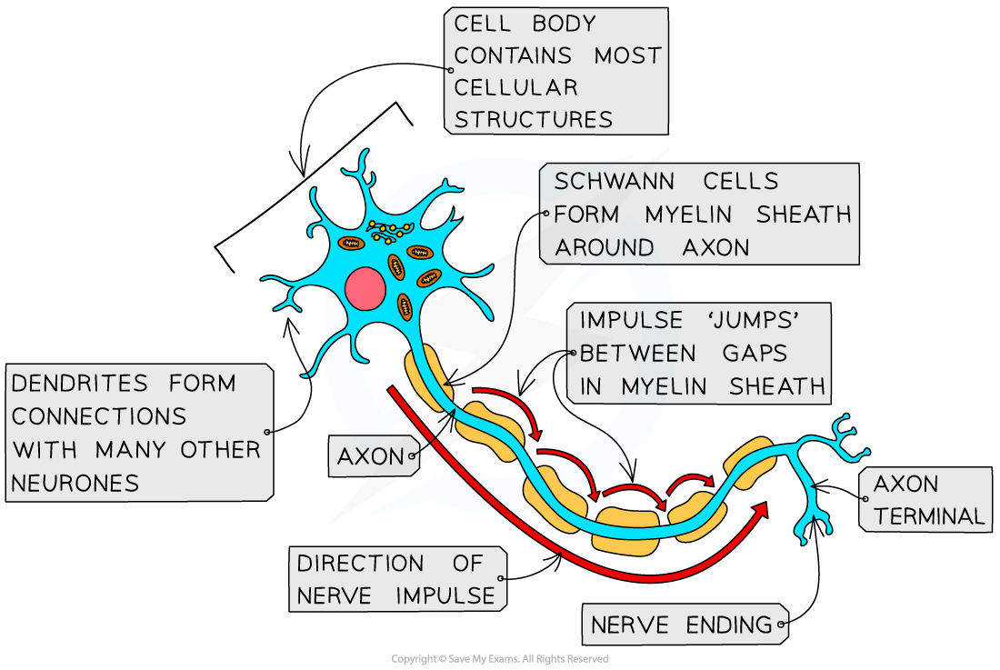
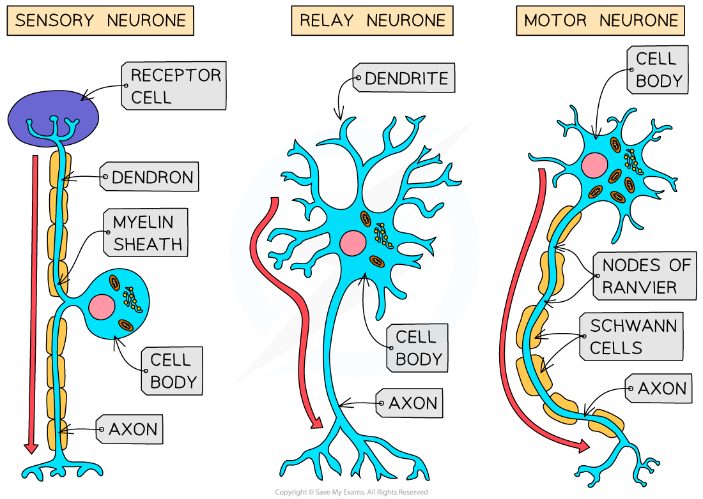

## Neurones: Structure & Function

* **Neurones** are specialised cells of the nervous system which carry **electrical impulses** around the body
* A bundle of neurones is known as a **nerve**
* There are different types of neurones, but the following features are found in all types

  + A **long fibre** known as an **axon**
  + A **cell body** that contains the **nucleus** and other cellular structures
  + The end of the axon, known as the **axon terminal,** has many nerve endings

    - The nerve endings at the axon terminals allow neurones to **connect** to and **receive impulses from** other **neurones**, forming a **network** for easy **communication**
* Some neurones are**myelinated**, meaning that their axon is **insulated** by a fatty layer known as the **myelin sheath**

  + The myelin sheath is made up of specialised cells known as **Schwann cells**which wrap themselves around the axon
  + There are **uninsulated gaps** between the Schwann cells known as the **nodes of Ranvier**
  + Electrical impulses in myelinated cells do not travel down the whole axon, but jump from one **node** to the next, speeding up impulse transmission
* In**non-myelinated neurones** the axon is not insulated by Schwann cells

  + The impulse travels more slowly as it moves through the entire length of the axon

***Neurones have a long axon, a cell body, and an axon terminal, and some neurones are myelinated***

* There are **three main types**of neurones

  + **Sensory neurones** carry impulses from **receptors** to the brain and spinal cord in the **CNS**
  + **Relay neurones** are found entirely within the CNS and **connect** **sensory** and **motor** neurones
  + **Motor** **neurones** carry impulses from the **CNS** to **effector**muscles or glands
* Each type of neurone has a **slightly different structure**

  + **Motor neurones**

    - A large **cell body at one end** that lies within the spinal cord or brain
    - Many highly-branched **dendrites** extending from the cell body, providing many connections with the axon terminals of other neurones
  + **Relay neurones**

    - Short neurones with axons and highly branched dendrites
  + **Sensory neurones**

    - A**cell body** that branches off in the **middle** of the axon
    - The dendrites are attached to a **receptor cell**
    - The section of neurone that links the axon terminal (at the receptors) with the cell body is known as a **dendron**; it delivers the electrical impulse to the cell body
    - The section of neurone that connects the cell body with the CNS is the **axon**

***Different types of neurone differ in both structure and function***