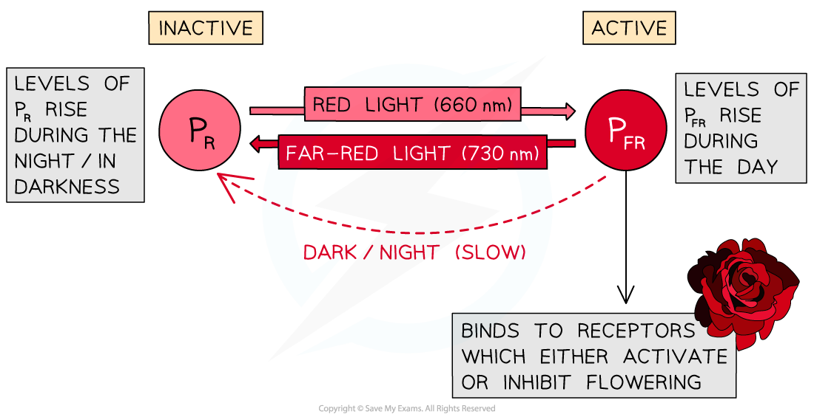

## Phytochrome

* Flowering in plants is controlled by the **stimulus** of night length

  + Nights are shorter during the spring and summer and longer in the autumn and winter
  + Some plants flower when nights are short and some flower when nights are long
* When the nights reach a certain length, genes that control flowering may be **switched on or off,**leading to the**activation or inhibition of flowering**

  + Genes that are switched on **are** **expressed**, leading to **production of the polypeptides** for which they code, while genes that are switched off **are not expressed**, so the polypeptides for which they code **are not produced**
* The length of night can be detected by a plant because it determines the quantities of different forms of a pigment called **phytochrome**in the leaf

#### Phytochrome

* The phytochrome pigment exists in two forms

  + **P****R**is the **inactive form** of phytochrome, it absorbs light from the **red** part of the spectrum (wavelength 660 nm)
  + **P****FR**is the **active form** of phytochrome, it absorbs light from the **far red** part of the spectrum (wavelength 730 nm)
* Absorption of different wavelengths of light causes a **reversible** **conversion between the P****R****and P****FR** forms of phytochrome

  + When **P****R****absorbs red light** (660 nm) **it is converted into P****FR**
  + When **P****FR****absorbs far red light** (730 nm)**it is converted back into P****R**
  + In the **absence of red light,**the unstable **P****FR****gradually converts back into P****R**
* **During the day**levels of **P****FR**rise

  + Sunlight contains more wavelengths at 660 nm than 730 so the conversion from PR to PFR occurs more rapidly in the daytime than the conversion from PFRto PR
* **During the night**levels of **P****R**rise

  + Red light wavelengths are not available in the darkness and PFRconverts slowly back to PR

***PR is converted to PFR in a reversible reaction which controls flowering***

#### E.g. long day plants

* Long day plants flower when the nights are **short**e.g. in summer

  + When nights are short, the **day length is longer**, hence the term 'long day plants'
* In **long day plants** high levels of the **active form of phytochrome activate flowering**
* Flowering occurs due to the following process

  + Days are long so **P****R****is converted to P****FR****at a greater rate** than PFRis converted to PR
  + The **active form of phytochrome**, PFR, is present at **high levels**
  + High levels of PFR**activate flowering**

    - PFR activates expression of genes that stimulate flowering
    - The active gene is transcribed and translated
    - The resulting protein causes flowers to be produced rather than stems and leaves