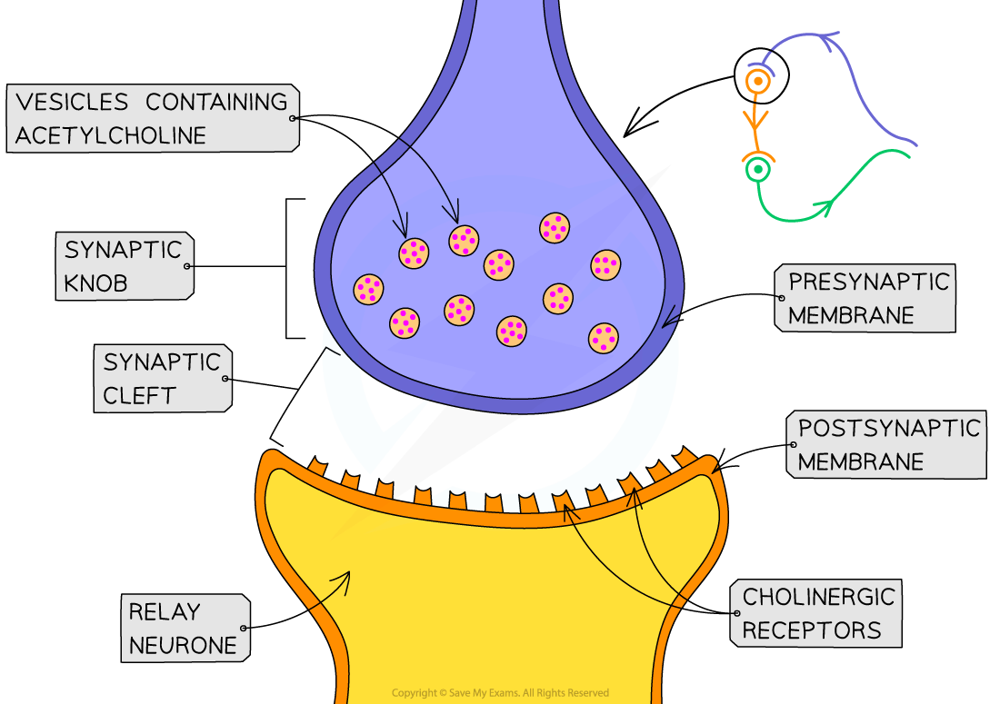
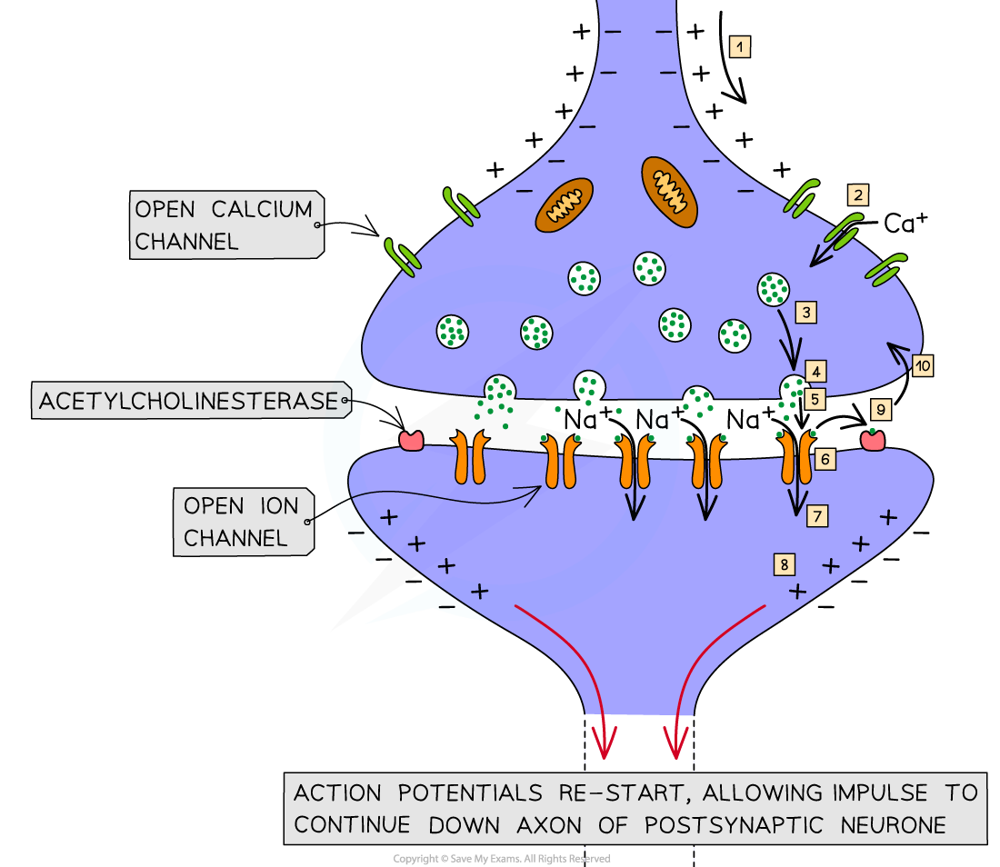

## Synapses: Structure & Function

* Structures known as**synapses** are found at the **junctions between cells in the nervous system** e.g.

  + In the sense organs there are synapses between **sensory receptor cells** and **sensory neurones**
  + In muscles there are synapses between **motor neurones** and **muscle fibres**
* The structure of a synapse includes the following features

  + A gap between the neurones known as the **synaptic cleft**
  + The neurone before the synapse is known as the **presynaptic neurone** and has a rounded end known as the **synaptic knob**
  + The neurone after the synapse is known as the **postsynaptic neurone**
  + Nerve impulses are passed across the synaptic cleft by the **diffusion of chemicals** known as **neurotransmitters** e.g. acetylcholine

    - Neurotransmitters are contained within vesicles in the synaptic knob

***Synapses are the junctions between neurones e.g. between a sensory neurone and a relay neurone***

#### Synaptic transmission

* Electrical impulses cannot ‘jump’ across the synaptic cleft
* When an action potential arrives at the end of the axon of the **presynaptic neurone** the **membrane** becomes depolarised, causing **voltage gated calcium ion channels** to open
* **Calcium ions** diffuse into the synaptic knob via **calcium ion channels** in the membrane
* The calcium ions cause vesicles in the synaptic knob to move towards the presynaptic membrane where they fuse with it and **release chemical messengers** called **neurotransmitters** into the synaptic cleft by exocytosis

  + A common neurotransmitter is**acetylcholine**, or **ACh**
* The neurotransmitters **diffuse** across the **synaptic cleft** and**bind with receptor molecules** on the **postsynaptic membrane**; this causes associated **sodium ion channels** on the postsynaptic membrane to open, allowing **sodium ions** to diffuse into the postsynaptic cell
* If enough neurotransmitter molecules bind with receptors on the postsynaptic membrane then an **action potential** is generated, which then travels down the **axon** of the **postsynaptic neurone**

  + Whether or not an action potential is generated depends on whether or not **threshold potential** is reached, which in turn depends on the **number of action potentials arriving at the presynaptic knob**

    - Many action potentials will cause more neurotransmitter to be released by exocytosis
    - A large amount of neurotransmitter will cause many sodium ion channels to open
    - Many sodium ion channels opening will allow a large influx of sodium ions, increasing the likelihood of threshold being reached
* The neurotransmitters are then **broken down** to prevent continued stimulation of the postsynaptic neurone

  + The enzyme that breaks down acetylcholine is **acetylcholinesterase**

***Impulses are transmitted across the synaptic cleft by the diffusion of neurotransmitters such as acetylcholine***

#### Additional roles of synapses

* Synapses enable

  + **Unidirectionality** of impulse transmission

    - Synapses ensure the **one-way transmission** of impulses
    - Impulses can only pass in **one direction** at synapses because **neurotransmitter is released on one side** and its **receptors are on the other;** chemical transmission cannot occur in the opposite direction
  + **Divergence** of nerve impulses

    - One neurone can connect to **several other neurones** at a synapse, allowing nerve signals to be sent in several directions from a single presynaptic neurone
  + **Amplification** of nerve signals by **summation**

    - When an impulse arrives at a synapse it **does not always** cause an impulse to be generated in the next neurone; a **single impulse** that arrives at a synaptic knob may be **insufficient** to generate an action potential in the post-synaptic neurone

      * Only a small amount of acetylcholine may release into the synaptic cleft
      * A small number of sodium ion channels are opened in the postsynaptic axon membrane
      * An insufficient number of sodium ions pass through the membrane
      * The threshold potential is not reached
    - The effect of multiple impulses can be added together to overcome this in a process known as **summation**
    - Summation can be achieved by

      * **Several presynaptic neurones** converging to meet a single postsynaptic neurone

        + This is known as **synaptic convergence**
      * **Many action potentials** arriving at a postsynaptic knob in quick succession