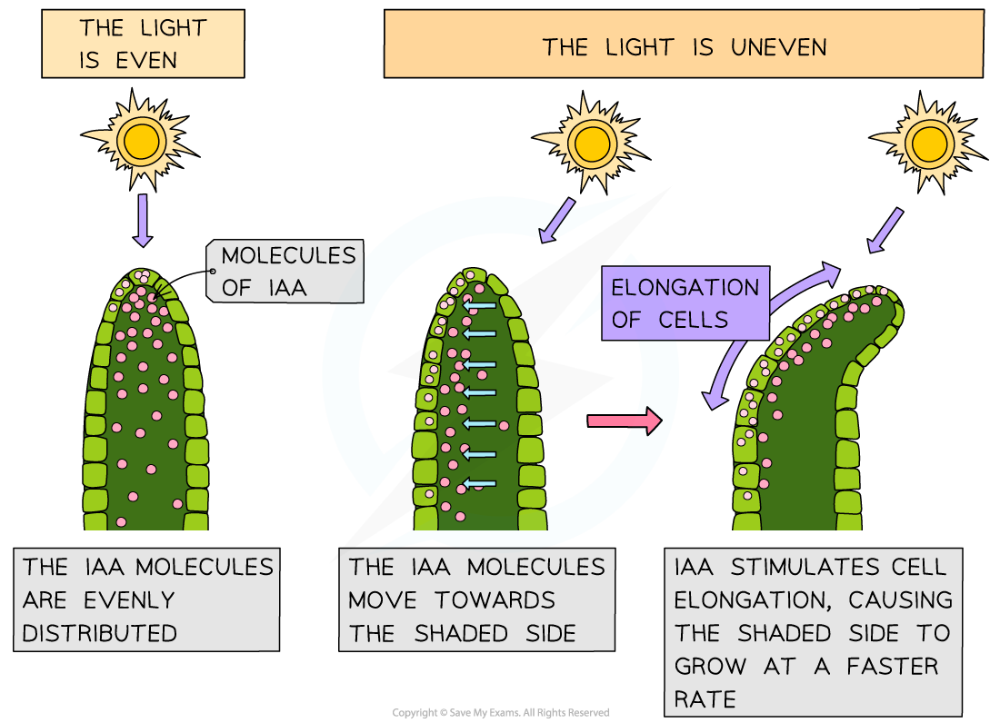
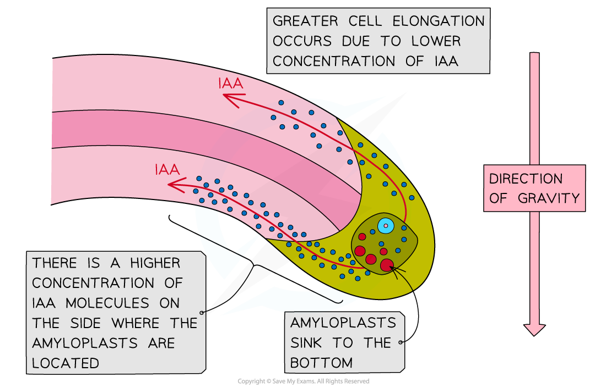

## The Effects of IAA

* Just like animals, the survival of plants is dependent on their ability to **respond to changes** in their environment; this **maximises their survival chances** e.g.

  + Growing towards light **maximises the rate of photosynthesis** and therefore glucose production
  + Producing harmful or foul-tasting chemicals in response to being eaten by a herbivore **reduces the likelihood of being eaten**
  + Roots growing towards water **maximises the plant's ability to gain water**
* Plants can respond to **several types of stimuli** e.g.

  + Light
  + Gravity
  + Physical objects
  + Herbivory
  + Water
  + Physical touch
* Plants can respond to stimuli in various ways, including by **altering their growth**

  + E.g. a seedling will bend and grow towards the light because there is more growth on the shaded side than on the illuminated side
* This type of **directional** **growth response** is referred to as a **tropism**

  + Phototropism is a growth response to**light**
  + Geotropism is a growth response to **gravity**

    - The response to gravity is also known as gravitropism
* Tropisms can be **positive** or **negative**

  + Positive tropisms involve growth **towards** a stimulus

    - E.g. positive phototropism is a growth response towards light
  + Negative tropisms involve growth **away from** a stimulus

    - E.g. negative geotropism is a growth responseaway from gravity i.e. upwards

#### Plant growth factors

* The growth responses of plants rely on chemical substances that are released in response to a stimulus
* These chemical **growth factors** act in a similar way to the hormones that are found in animals

  + Plant growth factors are sometimes referred to as **plant hormones** as they are **chemical messengers**
* Growth factors are produced in the growing parts of a plant before moving **from the growing regions to other tissues** where they **regulate cell growth** in response to a directional stimulus

  + E.g. **auxin** is a growth factor that **stimulates cell elongation in plant shoots** and **inhibits growth in cells in plant roots**
* Other examples of plant hormones along with some of their regulatory roles include

  + **Giberellins**

    - Stem elongation
    - Flowering
    - Seed germination
  + **Cytokinins**

    - Cell growth and division
  + **Abscisic** **acid** (ABA)

    - Leaf loss
    - Seed dormancy
  + **Ethene**

    - Fruit ripening
    - Flowering

#### Indoleacetic acid

* **Indoleacetic acid**, or **IAA,** is a type of **auxin**

  + **Auxins** are a group of plant growth factors that influence many aspects of plant growth
* It is thought that **IAA brings about plant responses** such as phototropism by **altering the** transcription **of genes inside plant cells**

  + Altering the expression of genes that code for proteins involved with cell growth can affect the growth of a plant
* IAA is produced by cells in the growing parts of a plant before it is **redistributed** to other plant tissues

  + IAA can be transported from cell to cell by **diffusion and active transport**
  + Transport of IAA over longer distances occurs in the **phloem**
* The redistribution of IAA is affected by **environmental stimuli** such as light and gravity, leading to an uneven distribution of IAA in different parts of the plant

  + This brings about **uneven plant growth**

#### IAA in plant shoots

* Light affects the growth of plant shoots in a response known as **phototropism**
* The **concentration of IAA** determines the **rate of cell elongation** within the stem

  + A **higher concentration of IAA**causes an **increase** in the rate of cell elongation
  + If the concentration of IAA is **not uniform** across the stem then **uneven cell growth** can occur
* When light shines on a stem from one side, IAA is transported**from the illuminated side of a shoot to the shaded side**
* An **IAA gradient** is established, with **more on the shaded side** and **less on the illuminated side**
* The higher concentration of auxin on the shaded side of the shoot causes a **faster rate of cell elongation**, and the shoot bends towards the source of light

***IAA stimulates cell elongation in shoots***

#### IAA in roots

* Roots respond to gravity in a response known as **geotropism**
* In roots, **IAA concentration also affects cell elongation**, but higher concentrations result in a **lower** rate of cell elongation

  + Note that this is the **opposite effect**to that of IAA on **shoot cells**
* IAA is transported**towards the lower side** of plant roots
* The resulting high concentration of auxin at the lower side of the root **inhibits cell elongation**
* As a result, the **lower side grows at a slower rate than the upper side of the root**, causing the **root to bend downwards**

***IAA inhibits cell elongation in roots. Note that you do not need to know about the role played by amyloplasts in detecting the direction of gravity***