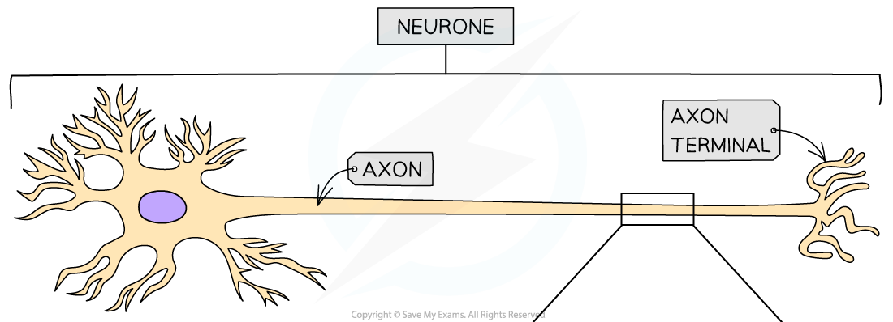

## Transmission of Nerve Impulses

* **Neurones** transmit **electrical impulses** which travel along the neurone **cell surface membrane** from one end of a neurone to the other

  + Note that an impulse is **not** an electrical current that flows along neurones as if they were wires
  + Instead, an impulse is a **momentary reversal in the electrical potential difference** across the **neurone cell surface membrane**

    - The electrical potential difference across a membrane can also be described as the **voltage** across a membrane, the **difference in charge** across a membrane, or the **membrane potential**
* The different states of membrane potential across a neurone cell surface membrane during transmission of a nerve impulse include

  + **Resting potential**
  + **Action potential**

#### Resting potential

* In a **resting axon,** i.e.one that is **not transmitting impulses**, the **inside** of the axon always has a **negative electrical potential** compared to outside the axon

  + The **difference in charge** between the inside and outside of the neurone is due to **different numbers of ions** on each side of the neurone cell surface membrane
  + When there is a difference in charge across a membrane, we say that the membrane is **polarised**
* This **potential difference,** or **difference in charge,** across the membrane when there are no impulses is usually about **-70 mV** (millivolts) i.e. the inside of the axon has an electrical potential about 70 mV **lower** than the outside

  + -70 mV is the **resting potential** of the neurone
* Two factors contribute to establishing and maintaining resting potential

  + The active transport of sodium ions and potassium ions
  + A difference in membrane permeability to sodium and potassium ions

#### The active transport of sodium ions and potassium ions

* Carrier proteins called **sodium-potassium pumps** are present in the cell surface membranes of neurones
* These pumps use**ATP** to actively transport**sodium ions** (Na⁺) **out** of the axon and**potassium ions**(K⁺)**into** the axon
* The two types of ions are pumped at an unequal rate; for every **3 sodium ions that are pumped out** of the axon, only **2 potassium ions are pumped in**
* This creates a concentration gradient across the membrane for both sodium ions and potassium ions

#### Difference in membrane permeability to sodium ions and potassium ions

* Because of the concentration gradient generated by the sodium-potassium pumps, both sodium and potassium ions will **diffuse back across the membrane**

  + The neurone cell surface membrane has **sodium ion channels** and **potassium ion channels** that allow sodium and potassium ions to move across the membrane by facilitated diffusion
* The neurone membrane is **less permeable** to sodium ions than potassium ions, so potassium ions inside the neurone can diffuse **out**at a **faster rate** than **sodium ions** can diffuse **back in**
* This results in**more positive ions** on the **outside** of the neurone than on the inside, generating a **negative charge** **inside** the neurone in relation to the outside
* The result of this is that the neurone has a **resting membrane potential** of around **-70 millivolts (mV)**

***Sodium-potassium pumps in the membrane of a resting neurone generate a concentration gradient for both sodium ions and potassium ions. This process, together with the facilitated diffusion of potassium ions back out of the cell, generates a negative resting potential across the membrane***

#### Action potential

* Once resting potential is reached the neurone membrane is said to be **polarised**
* To initiate a nerve impulse in a neurone the membrane needs to be **depolarised**

  + Depolarisation is the **reversal of the electrical potential difference** across the membrane
* The depolarisation of the membrane occurs when an **action potential** is generated

  + Action potentials lead to the reversal of resting potential from around **-70 mV** to around **+30 mV**
* Action potentials involve the **rapid movement**of**sodium ions**and**potassium ions** across the **membrane** of the **axon**
* An action potential is the**potential electrical difference** produced across the axon membrane when a neurone is **stimulated** e.g. when an environmental stimulus is detected by a receptor cell

#### Generating an action potential

* Some of the ion channels in the membrane of a neurone are **voltage gated**, meaning that they open and close in response to changes in the **electrical potential** across the membrane

  + Voltage gated ion channels are **closed** when the membrane is at rest, but they are involved in the generation and transmission of action potentials
  + Note that not all of the channels in a neurone membrane are voltage gated e.g. some types of potassium ion channels are open when a neurone is at rest to enable potassium ions to diffuse out of the axon and generate a resting potential
* When a neurone is stimulated the following steps occur

  + A small number of **sodium ion channels** in the axon membrane **open**
  + **Sodium ions** begin to move **into the axon** down their **concentration gradient**

    - During resting potential there is a greater concentration of sodium ions outside the axon than inside due to the action of sodium-potassium pumps
  + This **reduces**the**potential difference** across the axon membrane as the **inside** of the axon becomes **less negative**
  + If the potential difference reaches around **-55 mV,**known as the **threshold potential**, **more sodium ion channels** open, leading to a further influx of sodium ions

    - This second set of sodium ion channels are voltage gated channels
    - Note that an **action potential**is only **initiated** if the **threshold potential**is reached
  + Once the charge has been reversed from -70 mV to around +30 mV the membrane is said to be **depolarised** and **an action potential** has been**generated**

#### Repolarisation

* About 1 millisecond after an action potential is generated all the**voltage gated sodium channels**in this section of membrane**close**
* **Voltage gated potassium channels** in this section of axon membrane now **open**, allowing the diffusion of potassium ions **out of the axon** down their concentration gradient

  + Remember that the sodium-potassium pumps have not stopped working during the action potential; hence the potassium ion gradient is still present
* This movement of potassium ions causes the inside of the axon to become negatively charged again, a process known as **repolarisation**

  + There is a short period during which the membrane potential is more negative than resting potential; this is known as **hyperpolarisation**
  + The period during which the membrane is hyperpolarised is known as the **refractory period**

    - The membrane is unresponsive to stimulation during the refractory period, so a new action potential cannot be generated at this time
    - This makes the action potentials **discrete** events and means the impulse can **only** **travel in one direction**
    - This is essential for the successful and efficient transmission of nerve impulses along neurones
* The voltage gated potassium channels then **close,** and the **sodium-potassium pumps** work to restore**resting potential**

  + Only once resting potential is restored can the membrane be stimulated again

***The depolarisation and repolarisation of an action potential can be clearly seen in a graph of membrane potential against time***

#### Transmission of an action potential

* Once an action potential has been generated it can be **propagated**, or transmitted, along the length of the axon

  + The depolarisation of the membrane at the site of the first action potential causes **sodium ions**to **diffuse along the cytoplasm** into the next section of the axon, **depolarising** the membrane in this new section, and causing voltage gated sodium channels to open
  + This triggers **another action potential** in this section of the axon membrane
  + This process then repeats along the length of the axon

    - Note that any sodium ions that diffuse backwards along the membrane are unable to initiate a new action potential due to the **hyperpolarised** nature of the membrane in the moments following an action potential
* The action potential is said to move along the axon in a **wave of depolarisation**
* In the body, this allows action potentials to begin at one end of an axon and then pass along the entire length of the axon membrane

***Nerve impulses can be transmitted along axons by the diffusion of sodium ions***

#### The all-or-nothing principle

* Action potentials are either generated or not generated depending on whether the **threshold potential** is reached; there is **no such thing as a small or large action potential**

  + If a stimulus is **weak**only a few sodium ion channels will open and the membrane won’t be sufficiently depolarised to reach the **threshold potential;**an action potential will not be generated
  + If a stimulus is **strong enough** to raise the membrane potential above the**threshold** **potential** then an action potential will be generated
* This is the **all-or-nothing principle**

  + An impulse is **only transmitted** if the **initial stimulus is sufficient** to increase the membrane potential above a **threshold potential**
* Stimulus size can be detected by the brain because as the **intensity of a stimulus** **increases**, the **frequency**of action potentials transmitted along the neurone**increases**

  + This means that a small stimulus may only lead to one action potential, while a large stimulus may lead to several action potentials in a row

***As the strength of a stimulus increases, the frequency at which action potentials are generated also increases***

#### Myelination

* In **unmyelinated** neurones the speed of conduction is relatively **slow** because depolarisation must occur along the whole membrane of the axon
* By insulating the axon membrane myelin **increases the speed at which action potentials can travel** along the neurone

  + In sections of the axon that are surrounded by a myelin sheath membrane **depolarisation** **cannot occur**, as the myelin sheath **stops** the diffusion of sodium and potassium ions
  + Action potentials can only occur at the **nodes of Ranvier**

    - Nodes of Ranvier are the gaps between the Schwann cells that make up the myelin sheath
  + Sodium ions diffuse along the axon within the Schwann cells and the membrane at the nodes of Ranvier depolarises when the sodium ions arrive

    - The diffusion of sodium ions in this way is known as **local currents**, or **local circuits**
  + The action potential therefore appears to **‘jump’ from one node to the next;**this is known as **saltatory conduction**
* Saltatory conduction allows the impulse to travel **much faster** than in an unmyelinated axon of the same diameter

***Action potentials are transmitted along myelinated axons by saltatory conduction***

#### Preventing impulse transmission

* The transmission of nerve impulses is essential to survival as it allows the body to **detect and respond to stimuli**
* On occasion, however, it is useful to be able to prevent the transmission of impulses e.g. in painkillers and anaesthetics
* Our understanding of the way that action potentials are transmitted means that it is possible to design medications that **prevent impulse transmission**

  + Such drugs may **bind to sodium ion channels**, preventing them from opening and therefore **preventing an influx of sodium ions** when an axon is stimulated
  + Preventing sodium ion influx **prevents membrane depolarisation** and an **action potential cannot be generated**