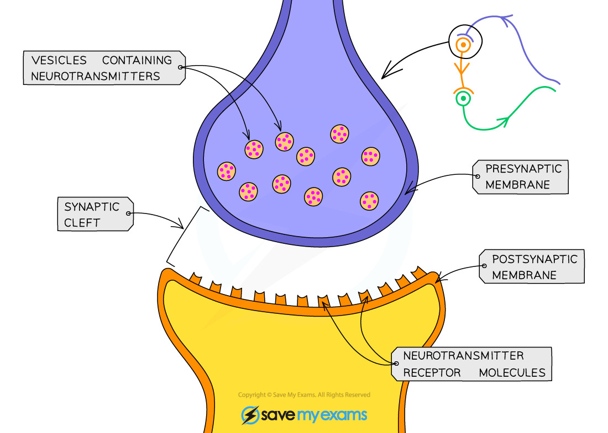

## Action of Drugs on Synapses

* The chemicals in **drugs** can have a major impact on the **functioning of the brain and nervous system**
* Some prescription drugs can have a **beneficial effect** on those suffering from neurological disorders while recreational drugs can have a **damaging** or even fatal effect
* Many drugs impact the nervous system by altering the events that occur at a **synapse**
* Drugs can **increase transmission** of impulses at a synapse by

  + Causing more neurotransmitter to be **produced** in the synaptic knob
  + Causing more neurotransmitter to be **released** at the presynaptic membrane
  + Imitating the effect of a neurotransmitter by **binding to and activating receptors** on the postsynaptic membrane
  + **Preventing the breakdown** of neurotransmitters by enzymes
  + **Preventing the reuptake** of neurotransmitters by the presynaptic cell
* Drugs can **decrease transmission** of impulses at a synapse by

  + **Preventing production** of neurotransmitter in the presynaptic knob
  + **Preventing the release** of neurotransmitter at the presynaptic membrane
  + Enabling neurotransmitter to gradually leak out of the presynaptic knob so there is little left when an action potential arrives

    - The neurotransmitter that leaks out of the cell is **destroyed by enzymes**
  + Binding to receptors on the postsynaptic membrane and so **preventing neurotransmitters from binding**

***Drugs can influence the transmission of nerve impulses at synapses***

#### MDMA

* MDMA is a **recreational drug** that is also known as ecstasy

  + Its use and sale are criminal offences in most parts of the world
* MDMA effects multiple neurotransmitters, most notably **serotonin**

  + MDMA **inhibits the reuptake** of serotonin into the presynaptic neurone by **binding to the specific proteins that enable serotonin reuptake**, located on the presynaptic membrane; this increases the amount of serotonin present in the brain

    - Serotonin is usually reabsorbed into the **presynaptic neurone to be recycled** for future action potentials
  + MDMA also triggers the **release of further serotonin** from presynaptic neurones, further adding to the increase
* Serotonin can affect people in many ways including their **mood**, anxiety and sleep
* When an individual takes MDMA they may feel **extreme euphoria** and enhanced touch and bodily sensations

#### L-dopa

* L-dopa is a drug used to treat the symptoms of **Parkinson's disease**
* It has a very **similar structure to dopamine;** a neurotransmitter present at lower levels than usual in the brains of those who suffer from Parkinson's disease
* L-dopa is transported from the blood into the brain, where it is **converted into dopamine** in a reaction catalysed by the **enzyme** dopa-decarboxylase
* The effect is to **increase levels of dopamine in the brain**

  + Note, dopamine cannot be given directly to those who have Parkinson's disease as it cannot cross the barrier between the blood and the brain
* Increased levels of dopamine mean that **more nerve impulses are transmitted** in parts of the brain that control movement, giving sufferers better control over their movement and lessening the symptoms of Parkinson's disease