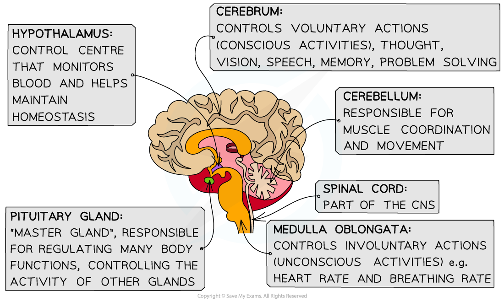
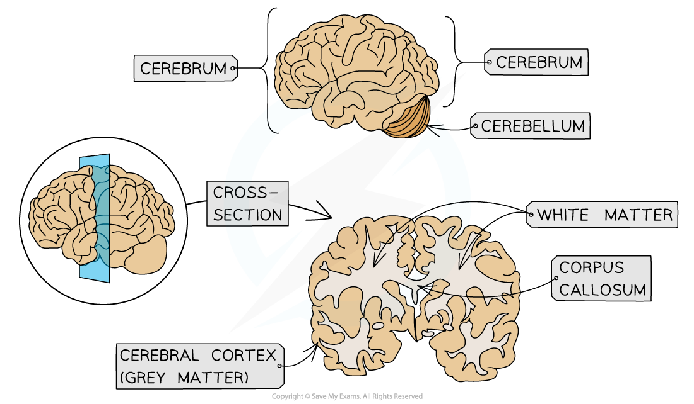

## Brain: Structure & Function

* The brain, alongside the spinal cord, is part of the **central nervous system** (CNS)
* The brain is made of billions of **interconnected neurones**
* Within the brain are**different regions** that carry out**different functions**

***Different regions of the brain carry out different functions***

* You need to know the functions of the following brain regions

#### The cerebrum

* The cerebrum is the **largest part** of the brain in humans, accounting for about 80% of the total mass of the brain
* It carries out a large**variety of functions** involved with **conscious activities**, including:

  + Vision
  + Hearing
  + Speech
  + Thinking
  + Memory
* The cerebrum is divided into**two halves** known as the **cerebral hemispheres**

  + The hemispheres are joined together by a **band of nerve fibres** known as the **corpus callosum**
  + The **right hemisphere** controls the **left side of the body** and the **left** one controls the **right side**
* The cerebrum has a **thin outer layer** known as the**cerebral cortex** or '**grey matter**'

  + The cerebral cortex consists of the **cell bodies of neurones**
  + It is**highly folded**, which **increases its surface area** and allows it to contain a **greater number of neurones**

    - With more neurones in the brain, **more neurone connections** can be made
    - This is important, as the more connections between neurones in the brain, the **greater the ability of the brain to carry out more complex behaviours**
* Beneath the cerebral cortex or grey matter layer is the '**white matter'**

  + The white matter consists of the **myelinated axons of neurones**

***The cerebrum consists of two hemispheres joined by the corpus callosum***

#### The hypothalamus

* The hypothalamus monitors **the blood** as it flows through the brain and, in response, **releases hormones** orstimulatestheneighbouring **pituitary gland** to release hormones

  + The hypothalamus plays an important role in some homeostatic**mechanisms**
* Hypothalamus functions include

  + **Regulating body temperature**

    - The hypothalamus **monitors blood temperature** and initiates a homeostatic response if this temperature gets too high or too low
  + **Osmoregulation**

    - Cells in the hypothalamus **monitor the water balance of the blood** and releases the hormone ADH if the blood becomes too concentrated

      * ADH increases absorption of water in the kidneys
  + **Regulating digestive activity**

    - The hypothalamus regulates the hormones that control appetite as well as the secretion of digestive enzymes
  + **Controlling endocrine functions**

    - The hypothalamus causes the pituitary gland to release hormones that control a variety of processes e.g. metabolism, growth and development, puberty, sexual functions, sleep, and mood

#### The cerebellum

* The cerebellum **coordinates movement**

  + This includes **balance;** a highly complex function that requires coordination between multiple parts, including the eyes, semicircular canals in the ears, and many muscles

#### The medulla oblongata

* Also known as the **medulla**
* The medulla contains co-ordination centres that control different functions e.g.

  + **The cardiac centre** controls heart rate
  + **The respiratory centre** controls breathing rate