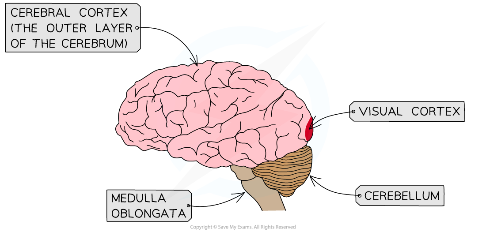

## Development of the Visual Cortex

* The visual cortex is the **region of the cerebral cortex** in which **visual information** is processed

  + The cerebral cortex is the outer layer of the **cerebrum**
* Soon after birth the neurones in the visual cortex of baby mammals begin to form connections, or **synapses**, allowing visual information to be transferred through and processed by the visual cortex
* Both eyes need to be visually stimulated in order for the neurones in the visual cortex to be **organised correctly** during this period of early development, known as the **critical period**
* Synapses that pass on nerve impulses during this critical period are **strengthened** and become **permanent parts of the structure of the visual cortex**
* Synapses that do not receive nerve impulses during this critical period **are lost** and **cannot be re-formed**

  + This can result in blindness in one or both eyes if visual stimulation is not provided during the critical period
* Evidence for this critical period of development comes from a **study using animal models** carried out by Hubel and Wiesel

***The visual cortex is located at the back of the brain within the cerebral cortex***