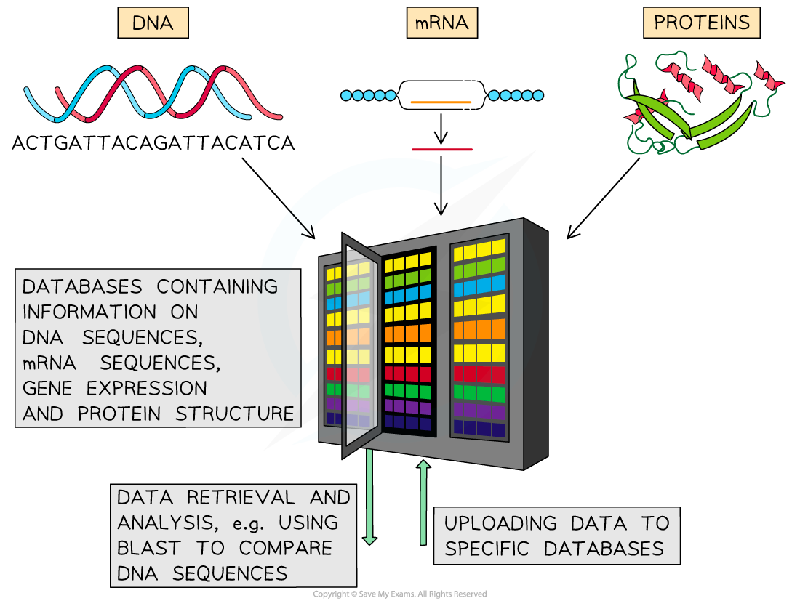

## Personalised Medicine

* Personalised medicine involves the development of **targeted** **drugs** to treat a variety of human diseases in **individuals with different**genotypes

  + Such drugs can be tested on **synthetic tissues**; groups of cells **cultured in a lab** that are **genetically identical** to certain groups of patients
* Information gathered from genome projects like the Human Genome Project (HGP) can be used to develop **genomic medicine,** which uses information about the **genes** to design medical treatments

  + The HGP involved the **sequencing** of the entire human genome
  + The information gained during the HGP is stored in **databases**, within which **genes that code for certain proteins can be found and analysed**
  + Knowing the sequence and structure of proteins involved in disease allows the **development of drugs that target specific proteins**

    - E.g. if an enzyme is involved with disease, a drug that acts as an **enzyme inhibitor** can be developed
* By combining information about the genome with other clinical and diagnostic information, patterns can be identified that can help to determine an individual's **risk of developing disease**

  + Genetic screening allows individuals with a high chance of developing specific diseases to be identified and means that **preventative** measures can be taken e.g.

    - Certain genetic mutations are known to increase the risk of an individual developing breast cancer, so those who know that they have such a mutation can have surgery in advance to reduce their risk
    - An individual may be able to make certain life choices regarding diet and lifestyle based on knowledge of their genetic risk of cancers and heart disease
* Doctors can also use an individual's genome to work out **how well they might respond** to specific treatments, allowing treatments to be selected on the basis of an individual's genotype

***Databases can be used to store information on gene and protein sequences that can then be used to design drugs or determine the most effective treatment for a patient***

#### Social, moral and ethical issues

* **Increased research costs** for drug companies could increase the price of new medicines and mean that **only wealthier people have access** to personalised medicine
* There is fear that insurance companies and employers may use personalised medical data against individuals to **unfairly discriminate against them** e.g. insurance costs might increase for people with certain genetic variants
* **Some patients may be refused personalised medicine** if it is not predicted to be that effective for them, even if there are no other treatment options
* Knowing that the only medication available may not work could be very distressingfor the individual being treated and their families