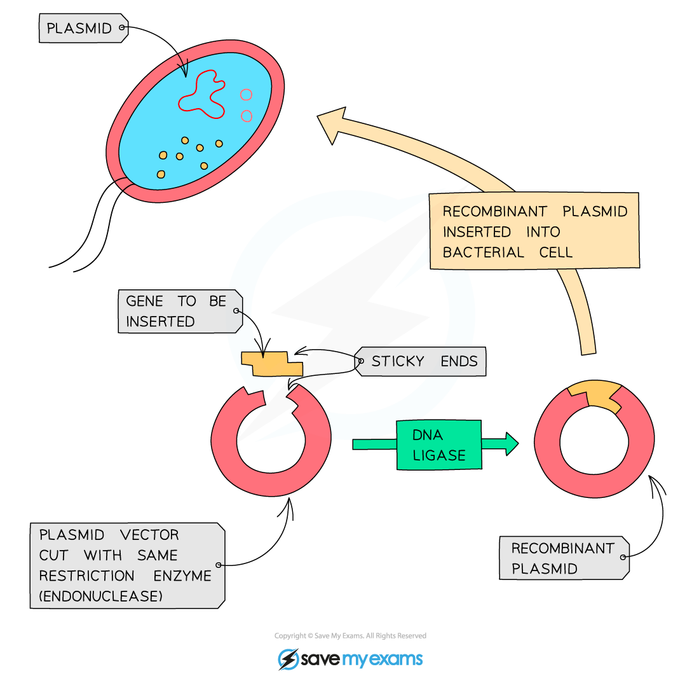
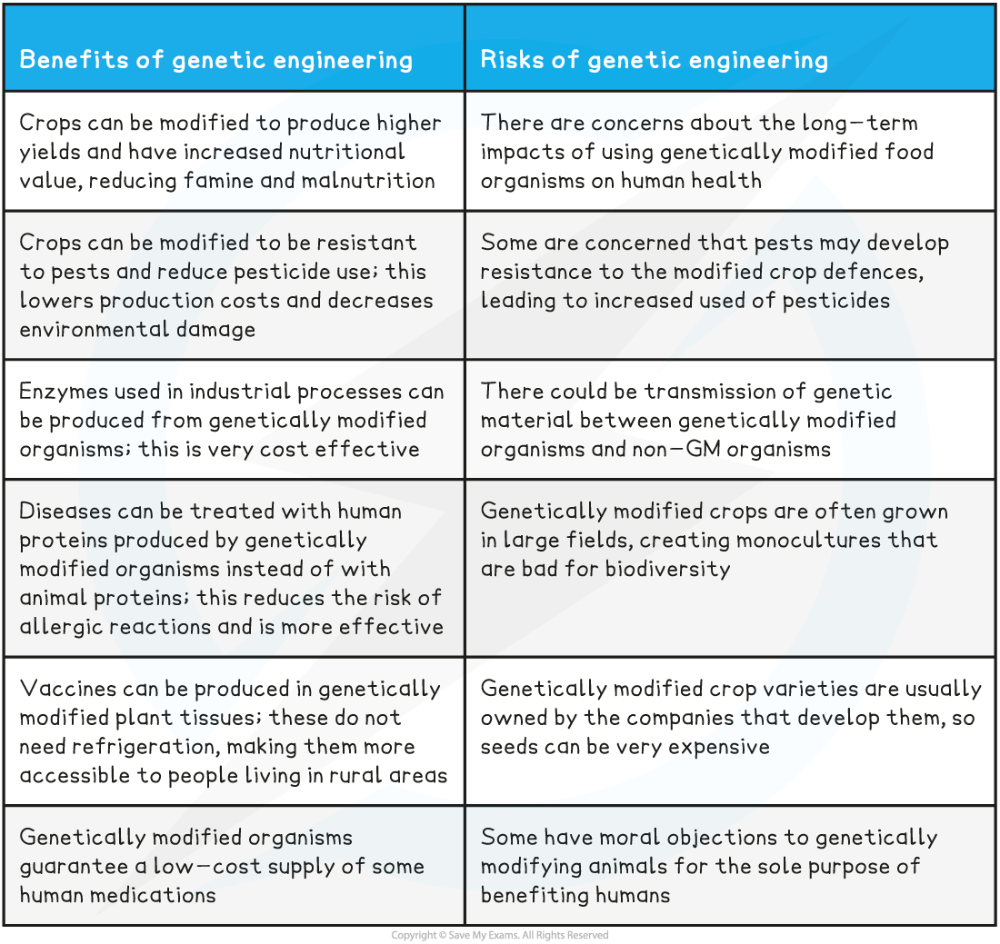

## Producing Drugs Using GMOs

* Genetic engineering is a technique used to deliberately modify a specific characteristic of an organism

  + The technique involves **removing a gene** that codes for a desired characteristic from **one organism** and **transferring** the gene **into another** organism where the **desired gene is then**expressed
* The genetically engineered organism is said to contain **recombinant DNA** and will be a **genetically modified organism** (GMO)
* Micro-organisms, plants and animals have been genetically engineered to produce proteins used in medicine

#### Genetically modified micro-organisms

* Restriction enzymes are used to **remove** the gene coding for a desired protein from an organism's genome

  + The protein coded for here will be responsible for the **characteristic desired** in the GMO e.g. the ability to produce insulin
* Many **copies** of the gene are made using the **polymerase chain reaction**, or **PCR**

  + The enzyme DNA polymerase is used to join free nucleotides into new strands of DNA that are complementary to the original strand
* These copies are **inserted into** small loops of DNA called **plasmids,** which then **transfer the copies** into micro-organisms

  + The plasmids are said to be DNA **vectors**
  + The enzyme DNA ligase catalyses the joining of the desired gene to the plasmid vector
* The genetically modified micro-organisms are **grown in large fermenters** containing nutrients, enabling them to **multiply** and produce **large quantities** of the new protein
* The protein can be **isolated** and **purified** before being packaged and distributed

  + **Human insulin** and **human blood clotting factors** are examples of medicinal proteins produced by genetically modified bacteria

***The human insulin gene can be inserted into bacterial plasmid vectors which are then transferred into bacterial cells***

#### Genetically modified plants

* A similar process can be used to insert desired genes from other organisms into plant cells
* After the gene is inserted into a plasmid and then transferred to a bacterial cell, the bacteria can be used to **infect plant cells;** the bacterium acts as a **vector** for **introducing the gene into the plant DNA**

  + Note that this isn't the only method of introducing new genes into plant cells

    - Another method involves a 'gene gun'; tiny pellets are coated with the desired DNA and then fired into the plant cells
* The gene is transferred from the bacterial cell **into the plant cell nucleus**, after which the plant cell is stimulated to multiply and grow into an **adult plant**

  + **Each cell** of the plant **contains a copy** of the gene coding for the desired protein
* The protein can now be **purified** from the plant tissues, or the plant can be **eaten** to deliver the drug

  + **Human insulin** and a **cholera vaccine** are examples of drugs produced by modified plants

#### Genetically modified animals

* The gene that codes for the desired protein is injected into the **nucleus of a**zygote
* The zygote is **implanted** into the uterus of a surrogate animal where it develops into an **adult animal**

  + **Every cell** of this genetically modified animal will **contain a copy** of the gene coding for the desired protein
* The protein can be **purified** from **e.g. the milk** of the animal

  + **Human blood clotting proteins** can be produced from the milk of genetically modified animals

## Using GMOs: Risks & Benefits

* While GMOs can be used for medical benefit, there is still **much concern about the potential impacts** of changing the genes of organisms, as well as the **ethics of genetically modifying animals**

  + These concerns are often amplified when the GMOs are **crop plants destined for human consumption**

**Risks and Benefits of Genetic Engineering Table**

