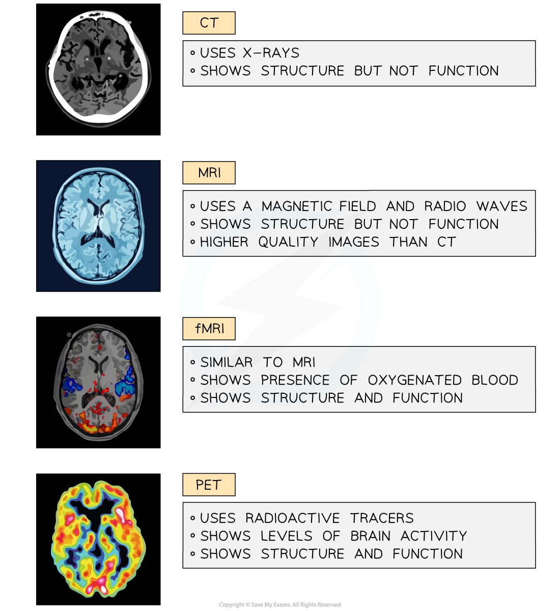

## Studying the Brain

* Our understanding of brain structure and function is limited

  + The brain is incredibly**complex** and **very delicate**
  + Different regions work together to bring about brain function so can’t be studied in **isolation**
* It is therefore extremely difficult for neuroscientists to study the brain and find out how it works
* Specialised **scanners** and techniques can be used to study the brain without having to resort to **surgical intervention**

#### Computerised Tomography

* **Computerised tomography**, or **CT**, scans produce cross-section images of the brain using **x-ray radiation**

  + A beam of x-rays are aimed at a patient from all angles around the body
  + Digital x-ray detectors are used to pick up the x-rays as they exit the patient's body
  + Denser tissue absorbs more of the x-ray radiation so shows up as a lighter region on a scan
* A scan produced in this way shows **physical structures** of the brain and allows visualisation of any tissue damage

  + E.g. blood is less dense than brain tissue so a CT scan can be used to locate damaged blood vessels and areas of bleeding after a patient has had a stroke
* The scans **don't directly show the functions** of the regions of the brain but it is possible to link visible symptoms with the location of any tissue damage

  + This can allow neurologists to work out which regions of the brain are responsible for which functions
* CT scans are not recommended for **pregnant patients or children** due to the risks of exposure to the X-ray radiation, which is given at a **higher level** than in a normal X-ray

  + The risk of damage from such scans is still very low

#### Magnetic Resonance Imaging

* **Magnetic Resonance Imaging**, or **MRI**, uses a combination of a **magnetic field and radio waves** to generate images through the body

  + The patient being scanned must remain very still while inside a large magnet
* **Soft tissues** can be seen clearly using MRI, and images produced are at a **higher resolution** than those produced from CT scanning
* As with CT scanning, MRI is useful for **identifying areas of abnormal or damaged tissue**, but only enables brain function to be analysed by **linking damage on a scan with visible symptoms** in a patient
* MRI is especially useful for **tumour diagnosis** as tumours show up clearly in images generated in this way

  + MRI scans can therefore be used to **identify and locate tumours** in the brain
* MRI scans are **considerably more expensive** to carry out than CT scans but **do not carry the risk associated with the use of potentially harmful x-rays**

  + MRI scans are often the imaging method of choice during long-term therapies
* The magnetic field of an MRI scanner can **interfere with medical devices** such as pacemakers and insulin pumps, so patients with such devices cannot have MRI scans

#### Functional MRI

* **Functional MRI**, or **fMRI**, functions in a similar way to MRI, making use of a magnetic field and radio waves to generate images of brain structure
* The difference between MRI and fMRI is that fMRI scans allow **brain function to be studied in real time**

  + fMRI scans show the **location of oxygenated blood** in the brain, therefore indicating **which brain regions are active** at any one time

    - The scanner measures the **ratio of oxygenated to deoxygenated** haemoglobin
  + Patients can be asked to carry out particular actions, answer questions, or think about a specific topic while inside a scanner and the **change in blood flow to regions of the brain can be assessed**

    - The region of the brain associated with the activity or thought will 'light up' in the scanner
    - This can be used in medical diagnosis e.g. searching for the cause of seizures, or in psychology research

#### Positron Emission Tomography

* PET scans use **radioactive tracers** which collect in areas where there is **increased** **blood flow,** metabolism, or neurotransmitter activity

  + The tracer is introduced to the blood in advance of the scan so that it can be detected by the scanner
  + E.g. a radioactive tracer might be **radioactively labelled glucose**; glucose will be transported in the blood and will be present in high concentrations in metabolically active areas of the brain
* The scanner can detect areas of **high radioactivity**, and so the movement of the tracer through the body and any accumulation of tracer in the brain can be seen
* The amount of radioactive tracer present in a brain region can **indicate whether that region is active or inactive**

  + This has been useful in building an understanding of specific diseases such as Alzheimer's where brain activity in certain regions decreases
* Neurologists can use the images to study the **structure** and **function** of the brain in **real time**

***Some types of scan show only structure, while other allow the study of structure and function in real time***