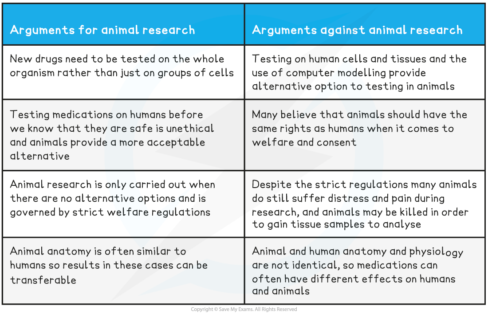

## The Role of Animal Models in Research

* The human brain is very **difficult to study**

  + The brain is**complex** and its tissues are **delicate** meaning that it is **easy to cause damage** during a surgical examination
  + Different regions work together to bring about brain function so often **cannot be studied in isolation**
* For this reason, **animal models** have historically been used in brain research

  + Some animals have **similar brain structure** to humans, so the findings from such models can **reasonably be applied to the human brain**
  + Many consider experimenting on animals for medical reasons to be **more ethically acceptable** than experimenting on humans
* Note that a **model in science** is something that provides a **representation of real events** e.g.

  + **Computer modelling** can be used to predict the future of global warming
  + Balls can be used to **represent the molecules** of a solid, liquid, or gas
  + **Scaled down models** of vehicles can be used in design and safety testing

#### The work of Hubel and Wiesel

* Hubel and Wiesel carried out research into the **brain's visual systems** during the 1960s and 1970s
* They studied the **long-term impact of depriving various animal models of vision in one eye**, and in doing so learned about the **development of the brain's visual cortex**

  + The visual cortex is the **region of the cerebral cortex** in which **visual information** is processed
* Hubel and Wiesel began their research using **kittens as animal models**

  + They stitched one of a subject's eyes closed soon after birth, meaning that as the kitten grew it could **only see out of one eye**
  + After 3 months they found that the **kittens were blind in the eye that had been stitched shut**
  + When they studied the **activity of the neurones** in the kittens' visual cortexes using **electrodes,** they found that the **ocular dominance columns** corresponding to the stitched shut eye were **smaller than in normal kittens** while the columns corresponding to the open eye were **larger than normal**

    - Ocular dominance columns are **groups of neurones** in the visual cortex that **respond only to input from one eye or the other**

      * Right ocular dominance columns receive information from the **right eye** while left columns receive information from the **left eye**
  + They concluded that the ocular dominance columns for the blinded eye were able to **redistribute** in order to correspond to the normal eye; they had **switched dominance**
* The research was then repeated using **adult cat models**

  + They found that **no blindness** resulted from the 3-month loss of vision, and **no changes** took place to the distribution of the ocular dominance columns
* They were able to **replicate these results** in young and adult monkeys, demonstrating the **essential nature of light stimulation** to the visual cortex during the **early months of development**

  + Without early stimulation to both eyes the ocular dominance columns in the visual cortex are **unable to develop normally**

***Ocular dominance columns are stripes of neurones in the visual cortex that receive information from either the left or right eye***

## Moral & Ethical Issues Relating to Animals in Research

* The use of animals in medical research is common as it allows for the **testing of new medications** and **research into** **anatomy** and **physiology** without endangering the lives of humans
* Despite this, the use of animals in scientific research is **highly controversial**

**Animal Research Ethical Arguments Table**

